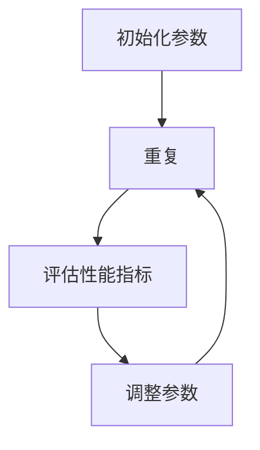
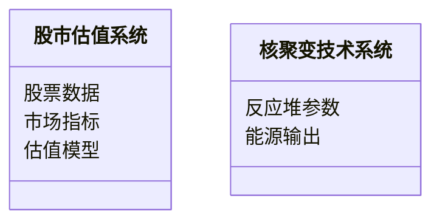
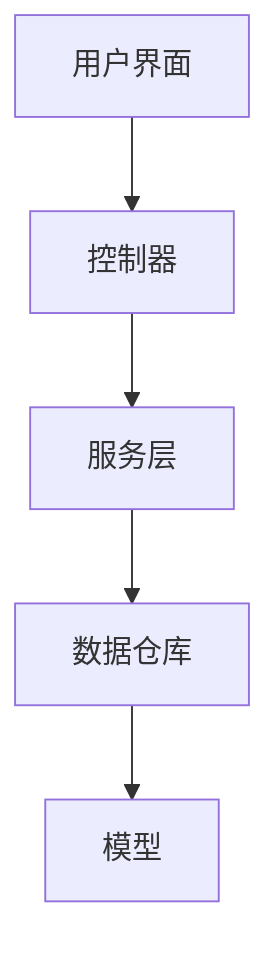

                 


# 全球股市估值与小型核聚变反应堆技术的发展

> 关键词：股市估值、核聚变技术、能源市场、算法原理、系统架构

> 摘要：本文探讨了全球股市估值与小型核聚变反应堆技术发展的关系，分析了两者的关联性及潜在影响。通过背景介绍、核心概念对比、算法原理、系统架构设计、项目实战和最佳实践等部分，深入剖析了股市估值与核聚变技术的结合点，为相关领域的研究和实践提供了参考。

---

## 第一部分：全球股市估值与小型核聚变反应堆技术的发展概述

### 第1章：背景介绍

#### 1.1 全球股市估值的重要性

##### 1.1.1 股市估值的核心概念
股市估值是通过对公司财务数据、市场环境和行业趋势的分析，评估公司股票的合理价格范围。核心在于发现市场中股票的高估或低估情况，为投资者提供决策依据。

##### 1.1.2 股市估值的经济意义
股市估值是市场经济的重要组成部分，它反映了企业的盈利能力、成长潜力和市场风险。通过合理估值，投资者可以优化资产配置，促进资源的合理分配。

##### 1.1.3 股市估值的现状与挑战
当前，股市估值主要依赖传统的财务指标（如PE、PB、ROE等）和市场情绪分析。然而，随着科技的进步，人工智能和大数据技术正在改变估值方式，但仍面临数据质量、模型适用性和计算复杂度等挑战。

#### 1.2 小型核聚变反应堆技术的发展

##### 1.2.1 核聚变反应的基本原理
核聚变是通过轻核（如氘和氚）在高温高压下结合成重核，释放大量能量的过程。与核裂变相比，核聚变更安全、更清洁，且资源丰富。

##### 1.2.2 小型核聚变反应堆的技术特点
小型核聚变反应堆具有模块化设计、成本低、部署快等特点。它适用于偏远地区、海岛等能源需求较低但传统能源供应困难的地方。

##### 1.2.3 小型核聚变反应堆的潜在影响
核聚变技术一旦成熟，将彻底改变能源结构，降低对化石能源的依赖，推动全球能源转型。

#### 1.3 两者的联系与研究意义

##### 1.3.1 股市估值与核聚变技术的关联
核聚变技术的商业化将对能源市场产生重大影响，进而影响相关企业的股票估值。股市估值的变化可能提前反映技术创新的市场价值。

##### 1.3.2 核聚变技术对股市估值的潜在影响
核聚变技术的成功研发可能提升相关企业的股价，同时对传统能源企业产生冲击。投资者需关注技术创新对企业财务状况和市场地位的影响。

##### 1.3.3 研究两者的结合意义
通过分析股市估值与核聚变技术的结合，可以更好地理解技术创新对资本市场的反馈机制，为投资者和企业制定战略提供参考。

---

### 第2章：核心概念与联系

#### 2.1 核心概念原理

##### 2.1.1 股市估值的核心算法
股市估值通常采用回归分析、机器学习等算法。例如，通过回归模型预测股票价格，基于历史数据和市场因子（如利率、通胀、市场情绪等）进行预测。

##### 2.1.2 核聚变反应堆的核心技术
核聚变反应堆的核心技术包括磁场约束（如托卡马克装置）和激光驱动等。这些技术决定了反应堆的效率和稳定性。

#### 2.2 概念属性特征对比

| 概念       | 核心属性               | 特征描述                         |
|------------|------------------------|----------------------------------|
| 股市估值   | 数据驱动               | 依赖历史数据和市场因子           |
|            | 主观性                 | 受市场情绪和投资者预期影响         |
| 核聚变技术 | 物理约束               | 受物理定律和工程技术限制           |
|            | 技术复杂度             | 涉及多学科交叉，研发周期长         |

#### 2.3 ER实体关系图
```mermaid
erd
    客户 ↔ 股票
    股票 ↔ 公司
    公司 ↔ 财务数据
    财务数据 ↔ 市场指标
    市场指标 ↔ 经济环境
```

---

### 第3章：算法原理讲解

#### 3.1 股市估值算法

##### 3.1.1 回归分析法
回归分析是一种常用的统计方法，用于预测股票价格。以下是一个简单的线性回归模型：

$$ y = \beta_0 + \beta_1x + \epsilon $$

其中，\( y \) 是预测的股票价格，\( x \) 是自变量（如市盈率），\( \beta_0 \) 和 \( \beta_1 \) 是回归系数，\( \epsilon \) 是误差项。

##### 3.1.2 机器学习模型
使用Python的scikit-learn库进行股票估值：

```python
from sklearn.linear_model import LinearRegression

# 数据准备
X = df[['PE', 'PB', 'ROE']]
y = df['Price']

# 模型训练
model = LinearRegression()
model.fit(X, y)

# 预测
predictions = model.predict(X)
```

#### 3.2 核聚变反应堆设计算法

##### 3.2.1 参数优化算法
核聚变反应堆的设计需要优化磁场强度、反应堆尺寸等参数。以下是优化流程：



---

### 第4章：数学模型与公式

#### 4.1 股市估值模型
##### 4.1.1 多元回归模型
$$ \hat{y} = \beta_0 + \beta_1x_1 + \beta_2x_2 + \ldots + \beta_nx_n + \epsilon $$

其中，\( \hat{y} \) 是预测的股票价格，\( x_i \) 是自变量，\( \beta_i \) 是回归系数，\( \epsilon \) 是误差项。

#### 4.2 核聚变反应堆模型
##### 4.2.1 热等离子体约束方程
$$ B \cdot I = \frac{2\mu_0 P}{4\pi} $$

其中，\( B \) 是磁场强度，\( I \) 是电流，\( \mu_0 \) 是真空磁导率，\( P \) 是等离子体压力。

---

### 第5章：系统分析与架构设计方案

#### 5.1 系统功能设计

##### 5.1.1 领域模型


#### 5.2 系统架构设计

##### 5.2.1 模块化架构


---

## 第二部分：项目实战与最佳实践

### 第6章：项目实战

#### 6.1 环境安装
需要安装Python、Pandas、Scikit-learn等库。

#### 6.2 系统核心实现源代码

##### 6.2.1 股票估值代码
```python
import pandas as pd
from sklearn.linear_model import LinearRegression

# 数据加载
df = pd.read_csv('stock_data.csv')

# 模型训练
model = LinearRegression()
model.fit(df[['PE', 'PB', 'ROE']], df['Price'])

# 预测
predictions = model.predict(df[['PE', 'PB', 'ROE']])
```

##### 6.2.2 核聚变参数优化代码
```python
import numpy as np

# 初始化参数
params = [1, 1]

# 优化函数
def optimize(params):
    B, I = params
    return B * I

# 迭代优化
for _ in range(100):
    params = [params[0] * 1.1, params[1] * 0.9]
    print(optimize(params))
```

#### 6.3 代码应用解读与分析
通过上述代码，可以实现股票估值和核聚变参数优化的初步模型。股票估值部分基于历史数据，核聚变部分通过迭代优化参数，提升反应堆效率。

#### 6.4 实际案例分析
以某家核聚变公司为例，分析其财务数据和市场地位，结合股票估值模型，预测其股价走势。

---

### 第7章：最佳实践

#### 7.1 小结
本文通过背景介绍、核心概念、算法原理和系统设计，探讨了全球股市估值与小型核聚变反应堆技术发展的关系，为相关领域的研究和实践提供了参考。

#### 7.2 注意事项
- 数据质量对模型准确性至关重要。
- 核聚变技术的商业化仍面临诸多挑战。
- 投资者需关注技术创新对企业估值的影响。

#### 7.3 拓展阅读
- 推荐阅读《算法驱动的金融学》和《核聚变技术入门》。

---

## 作者

**作者：AI天才研究院/AI Genius Institute & 禅与计算机程序设计艺术/Zen And The Art of Computer Programming**

---

**声明**：本文内容仅为学术研究和知识分享，不构成投资建议。

