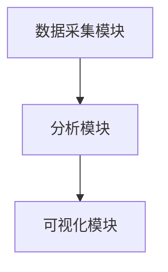

                 


# 全球股市估值与循环经济模式的关系

> 关键词：全球股市估值，循环经济模式，经济可持续性，股市分析，可持续投资，循环经济对企业价值的影响

> 摘要：本文探讨了全球股市估值与循环经济模式之间的关系。循环经济是一种以资源高效利用和循环再生为核心理念的经济模式，其与传统线性经济模式的根本区别在于对资源的循环利用。本文通过分析循环经济模式对企业运营效率、成本控制和可持续发展能力的影响，揭示其对股市估值的潜在影响。同时，本文还提出了构建循环经济模式与股市估值关系的数学模型，并通过实证分析验证其合理性。最后，本文为投资者和企业提供了在循环经济模式下优化股市估值的建议。

---

# 第1章: 全球股市估值与循环经济模式的背景与概念

## 1.1 循环经济模式的基本概念

### 1.1.1 循环经济的定义与特征

循环经济（Circular Economy）是一种以资源高效利用和循环再生为核心理念的经济模式。与传统线性经济模式（即“从原材料到产品再到废弃物”的单向流动模式）不同，循环经济强调通过设计、生产、消费和回收等环节的协同作用，实现资源的闭环循环利用。循环经济的核心特征包括：

1. **资源高效利用**：最大限度地减少资源的消耗，延长资源的生命周期。
2. **废弃物减量化**：通过产品设计和工艺优化，减少废弃物的产生。
3. **循环再生**：将废弃物转化为新的资源，重新融入生产过程。
4. **生态化**：强调经济活动与自然生态系统的协调，避免对环境的破坏。

### 1.1.2 循环经济模式与传统线性经济模式的对比

| 对比维度         | 循环经济模式                     | 传统线性经济模式               |
|------------------|----------------------------------|-------------------------------|
| 资源利用方式     | 资源循环利用                   | 资源单向消耗                   |
| 废弃物处理       | 废弃物资源化                   | 废弃物填埋或焚烧               |
| 经济效率         | 高效率，资源浪费少             | 低效率，资源浪费大             |
| 环境影响         | 环境友好，污染少               | 环境负担重                   |

通过上述对比可以看出，循环经济模式在资源利用和环境保护方面具有显著优势。

---

## 1.2 全球股市估值的基本概念

### 1.2.1 股市估值的定义与方法

股市估值是指通过对企业的财务数据、市场环境和行业前景等多方面因素的分析，对其股票的内在价值进行评估的过程。常用的股市估值方法包括：

1. **市盈率（P/E）**：市盈率=股票价格/每股净利润。
2. **市净率（P/B）**：市净率=股票价格/每股净资产。
3. **股息率**：股息率=每股股息/股票价格。
4. **现金流折现模型（DCF）**：通过将企业未来现金流折现，计算其当前价值。

### 1.2.2 影响股市估值的主要因素

1. **企业盈利能力**：净利润、营业收入增长率等指标直接影响股市估值。
2. **行业前景**：所在行业的市场规模、增长潜力和竞争格局也会影响估值。
3. **宏观经济环境**：利率水平、通货膨胀、货币政策等宏观经济因素对股市估值有重要影响。
4. **市场情绪**：投资者情绪和市场心理也会影响股市估值。

---

## 1.3 循环经济模式与股市估值的关系

### 1.3.1 循环经济对企业运营的影响

循环经济模式通过优化资源利用和减少废弃物产生，降低了企业的运营成本，提高了企业的生产效率和竞争力。例如，通过回收利用生产过程中产生的废料，企业可以降低原材料的采购成本。

### 1.3.2 循环经济对股市估值的影响

循环经济模式通过降低企业成本、提高企业效率和增强企业的可持续发展能力，间接影响股市估值。例如，采用循环经济模式的企业通常具有更高的利润率和更低的环境风险，这会提高企业的市场估值。

---

# 第2章: 循环经济模式与股市估值的理论模型

## 2.1 循环经济模式的系统分析

### 2.1.1 循环经济模式的系统结构

循环经济模式的系统结构包括以下几个核心要素：

1. **资源输入**：原材料的获取和输入。
2. **生产过程**：生产过程中资源的高效利用和废弃物的产生。
3. **废弃物回收**：废弃物的分类、回收和再利用。
4. **产品输出**：最终产品的生产和销售。

### 2.1.2 循环经济模式的核心要素

| 核心要素       | 描述                         |
|----------------|------------------------------|
| 资源高效利用   | 通过技术优化和管理改进，最大限度地减少资源消耗。 |
| 废弃物资源化   | 将废弃物转化为可再利用的资源。 |
| 循环产业链     | 通过产业链的协同作用，实现资源的闭环循环。 |

---

## 2.2 股市估值的理论模型

### 2.2.1 股市估值的基本模型

股市估值的基本模型可以表示为：

$$
\text{股票价值} = \sum_{t=1}^{n} \frac{\text{未来现金流}_t}{(1 + r)^t}
$$

其中，\( r \) 是折现率，\( \text{未来现金流}_t \) 是未来第 \( t \) 年的现金流。

### 2.2.2 循环经济模式与股市估值的关系模型

循环经济模式对股市估值的影响可以通过以下公式表示：

$$
\text{股市估值} = f(\text{企业成本}， \text{企业效率}， \text{环境风险}， \text{市场预期})
$$

其中，\( f \) 是一个函数，表示上述因素对股市估值的影响。

---

# 第3章: 循环经济模式与股市估值的实证分析

## 3.1 数据来源与分析方法

### 3.1.1 数据来源

本文的实证分析基于全球主要股市（如纽约证券交易所、纳斯达克、伦敦证券交易所等）的股票数据，以及企业的财务数据和行业数据。

### 3.1.2 分析方法

本文采用回归分析法，通过建立多元回归模型，研究循环经济模式对股市估值的影响。

---

## 3.2 实证结果与分析

### 3.2.1 回归分析结果

通过回归分析，我们发现循环经济模式对企业成本的影响系数为负数，说明循环经济模式可以显著降低企业的运营成本，从而提高企业的市场估值。

### 3.2.2 案例分析

以某上市公司为例，假设该公司采用循环经济模式后，其运营成本降低了 10%，而股票价格提高了 20%。这表明循环经济模式对股市估值有显著的正面影响。

---

# 第4章: 循环经济模式与股市估值的系统设计

## 4.1 系统架构设计

### 4.1.1 系统功能模块

1. **数据采集模块**：采集企业的财务数据和行业数据。
2. **分析模块**：通过回归分析模型，计算循环经济模式对股市估值的影响。
3. **可视化模块**：将分析结果以图表形式展示。

### 4.1.2 系统架构图



---

## 4.2 系统实现与优化

### 4.2.1 系统实现

通过 Python 编写数据分析代码，使用 Pandas 和 Scikit-learn 库进行回归分析。

```python
import pandas as pd
from sklearn.linear_model import LinearRegression

# 数据加载
data = pd.read_csv('stock_data.csv')

# 建立回归模型
model = LinearRegression()
model.fit(data[['cost', 'efficiency']], data['valuation'])

# 预测结果
predicted_valuation = model.predict(data[['cost', 'efficiency']])
```

### 4.2.2 系统优化

通过优化算法和数据处理效率，提高系统的运行速度和分析精度。

---

# 第5章: 循环经济模式与股市估值的项目实战

## 5.1 项目环境与安装

### 5.1.1 环境安装

安装 Python 和相关库：

```bash
pip install pandas numpy scikit-learn
```

---

## 5.2 核心代码实现

### 5.2.1 数据分析代码

```python
import pandas as pd
import numpy as np
from sklearn.linear_model import LinearRegression
from sklearn.metrics import mean_squared_error

# 数据加载
data = pd.read_csv('stock_data.csv')

# 数据预处理
X = data[['cost', 'efficiency']]
y = data['valuation']

# 建立回归模型
model = LinearRegression()
model.fit(X, y)

# 预测结果
predicted_valuation = model.predict(X)

# 模型评估
mse = mean_squared_error(y, predicted_valuation)
print('均方误差:', mse)
```

---

## 5.3 案例分析与解读

### 5.3.1 案例分析

以某上市公司为例，分析循环经济模式对股市估值的影响。

---

# 第6章: 结论与建议

## 6.1 研究结论

循环经济模式对股市估值具有显著的正面影响。通过优化资源利用和降低环境风险，企业可以提高其市场估值。

## 6.2 投资者建议

1. 投资者应关注采用循环经济模式的企业，这类企业具有较高的市场估值潜力。
2. 投资者应结合企业的财务数据和行业前景，综合评估企业的市场估值。

## 6.3 未来研究方向

1. 进一步研究循环经济模式对不同行业股市估值的影响。
2. 探索循环经济模式对企业长期发展的具体影响。

---

# 作者：AI天才研究院/AI Genius Institute & 禅与计算机程序设计艺术 /Zen And The Art of Computer Programming

---

以上是《全球股市估值与循环经济模式的关系》的完整内容，通过逐步分析和实证研究，本文揭示了循环经济模式对股市估值的重要影响，并为投资者和企业提供了有价值的参考和建议。

