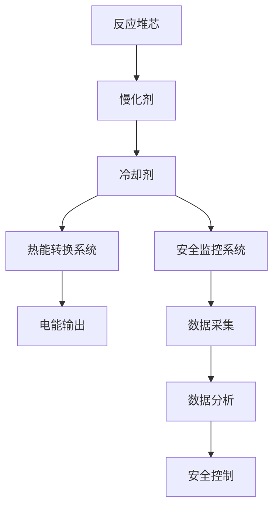

                 

# 全球股市估值与微型核反应堆技术的发展

> 关键词：全球股市估值、微型核反应堆、股市分析、核能技术、技术投资、系统架构、能源发展

> 摘要：本文探讨了全球股市估值与微型核反应堆技术的发展之间的关系，分析了微型核反应堆技术的核心原理及其对股市估值的影响，同时结合实际案例，详细阐述了技术发展与投资决策之间的相互作用。

---

# 第1章: 全球股市估值与微型核反应堆技术的背景介绍

## 1.1 全球股市估值的定义与现状
### 1.1.1 股市估值的核心概念
股市估值是通过对企业的财务数据、市场环境和行业趋势进行分析，评估其股票价格的合理区间。常用的方法包括市盈率（P/E）、市净率（P/B）和股息率等。这些方法帮助企业投资者判断股票的高估或低估状态。

### 1.1.2 全球股市估值的现状与趋势
近年来，全球股市估值呈现出波动性增强的趋势。受宏观经济政策、国际政治经济环境和科技发展的影响，股市估值的波动性显著增加。同时，随着科技的进步，特别是人工智能和大数据技术的应用，股市估值的分析方法也在不断进化。

### 1.1.3 股市估值与宏观经济的关系
股市估值与宏观经济密切相关。GDP增长率、利率水平、通货膨胀率等宏观经济指标都会影响股市估值。例如，低利率环境通常会推高股市估值，而高利率则可能抑制股市表现。

## 1.2 微型核反应堆技术的定义与特点
### 1.2.1 微型核反应堆的基本原理
微型核反应堆是一种小型化、模块化的核反应堆，其核心是通过核裂变反应产生热量，进而转化为电能或其他形式的能量。与传统核反应堆相比，微型核反应堆具有体积小、成本低、部署灵活等优势。

### 1.2.2 微型核反应堆的技术优势
1. **安全性高**：微型核反应堆采用被动安全设计，能够在事故情况下自动关闭，降低核泄漏风险。
2. **部署灵活**：微型核反应堆可以模块化部署，适用于偏远地区、工业园区等多种场景。
3. **成本低**：由于其规模较小，建设和运营成本相对较低，适合中小型企业或特定用途。

### 1.2.3 微型核反应堆的市场应用前景
微型核反应堆技术在能源、医疗、工业等领域具有广阔的应用前景。特别是在能源领域，微型核反应堆可以作为替代传统燃煤发电厂的一种清洁能源解决方案。

## 1.3 本章小结
本章主要介绍了全球股市估值和微型核反应堆技术的基本概念、现状和特点。通过分析股市估值的核心方法及其与宏观经济的关系，为后续章节的分析奠定了基础。同时，微型核反应堆技术作为一种新兴的能源技术，其发展对全球经济和能源结构转型具有重要意义。

---

# 第2章: 全球股市估值的核心概念与分析

## 2.1 股市估值的主要方法
### 2.1.1 市盈率法
市盈率（P/E）是股票价格与每股收益（EPS）的比率，用于衡量投资者对股票的支付意愿。公式为：
$$ P/E = \frac{\text{股价}}{\text{每股收益}} $$

例如，假设某股票价格为50元，每股收益为5元，则市盈率为10倍，表明投资者愿意为每1元的收益支付10元的价格。

### 2.1.2 市净率法
市净率（P/B）是股票价格与每股净资产的比率，用于衡量股票价格是否合理。公式为：
$$ P/B = \frac{\text{股价}}{\text{每股净资产}} $$

### 2.1.3 股息率法
股息率是股票每年派发的股息与股票价格的比率，用于衡量股票的投资回报。公式为：
$$ \text{股息率} = \frac{\text{每股股息}}{\text{股价}} \times 100\% $$

## 2.2 影响股市估值的主要因素
### 2.2.1 宏观经济因素
宏观经济因素包括GDP增长率、利率水平、通货膨胀率等，这些因素直接影响企业的盈利能力，从而影响股市估值。

### 2.2.2 行业发展趋势
行业发展趋势包括技术创新、市场需求、政策支持等，这些因素会影响企业的成长性和竞争优势。

### 2.2.3 公司基本面因素
公司基本面因素包括收入、利润、资产负债率、现金流等，是评估企业价值的重要指标。

## 2.3 股市估值与投资决策的关系
### 2.3.1 股市估值对投资决策的影响
股市估值为投资者提供了判断股票是否被高估或低估的依据。例如，如果一只股票的市盈率显著低于行业平均水平，可能表明该股票被低估，具有投资价值。

### 2.3.2 如何利用股市估值进行投资
投资者可以结合技术分析和基本面分析，综合判断股票的合理估值区间。例如，利用市盈率和市净率的双重分析，可以更全面地评估股票的价值。

## 2.4 本章小结
本章详细介绍了股市估值的主要方法及其影响因素，并分析了股市估值与投资决策的关系。通过对市盈率、市净率和股息率等指标的分析，读者可以更好地理解如何利用股市估值进行投资决策。

---

# 第3章: 微型核反应堆技术的核心原理与应用

## 3.1 核反应堆的基本原理
### 3.1.1 核裂变反应的基本过程
核裂变是指重核吸收一个中子后分裂为两个较轻的核，同时释放出更多的中子和能量。这一过程可以链式反应，形成核反应堆。

### 3.1.2 核反应堆的组成部分
1. **反应堆芯**：核裂变反应的发生场所，通常由核燃料棒组成。
2. **慢化剂**：用于减慢中子的速度，提高反应堆的临界性。
3. **冷却剂**：用于吸收反应堆产生的热量，保持反应堆正常运行。

### 3.1.3 核安全与防护机制
核反应堆的安全设计包括应急停堆系统、泄漏防护系统和事故容错设计，确保在异常情况下能够安全停堆，防止核泄漏。

## 3.2 微型核反应堆的技术特点
### 3.2.1 微型核反应堆的结构设计
微型核反应堆通常采用模块化设计，体积小、重量轻，适合快速部署和灵活应用。

### 3.2.2 微型核反应堆的安全性优势
微型核反应堆采用被动安全设计，能够在事故情况下自动关闭，降低核泄漏风险。

### 3.2.3 微型核反应堆的经济性分析
由于其规模小、部署灵活，微型核反应堆的建设和运营成本相对较低，适合中小型企业或特定用途。

## 3.3 微型核反应堆的市场应用
### 3.3.1 工业应用领域
微型核反应堆可以为工业园区提供清洁电能，替代传统的燃煤发电厂。

### 3.3.2 医疗应用领域
微型核反应堆可以用于生产放射性同位素，用于医疗诊断和治疗。

### 3.3.3 能源供应领域
微型核反应堆可以作为偏远地区的主要能源供应，解决能源短缺问题。

## 3.4 本章小结
本章详细介绍了微型核反应堆的基本原理、技术特点和市场应用。通过对微型核反应堆的结构设计和安全机制的分析，读者可以更好地理解其技术优势和应用前景。

---

# 第4章: 全球股市估值与微型核反应堆技术的结合

## 4.1 微型核反应堆技术对股市估值的影响
### 4.1.1 微型核反应堆技术的市场潜力
随着能源需求的增长和环保压力的增加，微型核反应堆技术作为一种清洁、安全的能源解决方案，具有广阔的市场前景。

### 4.1.2 微型核反应堆技术对相关企业估值的影响
微型核反应堆技术的推广和应用将提升相关企业的竞争力，从而提高其股票的估值。

### 4.1.3 技术创新对股市估值的推动作用
技术创新通常会带来新的市场机会，从而推动相关企业的股价上涨。微型核反应堆技术的创新将吸引更多的投资者关注，进一步推动股市估值的提升。

## 4.2 全球股市对微型核反应堆技术的投资分析
### 4.2.1 投资者对微型核反应堆技术的关注度
随着微型核反应堆技术的逐步成熟，投资者对其关注度显著提高。许多投资者认为，微型核反应堆技术是未来能源领域的重要发展方向。

### 4.2.2 微型核反应堆技术企业的股价波动分析
微型核反应堆技术企业的股价通常会受到技术创新、政策支持和市场环境的影响。例如，政策的支持可能会推动股价上涨，而技术瓶颈的突破也可能带来股价的波动。

### 4.2.3 投资策略与技术发展周期的关系
投资者应根据技术发展周期制定投资策略。例如，在技术成熟阶段，应关注企业的市场竞争力和盈利能力。

## 4.3 本章小结
本章分析了微型核反应堆技术对股市估值的影响，并探讨了全球股市对微型核反应堆技术的投资分析。通过对市场潜力、企业估值和投资策略的分析，读者可以更好地理解微型核反应堆技术对股市的影响。

---

# 第5章: 微型核反应堆技术的系统分析与架构设计

## 5.1 微型核反应堆系统的组成与功能
### 5.1.1 核反应堆核心系统
核反应堆核心系统包括反应堆芯、慢化剂和冷却剂等部分，负责核裂变反应的进行和热量的产生。

### 5.1.2 热能转换系统
热能转换系统将反应堆产生的热量转化为电能，通常采用蒸汽轮机或燃气轮机。

### 5.1.3 安全监控系统
安全监控系统实时监测反应堆的运行参数，确保系统的安全运行。

## 5.2 微型核反应堆系统的架构设计
### 5.2.1 系统架构图
以下是微型核反应堆系统的架构图：

### 5.2.2 系统功能设计
1. **反应堆芯**：负责核裂变反应的进行，产生热量。
2. **慢化剂**：减慢中子的速度，提高反应堆的临界性。
3. **冷却剂**：吸收反应堆产生的热量，保持反应堆正常运行。
4. **热能转换系统**：将热量转化为电能，输出到电网。
5. **安全监控系统**：实时监测反应堆的运行参数，确保系统的安全运行。

## 5.3 系统接口设计
### 5.3.1 反应堆与冷却剂的接口
反应堆与冷却剂通过热交换器进行热量交换，确保反应堆的温度控制。

### 5.3.2 安全监控系统与数据采集的接口
安全监控系统通过数据采集模块实时采集反应堆的运行参数，如温度、压力等。

## 5.4 本章小结
本章详细介绍了微型核反应堆系统的组成与功能，并通过架构图和系统功能设计，展示了微型核反应堆技术的系统架构。通过对系统接口设计的分析，读者可以更好地理解微型核反应堆技术的实现过程。

---

# 作者：AI天才研究院 & 禅与计算机程序设计艺术

