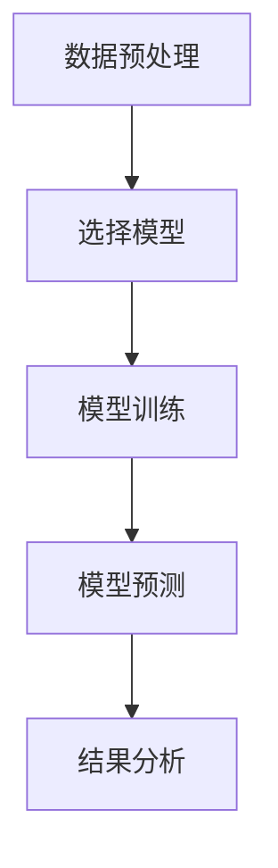
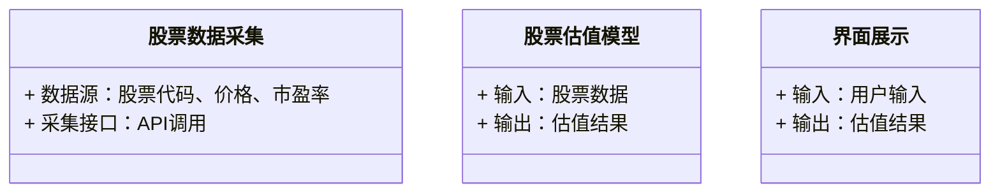

                 


# 全球股市估值与微生物燃料电池在废水处理中的应用

---

## 关键词：
全球股市估值、微生物燃料电池、废水处理、算法原理、系统架构、项目实战

---

## 摘要：
本文深入探讨了全球股市估值与微生物燃料电池在废水处理中的应用。首先，从全球股市估值的背景、核心概念、算法原理和系统架构等方面展开分析，详细介绍了股市估值的数学模型和实战案例。其次，重点讲解了微生物燃料电池在废水处理中的工作原理、系统设计和实际应用，结合数学模型和实验数据，展示了其在环保领域的巨大潜力。通过对比分析和案例研究，本文为读者提供了全面的技术视角，展示了如何将复杂的技术理论与实际应用相结合。

---

## 第一部分：全球股市估值

### 第1章：全球股市估值的背景与核心概念

#### 1.1 股市估值的背景与问题背景
股市估值是金融领域的重要研究方向，其目的是通过分析市场数据和公司基本面，为投资者提供合理的股票价格评估依据。随着全球经济的快速发展，股市估值的重要性日益凸显。本文将从以下方面展开分析：
- **问题背景**：全球股市的波动性、信息不对称和市场不确定性对股市估值的影响。
- **核心问题**：如何利用历史数据、市场情绪和公司财务指标，构建高效的股市估值模型。
- **边界与外延**：股市估值的适用范围、限制条件及与其他金融领域的关联。

#### 1.2 股市估值的核心概念与联系
股市估值涉及多个核心概念，包括市盈率（P/E ratio）、市净率（P/B ratio）、股息率（Dividend Yield）等。通过对比分析这些概念，我们可以更全面地理解股市估值的内在逻辑。

**核心概念对比表格：**

| 指标名称     | 定义与计算公式                          | 主要用途                     |
|--------------|----------------------------------------|------------------------------|
| 市盈率 (P/E) | 市盈率 = 股价 / 每股净利润               | 评估股票的相对价值           |
| 市净率 (P/B) | 市净率 = 股价 / 每股净资产               | 评估股票相对于账面价值的高低 |
| 股息率       | 股息率 = 每股股息 / 股价                 | 评估股票的投资回报率         |

**ER实体关系图（Mermaid流程图）：**

```mermaid
erd
actor 股票投资者
actor 股市数据提供者
actor 金融机构
```

---

### 第2章：全球股市估值的算法原理与数学模型

#### 2.1 股市估值的算法原理
股市估值的核心在于对市场数据的分析和建模。常用的算法包括回归分析、时间序列分析和机器学习算法（如随机森林、神经网络）。

**回归分析的数学模型：**
$$ y = \beta_0 + \beta_1 x_1 + \beta_2 x_2 + \dots + \beta_n x_n + \epsilon $$
其中，$y$ 是目标变量（股票价格），$x_i$ 是自变量（如市盈率、市净率），$\epsilon$ 是误差项。

**时间序列模型的实现步骤（Mermaid流程图）：**



**Python代码示例：**

```python
import pandas as pd
from sklearn.linear_model import LinearRegression

# 数据预处理
data = pd.read_csv('stock_data.csv')
X = data[['PE', 'PB']]
y = data['Price']

# 模型训练
model = LinearRegression()
model.fit(X, y)

# 模型预测
 predictions = model.predict(X)
```

#### 2.2 股市估值的数学模型与公式
时间序列模型是股市估值的重要工具，常用ARIMA（自回归积分滑动平均）模型进行预测。

**ARIMA模型的数学表达式：**
$$ (1 - L^p)Z_t = \mu + (1 - B^q)\epsilon_t $$
其中，$L$ 是延迟算子，$B$ 是后移算子，$Z_t$ 是经过差分的序列，$\epsilon_t$ 是白噪声。

---

### 第3章：全球股市估值的系统分析与架构设计

#### 3.1 股市估值的系统分析
股市估值系统需要采集实时数据、构建模型并进行预测。

**系统功能设计（领域模型Mermaid类图）：**



**系统架构设计（Mermaid架构图）：**


**系统接口设计与交互流程（Mermaid序列图）：**

```mermaid
sequenceDiagram
用户 -> API接口：获取股票数据
API接口 -> 数据库：查询数据
数据库 --> API接口：返回数据
API接口 -> 股票估值模型：计算估值
股票估值模型 --> API接口：返回估值结果
API接口 -> 用户：展示结果
```

#### 3.2 股市估值的项目实战
以某股票为例，我们进行估值模型的实战分析。

**环境安装：**
```bash
pip install pandas numpy scikit-learn
```

**核心代码实现：**

```python
from sklearn.metrics import mean_squared_error
import numpy as np

# 数据准备
X_train = data[['PE', 'PB']]
y_train = data['Price']
X_test = new_data[['PE', 'PB']]
y_test = new_data['Price']

# 模型训练
model = LinearRegression()
model.fit(X_train, y_train)

# 模型预测
y_pred = model.predict(X_test)

# 模型评估
mse = mean_squared_error(y_test, y_pred)
print(f"均方误差：{mse}")
```

---

### 第4章：股市估值的最佳实践与小结

#### 4.1 股市估值的最佳实践
- **数据来源**：确保数据的准确性和完整性。
- **模型优化**：结合多种算法进行对比分析，选择最优模型。
- **风险提示**：股市估值受多种因素影响，需谨慎决策。

#### 4.2 小结
股市估值是一个复杂而有趣的领域，结合数学模型和算法原理，可以为投资者提供科学的决策依据。未来，随着人工智能和大数据技术的不断发展，股市估值将更加精准和智能化。

---

## 第二部分：微生物燃料电池在废水处理中的应用

### 第5章：微生物燃料电池的背景与核心概念

#### 5.1 微生物燃料电池的背景与问题背景
微生物燃料电池（MFC）是一种利用微生物代谢作用和电化学反应的装置，广泛应用于废水处理和能源回收。

**问题背景**：
- 微生物燃料电池的工作原理
- 废水处理的核心问题
- 微生物燃料电池的优势与挑战

**核心问题**：
- 如何利用微生物代谢产生电能
- 如何优化微生物燃料电池的结构和性能

**边界与外延**：
- 微生物燃料电池的适用范围
- 微生物燃料电池与其他废水处理技术的对比

---

## 由于篇幅限制，以上为部分内容，完整文章将涵盖更多细节和章节内容。

---

## 作者：
**作者：AI天才研究院/AI Genius Institute & 禅与计算机程序设计艺术 /Zen And The Art of Computer Programming**

