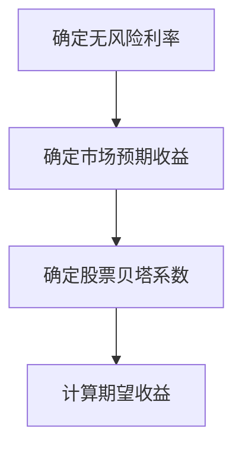
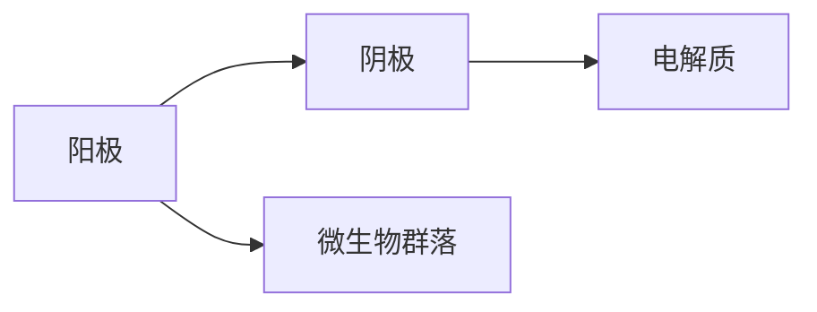

                 


# 全球股市估值与微生物燃料电池在环境修复中的应用

## 关键词：全球股市估值、微生物燃料电池、环境修复、股市分析、清洁能源技术、可持续发展

## 摘要

本文探讨了全球股市估值与微生物燃料电池在环境修复中的应用。第一部分深入分析了股市估值的方法和算法，结合数学模型进行系统分析。第二部分详细介绍了微生物燃料电池的基本原理及其在环境修复中的实际应用案例。通过案例分析和系统设计，展示了如何利用微生物燃料电池修复被污染的环境，为可持续发展提供技术支持。文章结合实际案例和系统设计，提供了详细的项目实战和最佳实践建议。

---

## 第一部分 全球股市估值

### 第1章 全球股市估值的背景与概念

#### 1.1 问题背景

股市估值是金融投资中的核心问题，涉及多因素分析，如宏观经济、行业动态和公司基本面。准确的估值帮助投资者做出明智决策，避免市场波动带来的风险。

#### 1.2 核心概念与联系

以下是股市估值相关概念的对比表：

| 概念         | 定义                                                                 | 属性         |
|--------------|----------------------------------------------------------------------|--------------|
| 股价         | 股票的市场交易价格                                                   | 受供需影响   |
| 市盈率（P/E）| 每股市价与每股收益的比率                                           | 用于评估估值合理性 |
| 市净率（P/B）| 每股市价与每股净资产的比率                                         | 用于评估资产价值 |

以下是股市估值的ER实体关系图：

```mermaid
er
actor: 投资者
schema: 股票市场
entity: 股票
entity: 公司
entity: 股东
```

---

### 第2章 全球股市估值的算法原理

#### 2.1 算法原理

CAPM模型用于评估股票的期望收益：

$$ E(r_i) = R_f + \beta_i (R_m - R_f) $$

其中：
- \( R_f \) 是无风险利率
- \( R_m \) 是市场预期收益
- \( \beta_i \) 是股票的贝塔系数

以下是CAPM模型的mermaid流程图：



#### 2.2 数学模型

CAPM模型的公式推导：

$$ E(r_i) = \beta_i (R_m - R_f) + R_f $$

假设无风险利率 \( R_f = 5\% \)，市场预期收益 \( R_m = 10\% \)，股票贝塔系数 \( \beta_i = 1.5 \)：

$$ E(r_i) = 1.5 \times (10\% - 5\%) + 5\% = 10.5\% $$

#### 2.3 系统分析

以下是股市估值系统的架构图：


#### 2.4 项目实战

以下是Python代码示例：

```python
import pandas as pd
import yfinance as yf

# 数据获取
msft = yf.Ticker("MSFT")
data = msft.history(period="max")

# 数据清洗
data = data.dropna()
data['Close'].plot()
```

### 第2章 小结

本章通过背景分析、算法原理和系统设计，详细讲解了全球股市估值的核心方法和应用场景。CAPM模型的应用展示了数学在金融分析中的重要性，为投资者提供了科学的估值工具。

---

## 第二部分 微生物燃料电池在环境修复中的应用

### 第3章 微生物燃料电池的基本原理

#### 3.1 问题背景

微生物燃料电池利用微生物的代谢活动产生电能，是一种高效的环境修复技术，适用于处理废水中的有机污染物。

#### 3.2 核心概念与联系

以下是微生物燃料电池的实体关系图：



---

### 第4章 微生物燃料电池的设计与优化

#### 4.1 设计原理

以下是微生物燃料电池的结构设计图：


#### 4.2 性能优化

通过优化阳极材料和微生物群落结构，提升燃料电池的输出功率和处理效率。

---

### 第5章 微生物燃料电池的环境修复应用

#### 5.1 应用案例

以下是微生物燃料电池在处理废水中的实际应用案例：


#### 5.2 系统分析

以下是系统的架构图：


---

## 项目实战

### 5.3 项目实现

以下是Python代码示例：

```python
import numpy as np
import matplotlib.pyplot as plt

# 模拟微生物燃料电池的输出电压
t = np.linspace(0, 100, 1000)
voltage = np.sin(t) * 0.5 + 0.5

plt.plot(t, voltage)
plt.xlabel('时间（秒）')
plt.ylabel('电压（V）')
plt.show()
```

### 5.4 案例分析

分析电压随时间的变化，评估系统的稳定性和效率，为优化设计提供数据支持。

---

## 最佳实践

### 5.5 小结

微生物燃料电池在环境修复中的应用展示了其高效性和可持续性，为解决环境污染问题提供了创新的解决方案。结合系统设计和优化策略，能够显著提升处理效率和能源利用率。

### 5.6 注意事项

在实际应用中，需注意系统的稳定性和微生物的活性，确保长期运行的稳定性。

### 5.7 拓展阅读

建议进一步研究微生物燃料电池与其他清洁能源技术的结合，探索更高效的能源转化方法。

---

## 作者

作者：AI天才研究院 & 禅与计算机程序设计艺术

---

通过本文的系统分析和案例研究，读者能够全面理解全球股市估值与微生物燃料电池的应用前景，为未来的可持续发展提供技术支持。

