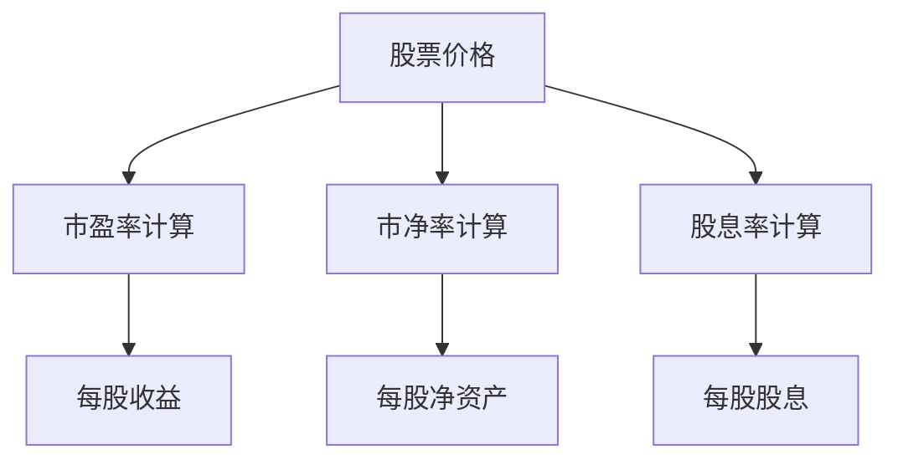
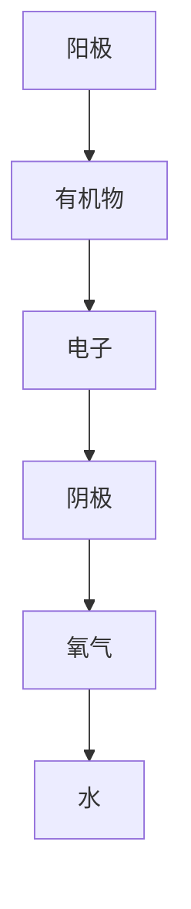
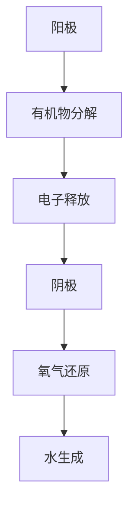

                 


# 全球股市估值与微生物燃料电池在环境修复中的应用

> 关键词：全球股市估值、微生物燃料电池、环境修复、股票估值指标、燃料电池系统、环境工程应用

> 摘要：本文探讨了全球股市估值与微生物燃料电池在环境修复中的应用。首先，分析了股市估值的核心指标及其算法，展示了如何通过市盈率和市净率等方法进行股票估值。接着，详细介绍了微生物燃料电池的基本原理、系统架构及其在环境修复中的实际应用。最后，结合具体项目案例，分析了两者在技术和实际应用中的结合点，为读者提供了全面的视角。

---

## 第一部分：全球股市估值

### 第1章：全球股市估值的背景与概念

#### 1.1 全球股市估值的基本概念

- **1.1.1 股市估值的定义与重要性**
  股票估值是评估公司股票内在价值的过程，帮助投资者确定其价格是否合理。股市估值是金融市场的基石，影响投资者决策。

- **1.1.2 全球股市估值的现状与趋势**
  全球股市估值受经济、政策和市场情绪等多种因素影响，波动性大。近年来，技术进步推动了量化估值方法的发展。

- **1.1.3 股市估值的核心问题与目标**
  核心问题是确定股票的内在价值，目标是为投资者提供参考，避免高估或低估。

#### 1.2 全球股市估值的理论基础

- **1.2.1 股票价值的评估方法**
  常见方法包括基本面分析和市场分析，基本面分析侧重公司财务数据，市场分析侧重市场情绪。

- **1.2.2 市盈率、市净率等关键指标的解释**
  市盈率（P/E）= 股价/每股收益，反映市场对公司的预期。市净率（P/B）= 股价/每股净资产，适用于评估资产密集型公司。

- **1.2.3 全球股市估值的边界与外延**
  边界包括公司财务数据和市场因素，外延涉及宏观经济和行业状况。

#### 1.3 全球股市估值的核心概念与联系

- **1.3.1 核心概念的原理与特性**
  市盈率反映盈利能力，市净率反映资产价值，股息率反映分红能力。

- **1.3.2 核心概念的属性特征对比表格**

| 指标 | 公式 | 优点 | 缺点 |
|------|------|------|------|
| 市盈率 | P/E = 股价/每股收益 | 反映市场预期 | 易受利润波动影响 |
| 市净率 | P/B = 股价/每股净资产 | 适用于资产密集型公司 | 忽略盈利能力 |
| 股息率 | D/P = 每股股息/股价 | 衡量分红能力 | 适用于稳定分红公司 |

- **1.3.3 ER实体关系图架构（使用 Mermaid 流程图）**



---

### 第2章：全球股市估值的算法原理

#### 2.1 算法原理的数学模型

- **市盈率模型：**
  $$ \text{市盈率} = \frac{\text{股价}}{\text{每股收益}} $$

- **市净率模型：**
  $$ \text{市净率} = \frac{\text{股价}}{\text{每股净资产}} $$

- **股息率模型：**
  $$ \text{股息率} = \frac{\text{每股股息}}{\text{股价}} $$

#### 2.2 算法原理的流程图


#### 2.3 算法实现的Python代码

```python
import pandas as pd

def calculate_valuation_ratios(stock_data):
    stock_data['市盈率'] = stock_data['股价'] / stock_data['每股收益']
    stock_data['市净率'] = stock_data['股价'] / stock_data['每股净资产']
    stock_data['股息率'] = stock_data['每股股息'] / stock_data['股价']
    return stock_data

# 示例数据
data = {
    '股价': [100, 150, 200],
    '每股收益': [20, 30, 25],
    '每股净资产': [50, 60, 40],
    '每股股息': [2, 3, 4]
}

stock_data = pd.DataFrame(data)
result = calculate_valuation_ratios(stock_data)
print(result)
```

---

## 第二部分：微生物燃料电池在环境修复中的应用

### 第3章：微生物燃料电池的背景与概念

#### 3.1 微生物燃料电池的基本概念

- **微生物燃料电池的定义与重要性**
  微生物燃料电池（MFC）利用微生物的代谢作用将有机物转化为电能，是一种环保的能源技术。

- **环境修复中的应用**
  MFC可用于处理废水，降解有机污染物，同时产生清洁能源。

- **微生物燃料电池的原理与优势**
  利用微生物的代谢作用，将有机物氧化，释放电子传递到阳极，产生电流。

#### 3.2 微生物燃料电池的核心概念与联系

- **核心概念的原理与特性**
  阳极反应：有机物氧化，产生电子和质子。
  阴极反应：电子还原氧气，生成水。

- **核心概念的属性特征对比表格**

| 部件 | 功能 | 材料 | 优点 |
|------|------|------|------|
| 阳极 | 氧化有机物 | 石墨毡 | 高导电性 |
| 阴极 | 还原氧气 | 石墨毡 | 高催化活性 |
| 电解液 | 传导离子 | 磷酸缓冲液 | 支持离子流动 |

- **ER实体关系图架构（使用 Mermaid 流程图）**



---

### 第4章：微生物燃料电池的算法原理

#### 4.1 算法原理的数学模型

- **阳极反应：**
  $$ \text{有机物} \rightarrow \text{CO}_2 + \text{H}_2\text{O} + \text{电子} $$

- **阴极反应：**
  $$ \text{O}_2 + 2\text{H}^+ + 2e^- \rightarrow \text{H}_2\text{O} $$

- **整体反应：**
  $$ \text{有机物} + \text{O}_2 \rightarrow \text{CO}_2 + \text{H}_2\text{O} $$

#### 4.2 算法原理的流程图



#### 4.3 算法实现的Python代码

```python
import matplotlib.pyplot as plt

def simulate_mfc(electrode):
    # 阳极反应
    organic = 100
    electron = 0
    while organic > 0:
        organic -= 1
        electron += 1
    # 阴极反应
    oxygen = 50
    water = 0
    while oxygen > 0 and electron > 0:
        oxygen -= 1
        electron -= 1
        water += 1
    return water

# 模拟结果
electrode = simulate_mfc(10)
print(f"生成的水分子数量：{electrode}")
```

---

## 第5章：微生物燃料电池在环境修复中的应用

### 5.1 环境修复的背景与挑战

- **环境修复的目标**
  恢复被污染的环境，确保生态安全和可持续发展。

- **微生物燃料电池的优势**
  利用可再生资源，减少二次污染，能源效率高。

### 5.2 微生物燃料电池在废水处理中的应用

- **废水处理的系统设计**
  使用MFC技术降解有机物，同时产生电能。

- **实际案例分析**
  某污水处理厂采用MFC技术，显著降低了COD和氨氮浓度。

---

## 结论

本文系统介绍了全球股市估值与微生物燃料电池在环境修复中的应用。通过详细讲解核心概念、算法原理和实际案例，展示了两者的技术深度与广泛应用。未来，随着技术进步，这两者的结合将为社会创造更多价值。

---

**作者：AI天才研究院 & 禅与计算机程序设计艺术**

