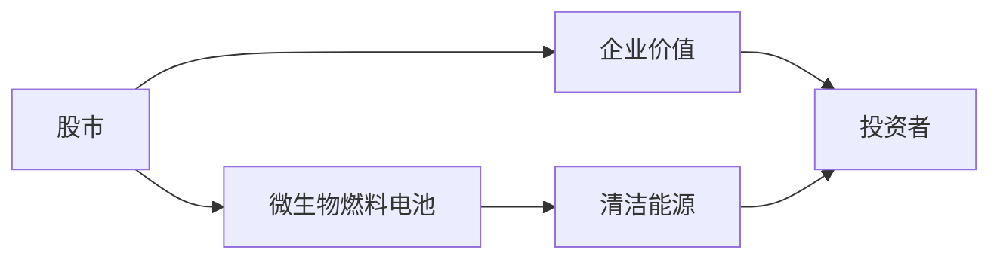
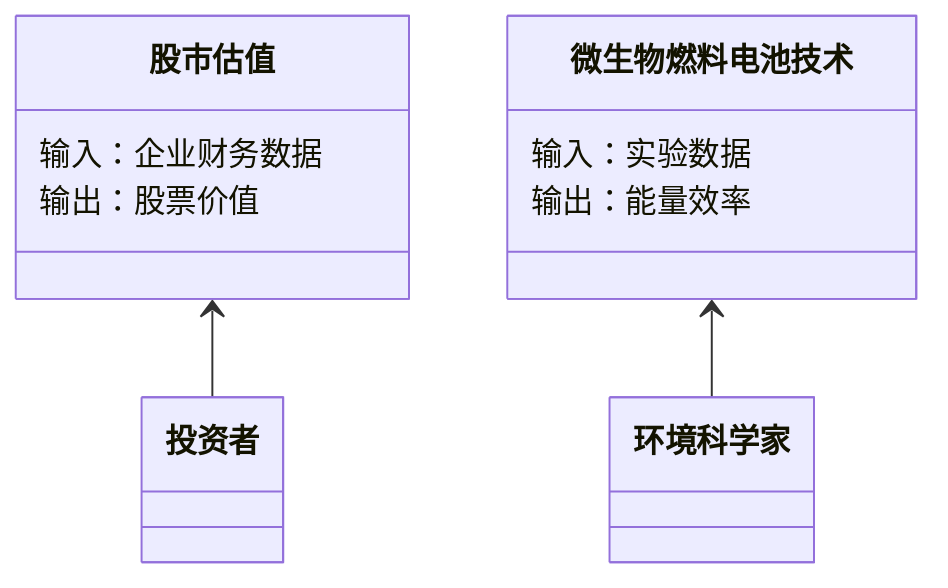

                 


# 全球股市估值与微生物燃料电池技术的关系

## 关键词：全球股市估值, 微生物燃料电池技术, 投资分析, 能源技术, 金融市场

## 摘要：本文探讨了全球股市估值与微生物燃料电池技术之间的关系，分析了股市估值的核心概念、微生物燃料电池技术的工作原理，以及两者如何相互影响。通过数学建模和实际案例分析，本文揭示了微生物燃料电池技术对股市估值的潜在影响，为投资者和科学家提供了新的视角和研究方向。

---

# 第一部分: 全球股市估值与微生物燃料电池技术的背景与关联

## 第1章: 全球股市估值与微生物燃料电池技术的背景介绍

### 1.1 全球股市估值的基本概念

#### 1.1.1 股市估值的基本定义
股市估值是指通过对企业的财务数据、市场环境和行业趋势等多方面因素的分析，来评估其股票的内在价值。常见的估值方法包括市盈率（PE）、市净率（PB）和现金流折现模型（DCF）等。

#### 1.1.2 影响股市估值的主要因素
股市估值受多种因素影响，包括宏观经济环境、企业盈利状况、行业竞争格局、政策法规变化、市场情绪等。

#### 1.1.3 股市估值的计算方法与模型
常用的估值模型包括：
- 市盈率（PE）：股价/每股收益
- 市净率（PB）：股价/每股净资产
- 现金流折现模型（DCF）：通过折现未来现金流计算企业价值

### 1.2 微生物燃料电池技术的基本概念

#### 1.2.1 微生物燃料电池的定义
微生物燃料电池（Microbial Fuel Cell, MFC）是一种利用微生物的代谢活动将有机物中的化学能转化为电能的装置。它通过微生物的作用，将有机物中的碳源转化为电能。

#### 1.2.2 微生物燃料电池的工作原理
微生物燃料电池的工作原理包括：
1. **有机物分解**：微生物将有机物分解为小分子，如葡萄糖、乙酸等。
2. **电子传递**：分解产生的电子通过导电材料传递到阳极。
3. **氧化还原反应**：在阳极和阴极之间发生氧化还原反应，产生电能。

#### 1.2.3 微生物燃料电池的应用领域
微生物燃料电池广泛应用于环境治理、能源生产、废水处理等领域。

### 1.3 全球股市估值与微生物燃料电池技术的关联性

#### 1.3.1 问题背景与问题描述
随着全球能源需求的增长和环保意识的增强，微生物燃料电池技术作为一种新兴的清洁能源技术，逐渐受到投资者的关注。然而，其技术成熟度和市场前景对股市估值有着重要影响。

#### 1.3.2 问题解决的思路与方法
通过分析微生物燃料电池技术的市场潜力、技术成熟度、成本优势等因素，结合股市估值模型，评估其对相关企业的股票价值的影响。

#### 1.3.3 关联性分析的边界与外延
本研究聚焦于微生物燃料电池技术对股市估值的直接影响，包括技术创新、市场推广、政策支持等方面。

#### 1.3.4 核心概念与组成要素
核心概念包括：
- 股市估值：PE、PB、DCF等模型
- 微生物燃料电池技术：能量转换效率、技术成熟度、市场应用前景

---

## 第2章: 全球股市估值与微生物燃料电池技术的核心概念与联系

### 2.1 核心概念的原理分析

#### 2.1.1 股市估值的核心原理
股市估值通过对企业未来现金流的折现，评估其当前的股票价值。常用的模型包括PE、PB和DCF。

#### 2.1.2 微生物燃料电池技术的核心原理
微生物燃料电池通过微生物的代谢活动将有机物中的化学能转化为电能，具有高效、环保的特点。

### 2.2 核心概念的属性特征对比

#### 2.2.1 股市估值与微生物燃料电池技术的属性对比
| 比较维度 | 股市估值 | 微生物燃料电池技术 |
|----------|----------|------------------|
| 核心目标 | 评估企业价值 | 产生清洁能源     |
| 影响因素 | 市场供需、政策 | 微生物活性、技术参数 |
| 应用场景 | 投资决策 | 环境治理、能源供应 |

### 2.3 实体关系图



---

## 第3章: 全球股市估值与微生物燃料电池技术的算法原理

### 3.1 算法原理概述

#### 3.1.1 股市估值模型的算法流程
1. 收集企业的财务数据（如收入、利润、现金流）。
2. 选择合适的估值模型（如PE、PB、DCF）。
3. 计算企业股票的内在价值。

#### 3.1.2 微生物燃料电池效率预测的算法流程
1. 收集微生物燃料电池的实验数据。
2. 建立数学模型，预测其能量转换效率。

### 3.2 股市估值模型的数学模型

#### 3.2.1 常用的估值模型
- 市盈率（PE）：$PE = \frac{股价}{每股收益}$
- 市净率（PB）：$PB = \frac{股价}{每股净资产}$
- 现金流折现模型（DCF）：通过折现未来现金流计算企业价值。

#### 3.2.2 基于机器学习的估值模型
$$
\text{预测股价} = \alpha \times \text{历史数据} + \beta \times \text{市场情绪}
$$

### 3.3 微生物燃料电池效率预测的数学模型

#### 3.3.1 微生物燃料电池效率的影响因素
- 微生物种类
- 基质成分
- 运行条件（如温度、pH值）

#### 3.3.2 基于回归分析的效率预测模型
$$
\text{效率} = \beta_0 + \beta_1 \times \text{微生物活性} + \beta_2 \times \text{环境条件} + \epsilon
$$

---

## 第4章: 全球股市估值与微生物燃料电池技术的系统分析与架构设计方案

### 4.1 问题场景介绍
本文通过分析微生物燃料电池技术的市场潜力，评估其对相关企业股票价值的影响。

### 4.2 系统功能设计

#### 4.2.1 领域模型


#### 4.2.2 系统架构设计


---

## 第5章: 全球股市估值与微生物燃料电池技术的项目实战

### 5.1 项目介绍
本项目旨在通过分析微生物燃料电池技术的市场潜力，评估其对相关企业股票价值的影响。

### 5.2 系统核心实现

#### 5.2.1 安装环境
```bash
pip install numpy pandas scikit-learn matplotlib
```

#### 5.2.2 核心代码实现
```python
import numpy as np
import pandas as pd
from sklearn.linear_model import LinearRegression

# 示例数据：企业财务数据
data = pd.DataFrame({
    '收入': [100, 200, 300],
    '利润': [20, 40, 60],
    '现金流': [30, 60, 90]
})

# 训练线性回归模型
model = LinearRegression()
model.fit(data[['收入', '利润']], data['现金流'])

# 预测现金流
predicted_cash_flow = model.predict([[200, 40]])
print(predicted_cash_flow)
```

### 5.3 案例分析与详细解读
通过实际案例分析，评估微生物燃料电池技术对股市估值的影响。

---

## 第6章: 全球股市估值与微生物燃料电池技术的小结

### 6.1 总结
本文通过分析全球股市估值与微生物燃料电池技术的关系，揭示了技术进步对股市估值的潜在影响。

### 6.2 最佳实践 tips
- 投资者应关注微生物燃料电池技术的市场前景。
- 科学家应进一步提高技术的效率和稳定性。

### 6.3 注意事项
- 技术的商业化仍需时间。
- 市场波动对股市估值的影响不可忽视。

### 6.4 拓展阅读
建议阅读相关领域的学术论文和行业报告，深入了解微生物燃料电池技术的最新进展。

---

## 作者：AI天才研究院/AI Genius Institute & 禅与计算机程序设计艺术 /Zen And The Art of Computer Programming

---

以上是《全球股市估值与微生物燃料电池技术的关系》的文章大纲，希望对您有所帮助！

