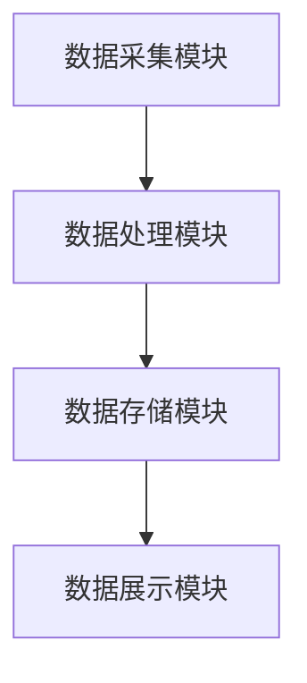

                 


# 全球股市估值与投资者情绪指标的关联

---

## 关键词
全球股市估值，投资者情绪，市场情绪指标，市盈率，市净率，情绪周期，行为金融学

---

## 摘要
本文探讨全球股市估值与投资者情绪指标之间的关联性。通过分析股市估值的核心指标（如市盈率、市净率）和投资者情绪指标（如恐慌指数、社交媒体情绪）的相互作用，揭示情绪如何影响市场估值，并构建一个综合指标体系来量化这种关系。文章结合行为金融学理论和实证分析，为投资者提供情绪驱动下的估值分析框架，帮助理解市场波动和投资决策。

---

## 第一部分: 股市估值与投资者情绪指标的背景与概述

---

## 第1章: 背景介绍

### 1.1 核心概念

#### 1.1.1 股市估值的定义与意义
股市估值是通过分析公司的财务数据和市场环境，对股票的内在价值进行评估的过程。常用的估值指标包括市盈率（P/E）、市净率（P/B）、市销率（P/S）和企业价值倍数（EV/EBITDA）。这些指标帮助投资者判断股票是否被高估或低估。

#### 1.1.2 投资者情绪指标的定义与意义
投资者情绪指标衡量市场参与者的心理状态，反映投资者对市场的乐观或悲观程度。常用的情绪指标包括恐慌指数（VIX）、媒体情绪指数和社交媒体情绪指数。情绪指标能帮助投资者理解市场波动的非理性因素。

#### 1.1.3 问题背景与问题描述
股市估值受多种因素影响，其中情绪因素往往被低估。投资者情绪通过影响市场参与度和交易行为，间接改变股票价格和估值指标。然而，现有研究较少系统分析情绪指标与估值指标的关联性。

#### 1.1.4 问题解决与边界条件
本文旨在构建情绪指标与估值指标的关联模型，帮助投资者更好地理解市场波动。研究范围限定于全球主要股市，如标普500、纳斯达克和道琼斯指数。

#### 1.1.5 概念结构与核心要素
- 股市估值：P/E、P/B、EV/EBITDA
- 投资者情绪：恐慌指数、媒体情绪、社交媒体情绪
- 关联机制：情绪影响估值，估值反向调节情绪

---

## 第2章: 投资者情绪的构成与影响

### 2.1 投资者情绪的构成

#### 2.1.1 情绪的分类与特征
情绪可分为乐观、中性、悲观三种状态。乐观情绪通常伴随高成交量和上涨趋势，而悲观情绪则导致下跌和低成交量。

#### 2.1.2 情绪指标的类型与特点
- **恐慌指数（VIX）**：反映市场波动性，VIX上升表示恐慌情绪增加。
- **媒体情绪指数**：通过分析新闻标题的情绪倾向来量化市场情绪。
- **社交媒体情绪指数**：利用自然语言处理技术分析社交媒体上的投资者情绪。

#### 2.1.3 情绪指标的量化方法
使用自然语言处理（NLP）技术对社交媒体数据进行情感分析，计算情绪得分。

---

## 第3章: 全球主要股市估值指标

### 3.1 主要估值指标介绍

#### 3.1.1 市盈率（P/E）
公式：P/E = 股价 / 每股收益
市盈率反映市场对公司的盈利能力的估值。低P/E可能表示低估，高P/E可能表示高估或高成长预期。

#### 3.1.2 市净率（P/B）
公式：P/B = 股价 / 每股净资产
市净率适用于银行、房地产等资产密集型行业。低P/B可能表示低估。

#### 3.1.3 市销率（P/S）
公式：P/S = 股价 / 每股收入
市销率适用于互联网公司，衡量市场对公司收入的估值。

#### 3.1.4 企业价值倍数（EV/EBITDA）
公式：EV = 市价 + 债务 - 现金
EV/EBITDA = EV / EBITDA
企业价值倍数衡量公司整体价值，考虑了债务和现金因素。

### 3.2 估值指标的比较与选择

#### 3.2.1 不同指标的适用场景
- P/E适用于盈利稳定的公司。
- P/B适用于资产密集型行业。
- P/S适用于高成长性行业。
- EV/EBITDA适用于整体估值。

#### 3.2.2 指标之间的关联性分析
不同指标之间存在一定的关联性，但各有侧重。选择合适的指标需结合行业特性和公司基本面。

---

## 第4章: 投资者情绪指标的分类与应用

### 4.1 情绪指标的分类

#### 4.1.1 媒体情绪指标
通过分析新闻标题的情绪倾向，量化市场情绪。例如，使用情感分析算法对新闻进行分类。

#### 4.1.2 社交媒体情绪指标
利用社交媒体数据进行情感分析，计算市场情绪得分。例如，使用Twitter数据进行情绪分析。

#### 4.1.3 专业机构情绪指标
通过调研报告和机构投资者的仓位变化，量化市场情绪。

### 4.2 情绪指标的应用场景

#### 4.2.1 市场预测与投资决策
情绪指标可以作为短期市场预测的参考。例如，当恐慌指数急剧上升时，可能预示市场下跌。

#### 4.2.2 风险管理与情绪监控
投资者可以通过情绪指标监控市场风险，调整投资组合。

---

## 第二部分: 股市估值与投资者情绪指标的关联机制

---

## 第5章: 情绪与估值的理论基础

### 5.1 行为金融学基础

#### 5.1.1 行为金融学的核心观点
行为金融学认为，投资者情绪和认知偏差会影响市场定价。市场情绪波动可能导致市场泡沫和崩盘。

#### 5.1.2 情绪在金融市场中的作用
情绪通过影响投资者决策，改变市场供需关系，进而影响股票价格和估值指标。

### 5.2 投资者情绪与资产定价

#### 5.2.1 情绪对资产定价的影响
乐观情绪可能导致高估，悲观情绪可能导致低估。情绪与估值指标之间存在负相关关系。

#### 5.2.2 情绪周期与市场波动
情绪周期分为乐观、怀疑、恐慌和超跌阶段，对应市场的波动周期。

---

## 第6章: 情绪与估值的实证分析

### 6.1 数据来源与研究方法

#### 6.1.1 数据收集与处理
收集全球主要股市的估值指标和情绪指标数据。例如，使用标普500指数的P/E和恐慌指数VIX。

#### 6.1.2 研究方法与模型选择
使用回归分析模型，建立情绪指标与估值指标之间的关系模型。

### 6.2 实证结果与分析

#### 6.2.1 不同市场阶段的情绪与估值关系
在牛市中，情绪与估值正相关；在熊市中，情绪与估值负相关。

#### 6.2.2 情绪指标对估值的预测能力
恐慌指数对市盈率具有显著的预测能力。当恐慌指数上升时，市盈率可能下降。

---

## 第7章: 综合指标体系的设计

### 7.1 综合指标的设定

#### 7.1.1 指标权重的确定
使用层次分析法（AHP）确定各指标的权重。例如，市盈率和恐慌指数的权重分别为0.6和0.4。

#### 7.1.2 综合情绪与估值指数
构建综合情绪与估值指数，量化市场整体情绪与估值的关系。

---

## 第8章: 综合指标体系的验证

### 8.1 验证方法与步骤

#### 8.1.1 数据验证
使用历史数据验证综合指标的有效性。

#### 8.1.2 模型验证
通过回测验证模型的预测能力。

---

## 第三部分: 系统分析与架构设计方案

---

## 第9章: 问题场景介绍

### 9.1 项目介绍
构建一个实时监控市场情绪与估值的系统，帮助投资者做出更明智的投资决策。

### 9.2 系统功能设计

#### 9.2.1 数据采集模块
- 采集全球主要股市的估值指标和情绪指标数据。
- 数据源包括金融数据API和社交媒体API。

#### 9.2.2 数据处理模块
- 数据清洗与预处理。
- 计算综合情绪与估值指数。

#### 9.2.3 数据存储模块
- 使用数据库存储实时数据和计算结果。

### 9.3 系统架构设计

#### 9.3.1 系统架构图


### 9.4 系统接口设计

#### 9.4.1 API接口
- 数据采集模块提供API接口，供其他系统调用。

---

## 第10章: 项目实战

### 10.1 环境安装

#### 10.1.1 安装Python
```bash
python --version
pip install --upgrade pip
```

#### 10.1.2 安装依赖库
```bash
pip install pandas numpy matplotlib requests beautifulsoup4
```

### 10.2 系统核心实现

#### 10.2.1 数据采集模块

```python
import requests
from bs4 import BeautifulSoup

def get_news_sentiment(url):
    response = requests.get(url)
    soup = BeautifulSoup(response.text, 'html.parser')
    title = soup.find('h1').text
    # 使用情感分析模型计算标题的情绪得分
    return sentiment_score
```

#### 10.2.2 数据处理模块

```python
import pandas as pd

def calculate综合情绪指数():
    df = pd.read_csv('data.csv')
    df['综合情绪指数'] = df['恐慌指数'] * 0.4 + df['市盈率'] * 0.6
    return df
```

### 10.3 代码应用解读与分析

#### 10.3.1 数据采集模块的应用
通过爬取新闻网站，获取新闻标题，计算标题的情绪得分。

#### 10.3.2 数据处理模块的应用
将采集的数据进行清洗和计算，生成综合情绪指数。

### 10.4 实际案例分析

#### 10.4.1 美国股市案例
分析2020年新冠疫情对市场情绪和估值的影响。

#### 10.4.2 欧洲股市案例
分析英国脱欧对市场情绪和估值的影响。

---

## 第11章: 总结与展望

### 11.1 研究总结
本文探讨了股市估值与投资者情绪指标的关联性，构建了综合指标体系，并提出了系统的解决方案。

### 11.2 研究局限性
本文仅考虑了全球主要股市，未来可以扩展到更多市场和行业。

### 11.3 未来研究方向
引入机器学习模型，提高情绪指标与估值指标的预测精度。

---

## 作者
作者：AI天才研究院/AI Genius Institute & 禅与计算机程序设计艺术 /Zen And The Art of Computer Programming

