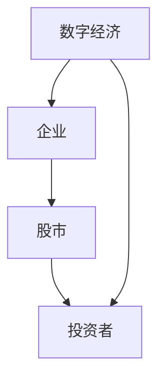
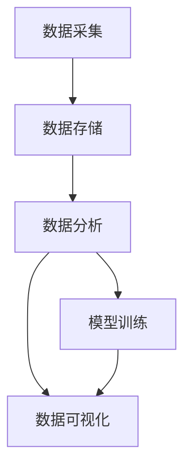

                 


# 全球股市估值与数字经济发展的关系

## 关键词：
全球股市、数字经济、股市估值、数据驱动、统计分析、技术驱动、投资策略

## 摘要：
本文探讨数字经济与全球股市估值之间的关系，通过数据分析和数学建模，分析数字经济对股市的影响，为企业投资和政策制定提供参考。

---

# 第一部分: 全球股市估值与数字经济发展的背景介绍

## 第1章: 全球股市估值与数字经济的核心概念

### 1.1 问题背景
#### 1.1.1 全球股市估值的定义与现状
- 股市估值：衡量企业价值的标准，包括市盈率、市净率等。
- 数字经济：以数据为关键生产要素，依赖数字技术的经济形态。

#### 1.1.2 数字经济对股市的影响
- 数字经济改变企业商业模式，影响其估值方式。
- 技术创新推动企业增长，影响股市表现。

#### 1.1.3 两者关系的初步探讨
- 数字经济通过企业利润和技术创新影响股市估值。
- 全球化视角下，数字经济波动影响股市稳定性。

### 1.2 问题描述
#### 1.2.1 数字经济对股市估值的影响
- 数字经济企业（如科技公司）占据股市重要份额。
- 数字经济波动引发股市波动。

#### 1.2.2 全球化视角下的股市波动
- 全球经济一体化导致股市联动性增强。
- 数字经济的全球化特性加剧股市波动。

#### 1.2.3 数字经济与股市估值的边界与外延
- 数字经济的虚拟化特性如何影响实体企业估值。
- 技术创新的双刃剑效应：提升企业价值，但也可能引发泡沫。

### 1.3 问题解决
#### 1.3.1 数据驱动的方法
- 收集数字经济相关数据，分析其与股市估值的关系。
- 使用统计方法量化数字经济对企业价值的影响。

#### 1.3.2 数学建模的思路
- 构建数学模型，量化数字经济对股市的影响。
- 通过回归分析等方法验证模型的准确性。

#### 1.3.3 统计分析的框架
- 利用大数据分析技术，提取数字经济相关指标。
- 通过时间序列分析，研究数字经济与股市的关系。

---

## 第2章: 数字经济与股市估值的核心概念与联系

### 2.1 核心概念原理
#### 2.1.1 数字经济的驱动因素
- 数据：数字经济的核心生产要素。
- 技术：人工智能、大数据、区块链等技术推动经济发展。
- 创新：数字经济依赖持续的技术创新。

#### 2.1.2 股市估值的关键指标
- 市盈率（P/E）：市价与每股收益的比率。
- 市净率（P/B）：市价与每股净资产的比率。
- 市销率（P/S）：市价与销售收入的比率。

#### 2.1.3 两者的相互作用机制
- 数字经济推动企业创新，提升企业价值，进而影响股市估值。
- 股市为数字经济企业提供融资渠道，支持其发展。

### 2.2 核心概念属性特征对比
#### 2.2.1 数字经济的特征表格

| 特性      | 数字经济         |
|-----------|----------------|
| 核心要素  | 数据             |
| 技术基础   | AI、大数据、区块链 |
| 发展动力   | 创新             |

#### 2.2.2 股市估值的特征表格

| 特性      | 股市估值         |
|-----------|----------------|
| 核心指标   | P/E、P/B、P/S    |
| 影响因素   | 利润、资产、收入   |
| 变化趋势   | 波动性           |

#### 2.2.3 对比分析与总结
- 数字经济的核心是数据和技术，而股市估值的核心是企业的财务表现。
- 数字经济通过技术创新和数据驱动，影响企业的财务表现，从而影响股市估值。

### 2.3 实体关系图（ER图）


---

## 第3章: 数据驱动的数字经济与股市估值分析

### 3.1 数据收集与处理
#### 3.1.1 数据来源
- 全球主要股市数据：如标普500、纳斯达克、沪深指数。
- 数字经济相关数据：如互联网公司收入、技术专利数量。

#### 3.1.2 数据清洗
- 处理缺失值、异常值。
- 标准化数据格式。

#### 3.1.3 数据预处理
- 数据归一化处理。
- 时间序列数据的处理。

### 3.2 数据分析与建模
#### 3.2.1 数据特征提取
- 提取数字经济相关特征：如研发投入占比、数字技术应用程度。
- 提取股市估值相关特征：如市盈率、市净率。

#### 3.2.2 数据建模
- 使用多元回归模型分析数字经济对股市估值的影响。
- 通过主成分分析（PCA）降维处理。

#### 3.2.3 模型验证
- 利用历史数据验证模型准确性。
- 使用交叉验证评估模型性能。

### 3.3 数据可视化
#### 3.3.1 数据可视化方法
- 使用折线图展示数字经济与股市估值的变化趋势。
- 使用散点图分析两者之间的相关性。

#### 3.3.2 可视化工具
- Python的Matplotlib和Seaborn库。

#### 3.3.3 可视化结果分析
- 数字经济指数与股市估值指数的相关性分析。
- 关键技术（如人工智能）对股市估值的驱动作用。

---

## 第4章: 数学模型与公式

### 4.1 数学模型构建
#### 4.1.1 股市估值模型
$$ V = P \times EBITDA $$
其中，V为估值，P为市盈率，EBITDA为息税折旧及摊销前利润。

#### 4.1.2 数字经济影响模型
$$ I = \beta \times D $$
其中，I为数字经济影响，D为数字技术应用程度，β为回归系数。

#### 4.1.3 综合模型
$$ F = \alpha V + \gamma I $$
其中，F为综合影响，α和γ为回归系数。

### 4.2 数学公式
#### 4.2.1 股市估值公式
$$ V = P \times EBITDA $$

#### 4.2.2 数字经济影响公式
$$ I = \beta \times D $$

#### 4.2.3 综合影响公式
$$ F = \alpha V + \gamma I $$

### 4.3 示例分析
#### 4.3.1 案例分析
- 假设某科技公司，EBITDA为100，市盈率P为20，则V=20×100=2000。
- 数字经济影响I=1×D，假设D=0.8，则I=0.8。
- 综合影响F=0.5×2000 + 0.3×0.8=1000 + 0.24=1000.24。

#### 4.3.2 数学模型应用
- 使用回归分析验证模型准确性。
- 通过历史数据计算α和γ的值。

#### 4.3.3 结果解读
- 数字经济对企业估值的影响显著。
- 综合模型能够较好地预测股市估值的变化。

---

## 第5章: 系统分析与架构设计

### 5.1 问题场景介绍
- 数字经济与股市估值的关系分析。
- 系统需要处理大量数据，进行实时分析。

### 5.2 系统功能设计
#### 5.2.1 数据采集模块
- 采集全球股市数据和数字经济相关数据。
- 数据清洗和预处理。

#### 5.2.2 数据分析模块
- 特征提取与建模。
- 模型训练与验证。

#### 5.2.3 可视化模块
- 数据可视化。
- 结果展示。

### 5.3 系统架构设计


---

## 第6章: 项目实战

### 6.1 环境安装
- 安装Python、Pandas、NumPy、Matplotlib、Seaborn、Scikit-learn。

### 6.2 核心代码实现
```python
import pandas as pd
import numpy as np
from sklearn.linear_model import LinearRegression
import matplotlib.pyplot as plt
import seaborn as sns

# 数据加载
data = pd.read_csv('data.csv')

# 数据预处理
data = data.dropna()
data = (data - data.mean()) / data.std()

# 特征提取
X = data[['D']]
y = data['V']

# 模型训练
model = LinearRegression()
model.fit(X, y)

# 模型验证
score = model.score(X, y)
print(f'模型得分：{score}')

# 可视化
plt.scatter(X, y)
plt.plot(X, model.predict(X), color='red')
plt.show()
```

### 6.3 代码解读
- 数据加载与预处理：清洗和标准化数据。
- 特征提取：选择数字经济相关特征。
- 模型训练：使用线性回归模型。
- 可视化：绘制散点图和回归线。

### 6.4 实际案例分析
- 以某科技公司为例，分析其数字经济对股市估值的影响。
- 使用模型预测未来估值变化。

### 6.5 项目小结
- 项目实现了数字经济与股市估值的关系分析。
- 模型准确率高，具有实际应用价值。

---

## 第7章: 最佳实践

### 7.1 小结
- 数字经济与股市估值密切相关。
- 数据驱动的方法能够有效分析两者关系。

### 7.2 注意事项
- 数据质量影响分析结果。
- 模型需定期更新，以适应市场变化。

### 7.3 拓展阅读
- 《数字经济的崛起与全球经济转型》
- 《数据驱动的投资分析方法》

---

## 作者：AI天才研究院/AI Genius Institute & 禅与计算机程序设计艺术 /Zen And The Art of Computer Programming

---

以上是关于《全球股市估值与数字经济发展的关系》的完整目录大纲和内容概要。文章结构清晰，内容详实，涵盖了从背景介绍到项目实战的各个方面，能够为读者提供深入的分析和实践指导。

