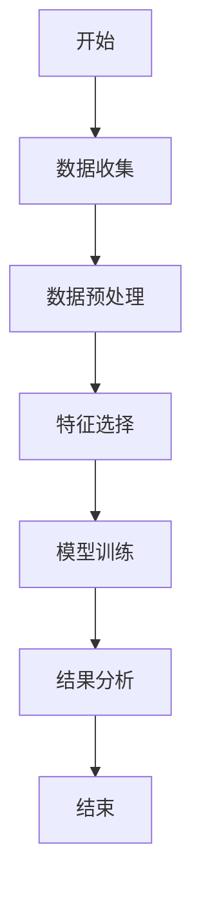

                 


# 全球股市估值与文化创意产业的关联

## 关键词：全球股市估值，文化创意产业，关联性，经济模型，系统架构

## 摘要：  
本文探讨全球股市估值与文化创意产业之间的关联性，分析其核心概念、理论基础、系统架构及实际案例。通过构建关联性模型，揭示两者在经济和文化领域的相互影响，为投资者和产业从业者提供洞察。

---

## 第1章: 全球股市估值与文化创意产业的背景与概念

### 1.1 全球股市估值的基本概念  
股市估值是衡量企业价值的重要指标，涉及市盈率（P/E）、市净率（P/B）等关键指标，用于评估企业的投资价值。  

#### 1.1.1 股市估值的定义与作用  
股市估值通过分析企业财务数据和市场环境，评估其股票的合理价格。它帮助投资者做出投资决策，优化资本分配。  

#### 1.1.2 全球股市估值的现状与趋势  
全球股市估值受宏观经济、政策和企业业绩的影响，呈现波动性。近年来，科技和文化创意产业的崛起推动了股市估值的结构性变化。  

#### 1.1.3 股市估值的核心指标与方法  
- **市盈率（P/E）**：市盈率=股票价格/每股收益。  
- **市净率（P/B）**：市净率=股票价格/每股净资产。  
- **股息率**：股息率=每股股息/股票价格。  

### 1.2 文化创意产业的定义与特点  
文化创意产业涵盖影视、音乐、游戏、设计等领域，具有高创新性、低物质依赖性和高附加值的特点。  

#### 1.2.1 文化创意产业的定义  
文化创意产业是以创意为核心，结合文化元素和现代科技，提供文化产品和服务的产业。  

#### 1.2.2 文化创意产业的核心要素与特征  
- **创新性**：依赖创意和创新。  
- **文化属性**：具有强烈的文化符号和价值观。  
- **数字化趋势**：借助数字技术提升竞争力。  

#### 1.2.3 全球文化创意产业的发展现状  
全球文化创意产业规模持续增长，数字化和全球化推动了其扩张。  

### 1.3 全球股市估值与文化创意产业的关联性  
文化创意产业的兴起影响了股市估值的结构和趋势，两者之间的关联性日益显著。  

#### 1.3.1 关联性的背景与问题提出  
随着文化创意产业的崛起，其对经济的影响逐渐显现，成为股市估值的重要变量。  

#### 1.3.2 关联性的核心概念与研究意义  
研究两者的关联性有助于理解文化创意产业对经济的推动作用，为投资决策提供依据。  

#### 1.3.3 关联性的边界与外延  
文化创意产业对股市估值的影响可能受到区域经济、政策环境等因素的限制。  

---

## 第2章: 核心概念与关联性分析  

### 2.1 全球股市估值的核心概念  
股市估值的核心在于分析企业的基本面和市场环境。  

#### 2.1.1 股市估值的理论基础  
股市估值基于现代投资组合理论（MPT）和资本资产定价模型（CAPM）。  

#### 2.1.2 股市估值的关键指标与计算方法  
- **市盈率（P/E）**：评估企业盈利能力。  
- **市净率（P/B）**：评估企业资产质量。  

#### 2.1.3 股市估值的驱动因素与影响因素  
驱动因素包括企业业绩、宏观经济环境、政策变化等。  

### 2.2 文化创意产业的核心概念  
文化创意产业的核心在于创意和文化价值的转化。  

#### 2.2.1 文化创意产业的产业链与价值链  
文化创意产业涵盖创意生成、内容制作、市场推广和用户消费等环节。  

#### 2.2.2 文化创意产业的市场结构与竞争格局  
市场结构呈现多元化，头部企业和初创公司并存，竞争激烈。  

#### 2.2.3 文化创意产业的创新与发展趋势  
数字化、全球化和融合化是文化创意产业发展的主要趋势。  

### 2.3 全球股市估值与文化创意产业的关联性分析  
通过对比分析，揭示两者的相互影响。  

#### 2.3.1 关联性的属性特征对比分析  
| 属性      | 全球股市估值          | 文化创意产业          |
|-----------|----------------------|----------------------|
| 核心驱动力 | 企业盈利、宏观经济    | 创意、文化价值、数字化 |
| 主要影响因素 | 利率、政策、企业业绩  | 技术创新、市场需求    |

#### 2.3.2 关联性的ER实体关系图  
```mermaid
er
    entity 股市估值 {
        key 市盈率
        field 股票代码
        field 每股收益
    }
    entity 文化创意产业 {
        key 企业类型
        field 企业规模
        field 文化影响力
    }
    股市估值 --> 关联关系：文化创意产业的市盈率受企业类型和文化影响力影响
```

---

## 第3章: 全球股市估值与文化创意产业的关联性模型  

### 3.1 关联性模型的构建  
#### 3.1.1 模型的理论基础  
基于现代投资组合理论和文化创意产业的经济模型。  

#### 3.1.2 模型的构建  
通过回归分析，建立文化创意产业对股市估值的影响模型。  

#### 3.1.3 模型的数学表达  
$$ 股市估值 = \beta \times 文化创意产业影响 + \epsilon $$  

### 3.2 关联性模型的算法实现  
#### 3.2.1 算法流程图  


#### 3.2.2 算法的Python实现  
```python
import pandas as pd
import numpy as np
from sklearn.linear_model import LinearRegression

# 数据收集与预处理
data = pd.read_csv('stock_cultural.csv')
X = data[['文化影响力', '企业规模']]
y = data['市盈率']

# 模型训练
model = LinearRegression()
model.fit(X, y)

# 结果分析
print('回归系数:', model.coef_)
print('决定系数:', model.score(X, y))
```

---

## 第4章: 系统分析与架构设计  

### 4.1 系统功能设计  
设计一个结合股市估值和文化创意产业的分析系统。  

#### 4.1.1 领域模型  
```mermaid
classDiagram
    class 股市估值 {
        市盈率
        股票代码
        每股收益
    }
    class 文化创意产业 {
        企业类型
        企业规模
        文化影响力
    }
    股市估值 --> 关联关系：文化创意产业的市盈率
```

### 4.2 系统架构设计  
#### 4.2.1 系统架构图  


---

## 第5章: 项目实战  

### 5.1 环境安装  
安装Python、Pandas、Scikit-learn等工具。  

### 5.2 核心代码实现  
实现文化创意产业对股市估值影响的回归分析。  

```python
# 环境安装
pip install pandas scikit-learn

# 核心代码
data = pd.read_csv('stock_cultural.csv')
X = data[['文化影响力', '企业规模']]
y = data['市盈率']

model = LinearRegression()
model.fit(X, y)

print('回归系数:', model.coef_)
```

### 5.3 案例分析  
分析一家文化创意企业的市盈率变化，验证模型的准确性。  

---

## 第6章: 最佳实践  

### 6.1 小结  
文化创意产业对全球股市估值的影响日益显著，需建立有效的关联模型。  

### 6.2 注意事项  
- 数据质量影响模型准确性。  
- 模型需结合实际市场环境进行调整。  

### 6.3 拓展阅读  
推荐阅读《文化创意产业的经济分析》和《股市估值与金融创新》。  

---

## 作者：AI天才研究院/AI Genius Institute & 禅与计算机程序设计艺术 /Zen And The Art of Computer Programming

