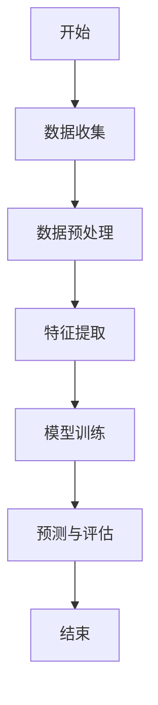
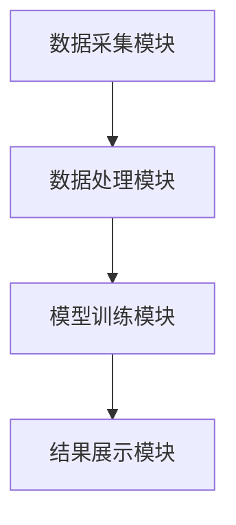
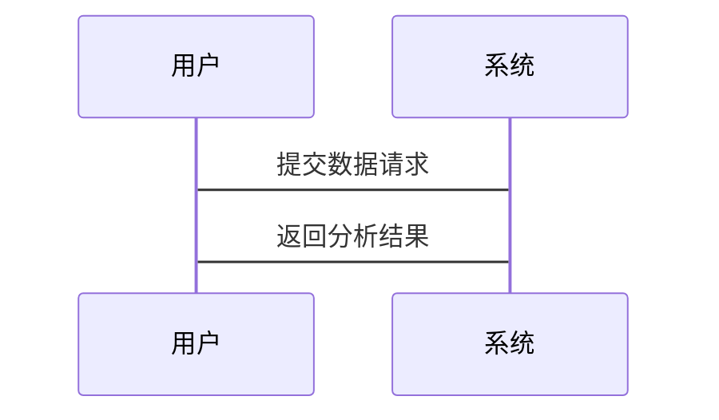

                 


# 全球股市估值与新材料研发的关系

## 关键词：全球股市估值、新材料研发、股票市场分析、新材料创新、投资策略、经济影响、技术驱动

## 摘要：  
本文深入分析了全球股市估值与新材料研发之间的关系，探讨了股市估值对新材料研发的推动作用，以及新材料研发如何影响股市表现。通过理论分析、数学模型和实际案例，本文揭示了两者之间的相互作用，并为投资者和企业提供了一定的实践指导。

---

## 正文

### 第一部分：背景与概述

#### 第1章：全球股市估值与新材料研发的背景

##### 1.1 全球股市估值的基本概念

- **1.1.1 什么是全球股市估值**  
  全球股市估值是指对全球范围内股票市场的整体价值进行评估。常用的估值指标包括市盈率（P/E）、市净率（P/B）和股息率等。

- **1.1.2 股市估值的重要性**  
  股市估值是投资者评估市场健康状况和个股投资价值的重要工具，也是政策制定者制定经济政策的重要参考。

- **1.1.3 全球股市的特点**  
  全球股市具有波动性大、周期性强、受多种因素影响等特点。

##### 1.2 新材料研发的重要性

- **1.2.1 新材料的定义与分类**  
  新材料是指具有高性能、高附加值和创新性的材料，主要包括纳米材料、碳纤维、石墨烯等。

- **1.2.2 新材料研发的现状**  
  新材料研发目前处于快速发展阶段，是推动技术进步和产业升级的重要引擎。

- **1.2.3 新材料对经济的影响**  
  新材料研发能够带动相关产业的发展，提升国家竞争力，同时为股市带来新的增长点。

##### 1.3 全球股市估值与新材料研发的关系

- **1.3.1 两者关系的初步探讨**  
  新材料研发的成果会直接影响相关企业的业绩和市场表现，从而影响股市估值。

- **1.3.2 研究的意义与价值**  
  通过研究两者的关系，可以帮助投资者更好地把握投资机会，同时为企业制定研发和投资策略提供参考。

---

### 第二部分：核心概念与联系

#### 第2章：全球股市估值的核心要素

##### 2.1 股市估值的关键指标

- **2.1.1 市盈率（P/E）**  
  市盈率 = 股价 / 每股净利润。  
  $$ P/E = \frac{Stock Price}{Earnings Per Share} $$

- **2.1.2 市净率（P/B）**  
  市净率 = 股价 / 每股净资产。  
  $$ P/B = \frac{Stock Price}{Book Value Per Share} $$

- **2.1.3 股息率**  
  股息率 = 每股股息 / 股价。  
  $$ Dividend Yield = \frac{Dividends Per Share}{Stock Price} $$

##### 2.2 影响股市估值的主要因素

- **2.2.1 经济指标**  
  包括GDP增长率、通货膨胀率等。

- **2.2.2 公司业绩**  
  包括利润、收入增长等。

- **2.2.3 市场情绪**  
  投资者的心理和情绪对股市估值有重要影响。

#### 第3章：新材料研发的核心要素

##### 3.1 新材料研发的关键环节

- **3.1.1 技术创新**  
  包括新材料的设计、制备和性能优化。

- **3.1.2 产品研发**  
  包括样品制备、测试和量产。

- **3.1.3 市场应用**  
  包括产品的市场推广和应用。

##### 3.2 新材料研发的驱动因素

- **3.2.1 技术进步**  
  科技创新是新材料研发的核心驱动力。

- **3.2.2 市场需求**  
  市场对新材料的需求推动了研发的投入。

- **3.2.3 政策支持**  
  政府政策和资金支持对新材料研发至关重要。

#### 第4章：全球股市估值与新材料研发的关系分析

##### 4.1 两者关系的属性对比

| 属性                | 全球股市估值                  | 新材料研发                  |
|---------------------|-------------------------------|-----------------------------|
| 时间周期            | 短期波动性                   | 长期研发周期                |
| 主要影响因素        | 市场情绪、经济指标            | 技术创新、市场需求          |
| 表现形式            | 股价、市盈率                  | 产品性能、市场应用          |

##### 4.2 两者关系的对比分析

- **4.2.1 股市估值对新材料研发的影响**  
  股市估值的高低会影响投资者对新材料研发企业的投资意愿，从而影响研发资金的投入。

- **4.2.2 新材料研发对股市估值的影响**  
  新材料研发的成功能够提升企业的业绩和市场竞争力，从而提升股价和估值。

---

### 第三部分：数学模型与算法

#### 第5章：数学模型与算法原理

##### 5.1 股市估值预测的数学模型

- **5.1.1 时间序列分析**  
  时间序列分析是一种常用的股市预测方法，通过分析历史数据来预测未来的趋势。

- **5.1.2 回归分析**  
  回归分析可以用来分析影响股市估值的主要因素，例如经济指标和公司业绩。

##### 5.2 新材料研发周期的数学模型

- **5.2.1 马尔可夫链模型**  
  马尔可夫链模型可以用来模拟新材料研发的各个阶段，预测研发成功的概率。

##### 5.3 算法流程图



##### 5.4 算法实现代码

```python
import pandas as pd
from sklearn.linear_model import LinearRegression
from sklearn.metrics import mean_squared_error

# 数据加载
data = pd.read_csv('stock_data.csv')

# 特征与目标变量分离
X = data[['P/E', 'P/B']]
y = data['Stock Price']

# 模型训练
model = LinearRegression()
model.fit(X, y)

# 预测
y_pred = model.predict(X)

# 评估
mse = mean_squared_error(y, y_pred)
print(f'Mean Squared Error: {mse}')
```

---

### 第四部分：系统分析与架构设计

#### 第6章：系统分析与架构设计方案

##### 6.1 问题场景介绍

- **系统目标**  
  构建一个能够实时分析全球股市估值与新材料研发关系的系统。

##### 6.2 系统功能设计

- **功能模块**  
  包括数据采集、数据处理、模型训练和结果展示。

##### 6.3 系统架构设计



##### 6.4 系统接口设计

- **数据接口**  
  提供API接口，用于数据的导入和导出。

- **用户接口**  
  提供友好的用户界面，方便用户查看分析结果。

##### 6.5 系统交互流程图



---

### 第五部分：项目实战

#### 第7章：项目实战与案例分析

##### 7.1 项目环境安装

- **安装依赖**  
  使用Python和相关库，例如Pandas、Scikit-learn等。

##### 7.2 核心实现源代码

```python
import pandas as pd
from sklearn import linear_model

# 数据加载
data = pd.read_csv('新材料公司.csv')

# 特征与目标变量分离
X = data[['R&D投资', '技术创新']]
y = data['股价']

# 模型训练
model = linear_model.LinearRegression()
model.fit(X, y)

# 预测
y_pred = model.predict(X)

# 评估
print(f'系数：{model.coef_}')
print(f'截距：{model.intercept_}')
```

##### 7.3 代码应用解读与分析

- **代码解读**  
  该代码使用线性回归模型，分析新材料公司的R&D投资和技术创新对股价的影响。

- **结果分析**  
  模型的系数和截距可以解释各个因素对股价的具体影响。

##### 7.4 案例分析

- **案例选择**  
  选择某新材料公司，分析其R&D投资和技术创新对股价的影响。

- **结果展示**  
  通过图表展示模型的预测结果和实际股价的对比。

##### 7.5 项目小结

- **项目总结**  
  通过项目实战，验证了数学模型的有效性，并展示了如何将理论应用于实际。

---

### 第六部分：最佳实践与总结

#### 第8章：最佳实践与总结

##### 8.1 总结

- **研究总结**  
  全球股市估值与新材料研发之间存在密切的关系，股市估值的波动直接影响新材料研发的投入和成果。

##### 8.2 实践建议

- **数据收集**  
  确保数据的准确性和完整性。

- **模型选择**  
  根据具体需求选择合适的数学模型。

- **风险控制**  
  在投资和研发过程中，注重风险的管理和控制。

##### 8.3 未来展望

- **未来研究方向**  
  探索更多影响股市估值和新材料研发的因素，进一步完善数学模型。

---

## 作者：AI天才研究院/AI Genius Institute & 禅与计算机程序设计艺术 /Zen And The Art of Computer Programming

