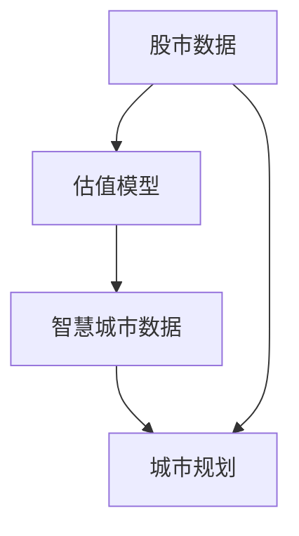
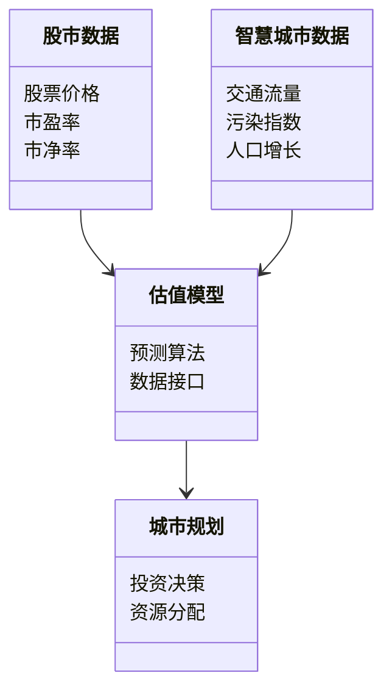
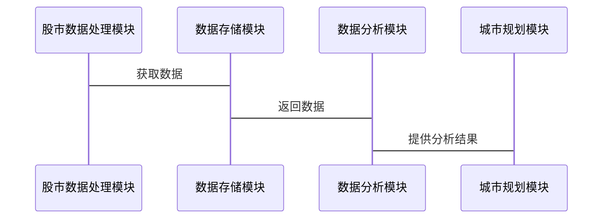

                 


# 全球股市估值与智慧城市建设的互动

> 关键词：全球股市估值、智慧城市建设、互动关系、数据共享、技术应用

> 摘要：本文探讨了全球股市估值与智慧城市建设之间的互动关系，分析了两者的核心概念、算法原理、系统架构，并通过实际案例展示了如何利用技术手段实现两者的有效结合，为智慧城市建设提供新的视角和方法。

---

# 第1章: 背景介绍

## 1.1 全球股市估值的基本概念
### 1.1.1 股市估值的定义与意义
股市估值是通过对上市公司的财务数据和市场表现进行分析，评估其股票的合理价格区间。常见的估值指标包括市盈率（P/E）、市净率（P/B）等。股市估值的意义在于帮助投资者做出理性决策，同时为市场的健康发展提供参考。

### 1.1.2 全球股市估值的现状与趋势
全球股市估值受经济环境、政策变化、企业业绩等多种因素影响。近年来，随着科技的进步和全球化的加深，股市估值的波动性增大，投资者对数据驱动的分析方法需求日益增加。

### 1.1.3 智慧城市建设的定义与目标
智慧城市建设是通过运用信息技术（如大数据、人工智能、物联网等）提升城市规划、管理和服务的智能化水平，目标是打造高效、宜居、可持续发展的城市。

---

## 1.2 股市估值与智慧城市建设的互动关系
### 1.2.1 股市估值对智慧城市建设的影响
股市估值反映了投资者对城市相关企业的信心，企业市值的变化可能影响城市的经济活力和投资环境。例如，科技企业在股市中的表现可能直接影响智慧城市建设的资金投入和技术研发。

### 1.2.2 智慧城市建设对股市估值的反作用
智慧城市建设通过提升城市的竞争力和吸引力，可能带动相关企业的业绩增长，从而提高其股票的估值。例如，智慧城市项目可能增加企业的收入来源，提升市盈率。

### 1.2.3 互动关系的背景与问题描述
随着科技的发展，智慧城市建设需要大量的资金和技术支持，而股市估值的变化直接影响企业的融资能力。如何在两者之间建立有效的互动机制，成为当前面临的重要问题。

---

## 1.3 问题解决与边界
### 1.3.1 问题解决的思路与方法
通过分析股市估值和智慧城市建设的核心要素，建立数据共享机制，利用技术手段进行预测和优化。

### 1.3.2 互动关系的边界与外延
互动关系主要集中在数据共享、技术应用和政策制定方面。需要明确边界，避免过度干预和信息泄露。

### 1.3.3 核心要素与概念结构
- 股市估值：企业财务数据、市场表现、投资者信心。
- 智慧城市建设：技术应用、政策支持、城市规划。
- 互动机制：数据共享、技术驱动、政策引导。

---

## 1.4 本章小结
本章通过背景介绍，明确了股市估值和智慧城市建设的基本概念，分析了它们之间的互动关系，并提出了问题解决的思路和方法。

---

# 第2章: 核心概念与联系

## 2.1 核心概念原理
### 2.1.1 股市估值的核心原理
股市估值依赖于对企业财务状况、行业前景和市场趋势的分析。常用的方法包括DCF模型（现金流贴现法）和相对估值法。

### 2.1.2 智慧城市建设的核心原理
智慧城市建设依赖于技术创新和数据驱动的管理方式，通过整合城市资源，优化资源配置效率。

---

## 2.2 核心概念属性特征对比
### 2.2.1 股市估值与智慧城市建设的对比分析
| 股市估值 | 智慧城市建设 |
|----------|---------------|
| 数据驱动 | 技术驱动      |
| 短期波动 | 长期规划      |
| 投资者行为 | 政府与企业合作 |

### 2.2.2 属性特征的表格化展示
通过对比分析，可以看出两者在驱动因素、时间跨度和参与主体上的差异。

### 2.2.3 关键差异与共同点总结
股市估值关注短期收益和市场情绪，而智慧城市建设注重长期规划和资源整合。两者在数据共享和技术应用上有潜在的协同空间。

---

## 2.3 ER实体关系图
### 2.3.1 实体关系图的 mermaid 表示


---

## 2.4 本章小结
本章通过核心概念的分析和对比，揭示了股市估值与智慧城市建设之间的联系，并通过实体关系图展示了它们的数据交互关系。

---

# 第3章: 算法原理讲解

## 3.1 算法原理概述
### 3.1.1 股市估值的核心算法
常用算法包括时间序列分析和机器学习模型。例如，ARIMA模型用于预测股票价格，LSTM网络用于捕捉时间依赖的特征。

### 3.1.2 智慧城市建设的算法特点
智慧城市建设中的算法主要集中在优化问题，如线性规划和遗传算法。例如，交通流量预测和资源分配优化。

---

## 3.2 算法实现与对比
### 3.2.1 时间序列分析（以ARIMA为例）
$$ ARIMA(p, d, q) $$
其中，p为自回归阶数，d为差分阶数，q为移动平均阶数。

### 3.2.2 机器学习模型（以LSTM为例）
LSTM网络通过长短期记忆单元处理时间序列数据，适用于股票价格预测。

### 3.2.3 算法对比与选择
时间序列分析适合短期预测，机器学习模型适合复杂模式识别。根据需求选择合适算法。

---

## 3.3 算法优化与实现
### 3.3.1 算法优化思路
通过参数调整和模型集成提升预测精度。

### 3.3.2 Python代码实现
```python
from sklearn.metrics import mean_squared_error
import numpy as np
import pandas as pd
```

---

## 3.4 本章小结
本章通过算法原理的讲解，分析了股市估值和智慧城市建设中的常用算法，并通过对比和优化，提出了适合实际应用的方法。

---

# 第4章: 系统分析与架构设计方案

## 4.1 系统分析
### 4.1.1 问题场景介绍
智慧城市建设需要整合股市数据，优化资源配置。例如，利用股市数据预测企业投资行为，优化城市规划。

### 4.1.2 项目介绍
构建一个数据共享平台，连接股市数据和智慧城市数据，提供实时分析和决策支持。

---

## 4.2 系统功能设计
### 4.2.1 领域模型设计


---

## 4.3 系统架构设计
### 4.3.1 系统架构图


---

## 4.4 系统接口设计
### 4.4.1 接口描述
- 数据接口：提供股市和城市数据的实时获取功能。
- 分析接口：提供预测结果和优化建议。

### 4.4.2 序列图


---

## 4.5 本章小结
本章通过系统分析与架构设计，明确了数据共享平台的构建方法，并通过接口设计展示了系统的交互流程。

---

# 第5章: 项目实战

## 5.1 项目环境安装
### 5.1.1 安装Python和相关库
```bash
pip install numpy pandas scikit-learn
```

---

## 5.2 核心代码实现
### 5.2.1 数据采集与清洗
```python
import pandas as pd
data = pd.read_csv('stock_data.csv')
data_clean = data.dropna()
```

### 5.2.2 模型训练与预测
```python
from sklearn.model_selection import train_test_split
from sklearn.linear_model import LinearRegression
X = data_clean[['市盈率', '市净率']]
y = data_clean['股票价格']
X_train, X_test, y_train, y_test = train_test_split(X, y, test_size=0.2)
model = LinearRegression()
model.fit(X_train, y_train)
```

### 5.2.3 结果分析
```python
print('预测结果:', model.predict(X_test))
print('均方误差:', mean_squared_error(y_test, model.predict(X_test)))
```

---

## 5.3 案例分析与优化
### 5.3.1 案例分析
通过实际案例分析模型的准确性，调整参数优化预测效果。

### 5.3.2 结果解读
解释预测结果对智慧城市建设的具体影响。

---

## 5.4 本章小结
本章通过项目实战，展示了如何利用技术手段实现股市估值与智慧城市建设的互动，为实际应用提供了参考。

---

# 第6章: 总结与展望

## 6.1 本章总结
本文通过背景介绍、核心概念分析、算法原理讲解和项目实战，全面探讨了全球股市估值与智慧城市建设的互动关系。

## 6.2 展望
未来，随着人工智能和大数据技术的进一步发展，股市估值与智慧城市建设的互动将更加紧密，需要进一步研究如何利用新技术优化互动机制。

---

# 作者：AI天才研究院/AI Genius Institute & 禅与计算机程序设计艺术 /Zen And The Art of Computer Programming

