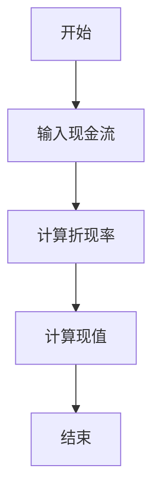
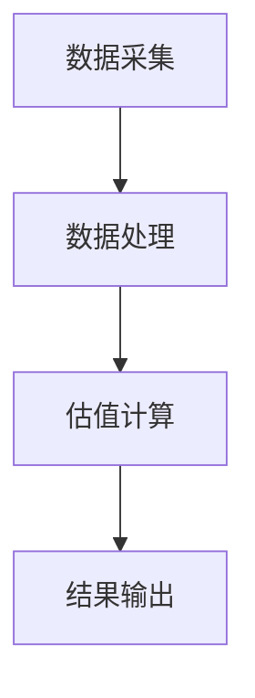
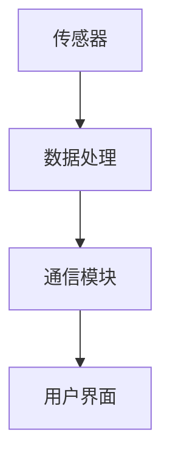

                 


# 全球股市估值与柔性电子在可穿戴医疗设备中的应用

## 关键词：全球股市估值，柔性电子，可穿戴医疗设备，投资分析，技术应用

## 摘要

本文深入探讨了全球股市估值的核心概念、算法原理及其系统架构设计，同时分析了柔性电子技术在可穿戴医疗设备中的应用，展示了两者之间的潜在联系。通过实际案例分析，文章展示了如何将柔性电子技术应用于医疗设备，并探讨了这对股市估值的影响。

---

## 第一部分：全球股市估值与分析

### 第1章：全球股市估值概述

#### 1.1 股市估值的基本概念

**1.1.1 股市估值的定义**  
股市估值是指通过对公司财务数据和市场信息的分析，评估其股票的内在价值，以指导投资决策。

**1.1.2 股市估值的核心要素**  
主要包括公司的盈利能力、成长潜力、财务状况和市场环境等。

**1.1.3 股市估值的分类与特点**  
分为绝对估值和相对估值，分别侧重于内在价值和市场比较。

#### 1.2 股市估值的背景与意义

**1.2.1 全球化背景下的股市发展**  
全球股市的互联互通使得跨国投资成为可能，推动了估值方法的多样化。

**1.2.2 股市估值在投资决策中的作用**  
帮助投资者识别被低估或高估的股票，优化资产配置。

**1.2.3 股市估值对经济的影响**  
影响市场流动性、企业融资成本和经济政策制定。

---

### 第2章：股市估值的核心概念与模型

#### 2.1 股市估值的关键指标

**2.1.1 市盈率（P/E Ratio）**  
计算公式：$$P/E = \frac{股票价格}{每股收益}$$  
衡量股票相对于其盈利水平的高低。

**2.1.2 市净率（P/B Ratio）**  
计算公式：$$P/B = \frac{股票价格}{每股净资产}$$  
适用于评估银行等资产密集型行业。

**2.1.3 市销率（P/S Ratio）**  
计算公式：$$P/S = \frac{股票价格}{每股收入}$$  
适合亏损企业或新兴行业的估值。

**2.1.4 股息率（Dividend Yield）**  
计算公式：$$股息率 = \frac{每股股息}{股票价格} \times 100\%$$  
反映投资回报的稳定性。

#### 2.2 股市估值模型

**2.2.1 现金流折现模型（DCF Model）**  
$$DCF = \frac{CF_1}{(1+r)^1} + \frac{CF_2}{(1+r)^2} + \dots + \frac{CF_n}{(1+r)^n}$$  
通过折现未来现金流计算企业价值。

**2.2.2 市盈率模型**  
$$P = \frac{P_{ref}}{E_{ref}} \times E$$  
基于可比公司市盈率进行估值。

**2.2.3 市净率模型**  
$$P = \frac{P_{ref}}{B_{ref}} \times B$$  
适用于资产密集型企业。

**2.2.4 综合估值模型**  
结合多种指标和模型，提供更全面的估值结果。

---

### 第3章：股市估值的算法原理

#### 3.1 股市估值的核心算法

**3.1.1 DCF模型的数学公式**  
通过公式展示DCF模型的计算过程，分析各变量的影响。

**3.1.2 市盈率模型的计算方法**  
使用可比公司数据，调整行业平均市盈率进行估值。

#### 3.2 算法流程图



---

### 第4章：股市估值的系统架构设计

#### 4.1 系统功能设计

**4.1.1 数据采集模块**  
收集股票的历史数据、财务报表和市场新闻。

**4.1.2 数据处理模块**  
清洗和转换数据，提取关键指标。

**4.1.3 估值计算模块**  
应用算法模型，计算股票的内在价值。

#### 4.2 系统架构设计



---

## 第二部分：柔性电子在可穿戴医疗设备中的应用

### 第5章：柔性电子技术概述

#### 5.1 柔性电子的基本概念

**5.1.1 柔性电子的定义**  
柔性电子是指基于柔性基底材料的电子设备，具有可弯曲、贴合性强的特点。

**5.1.2 柔性电子的核心技术**  
包括柔性显示、柔性传感器和柔性电池等。

**5.1.3 柔性电子的特性与优势**  
可弯曲、轻薄、透气性好，适合医疗设备应用。

---

### 第6章：柔性电子在可穿戴医疗设备中的应用

#### 6.1 可穿戴医疗设备的分类

**6.1.1 智能手表**  
监测心率、血压、血氧等指标。

**6.1.2 健康监测贴片**  
实时监测心电图、体温等数据。

#### 6.2 柔性电子在医疗设备中的具体应用

**6.2.1 柔性传感器的应用**  
用于监测生理参数，如心率、血压、血糖等。

**6.2.2 柔性显示技术的应用**  
提供直观的健康数据反馈，便于用户和医护人员查看。

---

### 第7章：柔性电子医疗设备的系统设计

#### 7.1 系统功能设计

**7.1.1 传感器模块**  
采集生理数据，如心率、体温。

**7.1.2 数据处理模块**  
分析和传输数据，生成可读的健康报告。

**7.1.3 通信模块**  
将数据传输到手机或云端，供医生远程监测。

#### 7.2 系统架构设计



---

### 第8章：项目实战与案例分析

#### 8.1 项目环境与工具

**8.1.1 开发工具**  
使用Arduino IDE和Python进行代码开发。

**8.1.2 硬件环境**  
柔性传感器、微控制器、无线通信模块。

#### 8.2 核心代码实现

**8.2.1 传感器数据采集代码**  
```python
# 示例代码：读取传感器数据
import serial

ser = serial.Serial('COM3', 9600)
data = ser.readline().decode().strip()
print(data)
```

**8.2.2 数据处理代码**  
```python
# 示例代码：处理传感器数据
import pandas as pd

data = pd.read_csv('sensor_data.csv')
filtered_data = data[data['value'] > 80]
print(filtered_data)
```

#### 8.3 案例分析与应用

结合实际案例，分析柔性电子在医疗设备中的应用效果，探讨其对股市估值的影响。

---

## 总结

**第9章：总结与展望**

总结全文，强调柔性电子技术在医疗设备中的巨大潜力，以及其对股市估值的重要影响。展望未来，随着技术的进步，柔性电子在医疗领域的应用将进一步拓展，推动股市估值的创新和发展。

---

**作者：AI天才研究院/AI Genius Institute & 禅与计算机程序设计艺术 /Zen And The Art of Computer Programming**

