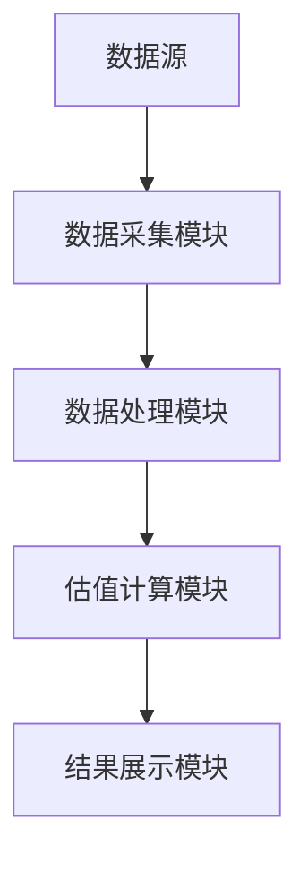
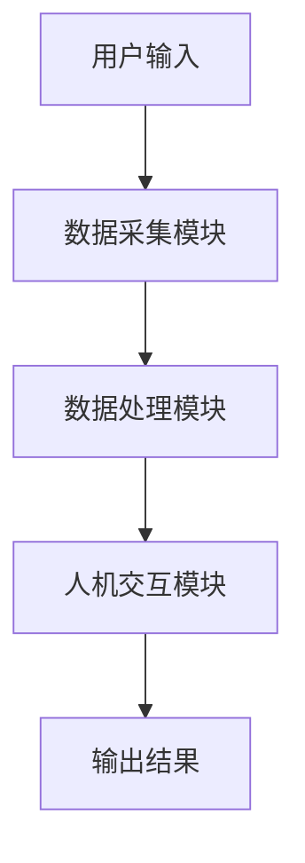

                 

# 全球股市估值与柔性电子在可穿戴设备中的应用

> 关键词：全球股市估值，柔性电子，可穿戴设备，时间序列分析，机器学习，数学模型

> 摘要：本文探讨了全球股市估值的核心方法和柔性电子在可穿戴设备中的应用。通过分析股市估值的数学模型和算法，结合柔性电子技术的发展，展示了如何将这些技术应用于实际项目中。文章详细介绍了系统的架构设计、项目实战以及最佳实践，为读者提供了全面的技术见解。

---

## 第1章: 全球股市估值概述

### 1.1 股市估值的基本概念

#### 1.1.1 股市估值的定义与意义
股市估值是指通过对公司财务数据、市场环境和行业趋势的分析，确定股票的合理价格范围。其目的是帮助投资者做出更明智的投资决策。

#### 1.1.2 股市估值的核心要素
- **市盈率（P/E）**：市盈率 = 股价 / 每股收益
- **市净率（P/B）**：市净率 = 股价 / 每股净资产
- **股息率**：股息率 = 每股股息 / 股价
- **内在价值**：股票的内在价值基于公司的未来现金流折现。

#### 1.1.3 全球股市的多样性与复杂性
全球股市受到宏观经济、行业趋势、公司业绩等多种因素的影响，因此估值过程具有高度的复杂性。

### 1.2 股市估值的主要方法

#### 1.2.1 市盈率法
市盈率法通过比较股票的市盈率与行业平均水平，判断其估值是否合理。

#### 1.2.2 市净率法
市净率法适用于银行等净资产占比较高的行业，通过比较市净率判断估值。

#### 1.2.3 股息率法
股息率法用于评估股票的分红能力，通常用于价值型投资。

#### 1.2.4 内在价值法
内在价值法通过DCF模型计算股票的理论价值，常用于成长型投资。

#### 1.2.5 现金流折现法
现金流折现法将未来现金流折现，计算股票的内在价值。

---

## 第2章: 全球股市估值的数学模型与算法

### 2.1 常见估值模型的数学表达

#### 2.1.1 市盈率模型
$$ P = \frac{E}{E/P} $$

#### 2.1.2 市净率模型
$$ P = \frac{B}{B/P} $$

#### 2.1.3 内在价值模型
$$ V = \sum_{t=1}^{\infty} \frac{CF_t}{(1+r)^t} $$

### 2.2 时间序列分析与预测

#### 2.2.1 ARIMA模型
ARIMA模型通过历史数据预测未来走势，常用于时间序列分析。

#### 2.2.2 GARCH模型
GARCH模型用于估计金融时间序列的波动性。

#### 2.2.3 LSTM网络
LSTM网络通过长短期记忆机制，捕捉时间序列中的长期依赖关系。

### 2.3 机器学习在股市估值中的应用

#### 2.3.1 线性回归模型
线性回归模型通过拟合直线，预测股票价格。

#### 2.3.2 支持向量回归
支持向量回归用于非线性关系的建模。

#### 2.3.3 随机森林
随机森林通过集成学习，提高模型的泛化能力。

---

## 第3章: 全球股市估值的系统架构设计

### 3.1 系统功能设计

#### 3.1.1 数据采集模块
数据采集模块负责收集股票的历史数据。

#### 3.1.2 数据处理模块
数据处理模块对数据进行清洗和转换。

#### 3.1.3 估值计算模块
估值计算模块基于模型计算股票的估值。

#### 3.1.4 结果展示模块
结果展示模块将估值结果以可视化形式呈现。

### 3.2 系统架构图

### 3.3 接口设计

#### 3.3.1 数据接口
数据接口负责与数据源的交互。

#### 3.3.2 算法接口
算法接口负责与估值模型的交互。

---

## 第4章: 柔性电子在可穿戴设备中的应用

### 4.1 柔性电子的基本概念

#### 4.1.1 柔性电子的定义
柔性电子是指具有柔软或可弯曲特性的电子设备。

#### 4.1.2 柔性电子的材料
柔性电子的主要材料包括有机材料和高分子材料。

#### 4.1.3 柔性电子的制备技术
柔性电子的制备技术包括印刷电子和柔性电路。

### 4.2 柔性电子在可穿戴设备中的应用

#### 4.2.1 柔性显示屏
柔性显示屏广泛应用于智能手表和手机。

#### 4.2.2 柔性传感器
柔性传感器用于监测生理指标。

#### 4.2.3 柔性电池
柔性电池为可穿戴设备提供稳定的电源。

### 4.3 柔性电子在医疗领域的应用

#### 4.3.1 柔性电子在健康监测中的应用
柔性电子用于监测心率、血压等生理指标。

#### 4.3.2 柔性电子在疾病诊断中的应用
柔性电子用于检测疾病标志物。

### 4.4 柔性电子的未来发展趋势

#### 4.4.1 高度集成化
柔性电子将向高度集成化方向发展。

#### 4.4.2 可穿戴设备的普及
随着技术的进步，柔性电子在可穿戴设备中的应用将更加广泛。

---

## 第5章: 柔性电子在可穿戴设备中的系统架构设计

### 5.1 系统功能设计

#### 5.1.1 数据采集模块
数据采集模块负责采集生理数据。

#### 5.1.2 数据处理模块
数据处理模块对数据进行分析和处理。

#### 5.1.3 人机交互模块
人机交互模块负责与用户的交互。

### 5.2 系统架构图

### 5.3 接口设计

#### 5.3.1 数据接口
数据接口负责与传感器的交互。

#### 5.3.2 人机交互接口
人机交互接口负责与用户的交互。

---

## 第6章: 项目实战

### 6.1 环境安装

#### 6.1.1 数据采集工具
安装数据采集工具，如Python的pandas库。

#### 6.1.2 数据处理工具
安装数据处理工具，如Python的numpy库。

#### 6.1.3 可视化工具
安装可视化工具，如Matplotlib。

### 6.2 核心实现

#### 6.2.1 数据采集与处理
编写代码采集并处理股票数据。

#### 6.2.2 模型训练与预测
使用机器学习模型训练并预测股票价格。

#### 6.2.3 柔性电子应用
设计并实现柔性电子在可穿戴设备中的应用。

### 6.3 实际案例分析

#### 6.3.1 股票估值案例
分析某公司的股票估值。

#### 6.3.2 可穿戴设备案例
展示柔性电子在智能手表中的应用。

---

## 第7章: 总结与展望

### 7.1 总结
本文探讨了全球股市估值和柔性电子在可穿戴设备中的应用，通过数学模型和实际案例分析，展示了这些技术的应用价值。

### 7.2 展望
未来，随着技术的进步，股市估值和柔性电子的应用将更加广泛和深入。

---

## 作者：AI天才研究院/AI Genius Institute & 禅与计算机程序设计艺术 /Zen And The Art of Computer Programming

---

以上为《全球股市估值与柔性电子在可穿戴设备中的应用》的完整内容，涵盖了股市估值和柔性电子在可穿戴设备中的应用，以及系统的架构设计和项目实战。希望对您有所帮助！

