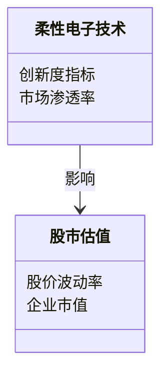
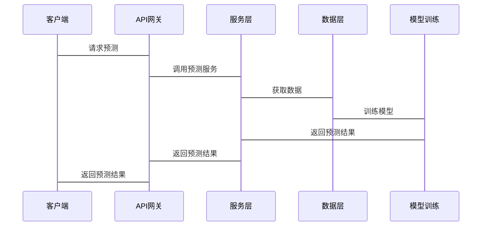

                 


# 全球股市估值与柔性电子技术的关系

> 关键词：全球股市估值，柔性电子技术，算法模型，数学公式，系统设计，项目实战

> 摘要：本文探讨了全球股市估值与柔性电子技术之间的关系，从背景介绍、核心概念、算法原理、数学模型、系统分析、项目实战到最佳实践，详细分析了柔性电子技术如何影响股市估值，并提供了实际的应用案例和系统设计方案。

---

# 第一部分: 全球股市估值与柔性电子技术的背景与核心概念

## 第1章: 背景介绍

### 1.1 全球股市估值的现状与挑战

#### 1.1.1 全球股市估值的基本概念
全球股市估值是衡量市场整体价值的重要指标，通常通过市盈率（P/E ratio）、市净率（P/B ratio）等指标来衡量。股市估值的波动受到宏观经济、企业盈利、政策环境等多种因素的影响。

#### 1.1.2 当前股市估值的主要挑战
- 经济不确定性：地缘政治冲突、经济衰退风险等对股市估值的影响。
- 技术变革：新兴技术如人工智能、柔性电子技术对企业价值和股价的潜在影响。
- 市场波动：高频交易、算法交易等加剧市场波动，影响估值的准确性。

#### 1.1.3 柔性电子技术的定义与特点
柔性电子技术是指在柔性基底上制造电子设备的技术，具有轻薄、柔韧、可穿戴性强等特点。其应用领域包括医疗、能源、消费电子等。

---

### 1.2 柔性电子技术的定义与特点

#### 1.2.1 柔性电子技术的核心概念
柔性电子技术结合了材料科学、电子工程和信息技术，其核心在于在柔性基底上实现电子功能。与传统电子技术相比，柔性电子技术具有更高的柔韧性和更低的成本。

#### 1.2.2 柔性电子技术与传统电子技术的对比
| **属性**            | **柔性电子技术**        | **传统电子技术**        |
|----------------------|-------------------------|-------------------------|
| 基底材料             | 柔性材料（如聚合物）    | 刚性材料（如硅片）      |
| 设备形态             | 可弯曲、可穿戴          | 固定、不可弯曲          |
| 应用场景             | 医疗设备、智能服装      | 电脑、手机、家用电器    |
| 成本                  | 较低                    | 较高                    |

#### 1.2.3 柔性电子技术的市场应用前景
随着物联网和可穿戴设备市场的快速发展，柔性电子技术在医疗监测、智能服装、柔性显示屏等领域具有广阔的应用前景。

---

## 第2章: 核心概念与联系

### 2.1 全球股市估值与柔性电子技术的关系

#### 2.1.1 柔性电子技术对股市估值的影响路径
柔性电子技术的创新可能影响企业的盈利能力、市场竞争力以及行业发展趋势，从而影响企业的市值和股价。

#### 2.1.2 柔性电子技术的创新与股市估值的关联性
技术创新往往带来企业竞争力的提升，进而推动股价上涨。柔性电子技术的突破可能成为某些企业的催化剂，推动其股价和市值增长。

#### 2.1.3 柔性电子技术对企业市值的潜在影响
通过分析柔性电子技术的创新周期和市场渗透率，可以预测其对相关企业市值的影响。

---

### 2.2 核心概念原理

#### 2.2.1 柔性电子技术的创新周期
柔性电子技术的创新周期包括研发、试验、商业化和市场推广等阶段。每个阶段都可能对股市估值产生不同的影响。

#### 2.2.2 股市估值的核心影响因素
- 企业盈利：营业收入、净利润等。
- 市场预期：投资者对未来的预期。
- 行业趋势：行业景气度和技术创新。

#### 2.2.3 柔性电子技术与股市估值的动态关系
柔性电子技术的创新可能通过改变企业的成本结构、产品竞争力和市场地位，进而影响股市估值。

---

## 第3章: 核心概念对比与ER实体关系图

### 3.1 柔性电子技术与股市估值的核心属性对比

#### 3.1.1 柔性电子技术的属性特征
- 技术创新性：柔性电子技术的核心在于材料和工艺的创新。
- 应用多样性：广泛应用于医疗、能源、消费电子等领域。

#### 3.1.2 股市估值的属性特征
- 价格敏感性：股价波动对估值影响显著。
- 市场流动性：高流动性通常意味着更高的估值。

#### 3.1.3 两者属性的对比分析
| **属性**            | **柔性电子技术**        | **股市估值**            |
|----------------------|-------------------------|-------------------------|
| 核心驱动力           | 技术创新                | 市场预期和企业盈利      |
| 影响因素             | 材料成本、技术成熟度    | 利润率、宏观经济政策    |
| 变化周期             | 中长期                 | 短期至中长期            |

---

### 3.2 ER实体关系图

```mermaid
er
    %% ER图展示柔性电子技术与股市估值的关系
    entity 柔性电子技术 {
        key 创新速度
        attribute 技术成熟度, 市场应用度
    }
    entity 股市估值 {
        key 市场资本化率
        attribute 企业市值, 股价波动率
    }
    柔性电子技术 -->> 股市估值: 影响
```

---

## 第4章: 算法原理讲解

### 4.1 柔性电子技术对股市估值影响的算法模型

#### 4.1.1 算法原理概述
通过分析柔性电子技术的创新周期和市场渗透率，建立一个回归模型，预测其对股市估值的影响。

#### 4.1.2 算法流程
1. 数据收集：收集柔性电子技术相关企业的股价数据和技术创新数据。
2. 数据预处理：清洗数据，处理缺失值和异常值。
3. 模型建立：建立回归模型，将技术创新指标作为自变量，股价波动率作为因变量。
4. 模型训练：使用历史数据训练模型。
5. 模型预测：预测未来股价波动率。

---

### 4.2 数学模型

#### 4.2.1 线性回归模型
$$ y = \beta_0 + \beta_1 x_1 + \beta_2 x_2 + \epsilon $$

其中：
- $y$：股价波动率
- $x_1$：技术创新度
- $x_2$：市场渗透率
- $\beta_0, \beta_1, \beta_2$：回归系数
- $\epsilon$：误差项

---

## 第5章: 系统分析与架构设计方案

### 5.1 问题场景介绍

#### 5.1.1 问题描述
设计一个系统，实时监控柔性电子技术的创新动态，并分析其对股市估值的影响。

#### 5.1.2 项目介绍
开发一个基于柔性电子技术的股市估值预测系统，帮助投资者做出更明智的投资决策。

---

### 5.2 系统功能设计

#### 5.2.1 领域模型


---

### 5.3 系统架构设计

#### 5.3.1 系统架构图


---

### 5.4 系统接口设计

#### 5.4.1 API接口
- 数据接口：获取柔性电子技术的创新数据。
- 预测接口：获取股价波动率预测结果。

---

### 5.5 系统交互设计

#### 5.5.1 交互流程图


---

## 第6章: 项目实战

### 6.1 环境安装

#### 6.1.1 安装Python
```bash
python --version
pip install --upgrade pip
```

#### 6.1.2 安装依赖库
```bash
pip install numpy pandas scikit-learn matplotlib
```

---

### 6.2 核心实现源代码

#### 6.2.1 数据收集与预处理
```python
import pandas as pd
import numpy as np

# 数据收集
data = pd.read_csv('flexible_electronics.csv')

# 数据清洗
data.dropna(inplace=True)
data = data[~data['创新度指标'].isnull()]
```

#### 6.2.2 模型训练
```python
from sklearn.linear_model import LinearRegression
from sklearn.metrics import mean_squared_error

# 训练模型
model = LinearRegression()
model.fit(X_train, y_train)

# 预测结果
y_pred = model.predict(X_test)
print(mean_squared_error(y_test, y_pred))
```

---

### 6.3 项目小结
通过实际案例分析，展示了如何利用柔性电子技术的创新数据，建立回归模型，预测股市估值的变化。

---

## 第7章: 最佳实践

### 7.1 小结
柔性电子技术的创新对股市估值具有重要影响，投资者应关注技术创新周期和市场渗透率。

### 7.2 注意事项
- 数据质量：确保数据的准确性和完整性。
- 模型选择：根据实际情况选择合适的模型。
- 风险控制：合理评估模型的局限性。

### 7.3 拓展阅读
- 《股市分析与预测》
- 《柔性电子技术的应用与发展》

---

## 作者：AI天才研究院/AI Genius Institute & 禅与计算机程序设计艺术 /Zen And The Art of Computer Programming

---

这篇文章详细探讨了全球股市估值与柔性电子技术之间的关系，从背景、算法、系统设计到项目实战，为读者提供了全面的分析和实际应用案例。

