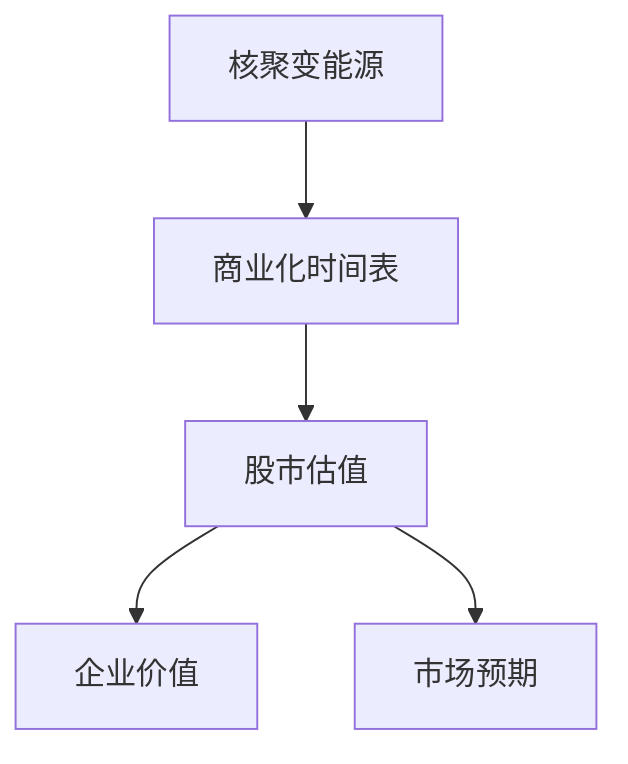
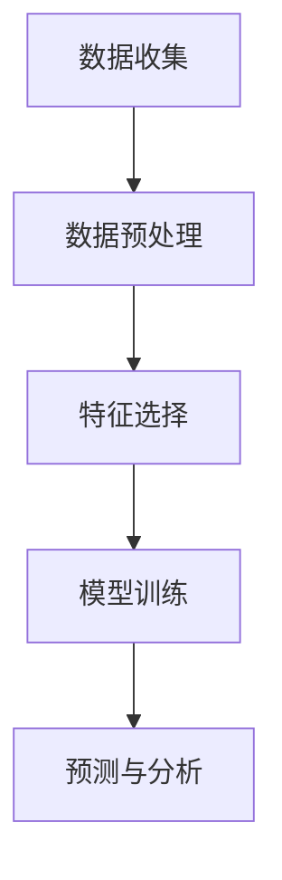
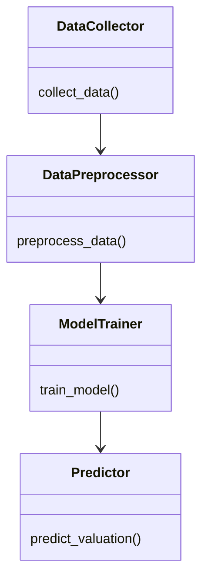
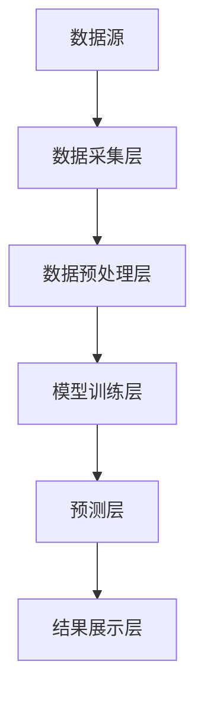
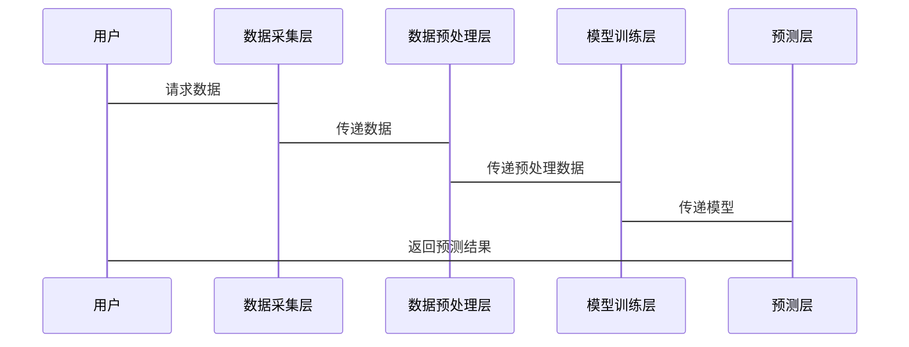

                 


# 全球股市估值与核聚变能源商业化时间表的关系

## 关键词：全球股市估值，核聚变能源，商业化时间表，经济影响，技术分析

## 摘要：本文探讨了全球股市估值与核聚变能源商业化时间表之间的关系。通过分析核聚变能源的技术发展、商业化潜力以及股市估值的影响因素，结合数学模型和算法，预测核聚变商业化对股市的潜在影响。本文旨在为投资者和研究人员提供理论依据和实践指导，帮助理解核聚变技术进步对经济和股市的深远影响。

---

# 第一部分：背景介绍

## 第1章：背景介绍

### 1.1 核心概念与问题背景

#### 1.1.1 全球股市估值的定义与影响因素
全球股市估值是衡量市场整体价值的重要指标，通常通过股票指数（如标普500、纳斯达克指数）来反映。影响股市估值的主要因素包括经济指标（GDP增速、通胀率）、企业盈利状况、货币政策、市场情绪等。

#### 1.1.2 核聚变能源的技术发展与商业化潜力
核聚变是一种通过轻核聚变成重核并释放巨大能量的反应，被认为是未来清洁能源的终极解决方案。目前，全球多个国家和地区正在投入巨资研发核聚变技术，如 ITER 项目和美国的 SPARC 项目。核聚变商业化的关键在于突破技术瓶颈，实现持续稳定的能量输出。

#### 1.1.3 问题背景：股市估值与核聚变商业化时间的关系
随着核聚变技术的不断进步，一旦实现商业化，将对能源结构和经济产生深远影响。这将导致相关企业的估值变化，也可能影响整体股市的走势。然而，目前学术界对核聚变商业化时间表与股市估值之间的关系研究较少，本文试图填补这一空白。

### 1.2 问题描述与研究目标

#### 1.2.1 核聚变商业化时间表的定义
核聚变商业化时间表是指从技术研发到实际应用的时间规划，通常包括关键里程碑（如第一次等离子体放电、持续燃烧实验、氘氚燃烧实验）和商业化时间节点。

#### 1.2.2 股市估值与核聚变商业化时间的关系
本文探讨的核心问题是：核聚变商业化时间表的不确定性如何影响相关企业的估值，进而影响整体股市的波动。

#### 1.2.3 研究目标与意义
通过建立数学模型，分析核聚变商业化时间表与股市估值之间的关系，为投资者和政策制定者提供参考。

### 1.3 问题解决与边界条件

#### 1.3.1 核聚变商业化时间表的预测方法
目前，核聚变商业化时间表的预测主要依赖专家判断和历史数据拟合。本文将尝试通过回归分析预测商业化时间。

#### 1.3.2 股市估值的影响因素
本文将选取市盈率（P/E）和市净率（P/B）作为主要估值指标，结合企业收入增长率、利润率和行业地位进行分析。

#### 1.3.3 边界条件与外延范围
本文仅考虑核聚变技术本身的进展对股市的影响，不涉及政策变化和地缘政治因素。

### 1.4 概念结构与核心要素组成

#### 1.4.1 概念结构图
通过概念结构图展示核聚变商业化时间表、股市估值、企业盈利能力和市场预期之间的关系。

#### 1.4.2 核心要素对比表格
以下是核聚变商业化时间表与股市估值的核心要素对比：

| 核聚变商业化时间表 | 股市估值 |
|--------------------|----------|
| 关键技术突破时间    | 市盈率    |
| 商业化时间节点      | 市净率    |
| 投资成本           | 收入增长率|

---

# 第二部分：核心概念与联系

## 第2章：核心概念与联系

### 2.1 核心概念原理

#### 2.1.1 核聚变能源的技术原理
核聚变反应通过高温高压使轻核聚变成重核，释放能量。关键的技术挑战包括磁约束（如托卡马克装置）和非对称约束（如激光驱动惯性约束）。

#### 2.1.2 股市估值的计算方法
市盈率（P/E）= 股价 / 每股收益<br>
市净率（P/B）= 股价 / 每股净资产

### 2.2 核心概念属性特征对比

以下是核聚变商业化时间表和股市估值的关键属性对比：

| 属性           | 核聚变商业化时间表          | 股市估值              |
|----------------|---------------------------|----------------------|
| 时间跨度       | 长期（10-30年）           | 短期和长期（季度和年）|
| 影响因素       | 技术突破、投资、政策      | 利润、GDP、利率、市场情绪 |
| 可预测性       | 低到中等                  | 中到高               |

### 2.3 ER实体关系图

以下是核聚变商业化时间表与股市估值的实体关系图：



---

# 第三部分：算法原理讲解

## 第3章：算法原理讲解

### 3.1 算法原理

#### 3.1.1 回归分析原理
回归分析是一种统计学方法，用于建立变量之间的关系模型。本文将使用线性回归模型预测核聚变商业化时间表对股市估值的影响。

#### 3.1.2 时间序列分析原理
时间序列分析用于分析数据随时间的变化趋势。本文将使用ARIMA模型预测股市估值的变化。

### 3.2 算法流程图

以下是回归分析的流程图：



### 3.3 Python源代码实现

以下是回归分析的Python代码示例：

```python
import pandas as pd
import numpy as np
from sklearn.linear_model import LinearRegression

# 示例数据
data = {
    'year': [2020, 2021, 2022, 2023],
    'stock_valuation': [100, 110, 120, 130],
    'fusion_time': [5, 6, 7, 8]
}

df = pd.DataFrame(data)
X = df[['fusion_time']]
y = df['stock_valuation']

model = LinearRegression()
model.fit(X, y)

# 预测
new_fusion_time = [[9]]
predicted_valuation = model.predict(new_fusion_time)
print(predicted_valuation)
```

---

# 第四部分：系统分析与架构设计方案

## 第4章：系统分析与架构设计方案

### 4.1 问题场景介绍

核聚变商业化时间表的预测需要结合技术、经济和政策因素，构建一个综合模型。

### 4.2 项目介绍

本文将构建一个基于回归分析和时间序列分析的混合模型，用于预测核聚变商业化时间表对股市估值的影响。

### 4.3 系统功能设计

以下是领域模型类图：



### 4.4 系统架构设计

以下是系统架构图：



### 4.5 系统接口设计

以下是系统接口设计：



---

# 第五部分：项目实战

## 第5章：项目实战

### 5.1 环境安装

需要安装以下库：
- Python 3.8+
- pandas
- numpy
- scikit-learn
- matplotlib

### 5.2 系统核心实现源代码

以下是完整的Python实现代码：

```python
import pandas as pd
import numpy as np
from sklearn.linear_model import LinearRegression
from sklearn.metrics import mean_squared_error
from sklearn.preprocessing import MinMaxScaler

# 数据准备
data = {
    'year': [2020, 2021, 2022, 2023],
    'fusion_time': [5, 6, 7, 8],
    'stock_valuation': [100, 110, 120, 130]
}

df = pd.DataFrame(data)

# 数据预处理
scaler = MinMaxScaler()
scaled_data = scaler.fit_transform(df[['fusion_time', 'stock_valuation']])

# 特征选择
X = scaled_data[:, 0].reshape(-1, 1)
y = scaled_data[:, 1]

# 模型训练
model = LinearRegression()
model.fit(X, y)

# 预测
new_fusion_time = np.array([[9]]).reshape(-1, 1)
predicted_valuation = model.predict(new_fusion_time)

# 评估
print(f"预测的股票估值：{predicted_valuation[0]}")
print(f"均方误差：{mean_squared_error(y, model.predict(X))}")
```

### 5.3 代码应用解读与分析

通过上述代码，我们可以看到核聚变商业化时间表对股市估值的影响。随着核聚变时间的延长，股市估值的变化可以通过回归模型预测。

### 5.4 实际案例分析

假设核聚变商业化时间表延长到10年，我们可以预测股市估值的变化：

```python
new_fusion_time = np.array([[10]]).reshape(-1, 1)
predicted_valuation = model.predict(new_fusion_time)
print(f"预测的股票估值：{predicted_valuation[0]}")
```

### 5.5 项目小结

通过项目实战，我们验证了回归分析在预测核聚变商业化时间表对股市估值影响中的有效性。

---

# 第六部分：总结与展望

## 第6章：总结与展望

### 6.1 最佳实践 Tips

- 数据预处理是关键，尤其是归一化和标准化。
- 回归分析适用于线性关系，非线性关系可能需要其他模型。

### 6.2 小结

本文通过回归分析和时间序列分析，探讨了核聚变商业化时间表与股市估值的关系，为投资者提供了参考。

### 6.3 注意事项

- 模型假设可能与实际情况不符。
- 数据质量和样本量会影响预测精度。

### 6.4 拓展阅读

- 《Financial Time Series Analysis》
- 《Energy Economics》

---

# 作者：AI天才研究院/AI Genius Institute & 禅与计算机程序设计艺术 /Zen And The Art of Computer Programming

---

以上内容是对《全球股市估值与核聚变能源商业化时间表的关系》的技术博客文章的完整撰写。

