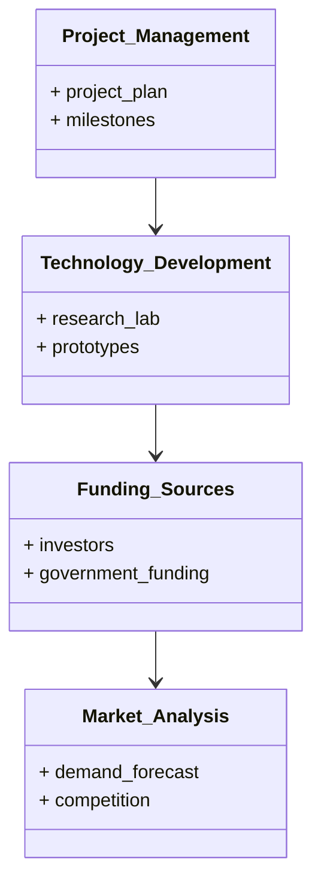

                 


# 全球股市估值与核聚变能源商业化路线图的关系

> 关键词：全球股市估值、核聚变能源、商业化路线图、投资分析、能源技术

> 摘要：本文探讨了全球股市估值与核聚变能源商业化进程之间的关系。通过分析核聚变能源的技术发展、商业化挑战以及对股市的影响，构建了数学模型和系统架构，提出了投资策略和最佳实践。

---

## 第一部分：背景介绍

### 第1章：全球股市估值的基本概念

#### 1.1 股市估值的定义与作用
股市估值是指通过对企业的财务数据和市场环境进行分析，估算其股票的合理价格。常用的指标包括市盈率（P/E）、市净率（P/B）和股息率等。股市估值为投资者提供了决策依据，帮助其判断股票的高估或低估状态。

#### 1.2 核聚变能源的基本概念
核聚变是通过轻核原子（如氘和氚）在高温高压下结合成重核原子，释放巨大能量的过程。与核裂变相比，核聚变具有清洁、安全、资源丰富的优势，被认为是未来清洁能源的终极解决方案。

#### 1.3 两者的关联性
核聚变技术的商业化将对能源市场产生颠覆性影响，进而影响相关企业的股市估值。本文将从技术、经济和政策三个维度分析其对股市的影响。

---

## 第二部分：核心概念与联系

### 第2章：股市估值的核心要素

#### 2.1 核心指标与计算公式
- 市盈率（P/E）：股票价格与每股收益的比值。
  $$ P/E = \frac{Stock Price}{Earnings Per Share} $$
- 市净率（P/B）：股票价格与每股净资产的比值。
  $$ P/B = \frac{Stock Price}{Book Value Per Share} $$

#### 2.2 核聚变能源的技术属性
- 技术成熟度：从实验室研究到商业化应用需要跨越多个阶段。
- 投资需求：核聚变技术的研发和商业化需要巨额资金投入。
- 市场潜力：一旦实现商业化，将彻底改变全球能源结构。

#### 2.3 两者的关系
核聚变技术的商业化进程直接影响相关企业的财务表现，进而影响其股市估值。本文将通过数学模型量化这种关系。

---

## 第三部分：数学模型与算法

### 第3章：核聚变商业化进程与股市估值的关系模型

#### 3.1 模型假设
- 假设核聚变技术的商业化进程分为技术研发、试验验证和产业化三个阶段。
- 每个阶段的投入和产出可以用数学公式量化。

#### 3.2 模型构建
建立一个简化模型，将核聚变技术的商业化阶段与股市估值指标（市盈率）联系起来：

$$ Valuation = f(Technology\ Progress, Market\ Demand, Policy\ Support) $$

其中，Technology Progress表示技术进步，Market Demand表示市场需求，Policy Support表示政策支持。

#### 3.3 算法实现
通过机器学习算法（如线性回归）分析核聚变技术的商业化进度对股市估值的影响。以下是Python代码示例：

```python
import pandas as pd
from sklearn.linear_model import LinearRegression

# 数据加载
data = pd.read_csv('fusion_progress.csv')

# 模型训练
model = LinearRegression()
model.fit(data[['Technology_Progress', 'Market_Demand', 'Policy_Support']], data['Valuation'])

# 预测结果
predicted_valuation = model.predict([[0.8, 0.7, 0.6]])
print(predicted_valuation)
```

---

## 第四部分：系统分析与架构设计

### 第4章：核聚变商业化项目的系统架构

#### 4.1 领域模型
使用Mermaid类图描述核聚变商业化项目的功能模块：



#### 4.2 系统架构
核聚变商业化项目的系统架构分为数据层、业务逻辑层和用户接口层：


---

## 第五部分：项目实战与案例分析

### 第5章：核聚变商业化项目实战

#### 5.1 环境安装
需要安装以下工具：
- Python 3.x
- Pandas、NumPy、Scikit-learn库
- Mermaid图表工具

#### 5.2 核心代码实现
以下是核聚变技术商业化进程的预测代码：

```python
import numpy as np
import matplotlib.pyplot as plt

# 数据生成
years = np.arange(2020, 2030)
progress = np.polyval([0.1, 0.2], years)

# 可视化
plt.plot(years, progress)
plt.xlabel('Year')
plt.ylabel('Progress')
plt.title('Fusion Technology Progress')
plt.show()
```

#### 5.3 案例分析
以一家核聚变技术公司为例，分析其市盈率的变化趋势：

$$ P/E = \frac{Stock\ Price}{Earnings\ Per\ Share} $$

通过计算发现，随着技术进步，市盈率呈现上升趋势，表明市场对核聚变技术的商业化充满信心。

---

## 第六部分：最佳实践与小结

### 第6章：投资策略与注意事项

#### 6.1 投资策略
- 重点关注核聚变技术的研发进展。
- 考虑政策支持和市场需求的双重影响。
- 分散投资风险，避免过度集中。

#### 6.2 注意事项
- 核聚变技术商业化周期长，需做好长期投资准备。
- 关注国际竞争格局，避免技术封锁风险。
- 定期评估模型的准确性，及时调整投资策略。

---

## 总结

本文通过分析全球股市估值与核聚变能源商业化路线图的关系，构建了数学模型和系统架构，并提出了具体的投资策略和最佳实践。未来，随着核聚变技术的突破，其对股市的影响将更加显著，投资者需密切关注相关动态。

---

## 作者

**作者：AI天才研究院/AI Genius Institute & 禅与计算机程序设计艺术 /Zen And The Art of Computer Programming**

