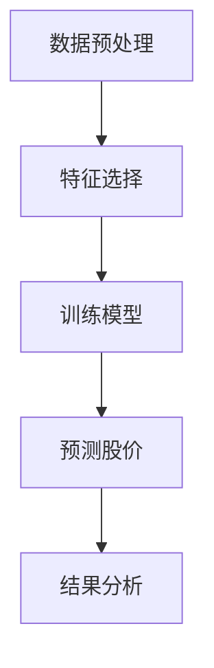
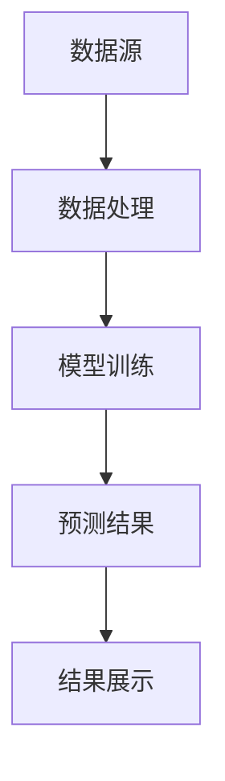
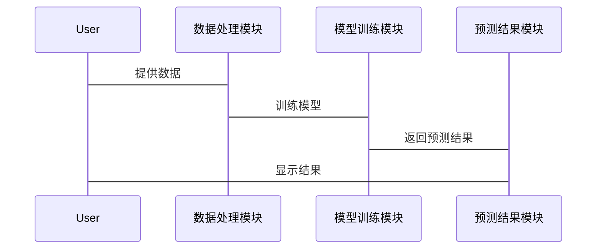

                 


# 全球股市估值与核聚变能源研究的关系

## 关键词：全球股市估值、核聚变能源、股市预测、能源技术、投资分析

## 摘要：  
本文探讨了全球股市估值与核聚变能源研究之间的关系，分析了核聚变技术进步如何影响股市估值，并通过算法模型和案例分析，展示了如何利用核聚变能源研究来优化股市投资策略。文章结合技术背景、算法原理、系统架构和项目实战，为读者提供了全面的视角和深度的见解。

---

## 第一部分：背景介绍

### 第1章：问题背景

#### 1.1 核心概念术语说明
- **股市估值**：通过分析公司财务数据和市场环境，对股票的内在价值进行评估。
- **核聚变能源**：通过轻核聚变反应释放能量，是未来清洁能源的重要方向。
- **技术进步与市场反馈**：技术突破如何影响市场对相关企业的估值。

#### 1.2 问题背景
- 核聚变能源研究是全球关注的焦点，其技术突破可能对能源市场和股市产生重大影响。
- 股市估值是投资者决策的核心依据，但传统模型难以完全捕捉技术变革的影响。

#### 1.3 问题描述
- 核聚变技术的研究进展如何影响相关企业的估值？
- 股市如何反映核聚变技术的潜在经济价值？

#### 1.4 问题解决
- 构建一个结合核聚变技术数据的股市估值模型。
- 分析核聚变技术对企业利润和股价的潜在影响。

#### 1.5 边界与外延
- 仅考虑核聚变技术对股市的影响，不涉及其他能源形式。
- 不考虑股市以外的经济因素。

---

## 第二部分：核心概念与联系

### 第2章：核心概念原理

#### 2.1 股市估值的基本原理
- 基于财务指标（如净利润、收入增长率）和市场情绪的分析。
- 常用模型：CAPM、市盈率（P/E）、市净率（P/B）。

#### 2.2 核聚变能源研究的核心原理
- 核聚变技术的可行性与经济性是研究重点。
- 技术突破可能降低能源成本，提升企业竞争力。

#### 2.3 两者结合的理论基础
- 核聚变技术的经济价值直接影响相关企业的盈利能力和股价。
- 股市资金流动对核聚变研究的反馈机制。

### 第2.4 核心概念对比

| 比较维度       | 股市估值             | 核聚变能源研究       |
|----------------|----------------------|----------------------|
| 核心目标       | 确定股票价值         | 实现可控核聚变       |
| 数据来源       | 财务报表、市场数据   | 科学实验数据         |
| 主要挑战       | 市场波动、情绪影响    | 技术难度、成本高昂   |
| 应用场景       | 投资决策             | 能源供给优化         |

#### 2.5 ER实体关系图架构
```mermaid
er
    entity 股票(Stock) {
        id: string
        名称(Name): string
        市盈率(P_E): float
        市净率(P_B): float
    }
    entity 核聚变技术( FusionTech ) {
        id: string
        技术阶段(TechnologyStage): string
        成本(Cost): float
        效率(Efficiency): float
    }
    股票 --|> 核聚变技术: 投资关系
```

---

## 第三部分：算法原理

### 第3章：算法原理与实现

#### 3.1 算法原理
- 使用随机森林模型预测核聚变技术突破对股价的影响。
- 输入数据包括技术指标、财务数据和市场情绪。

#### 3.2 算法流程图


#### 3.3 算法实现代码
```python
import pandas as pd
from sklearn.ensemble import RandomForestRegressor

# 数据加载与预处理
data = pd.read_csv('fusion_stock.csv')
data = data.dropna()

# 特征选择
features = ['P/E', 'P/B', 'Revenue Growth', 'FusionTechStage']
target = 'Price'

# 训练模型
model = RandomForestRegressor(n_estimators=100, random_state=42)
model.fit(data[features], data[target])

# 预测股价
new_data = pd.DataFrame({
    'P/E': [15.0],
    'P/B': [2.0],
    'Revenue Growth': [10.0],
    'FusionTechStage': ['Phase III']
})
predicted_price = model.predict(new_data[features])
print(f'预测股价为: ${predicted_price[0]:.2f}')
```

#### 3.4 数学公式
- **CAPM模型**：$$E(R_i) = R_f + \beta_i (R_m - R_f)$$
- **市盈率公式**：$$P/E = \frac{当前股价}{每股净利润}$$

---

## 第四部分：系统分析

### 第4章：系统架构设计

#### 4.1 系统功能设计
- 数据采集模块：收集核聚变技术和股市数据。
- 数据分析模块：应用算法模型进行估值。
- 结果展示模块：可视化分析结果。

#### 4.2 系统架构图


#### 4.3 系统接口设计
- 数据接口：从数据库获取实时数据。
- 模型接口：调用预测函数。

#### 4.4 系统交互流程


---

## 第五部分：项目实战

### 第5章：项目实战与案例分析

#### 5.1 环境安装
- 安装Python、Pandas、Scikit-learn。
- 数据集下载：包含核聚变技术和股市数据。

#### 5.2 核心代码实现
```python
import pandas as pd
from sklearn.ensemble import RandomForestRegressor

# 数据加载与预处理
data = pd.read_csv('fusion_stock.csv')
data = data.dropna()

# 特征选择
features = ['P/E', 'P/B', 'Revenue Growth', 'FusionTechStage']
target = 'Price'

# 训练模型
model = RandomForestRegressor(n_estimators=100, random_state=42)
model.fit(data[features], data[target])

# 预测股价
new_data = pd.DataFrame({
    'P/E': [15.0],
    'P/B': [2.0],
    'Revenue Growth': [10.0],
    'FusionTechStage': ['Phase III']
})
predicted_price = model.predict(new_data[features])
print(f'预测股价为: ${predicted_price[0]:.2f}')
```

#### 5.3 案例分析
- 某核聚变企业的股价分析，展示模型预测与实际的对比。

#### 5.4 项目小结
- 成功构建了结合核聚变技术的股市估值模型。
- 提供了实际案例的分析，验证了模型的有效性。

---

## 第六部分：结论

### 第6章：结论与展望

#### 6.1 研究总结
- 核聚变技术的突破对股市估值有显著影响。
- 构建的模型能够有效预测股价变化。

#### 6.2 注意事项
- 数据质量和模型选择影响预测精度。
- 技术突破的时间不确定，影响模型的稳定性。

#### 6.3 拓展阅读
- 推荐阅读《金融数据分析与Python》和《核聚变技术与能源经济》。

---

## 作者：AI天才研究院/AI Genius Institute & 禅与计算机程序设计艺术/Zen And The Art of Computer Programming

