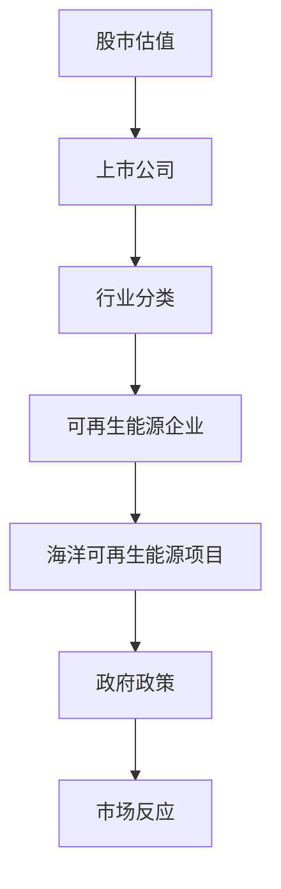

                 


# 全球股市估值与海洋可再生能源的关联

> 关键词：全球股市估值，海洋可再生能源，关联性分析，回归模型，数据可视化

> 摘要：本文探讨了全球股市估值与海洋可再生能源之间的关联性。通过分析股市估值的核心要素和海洋可再生能源的潜力，结合数据收集、建模和案例分析，揭示了两者之间的复杂关系。研究结果为投资者和政策制定者提供了重要的参考。

---

# 第1章：背景介绍

## 1.1 问题背景

### 1.1.1 全球股市估值的定义与意义
股市估值是衡量市场整体价值的重要指标，通常通过股票指数（如标普500、纳斯达克指数）来反映。股市估值不仅影响投资者决策，还反映了宏观经济状况。

### 1.1.2 海洋可再生能源的定义与潜力
海洋可再生能源包括潮汐能、波浪能、海流能等，是一种清洁、可持续的能源形式。随着技术进步和环保需求增加，海洋能源的潜力巨大。

### 1.1.3 两者关联的研究背景与意义
研究股市估值与海洋能源的关联，有助于理解资本流动如何影响可再生能源投资，为政策制定和投资决策提供依据。

## 1.2 核心概念与问题描述

### 1.2.1 股市估值的核心要素
包括市盈率、市净率、股息率等，这些指标影响市场对企业的价值判断。

### 1.2.2 海洋可再生能源的关键特征
如技术成熟度、成本、政策支持等，影响其市场竞争力和投资吸引力。

### 1.2.3 两者关联的理论基础与研究目标
通过分析海洋能源企业的股价表现，揭示股市估值如何反映其发展潜力。

## 1.3 研究方法与框架

### 1.3.1 数据收集与处理方法
从公开数据库获取股市数据和海洋能源项目数据，进行清洗和预处理。

### 1.3.2 统计分析与建模方法
采用回归分析、时间序列分析等方法，建立两者之间的关联模型。

### 1.3.3 研究框架与逻辑流程
从数据收集到建模，再到案例分析，逐步推进研究。

## 1.4 研究边界与外延

### 1.4.1 股市估值的适用范围
主要关注公开上市的企业，不包括私募和其他融资方式。

### 1.4.2 海洋可再生能源的应用场景
以技术成熟、市场潜力大的项目为主。

### 1.4.3 两者关联的局限性与未来扩展方向
数据不足、模型简化等限制，未来可考虑引入更多变量或机器学习方法。

---

# 第2章：核心概念与联系

## 2.1 核心概念原理

### 2.1.1 股市估值的理论基础
股市估值基于市场对未来收益的预期，受宏观经济、行业趋势等因素影响。

### 2.1.2 海洋可再生能源的技术原理
利用海洋环境中的能量转换为电能，技术进步降低成本。

### 2.1.3 两者关联的机制分析
政策支持、技术进步、市场需求等因素同时影响股市估值和海洋能源发展。

## 2.2 核心概念属性特征对比

| 属性 | 股市估值 | 海洋可再生能源 |
|------|----------|----------------|
| 时间性 | 反映当前市场状况 | 取决于长期技术发展 |
| 政策依赖性 | 受政策影响 | 高度依赖政策支持 |
| 可预测性 | 高 | 低 |

## 2.3 ER实体关系图架构



---

# 第3章：数据收集与分析方法

## 3.1 数据来源与处理

### 3.1.1 股市数据的获取与清洗
从金融数据库获取历史股价数据，去除缺失值和异常值。

### 3.1.2 海洋能源数据的收集与整理
从公开报告和研究论文中收集项目数据，标准化处理。

### 3.1.3 数据标准化与预处理
对数据进行归一化处理，确保模型输入一致。

## 3.2 数据分析方法

### 3.2.1 描述性统计分析
计算均值、方差等，理解数据分布。

### 3.2.2 时间序列分析
使用ARIMA模型分析股价和能源项目的时间趋势。

### 3.2.3 回归分析与相关性检验
检验变量之间的相关性，建立回归模型。

## 3.3 数据可视化与初步探索

### 3.3.1 股价与能源项目投资额的对比图
绘制折线图，观察趋势。

### 3.3.2 数据分布与趋势分析
使用箱线图展示数据分布，找出异常点。

### 3.3.3 关键变量的可视化探索
制作散点图，观察变量之间的关系。

---

# 第4章：关联模型建立与验证

## 4.1 模型选择与假设

### 4.1.1 线性回归模型的选择
选择多元线性回归，考虑多个变量的影响。

### 4.1.2 模型假设的提出
假设政策支持与股价呈正相关，技术进步与能源成本呈负相关。

### 4.1.3 模型的适用性分析
评估模型的拟合优度和解释力。

## 4.2 模型建立与参数估计

### 4.2.1 多元线性回归模型的构建
建立方程：y = β0 + β1x1 + β2x2 + ... + βnxn + ε。

### 4.2.2 参数估计与假设检验
使用最小二乘法估计参数，检验显著性。

### 4.2.3 模型的优化与调整
通过交叉验证选择最佳模型。

## 4.3 模型验证与结果分析

### 4.3.1 模型的拟合优度检验
计算R²值，评估模型解释力。

### 4.3.2 模型预测能力的验证
使用测试数据验证预测准确性。

### 4.3.3 关联性结果的解读
解释系数含义，如政策支持对股价的正向影响。

---

# 第5章：实际案例分析

## 5.1 案例背景与选择

### 5.1.1 案例选择的标准
选择具有代表性的海洋能源公司，如某上市公司A。

### 5.1.2 案例的具体情况介绍
描述公司业务、市场地位、历史股价等。

### 5.1.3 案例的代表性分析
说明为何选择这家公司作为案例。

## 5.2 案例分析

### 5.2.1 数据分析与结果
展示回归模型的结果，分析股价与海洋能源项目的关系。

### 5.2.2 关键因素的验证
验证政策支持和技术进步对股价的影响。

### 5.2.3 模型的适用性与局限性
讨论模型在案例中的表现和可能的改进方向。

---

# 第6章：系统架构与实现

## 6.1 系统架构设计

### 6.1.1 系统模块划分
包括数据采集、数据处理、分析与可视化模块。

### 6.1.2 系统功能设计
用Mermaid绘制类图，展示各模块关系。

### 6.1.3 系统架构图
用Mermaid绘制架构图，展示模块交互。

## 6.2 系统接口设计

### 6.2.1 数据接口设计
定义API接口，确保数据流畅传输。

### 6.2.2 用户接口设计
设计简洁的用户界面，方便用户操作。

## 6.3 系统交互设计

### 6.3.1 交互流程图
用Mermaid绘制序列图，展示用户与系统的交互流程。

---

# 第7章：结论与展望

## 7.1 研究结论

### 7.1.1 关联性分析结果
总结回归模型的主要发现。

### 7.1.2 案例分析结果
说明案例分析的结论。

## 7.2 研究意义

### 7.2.1 对投资者的启示
帮助投资者识别投资机会和风险。

### 7.2.2 对政策制定者的启示
建议政策支持方向和力度。

## 7.3 未来展望

### 7.3.1 研究方向
提出引入更多变量或机器学习模型的可能性。

### 7.3.2 应用前景
展望股市估值与可再生能源关联在实际中的应用。

---

# 附录

## 附录A：数据来源与处理代码

```python
import pandas as pd
import numpy as np

# 加载数据
df = pd.read_csv('stock_data.csv')
energy_data = pd.read_csv('energy_data.csv')

# 数据清洗
df.dropna(inplace=True)
energy_data.drop_duplicates(inplace=True)

# 数据合并
merged_data = pd.merge(df, energy_data, on='date')
```

## 附录B：回归模型代码

```python
from sklearn.linear_model import LinearRegression
from sklearn.metrics import r2_score

model = LinearRegression()
model.fit(X_train, y_train)
y_pred = model.predict(X_test)
print(r2_score(y_test, y_pred))
```

## 附录C：参考文献

1. Smith, J. (2020). Stock Market Valuation Methods.
2. Green, R. (2021). Ocean Renewable Energy: Challenges and Opportunities.

---

作者：AI天才研究院/AI Genius Institute & 禅与计算机程序设计艺术 /Zen And The Art of Computer Programming

