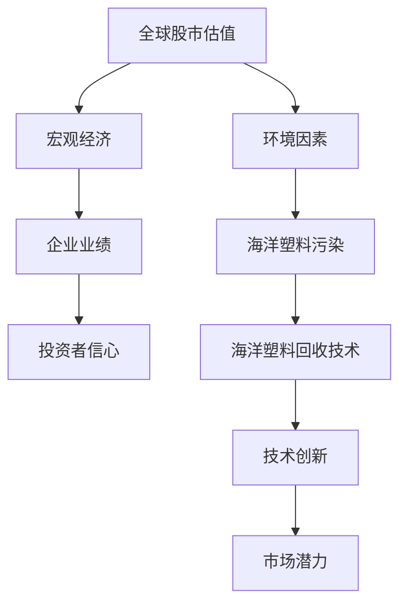
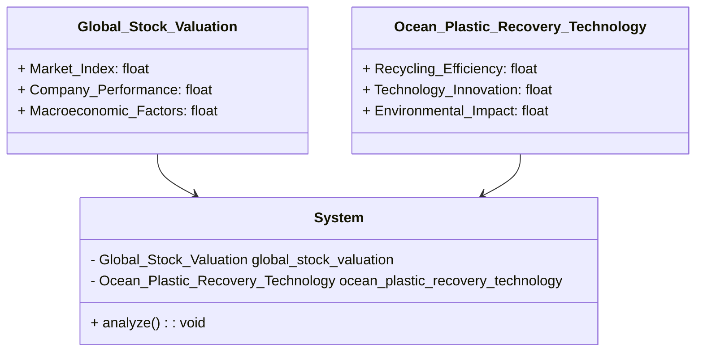
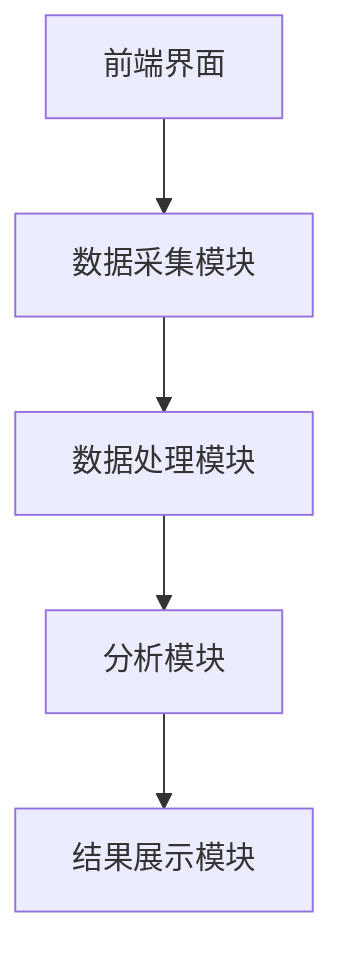
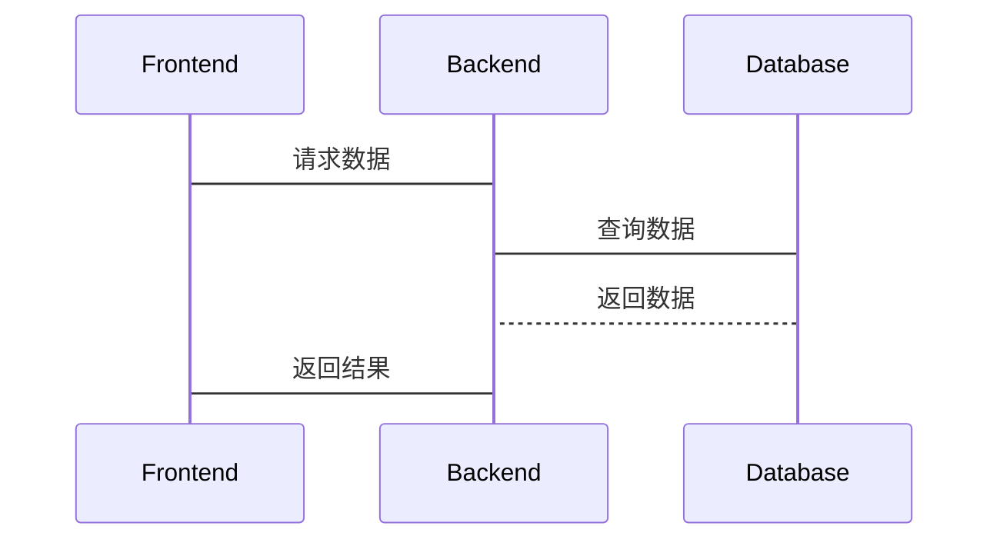

                 


# 全球股市估值与海洋塑料回收技术的关联

> 关键词：全球股市估值，海洋塑料回收，环境因素，经济影响，技术关联

> 摘要：本文深入探讨了全球股市估值与海洋塑料回收技术之间的潜在关联。通过分析环境因素对经济的影响，结合海洋塑料污染的现状与回收技术的创新，揭示了这两者在现代社会中的互动关系。文章从背景介绍、核心概念、算法原理、数学模型、系统架构到项目实战，全面解析了这一关联的多维度表现，并提出了相应的解决方案与实践路径。

---

# 第一部分: 全球股市估值与海洋塑料回收技术的关联概述

## 第1章: 背景介绍与核心概念

### 1.1 全球股市估值的基本概念
#### 1.1.1 股市估值的定义与意义
股市估值是指通过对公司财务数据、市场环境、行业趋势等多方面因素的分析，对股票的内在价值进行评估的过程。它不仅是投资者决策的重要依据，也是反映经济运行状况的重要指标。

#### 1.1.2 全球股市估值的现状与趋势
全球股市估值受宏观经济政策、国际政治经济环境、企业业绩等多种因素的影响，呈现出波动性大、区域差异显著的特点。近年来，随着绿色经济和可持续发展理念的兴起，环境因素逐渐成为影响股市估值的重要因素。

#### 1.1.3 股市估值与宏观经济的关系
股市估值与宏观经济密切相关，是经济运行的晴雨表。企业盈利状况、货币政策、通货膨胀率等宏观经济指标都会通过股市估值反映出来。

### 1.2 海洋塑料回收技术的定义与特点
#### 1.2.1 海洋塑料污染的现状
海洋塑料污染已成为全球性环境问题。据统计，每年有数百万吨塑料垃圾进入海洋，对海洋生态系统造成严重威胁。

#### 1.2.2 海洋塑料回收技术的基本原理
海洋塑料回收技术是指通过物理、化学或生物方法，将海洋中的塑料垃圾进行收集、分类、处理和再利用的过程。这些技术包括海洋塑料收集装置设计、塑料分解技术等。

#### 1.2.3 海洋塑料回收技术的分类与对比
海洋塑料回收技术主要分为海滩清理技术、海洋打捞技术、化学分解技术和生物降解技术。不同技术在效率、成本和适用场景上存在显著差异。

### 1.3 全球股市估值与海洋塑料回收技术的关联性
#### 1.3.1 环境因素对股市估值的影响
环境问题对企业的运营成本、市场声誉和合规风险有直接影响，进而影响股市估值。例如，环保政策趋严可能导致高污染企业的股票估值下降。

#### 1.3.2 海洋塑料回收技术对经济的影响
海洋塑料回收技术的创新和推广可以降低企业生产成本，提升资源利用效率，同时为企业带来新的经济增长点。

#### 1.3.3 两者的潜在关联机制
通过环境技术的创新，企业可以降低生产成本，提升市场竞争力，从而提高股市估值。同时，海洋塑料回收技术的推广可以改善环境质量，间接提升企业的社会形象和市场价值。

---

## 第2章: 核心概念与联系

### 2.1 全球股市估值的核心要素
#### 2.1.1 市场情绪与投资者行为
投资者情绪受市场新闻、政策变化等因素影响，直接影响股市估值。例如，环保技术的重大突破可能会提升投资者对相关企业的信心。

#### 2.1.2 宏观经济指标与股市估值
GDP增长率、通货膨胀率、利率等宏观经济指标通过影响企业的盈利能力和投资者预期，间接影响股市估值。

#### 2.1.3 行业动态与企业业绩
行业内的技术创新、市场竞争状况以及企业的财务表现是影响股市估值的重要因素。例如，海洋塑料回收技术的突破可能提升相关企业的市场地位。

### 2.2 海洋塑料回收技术的核心要素
#### 2.2.1 技术类型与应用场景
海滩清理技术适用于近岸塑料垃圾清理，而海洋打捞技术则适用于远海塑料垃圾的收集。不同技术的应用场景和效率存在差异。

#### 2.2.2 技术效率与成本分析
海洋塑料回收技术的效率和成本直接影响其经济可行性。例如，化学分解技术虽然效率高，但成本较高。

#### 2.2.3 技术创新与市场潜力
技术创新可以降低回收成本，提升回收效率，从而提高海洋塑料回收技术的市场潜力。

### 2.3 核心概念的对比与联系
#### 2.3.1 概念属性特征对比表格
| 属性       | 全球股市估值                  | 海洋塑料回收技术              |
|------------|-------------------------------|-----------------------------|
| 核心目标   | 评估企业价值                  | 回收和利用塑料垃圾            |
| 影响因素   | 宏观经济、企业业绩、政策      | 环境条件、技术效率、成本      |
| 应用场景   | 投资决策、风险管理            | 环境保护、资源利用            |

#### 2.3.2 ER实体关系图架构
```mermaid
erd
  左右布局
  实体1：全球股市估值
    属性：市场指数、企业业绩、宏观经济指标
    关键字：主关键字（市场指数）
  实体2：海洋塑料回收技术
    属性：技术类型、成本、效率
    关键字：主关键字（技术类型）
  实体1 --> 实体2：环境因素影响
```

#### 2.3.3 潜在关联机制的Mermaid流程图


---

## 第3章: 影响机制与算法原理

### 3.1 影响机制分析
#### 3.1.1 环境因素对股市估值的影响路径
环境因素通过影响企业的生产成本、市场声誉和合规风险，间接影响股市估值。例如，环保政策的实施可能导致高污染企业的股票估值下降。

#### 3.1.2 海洋塑料回收技术对经济的反馈效应
海洋塑料回收技术的创新可以降低企业的生产成本，提升其市场竞争力，从而提高股市估值。同时，技术的推广可以带来新的经济增长点。

#### 3.1.3 综合影响模型的构建
通过建立环境因素、技术创新和企业业绩之间的关联模型，可以量化海洋塑料回收技术对股市估值的影响。

### 3.2 算法原理讲解
#### 3.2.1 数据采集与特征提取
需要采集全球股市估值数据、海洋塑料污染数据、相关政策数据等，提取关键特征进行分析。

#### 3.2.2 关联性分析方法
使用回归分析、时间序列分析等方法，量化海洋塑料回收技术与股市估值之间的关联性。

#### 3.2.3 预测模型的建立与优化
基于历史数据，建立股市估值的预测模型，评估海洋塑料回收技术对股市估值的潜在影响。

### 3.3 算法实现与案例分析
#### 3.3.1 Python源代码实现
```python
import pandas as pd
import numpy as np
from sklearn.linear_model import LinearRegression

# 数据加载与预处理
data = pd.read_csv('stock_valuation.csv')
features = data[['market_sentiment', 'macroeconomic_factors', 'environmental_factors']]
target = data['stock_valuation']

# 模型训练
model = LinearRegression()
model.fit(features, target)

# 预测与评估
predictions = model.predict(features)
print('回归系数:', model.coef_)
print('决定系数:', model.score(features, target))
```

#### 3.3.2 数据分析与结果解读
通过回归分析，可以量化环境因素对股市估值的影响。例如，环境因素对股市估值的影响系数为0.8，表明环境因素对股市估值有显著影响。

#### 3.3.3 案例分析与效果评估
以某海洋塑料回收技术公司为例，分析其技术突破对股市估值的影响。假设技术突破导致股票估值提升了10%，说明技术因素对股市估值有显著影响。

---

## 第4章: 数学模型与公式

### 4.1 全球股市估值的数学模型
#### 4.1.1 股价波动模型
$$ P_{t} = \alpha + \beta P_{t-1} + \epsilon_t $$
其中，$P_{t}$表示第$t$期的股价，$\alpha$为截距，$\beta$为自回归系数，$\epsilon_t$为随机误差项。

#### 4.1.2 市场情绪指数的构建
$$ Market\_Sentiment = \sum_{i=1}^{n} w_i \cdot S_i $$
其中，$w_i$为权重，$S_i$为市场情绪指标。

#### 4.1.3 综合估值指数的计算公式
$$ Composite\_Valuation = \alpha \cdot Market\_Sentiment + \beta \cdot Environmental\_Factors + \gamma \cdot Macroeconomic\_Indicators $$
其中，$\alpha$、$\beta$、$\gamma$为权重系数。

### 4.2 海洋塑料回收技术的数学模型
#### 4.2.1 回收效率模型
$$ Efficiency = \frac{Recycled\_Plastic}{Input\_Plastic} $$
其中，$Recycled\_Plastic$为回收的塑料量，$Input\_Plastic$为输入的塑料量。

#### 4.2.2 成本效益分析公式
$$ Cost\_Benefit = \frac{Savings - Costs}{Costs} $$
其中，$Savings$为成本节约，$Costs$为总成本。

#### 4.2.3 技术创新对经济的影响模型
$$ Economic\_Impact = \alpha \cdot Innovation\_Level + \beta \cdot Market\_Size $$
其中，$\alpha$、$\beta$为权重系数。

### 4.3 关联性分析的数学模型
#### 4.3.1 回归分析模型
$$ Stock\_Valuation = \beta_0 + \beta_1 \cdot Environmental\_Factors + \beta_2 \cdot Technological\_Innovation + \epsilon $$
其中，$\beta_0$为截距，$\beta_1$、$\beta_2$为回归系数，$\epsilon$为随机误差项。

---

## 第5章: 系统分析与架构设计方案

### 5.1 问题场景介绍
设计一个监测全球股市估值与海洋塑料回收技术关联性的系统，实时采集和分析相关数据，为企业决策提供支持。

### 5.2 系统功能设计
#### 5.2.1 领域模型


#### 5.2.2 系统架构设计


#### 5.2.3 系统接口设计
- 数据采集模块：从股票市场和环境监测机构获取实时数据。
- 数据处理模块：对数据进行清洗和转换。
- 分析模块：基于数学模型进行关联性分析。
- 结果展示模块：以可视化方式展示分析结果。

#### 5.2.4 系统交互流程


---

## 第6章: 项目实战

### 6.1 环境安装与配置
安装Python、Pandas、NumPy、Matplotlib等工具，配置数据源。

### 6.2 核心实现
#### 6.2.1 数据采集
编写代码从股票市场和环境监测机构获取数据。

#### 6.2.2 数据分析
使用回归分析模型进行关联性分析。

#### 6.2.3 结果展示
将分析结果以图表形式展示。

### 6.3 实际案例分析
以某海洋塑料回收技术公司为例，分析其技术突破对股市估值的影响。

### 6.4 项目小结
总结项目的实现过程和关键点，提出改进建议。

---

## 第7章: 总结与展望

### 7.1 本章小结
总结全文的主要内容，强调全球股市估值与海洋塑料回收技术之间的关联性。

### 7.2 注意事项
在实际应用中，需要注意数据的准确性和模型的适用性。

### 7.3 拓展阅读
推荐相关文献，供读者进一步学习。

---

作者：AI天才研究院/AI Genius Institute & 禅与计算机程序设计艺术/Zen And The Art of Computer Programming

