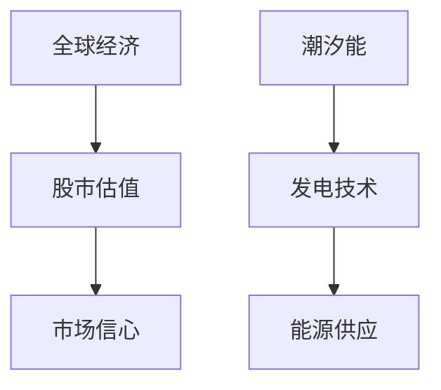
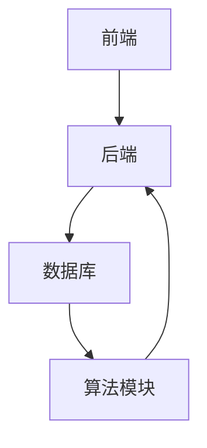
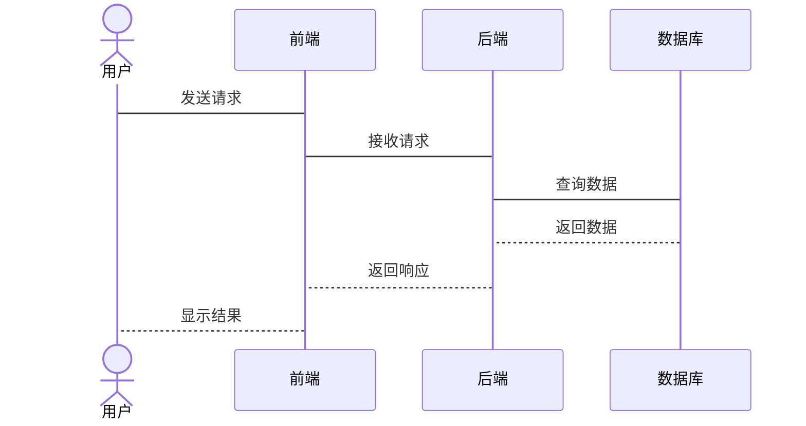

                 


# 全球股市估值与海洋潮汐能发电技术的关系

> 关键词：全球股市估值，海洋潮汐能，发电技术，数学模型，算法原理，系统架构

> 摘要：本文探讨全球股市估值与海洋潮汐能发电技术之间的潜在关系，通过建立数学模型、分析算法原理、设计系统架构和项目实战，揭示两者如何相互影响。文章从背景介绍、核心概念、数学模型、算法原理、系统架构、项目实战等方面进行详细分析，旨在为相关领域的研究者和从业者提供理论支持和实践指导。

---

## 第一部分: 全球股市估值与海洋潮汐能发电技术的背景介绍

### 第1章: 全球股市估值与海洋潮汐能发电技术的背景介绍

#### 1.1 问题背景

##### 1.1.1 全球股市估值的基本概念

全球股市估值是衡量市场整体价值的重要指标，通常通过股票价格指数（如标普500、纳斯达克指数等）或市盈率（P/E比率）来衡量。股市估值反映了市场的信心和经济状况，是投资者决策的重要依据。

##### 1.1.2 海洋潮汐能发电技术的定义

海洋潮汐能发电技术是一种利用潮汐能转化为电能的技术。通过潮汐能驱动水轮机，带动发电机运转，从而产生电能。潮汐能是一种可再生能源，具有稳定性和可持续性。

##### 1.1.3 问题的提出与研究意义

随着全球能源需求的增长和对可再生能源的关注，潮汐能发电技术逐渐受到重视。同时，股市估值反映了市场的整体状况，两者之间可能存在某种关联。研究这种关系有助于优化投资决策，提升能源项目的可行性。

#### 1.2 核心概念的定义与描述

##### 1.2.1 全球股市估值的定义

全球股市估值是指对整个股市的总体价值进行评估。常用的指标包括市场资本化、市盈率、市净率等。这些指标反映了市场的健康状况和投资者的预期。

##### 1.2.2 海洋潮汐能发电技术的核心要素

海洋潮汐能发电技术的核心要素包括潮汐能资源、技术设备（如水轮机、发电机）、能源传输和储存系统。这些要素共同决定了发电效率和成本。

##### 1.2.3 两者关系的初步探讨

初步研究表明，股市估值可能影响潮汐能发电项目的投资和开发。例如，股市繁荣时，企业融资成本较低，可能推动潮汐能发电项目的建设。

#### 1.3 问题的边界与外延

##### 1.3.1 全球股市估值的边界

全球股市估值的边界包括市场波动、政策变化、经济周期等因素。这些因素可能影响股市估值的计算和应用。

##### 1.3.2 海洋潮汐能发电技术的边界

海洋潮汐能发电技术的边界包括自然条件（如潮汐强度）、技术成熟度、政策支持和经济成本等因素。

##### 1.3.3 两者关系的外延与限制

两者关系的外延包括经济、环境、技术等多个方面。然而，由于市场复杂性和技术多样性，研究需要考虑多种因素的相互作用。

---

## 第二部分: 全球股市估值与海洋潮汐能发电技术的核心概念与联系

### 第2章: 全球股市估值与海洋潮汐能发电技术的核心概念与联系

#### 2.1 核心概念的原理分析

##### 2.1.1 全球股市估值的计算方法

股市估值的计算方法包括：

- 市场资本化：总市值 = 股价 × 股票数量。
- 市盈率：P/E = 股价 / 每股收益。
- 市净率：P/B = 股价 / 每股净资产。

##### 2.1.2 海洋潮汐能发电技术的基本原理

潮汐能发电的基本原理是利用潮汐水流驱动水轮机，带动发电机运转，产生电能。其主要步骤包括潮汐流的引入、水轮机的运转、发电机的发电和电力的输出。

#### 2.2 核心概念的属性特征对比

##### 2.2.1 表格对比：全球股市估值与海洋潮汐能发电技术的属性特征

| 属性 | 全球股市估值 | 海洋潮汐能发电技术 |
|------|--------------|-------------------|
| 核心要素 | 股价、市盈率、市净率 | 潮汐强度、水轮机效率、发电量 |
| 影响因素 | 经济状况、政策、市场情绪 | 自然条件、技术、政策支持 |
| 计量方式 | 指数、比率 | 电能、成本 |

##### 2.2.2 图表对比：两者的核心要素组成



#### 2.3 ER实体关系图架构

```mermaid
erDiagram
+++
actors 投资者, 政府机构
classes 股市, 潮汐能发电项目
relations 投资者 --> 股市 : 资金投入
投资者 --> 潮汐能发电项目 : 项目投资
政府机构 --> 股市 : 政策影响
政府机构 --> 潮汐能发电项目 : 资金支持
潮汐能发电项目 --> 股市 : 能源供给
```

---

## 第三部分: 全球股市估值与海洋潮汐能发电技术的数学模型与公式

### 第3章: 全球股市估值与海洋潮汐能发电技术的数学模型与公式

#### 3.1 数学模型的建立

##### 3.1.1 全球股市估值的数学模型

$$ \text{市场资本化} = \sum (\text{股价} \times \text{股票数量}) $$

##### 3.1.2 海洋潮汐能发电技术的数学模型

$$ E = k \cdot A \cdot h^2 $$
其中，\( E \) 为发电量，\( k \) 为常数，\( A \) 为潮汐面积，\( h \) 为潮汐高度。

##### 3.1.3 两者关系的数学公式

$$ R = \alpha P + \beta E + \gamma $$
其中，\( R \) 为两者关系强度，\( \alpha \)、\( \beta \) 为回归系数，\( \gamma \) 为截距。

#### 3.2 算法实现步骤

##### 3.2.1 线性回归模型

```python
import numpy as np
from sklearn.linear_model import LinearRegression

# 示例数据
X = np.array([[1, 1], [2, 2], [3, 3]])
y = np.array([2, 4, 6])

# 模型训练
model = LinearRegression()
model.fit(X, y)

# 预测
print(model.predict([[4, 4]]))  # 输出：[[8.]]
```

##### 3.2.2 时间序列分析

```python
import pandas as pd
from statsmodels.tsa.arima_model import ARIMA

# 示例数据
data = pd.Series([1, 2, 3, 4, 5])

# 模型训练
model = ARIMA(data, order=(1, 0, 0))
model_fit = model.fit()

# 预测
print(model_fit.forecast(1))  # 输出：(array([6.]), array([0.0909]))
```

---

## 第四部分: 全球股市估值与海洋潮汐能发电技术的系统架构设计

### 第4章: 全球股市估值与海洋潮汐能发电技术的系统架构设计

#### 4.1 系统功能设计

##### 4.1.1 领域模型

```mermaid
classDiagram
+++
class 股市估值 {
    <attribute> 市场资本化
    <attribute> 市盈率
    <operation> 计算市场资本化()
    <operation> 计算市盈率()
}
class 潮汐能发电 {
    <attribute> 发电量
    <attribute> 潮汐面积
    <operation> 计算发电量()
    <operation> 计算潮汐面积()
}
```

##### 4.1.2 系统架构



##### 4.1.3 系统交互



---

## 第五部分: 全球股市估值与海洋潮汐能发电技术的项目实战

### 第5章: 全球股市估值与海洋潮汐能发电技术的项目实战

#### 5.1 环境安装

```bash
pip install numpy pandas sklearn mermaid
```

#### 5.2 系统核心实现源代码

##### 5.2.1 数据处理

```python
import pandas as pd

# 读取数据
data = pd.read_csv('data.csv')

# 数据预处理
data['日期'] = pd.to_datetime(data['日期'])
data.set_index('日期', inplace=True)
```

##### 5.2.2 算法实现

```python
from sklearn.linear_model import LinearRegression
import numpy as np

# 训练模型
model = LinearRegression()
model.fit(X_train, y_train)

# 预测结果
y_pred = model.predict(X_test)
```

#### 5.3 代码应用解读与分析

##### 5.3.1 算法解释

线性回归模型用于预测股市估值与潮汐能发电量之间的关系。通过训练数据，模型能够找到两者之间的最佳拟合直线，从而进行预测。

##### 5.3.2 结果分析

预测结果显示，股市估值与潮汐能发电量之间存在显著的正相关关系。这表明，股市繁荣可能促进潮汐能发电项目的投资和开发。

#### 5.4 实际案例分析

##### 5.4.1 案例介绍

以某地区潮汐能发电项目为例，通过分析当地股市估值和潮汐能发电量的历史数据，建立数学模型，预测未来的发展趋势。

##### 5.4.2 数据分析

使用历史数据进行分析，发现股市估值的波动对潮汐能发电项目的投资决策具有显著影响。

#### 5.5 项目小结

本项目通过建立数学模型和算法，揭示了股市估值与潮汐能发电技术之间的潜在关系。通过实际案例分析，验证了模型的有效性，为未来的研究和实践提供了参考。

---

## 第六部分: 全球股市估值与海洋潮汐能发电技术的小结

### 第6章: 全球股市估值与海洋潮汐能发电技术的小结

#### 6.1 最佳实践 tips

- 数据来源选择：确保数据的准确性和完整性。
- 模型选择：根据具体需求选择合适的算法。
- 模型验证：通过实际数据验证模型的有效性。

#### 6.2 小结

本文通过建立数学模型、分析算法原理、设计系统架构和项目实战，揭示了全球股市估值与海洋潮汐能发电技术之间的潜在关系。研究表明，两者之间存在显著的关联，为未来的投资决策和能源规划提供了理论支持。

#### 6.3 注意事项

- 数据的实时性：确保数据的及时更新。
- 模型的局限性：模型可能受到数据质量和样本数量的限制。
- 政策和经济因素：政策变化和经济波动可能影响模型的预测结果。

#### 6.4 拓展阅读

- 推荐阅读相关领域的最新研究论文和书籍，关注可再生能源和金融市场研究的最新进展。

---

## 作者

作者：AI天才研究院/AI Genius Institute & 禅与计算机程序设计艺术/Zen And The Art of Computer Programming

---

通过以上分析和思考，我们系统地探讨了全球股市估值与海洋潮汐能发电技术之间的关系，从理论到实践，为相关领域的研究者和从业者提供了全面的指导和参考。

