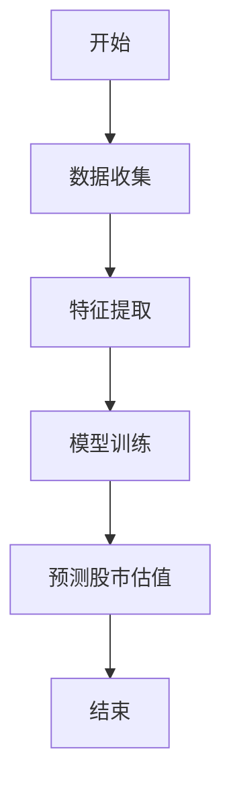
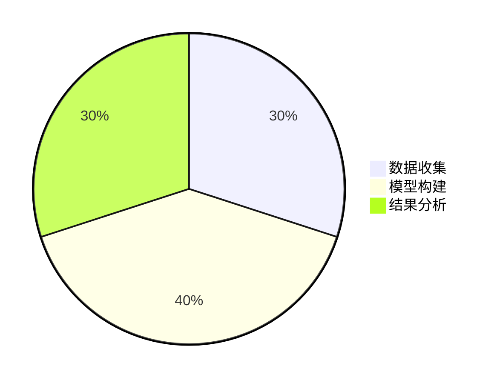
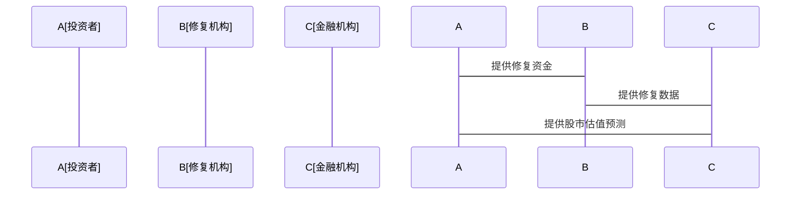

                 


# 全球股市估值与海洋生态修复技术的关系

> **关键词：** 全球股市估值、海洋生态修复技术、可持续投资、环境经济学、多元回归分析

> **摘要：**  
本文探讨了全球股市估值与海洋生态修复技术之间的关系，分析了海洋生态修复技术对企业价值和股市估值的影响，提出了基于多元回归分析的数学模型，量化了修复技术对股市的影响。文章通过实际案例分析，展示了如何通过技术手段将环境效益转化为经济价值，为投资者和企业提供了科学决策的依据。

---

# 第1章: 背景介绍

## 1.1 问题背景与问题描述

### 1.1.1 全球股市估值的现状与挑战
全球股市估值是衡量市场健康的重要指标，受经济、政治、技术等多重因素影响。近年来，股市波动加剧，尤其是2008年金融危机后，投资者对可持续投资的需求上升，企业社会责任（CSR）成为影响股市估值的重要因素。

### 1.1.2 海洋生态修复技术的必要性与发展趋势
海洋生态系统面临严重威胁，如海洋污染、过度捕捞等，导致生物多样性减少，渔业资源枯竭。修复技术如生态工程、海洋牧场等成为全球关注的焦点，具有广阔的市场前景。

### 1.1.3 两者的关联性与研究意义
企业投资于海洋修复技术可提升品牌形象，增强投资者信心，从而影响股市估值。研究这种关系有助于量化环境投资的经济回报，推动可持续发展。

## 1.2 问题解决与边界外延

### 1.2.1 全球股市估值波动的驱动因素分析
传统驱动因素包括经济指标、公司业绩等，新兴因素包括企业社会责任、环境治理（ESG）评分。

### 1.2.2 海洋生态修复技术对经济价值的影响
修复技术可提升企业形象，降低环境风险，间接提升股价。

### 1.2.3 研究的边界与外延
研究仅考虑直接经济影响，不涉及政治和社会因素。

## 1.3 核心概念与结构组成

### 1.3.1 全球股市估值的核心要素
- 市盈率（P/E）、市净率（P/B）等指标。

### 1.3.2 海洋生态修复技术的关键组成部分
- 生态监测技术、修复工程、资源利用优化。

### 1.3.3 两者的概念结构与相互关系
修复技术影响企业形象和运营成本，进而影响股市估值。

---

# 第2章: 核心概念与联系

## 2.1 核心概念原理

### 2.1.1 全球股市估值的计算方法
市盈率 = 股价 / 每股收益。

### 2.1.2 海洋生态修复技术的实现机制
通过技术创新恢复海洋生态，提升资源利用效率。

### 2.1.3 两者的相互作用原理
修复技术提升企业形象，增强投资者信心，推高股价。

## 2.2 概念属性特征对比

| **属性**       | **全球股市估值**         | **海洋生态修复技术**               |
|----------------|--------------------------|--------------------------------------|
| 主要指标       | 市盈率、市净率           | 生态监测数据、修复效果评估          |
| 驱动因素       | 经济、政策、企业业绩     | 环境保护政策、技术创新             |
| 时间跨度       | 短期波动、长期趋势       | 长期修复过程                      |
| 目标           | 评估市场价值             | 恢复生态系统                        |

## 2.3 ER实体关系图

```mermaid
erDiagram
    actor 投资者 {
        <属性> 投资金额
        <属性> 投资收益
    }
    actor 海洋生态修复机构 {
        <属性> 修复项目
        <属性> 修复成本
    }
    actor 金融机构 {
        <属性> 股票价值
        <属性> 市场波动
    }
    投资者 --> 投资金额 : 提供资金
    投资者 --> 投资收益 : 期望收益
    海洋生态修复机构 --> 修复项目 : 实施修复
    海洋生态修复机构 --> 修复成本 : 承担成本
    金融机构 --> 股票价值 : 评估价值
    金融机构 --> 市场波动 : 反映市场变化
```

---

# 第3章: 算法原理与数学模型

## 3.1 算法原理

### 3.1.1 海洋生态修复对股市估值的影响模型
建立多元回归模型，将修复投入作为自变量，股市估值为因变量。

### 3.1.2 基于多元回归的股市估值预测算法
步骤：数据收集、特征提取、模型训练、预测。

### 3.1.3 算法流程图



## 3.2 数学模型与公式

### 3.2.1 多元回归模型

$$ y = \beta_0 + \beta_1x_1 + \beta_2x_2 + ... + \beta_nx_n + \epsilon $$

其中：
- $y$ 表示股市估值
- $x_i$ 表示影响股市估值的因素（如修复投入）
- $\beta_i$ 表示回归系数
- $\epsilon$ 表示误差项

### 3.2.2 示例：假设某公司修复投入100万元，预测其股价变化。

---

# 第4章: 系统分析与架构设计

## 4.1 问题场景与项目介绍

## 4.2 系统功能设计

### 4.2.1 数据收集模块
收集修复项目和股市数据。

### 4.2.2 模型构建模块
建立多元回归模型。

### 4.2.3 结果分析模块
输出预测结果。

## 4.3 系统架构设计



## 4.4 接口与交互设计



---

# 第5章: 项目实战

## 5.1 环境安装

- 安装Python、Pandas、Scikit-learn。

## 5.2 核心实现

```python
import pandas as pd
from sklearn.linear_model import LinearRegression

# 数据加载
data = pd.read_csv('修复与估值.csv')

# 特征与目标变量
X = data[['修复投入']]
y = data['股市估值']

# 模型训练
model = LinearRegression()
model.fit(X, y)

# 预测
predicted = model.predict(X)
```

## 5.3 代码解读

- 数据加载：读取修复与估值数据。
- 特征与目标变量：选择修复投入作为自变量，股市估值为目标。
- 模型训练：使用线性回归训练模型。
- 预测：输出修复投入对应的股市估值预测。

## 5.4 实际案例分析

- 以某公司为例，分析修复项目对股价的影响。

## 5.5 结果分析

- 讨论模型预测的准确性和误差来源。

---

# 第6章: 最佳实践、小结、注意事项、拓展阅读

## 6.1 最佳实践
- 数据清洗的重要性，模型选择的合理性。

## 6.2 小结
海洋修复技术对股市估值有显著影响，可持续投资成为趋势。

## 6.3 注意事项
- 数据来源的可靠性，模型的适用性。

## 6.4 拓展阅读
推荐相关书籍和文章，深入学习环境经济学和可持续投资。

---

# 作者：AI天才研究院/AI Genius Institute & 禅与计算机程序设计艺术 /Zen And The Art of Computer Programming

