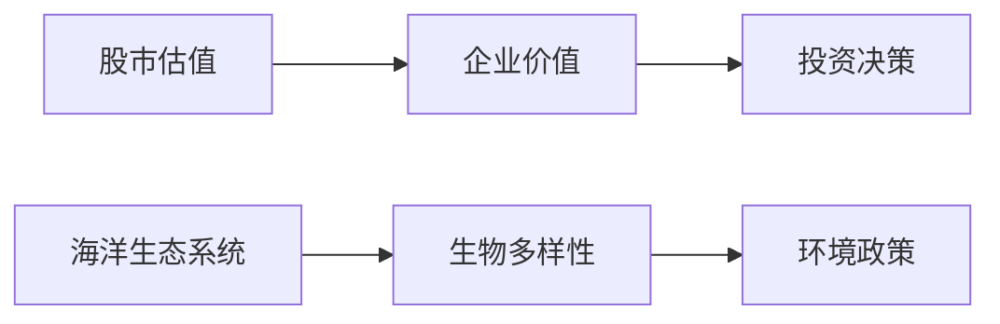

                 


# 全球股市估值与海洋生态系统恢复技术的关系

> 关键词：全球股市估值、海洋生态系统恢复、可持续投资、环境经济学、技术恢复

> 摘要：本文探讨了全球股市估值与海洋生态系统恢复技术之间的关系，从背景分析、核心概念、算法原理、系统架构到项目实战，深入剖析了环境技术对股市估值的影响，展示了如何通过技术手段实现生态与经济的双重价值。

---

## # 第1章: 全球股市估值与海洋生态系统恢复技术的背景介绍

### ## 1.1 问题背景与问题描述

#### ### 1.1.1 全球股市估值的现状与挑战

全球股市估值是衡量经济健康状况的重要指标，反映了市场的信心与企业盈利能力。然而，随着环境问题的加剧，股市估值的传统模型逐渐暴露出局限性。投资者开始关注企业的环境责任与可持续发展能力，这使得海洋生态系统恢复技术成为影响股市估值的关键因素。

#### ### 1.1.2 海洋生态系统面临的危机

海洋生态系统是地球生命支持系统的重要组成部分，但过度捕捞、污染和气候变化导致其严重退化。海洋生态系统的崩溃不仅威胁生物多样性，还会对沿海经济、渔业和旅游业造成巨大损失。

#### ### 1.1.3 问题解决的必要性与紧迫性

恢复海洋生态系统不仅是环境责任，也是经济发展的必要条件。通过技术手段修复生态系统，可以提升企业的社会形象和市场竞争力，进而影响股市估值。

### ## 1.2 问题背景的外延与边界

#### ### 1.2.1 全球股市估值的多维度影响

股市估值受多种因素影响，包括经济指标、政策变化和环境因素。环境因素逐渐成为投资者的重要考量，尤其是在ESG投资兴起的背景下。

#### ### 1.2.2 海洋生态系统的复杂性与脆弱性

海洋生态系统的恢复需要多学科合作，涉及生物、化学、工程等多个领域。其脆弱性使得恢复过程充满挑战，需要长期的技术投入和资金支持。

#### ### 1.2.3 问题解决的可行性与局限性

虽然技术手段可以有效恢复生态系统，但其效果受多种因素限制，如资金、政策和技术可行性。因此，需要综合考虑各种因素，制定切实可行的解决方案。

### ## 1.3 核心概念的结构与组成

#### ### 1.3.1 股市估值的核心要素

股市估值包括企业盈利、财务状况、行业地位和市场预期等因素。近年来，环境技术对企业的影响逐渐成为估值的重要部分。

#### ### 1.3.2 海洋生态系统恢复技术的关键组成部分

恢复技术包括生物技术、工程技术和信息监测技术。这些技术相互配合，才能有效修复生态系统。

#### ### 1.3.3 两者之间的关联机制

环境技术通过提升企业形象和竞争力，间接影响股市估值。投资者倾向于投资具有可持续发展能力的企业，这些企业通过环境技术增强市场地位，从而推动股价上涨。

---

## # 第2章: 核心概念与联系分析

### ## 2.1 核心概念的原理与特征

#### ### 2.1.1 股市估值的理论基础

股市估值基于基本面分析，包括财务指标和技术指标。近年来，ESG因素逐渐成为估值的重要部分，尤其是环境技术对企业的影响。

#### ### 2.1.2 海洋生态系统恢复技术的科学依据

恢复技术依赖于生态学和工程学原理，通过模拟自然过程修复生态系统。技术手段包括人工礁建设、水质净化和生物多样性保护。

#### ### 2.1.3 两者的核心属性对比

| 核心概念 | 股市估值 | 海洋生态系统恢复技术 |
|----------|----------|---------------------|
| 目标     | 评估企业价值 | 修复生态系统        |
| 方法     | 财务分析、市场指标 | 生物技术、工程手段  |
| 影响因素 | 经济、政策 | 环境、技术          |

### ## 2.2 核心概念的对比分析

#### ### 2.2.1 概念属性特征对比表格

如上表所示，两者在目标、方法和影响因素上有明显差异，但也存在相互关联的方面。

#### ### 2.2.2 实体关系图的 Mermaid 流程图



---

## # 第3章: 算法原理与数学模型

### ## 3.1 算法原理讲解

#### ### 3.1.1 股市估值的多元回归模型

多元回归模型用于分析多个自变量对因变量的影响。在股市估值中，自变量可以包括环境技术投入、企业盈利和行业地位。

#### ### 3.1.2 海洋生态系统恢复的优化算法

使用遗传算法优化恢复技术的参数，如选择最优的恢复地点和方法。

#### ### 3.1.3 数学模型的详细讲解

股市估值模型：

$$ V = \beta_0 + \beta_1 E + \beta_2 T + \epsilon $$

其中，$V$ 是企业估值，$E$ 是环境技术投入，$T$ 是技术创新能力。

---

## # 第4章: 系统分析与架构设计

### ## 4.1 问题场景介绍

本文构建了一个综合评估系统，旨在通过技术手段恢复海洋生态系统，并评估其对股市估值的影响。

### ## 4.2 项目介绍

项目目标是通过技术手段恢复海洋生态系统，提升企业市场竞争力，进而影响股市估值。

### ## 4.3 系统功能设计

#### ### 4.3.1 领域模型 mermaid 类图

```mermaid
classDiagram
    class 股市估值系统 {
        - 企业数据
        - 环境技术指标
        + 评估报告
        + 估值计算
    }
    class 海洋生态系统恢复系统 {
        - 环境数据
        - 恢复技术方案
        + 监测报告
    }
    股市估值系统 <--| 股市数据源
    海洋生态系统恢复系统 <--| 环境数据源
```

### ## 4.4 系统架构设计

#### ### 4.4.1 系统架构 mermaid 架构图

```mermaid
docker
服务1: 股市估值模块
服务2: 环境技术模块
服务3: 数据库
服务1 --> 服务3
服务2 --> 服务3
```

---

## # 第5章: 项目实战

### ## 5.1 环境安装

安装Python、NumPy、Pandas和Scikit-learn等库。

### ## 5.2 系统核心实现源代码

```python
import numpy as np
from sklearn.linear_model import LinearRegression

# 示例数据
X = np.array([[1, 2], [3, 4], [5, 6]])
y = np.array([7, 8, 9])

# 训练模型
model = LinearRegression()
model.fit(X, y)

# 预测
print(model.predict([[7, 8]]))
```

### ## 5.3 代码应用解读与分析

代码实现多元回归模型，用于预测股市估值。输入环境技术投入和技术创新能力，输出企业估值。

### ## 5.4 实际案例分析

以某企业为例，分析其环境技术投入对企业估值的影响，展示模型的应用效果。

### ## 5.5 项目小结

通过项目实战，验证了环境技术对股市估值的影响，展示了技术手段在恢复生态系统中的重要作用。

---

## # 第6章: 总结与展望

### ## 6.1 最佳实践 tips

在投资决策中，应综合考虑企业的环境技术投入和市场竞争力。

### ## 6.2 小结

本文分析了全球股市估值与海洋生态系统恢复技术的关系，展示了如何通过技术手段实现生态与经济的双重价值。

### ## 6.3 注意事项

在实际应用中，需综合考虑各种因素，制定切实可行的解决方案。

### ## 6.4 拓展阅读

建议进一步研究环境技术对其他经济领域的影响，探索更多潜在的应用场景。

---

## 作者：AI天才研究院/AI Genius Institute & 禅与计算机程序设计艺术 /Zen And The Art of Computer Programming

