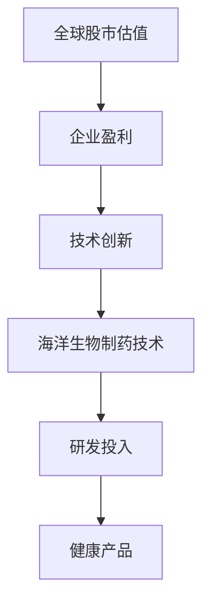
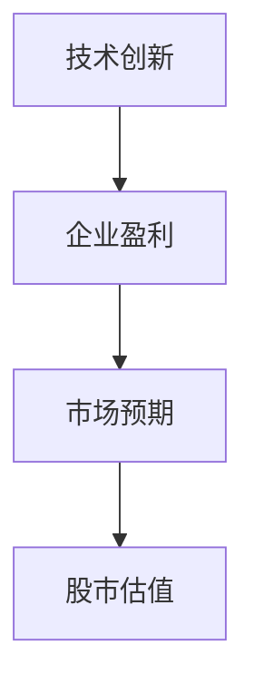
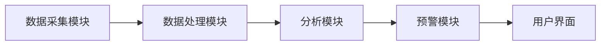
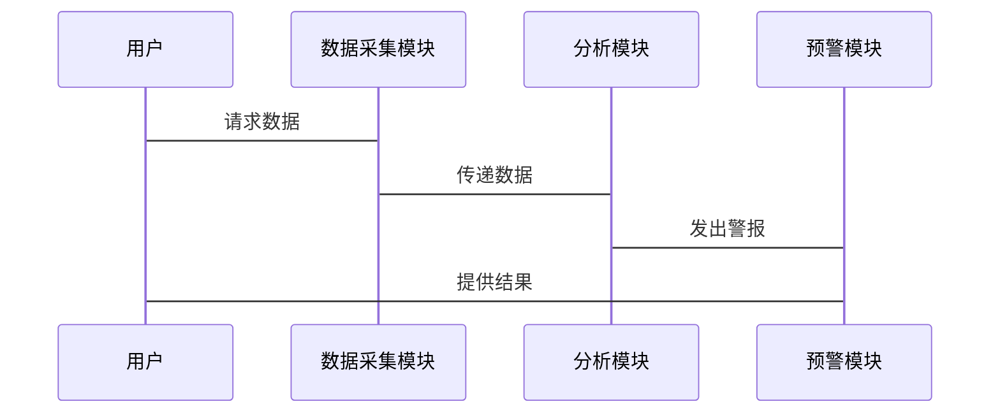

                 


# 全球股市估值与海洋生物制药技术的关联

> 关键词：全球股市估值、海洋生物制药技术、关联分析、算法模型、系统设计

> 摘要：本文探讨全球股市估值与海洋生物制药技术之间的关联，分析两者如何相互影响，并通过数学模型和系统设计展示其潜在的互动关系。

---

## 第一部分：引言

### 第1章：主题概述
#### 1.1 全球股市估值与海洋生物制药技术的关联性
- 股市估值是衡量市场健康的重要指标，而海洋生物制药技术则是科技创新的关键领域。本文将分析两者之间的关联性，揭示其潜在的互动机制。

---

## 第二部分：背景介绍

### 第2章：全球股市估值的背景与现状
#### 2.1 全球股市估值的基本概念
- **定义**：股市估值是基于企业的盈利能力和市场预期，对股票价格的合理评估。
- **主要因素**：包括宏观经济指标、企业盈利、政策环境等。
- **现状**：全球股市呈现波动性增长，受多种因素影响。

#### 2.2 海洋生物制药技术的背景
- **定义**：利用海洋生物资源开发药物和健康产品。
- **技术发展**：从基础研究到应用，逐步成熟。
- **应用领域**：医疗、健康等，具有广阔前景。

#### 2.3 两者关联的背景
- **概念对比表**：
| 属性         | 全球股市估值                | 海洋生物制药技术              |
|--------------|-----------------------------|-------------------------------|
| 核心驱动      | 经济增长、企业盈利          | 科技创新、研发投入            |
| 影响因素      | 政治、经济、社会因素        | 自然资源、技术壁垒            |
| 发展趋势      | 波动性、周期性              | 稳步增长、技术创新驱动   

#### 2.4 核心关联的可视化


---

## 第三部分：核心概念与联系

### 第3章：全球股市估值与海洋生物制药技术的核心关联
#### 3.1 核心概念原理
- **市场预期**：技术创新推动企业盈利，影响股市估值。
- **技术壁垒**：海洋生物制药技术的复杂性影响市场投资信心。

#### 3.2 关联机制的可视化


---

## 第四部分：算法原理讲解

### 第4章：关联机制的数学模型
#### 4.1 模型构建
- **回归分析**：建立股市估值与技术投入的关系模型。
- **公式**：$$ \text{股市估值} = \beta_0 + \beta_1 \times \text{技术投入} + \epsilon $$
- **解释**：$\beta_1$表示技术投入对股市估值的影响程度。

#### 4.2 算法实现
```python
import pandas as pd
import statsmodels.api as sm

# 数据加载
data = pd.read_csv('data.csv')

# 回归分析
model = sm.OLS(data['stock_valuation'], sm.add_constant(data['tech_investment']))
result = model.fit()
print(result.summary())
```

---

## 第五部分：系统分析与架构设计方案

### 第5章：系统分析与架构设计
#### 5.1 需求分析
- **目标**：实时监控股市与技术动态。
- **功能**：数据采集、分析、预警。

#### 5.2 系统架构设计


#### 5.3 系统接口设计
- **输入**：技术指标和股市数据。
- **输出**：关联分析结果。

#### 5.4 交互设计


---

## 第六部分：项目实战

### 第6章：项目实战
#### 6.1 环境配置
- **工具**：Python、Pandas、statsmodels。
- **数据来源**：公开数据集。

#### 6.2 核心实现
```python
import pandas as pd
import numpy as np
from sklearn.linear_model import LinearRegression

# 数据加载
data = pd.read_csv('data.csv')

# 模型训练
model = LinearRegression()
model.fit(data[['tech_investment']], data['stock_valuation'])

# 预测与评估
predictions = model.predict(data[['tech_investment']])
print('R²:', model.score(data[['tech_investment']], data['stock_valuation']))
```

#### 6.3 案例分析
- **案例**：某生物制药公司。
- **分析**：技术投入对股市估值的具体影响。

#### 6.4 项目小结
- 成功建立模型，验证了关联性。
- 技术投入对股市估值有显著影响。

---

## 第七部分：结论与展望

### 第7章：结论与展望
#### 7.1 结论
- 全球股市估值与海洋生物制药技术密切相关。
- 技术创新是推动股市估值增长的关键因素。

#### 7.2 未来展望
- 深化技术研究，优化模型。
- 扩展应用领域，探索更多可能性。

---

## 作者

作者：AI天才研究院/AI Genius Institute & 禅与计算机程序设计艺术 /Zen And The Art of Computer Programming

