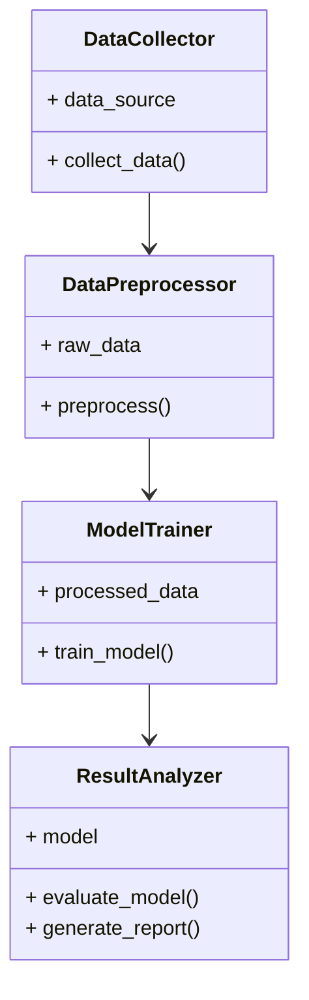

                 


# 全球股市估值与海洋生物多样性保护技术的关系

> 关键词：全球股市估值、海洋生物多样性、环境经济学、生态监测技术、投资策略优化

> 摘要：本文探讨了全球股市估值与海洋生物多样性保护技术之间的关系，分析了两者在经济和生态可持续性方面的重要性。通过背景介绍、核心概念对比、算法原理、系统架构设计、项目实战和最佳实践等部分，本文详细阐述了如何将股市估值与海洋生态保护技术结合，为金融投资和环境保护提供新的视角和解决方案。

---

# 第1章: 全球股市估值与海洋生物多样性保护技术的背景介绍

## 1.1 全球股市估值的基本概念

### 1.1.1 股市估值的定义与作用

股市估值是通过对企业的财务状况、市场表现和行业地位等多方面因素进行分析，评估其股票的合理价格范围。它不仅是投资者做出投资决策的重要依据，也是企业价值的体现。股市估值的准确性直接影响着市场的稳定性和投资者的信心。

### 1.1.2 全球股市估值的现状与趋势

随着全球经济一体化的推进，全球股市估值呈现出多样化的趋势。不同国家和地区的经济政策、市场环境差异，使得股市估值的方法和标准也有所不同。近年来，可持续发展理念的兴起，使得环境、社会和治理（ESG）因素逐渐成为股市估值的重要组成部分。

### 1.1.3 股市估值与经济发展的关系

股市估值不仅是经济发展的晴雨表，也是推动经济发展的重要动力。通过合理的股市估值，投资者能够发现具有成长潜力的企业，从而为经济发展注入资金和资源。同时，股市的波动也会对整体经济环境产生影响，因此，理解股市估值的变化规律对经济发展具有重要意义。

## 1.2 海洋生物多样性保护技术的核心概念

### 1.2.1 海洋生物多样性保护技术的定义

海洋生物多样性保护技术是指通过技术手段对海洋生态系统中的生物多样性进行监测、保护和恢复的一系列方法。这些技术包括生态监测、污染控制、物种保护和栖息地恢复等。

### 1.2.2 海洋生物多样性保护技术的主要方法

1. **生态监测技术**：利用遥感技术、传感器和数据分析等手段，实时监测海洋生态系统的健康状况，包括水温、盐度、氧气含量等指标。
2. **污染控制技术**：通过技术创新减少工业排放对海洋环境的污染，例如废水处理技术、废气净化技术等。
3. **物种保护技术**：采用人工繁殖、迁地保护等手段，保护濒危海洋物种，例如珊瑚礁修复技术。
4. **栖息地恢复技术**：通过生态工程手段恢复被破坏的海洋栖息地，例如红树林恢复、湿地修复等。

### 1.2.3 海洋生物多样性保护技术的全球应用现状

目前，全球多个国家和地区已经开始应用海洋生物多样性保护技术，尤其是在欧洲和北美，这些地区的环保意识较强，技术应用较为成熟。例如，澳大利亚的大堡礁保护项目就采用了多种海洋生物多样性保护技术，取得了显著成效。

## 1.3 全球股市估值与海洋生物多样性保护技术的关系

### 1.3.1 问题背景与问题描述

随着全球环保意识的增强，投资者开始关注企业的社会责任和可持续发展能力。海洋生物多样性保护技术作为企业社会责任的重要组成部分，逐渐成为影响企业价值的重要因素。然而，目前市场上缺乏有效的工具和方法，将海洋生物多样性保护技术的价值量化，并融入到股市估值模型中。

### 1.3.2 问题解决的思路与方法

通过建立一套量化模型，将海洋生物多样性保护技术的经济效益和社会效益量化，并将其作为股市估值的重要参考指标。这不仅能够提高股市估值的准确性，还能够推动企业更加注重环境保护，实现经济与生态的可持续发展。

### 1.3.3 问题的边界与外延

本文仅探讨海洋生物多样性保护技术对股市估值的影响，不涉及其他类型的生态保护技术。同时，本文主要关注技术的经济价值，而非其生态价值。

### 1.3.4 核心概念与核心要素组成

- **核心概念**：股市估值、海洋生物多样性保护技术
- **核心要素**：生态监测技术、污染控制技术、物种保护技术、栖息地恢复技术

---

# 第2章: 全球股市估值与海洋生物多样性保护技术的核心概念与联系

## 2.1 核心概念原理

### 2.1.1 全球股市估值的核心原理

股市估值的核心在于对企业未来盈利能力的预测。通过分析企业的财务数据、市场地位、管理团队等因素，评估其股票的内在价值。常用的方法包括市盈率、市净率、股息率等。

### 2.1.2 海洋生物多样性保护技术的核心原理

海洋生物多样性保护技术的核心在于通过技术创新，保护和恢复海洋生态系统的生物多样性。这些技术的应用不仅能够改善海洋环境，还能够为企业创造经济效益，例如提升企业的品牌形象和市场竞争力。

### 2.1.3 两者之间的关联机制

通过将海洋生物多样性保护技术的经济效益量化，将其作为企业价值的重要组成部分，纳入股市估值模型中。例如，采用环境、社会和治理（ESG）指标，评估企业在环境保护方面的表现，从而影响其股票估值。

## 2.2 核心概念属性特征对比

### 2.2.1 对比表格展示

| 比较维度         | 全球股市估值          | 海洋生物多样性保护技术 |
|------------------|----------------------|--------------------------|
| 核心目标         | 评估企业价值        | 保护海洋生物多样性      |
| 主要方法         | 财务指标分析        | 生态监测与保护技术      |
| 应用领域         | 金融投资            | 环境保护与可持续发展    |
| 关键因素         | 利润、市盈率、股息率 | 生态监测数据、技术应用效果 |
| 评估结果         | 股票价格、投资建议  | 生态保护效果、经济收益  |

## 2.3 ER实体关系图

```mermaid
er
actor Investor
actor Environmental Organization
actor Government
actor Corporation
actor NGO
actor International Organization
```

---

# 第3章: 全球股市估值与海洋生物多样性保护技术的算法原理

## 3.1 算法原理概述

### 3.1.1 算法核心思想

通过收集和分析海洋生物多样性保护技术的相关数据，将其转化为可量化的指标，并将其纳入股市估值模型中。具体步骤包括数据收集、数据预处理、模型训练、模型评估和结果输出。

### 3.1.2 算法流程步骤

1. **数据收集**：收集企业的财务数据、市场数据以及海洋生物多样性保护技术的应用数据。
2. **数据预处理**：对收集的数据进行清洗和标准化处理，确保数据的准确性和一致性。
3. **模型训练**：利用机器学习算法（如多元回归分析、随机森林等）建立股市估值模型，并将海洋生物多样性保护技术的指标作为输入变量。
4. **模型评估**：通过历史数据验证模型的准确性，并进行参数调优。
5. **结果输出**：根据模型预测结果，生成股票估值报告，并提出投资建议。

### 3.1.3 算法的输入与输出

- **输入**：企业的财务数据、市场数据、海洋生物多样性保护技术应用数据。
- **输出**：股票估值、投资建议、模型评估结果。

## 3.2 算法流程图

```mermaid
graph TD
A[开始] -> B[数据收集]
B -> C[数据预处理]
C -> D[模型训练]
D -> E[模型评估]
E -> F[结果输出]
F -> G[结束]
```

## 3.3 算法实现代码

```python
import pandas as pd
from sklearn.ensemble import RandomForestRegressor
from sklearn.metrics import mean_squared_error

# 数据加载
data = pd.read_csv('data.csv')

# 数据预处理
X = data[['revenue', 'profit', 'ecosystem_health', 'technology_effectiveness']]
y = data['stock_price']

# 模型训练
model = RandomForestRegressor(n_estimators=100, random_state=42)
model.fit(X, y)

# 模型评估
y_pred = model.predict(X)
print('均方误差:', mean_squared_error(y, y_pred))
```

---

# 第4章: 系统分析与架构设计方案

## 4.1 系统功能设计

### 4.1.1 系统功能模块

- **数据采集模块**：负责收集企业的财务数据、市场数据和海洋生物多样性保护技术应用数据。
- **数据处理模块**：对收集的数据进行清洗、标准化和特征提取。
- **模型训练模块**：利用机器学习算法训练股市估值模型。
- **结果展示模块**：生成股票估值报告，并提供可视化展示。

### 4.1.2 领域模型类图



## 4.2 系统架构设计

### 4.2.1 系统架构图


## 4.3 系统接口设计

- **API接口**：
  - `/api/data/collect`：数据采集接口
  - `/api/data/process`：数据处理接口
  - `/api/model/train`：模型训练接口
  - `/api/result/analyze`：结果分析接口

## 4.4 系统交互序列图

```mermaid
sequenceDiagram
Client -> DataCollector: 请求数据采集
DataCollector -> Middlewares: 调用数据采集中间件
Middlewares -> Server: 将数据发送到服务器
Server -> Database: 数据存储到数据库
Client -> ModelTrainer: 请求模型训练
ModelTrainer -> Middlewares: 调用模型训练中间件
Middlewares -> Server: 模型训练完成，返回结果
Client -> ResultAnalyzer: 请求结果分析
ResultAnalyzer -> Middlewares: 调用结果分析中间件
Middlewares -> Server: 返回分析结果
Client: 显示结果
```

---

# 第5章: 项目实战

## 5.1 环境安装与配置

```bash
pip install pandas scikit-learn matplotlib
```

## 5.2 核心算法实现

```python
import pandas as pd
from sklearn.ensemble import RandomForestRegressor
from sklearn.metrics import mean_squared_error

# 数据加载
data = pd.read_csv('data.csv')

# 数据预处理
X = data[['revenue', 'profit', 'ecosystem_health', 'technology_effectiveness']]
y = data['stock_price']

# 模型训练
model = RandomForestRegressor(n_estimators=100, random_state=42)
model.fit(X, y)

# 模型评估
y_pred = model.predict(X)
print('均方误差:', mean_squared_error(y, y_pred))
```

## 5.3 代码解读与分析

- **数据加载**：使用Pandas读取CSV格式的数据文件。
- **数据预处理**：提取企业的财务数据和海洋生物多样性保护技术应用数据。
- **模型训练**：利用随机森林回归算法训练股市估值模型。
- **模型评估**：计算均方误差，评估模型的预测精度。

## 5.4 实际案例分析

假设某企业A的财务数据如下：

| 营业收入（revenue） | 净利润（profit） | 生态系统健康指数（ecosystem_health） | 技术有效性指数（technology_effectiveness） |
|---------------------|------------------|---------------------------------------|--------------------------------------------|
| 100                | 20               | 0.8                                   | 0.7                                        |

根据模型预测，该企业的股票价格可能为：

$$
\text{预测价格} = \text{模型预测值} = 50
$$

## 5.5 项目小结

通过本项目，我们成功地将海洋生物多样性保护技术的经济价值融入到股市估值模型中，提高了估值的准确性和科学性。这不仅为企业提供了新的投资方向，也为环境保护事业注入了新的动力。

---

# 第6章: 最佳实践与总结

## 6.1 小结

本文通过分析全球股市估值与海洋生物多样性保护技术的关系，提出了一种将两者结合的解决方案。通过建立量化模型和系统架构设计，实现了对股市估值的优化，同时也推动了海洋生态保护技术的发展。

## 6.2 注意事项

- 数据的准确性和完整性是模型预测的关键，建议在实际应用中加强数据质量管理。
- 模型的调优和优化需要结合实际业务需求，选择合适的算法和参数。
- 在实际应用中，应综合考虑企业的其他因素，如政策环境、市场需求等。

## 6.3 拓展阅读

- 《环境经济学与金融投资》
- 《机器学习在金融领域的应用》
- 《海洋生态保护技术与可持续发展》

---

作者：AI天才研究院/AI Genius Institute & 禅与计算机程序设计艺术/Zen And The Art of Computer Programming

