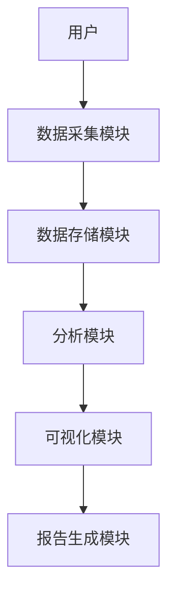

                 


# 全球股市估值与海洋生物多样性保护的关联

## 关键词：
- 全球股市估值
- 海洋生物多样性
- 可持续发展
- 环境影响
- 企业社会责任

## 摘要：
本文探讨全球股市估值与海洋生物多样性保护之间的深层关联。通过分析股市估值的核心概念、海洋生物多样性保护的重要性，以及两者如何在经济、生态和政策层面上相互影响，本文揭示了环境因素对金融市场的潜在影响。结合数学模型、系统架构和实际案例，本文为投资者、企业和政策制定者提供了可持续发展的新视角。

---

## 第一部分：全球股市估值与海洋生物多样性保护的背景与关联性

### 第1章：全球股市估值的基本概念与现状

#### 1.1 股市估值的核心概念
股市估值是衡量企业或市场整体价值的重要指标。常用的方法包括：
- **相对估值法**：基于市盈率（PE）、市净率（PB）等指标。
- **绝对估值法**：基于现金流折现模型（DCF）等。

#### 1.2 海洋生物多样性保护的重要性
海洋生物多样性是生态系统的基石，其价值体现在：
- **生态系统服务**：如水循环、碳汇等。
- **经济价值**：如渔业、旅游业的收入。

#### 1.3 股市估值与海洋保护的关联性
- **企业行为**：企业参与海洋保护可能提升品牌形象，进而影响股市估值。
- **环境风险**：海洋污染等环境问题可能对企业的财务表现产生负面影响。

---

### 第2章：海洋生物多样性保护与经济活动的相互作用

#### 2.1 海洋资源对经济活动的贡献
- **渔业**：全球渔业产值约为$1000亿美元/年。
- **运输**：海洋运输占全球贸易的$90\%$。

#### 2.2 海洋保护对经济活动的间接影响
- **生态系统的稳定性**：健康的海洋生态系统有助于减少环境风险。
- **可持续发展**：海洋保护促进长期经济增长。

#### 2.3 海洋保护与企业社会责任的结合
- **企业动机**：企业通过参与海洋保护提升品牌形象。
- **投资者偏好**：可持续发展理念影响投资者决策。

---

## 第二部分：全球股市估值与海洋保护关联的机制与分析

### 第3章：海洋保护对股市估值的直接影响

#### 3.1 海洋保护对企业财务表现的影响
- **环保投资**：企业环保支出可能增加短期成本，但有助于长期利润增长。
- **环境风险**：海洋污染可能导致企业面临罚款和声誉损失。

#### 3.2 海洋保护对股价波动的影响
- **短期冲击**：环境事件可能引发股价短期波动。
- **长期支撑**：可持续发展理念可能提升股价长期表现。

#### 3.3 海洋保护对投资者信心的影响
- **信任度**：企业环保表现影响投资者信任。
- **投资偏好**：可持续发展理念影响投资决策。

---

### 第4章：海洋保护对股市整体估值的间接影响

#### 4.1 海洋保护对全球经济的影响
- **GDP贡献**：海洋经济占全球GDP的$15\%$。
- **就业机会**：海洋产业提供超过$3000万个就业岗位。

#### 4.2 海洋保护对金融市场的系统性风险
- **环境风险**：海洋污染可能引发系统性金融危机。
- **政策风险**：海洋保护政策可能影响企业估值。

#### 4.3 海洋保护对投资策略的影响
- **ESG投资**：环境、社会和治理（ESG）因素成为投资决策的重要考量。
- **风险定价**：海洋保护相关的风险因素可能影响资产定价。

---

## 第三部分：全球股市估值与海洋保护的量化分析

### 第5章：数学模型与算法原理

#### 5.1 关联性分析模型
- **多元回归模型**：用于分析海洋保护与股市估值的关系。
  $$ Y = \beta_0 + \beta_1X + \epsilon $$
  其中，$Y$为股市估值，$X$为海洋保护指数。

#### 5.2 算法实现
- **步骤1**：收集全球股市估值数据和海洋保护指数。
- **步骤2**：构建多元回归模型。
- **步骤3**：计算回归系数，验证模型显著性。

#### 5.3 系统架构设计
- **数据采集模块**：获取股市和海洋保护数据。
- **分析模块**：运行回归模型。
- **可视化模块**：展示结果。

---

### 第6章：系统分析与架构设计方案

#### 6.1 系统功能设计
- **数据采集**：从公开数据源获取股市和海洋保护数据。
- **分析模块**：运行数学模型，生成关联性报告。
- **可视化模块**：以图表形式展示分析结果。

#### 6.2 系统架构设计


---

### 第7章：项目实战

#### 7.1 环境安装
- **工具**：Python、Pandas、Matplotlib、Scikit-learn。
- **数据源**：全球股市数据和海洋保护指数数据。

#### 7.2 核心代码实现
```python
import pandas as pd
import numpy as np
from sklearn.linear_model import LinearRegression
import matplotlib.pyplot as plt

# 数据加载
data = pd.read_csv('data.csv')

# 模型训练
model = LinearRegression()
model.fit(data[['海洋保护指数']], data['股市估值'])

# 结果展示
plt.scatter(data['海洋保护指数'], data['股市估值'])
plt.plot(data['海洋保护指数'], model.predict(data[['海洋保护指数']]), color='red')
plt.xlabel('海洋保护指数')
plt.ylabel('股市估值')
plt.show()
```

#### 7.3 实际案例分析
- **案例**：马绍那群岛的海洋保护项目。
- **分析**：项目实施前后的股市估值变化。

---

## 第四部分：总结与展望

### 第8章：政策与投资

#### 8.1 政策建议
- **政策支持**：政府应鼓励企业参与海洋保护。
- **监管框架**：建立统一的环境风险评估标准。

#### 8.2 投资策略
- **ESG投资**：投资者应关注企业的环境表现。
- **长期视角**：重视可持续发展的长期价值。

---

### 第9章：总结与展望

#### 9.1 小结
本文揭示了全球股市估值与海洋保护之间的复杂关联，强调了环境因素对金融市场的潜在影响。

#### 9.2 未来展望
- **技术创新**：人工智能和大数据技术的应用潜力。
- **全球合作**：加强国际合作，推动海洋保护与金融市场的协同发展。

---

## 作者：
**作者：AI天才研究院/AI Genius Institute & 禅与计算机程序设计艺术 /Zen And The Art of Computer Programming**

