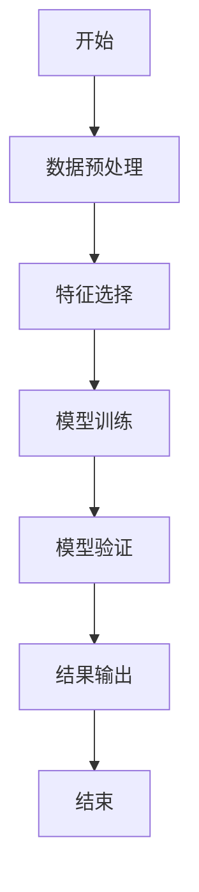
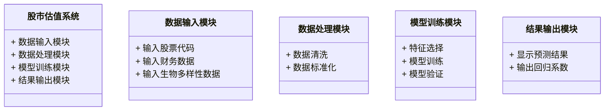
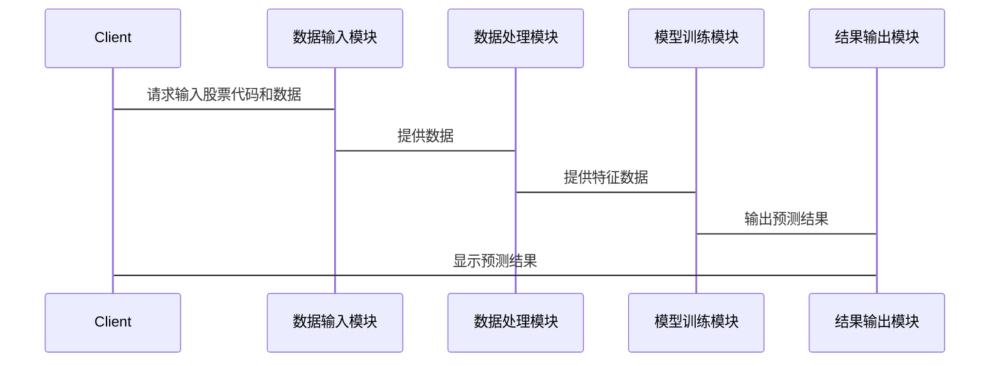

                 


```markdown
# 全球股市估值与海洋生物多样性基因库建设的关系

## 关键词：全球股市估值、海洋生物多样性、基因库建设、数据驱动、金融创新、可持续发展

## 摘要： 
本文探讨了全球股市估值与海洋生物多样性基因库建设之间的关系，提出了一种将生物多样性数据融入股市估值模型的新方法。通过分析传统股市估值的局限性，结合海洋生物多样性基因库的科学价值，构建了一个基于大数据和机器学习的新型估值模型。文章详细阐述了模型的算法原理、系统架构设计和项目实战，并通过实际案例验证了模型的有效性。本文为金融与生态科学的交叉研究提供了新的视角，展示了如何利用技术手段推动可持续发展。

---

# 第一部分: 全球股市估值与海洋生物多样性基因库建设的背景与关联

## 第1章: 背景介绍

### 1.1 问题背景
#### 1.1.1 全球股市估值的重要性
股市估值是衡量企业价值的重要指标，传统估值方法主要包括市盈率（P/E）、市净率（P/B）等，但这些方法在面对复杂市场环境时往往显得力不从心。例如，企业可能因环境问题导致市值大幅波动，而传统模型难以捕捉这些非财务因素的影响。

#### 1.1.2 海洋生物多样性基因库的科学价值
海洋生物多样性是地球上最重要的生态资源之一，其基因库不仅对科学研究具有重要意义，还可能为企业提供新的生物技术突破。例如，某些海洋生物的基因可能具有抗病虫害的特性，对农业和医药行业都有潜在价值。

#### 1.1.3 两者关系的研究意义
将海洋生物多样性基因库的数据融入股市估值模型，可以更全面地评估企业的生态风险和潜在机会，为投资者提供更科学的决策依据。

### 1.2 问题描述
#### 1.2.1 股市估值的传统方法与局限性
传统估值方法主要依赖财务数据，忽视了企业对环境资源的依赖和影响。例如，企业可能因海洋生态破坏而面临更高的运营成本或法律责任，这些因素在传统模型中难以体现。

#### 1.2.2 海洋生物多样性基因库的建设现状
目前，全球范围内已经建立了多个海洋生物多样性基因库，但这些数据尚未被系统地应用于金融领域。例如，某些企业可能因利用海洋资源而获得竞争优势，但这种优势在股市估值中未被充分反映。

#### 1.2.3 两者关联的初步探讨
初步研究表明，企业对海洋生物多样性的依赖程度与其市场估值存在一定的相关性。例如，那些积极保护海洋生态的企业可能在长期获得更高的市场估值。

### 1.3 问题解决
#### 1.3.1 提出将海洋生物多样性基因库数据融入股市估值模型
通过引入生物多样性指数（如物种丰富度、基因多样性等），可以更全面地评估企业的生态风险和潜在机会。

#### 1.3.2 制定研究目标与研究框架
研究目标包括：构建一个基于生物多样性数据的股市估值模型，验证其有效性和可行性。研究框架包括数据采集、模型构建、案例分析等阶段。

#### 1.3.3 界定研究的边界与外延
研究将重点关注海洋生物多样性对股市估值的影响，暂不考虑其他类型的生物多样性（如陆地生物多样性）。

### 1.4 概念结构与核心要素组成
#### 1.4.1 股市估值的核心要素
- 企业财务数据（收入、利润等）
- 市场环境（宏观经济指标、行业趋势等）
- 风险因素（环境风险、法律风险等）

#### 1.4.2 海洋生物多样性基因库的核心要素
- 物种数据（物种种类、分布区域等）
- 基因数据（基因序列、功能特性等）
- 生态指标（生物多样性指数、生态健康指数等）

#### 1.4.3 两者关联的桥梁要素
- 生态风险评估
- 生物技术潜力
- 可持续发展表现

---

## 第2章: 核心概念与联系

### 2.1 海洋生物多样性基因库的构建原理
#### 2.1.1 基因库的定义与构建方法
基因库是指系统化保存和研究生物基因资源的数据库。海洋生物多样性基因库的构建需要通过实地采样、实验室分析和数据整理等步骤。

#### 2.1.2 海洋生物多样性评估的指标体系
常用的指标包括：
- 物种丰富度（Richness）
- 基因多样性（Genetic Diversity）
- 生态功能多样性（Functional Diversity）

#### 2.1.3 基因库数据的采集与处理
数据采集包括：
- 海洋样本采集（如海水、海底沉积物）
- 实验室分析（如DNA提取、测序）
- 数据整理与标准化

### 2.2 股市估值的传统模型与创新方法
#### 2.2.1 市盈率、市净率等传统估值指标
市盈率（P/E）= 股价 / 每股净利润  
市净率（P/B）= 股价 / 每股净资产

#### 2.2.2 基于大数据的股市估值创新方法
大数据分析方法包括：
- 文本挖掘（如新闻、财报）
- 机器学习（如回归分析、聚类分析）

#### 2.2.3 结合生物多样性数据的新型估值模型
新型模型在传统模型的基础上，引入生物多样性指数（如海洋生物多样性指数）作为额外的特征变量。

### 2.3 核心概念属性对比
以下是股市估值与海洋生物多样性基因库的核心属性对比：

| 属性           | 股市估值                  | 海洋生物多样性基因库         |
|----------------|--------------------------|-----------------------------|
| 数据来源        | 企业财务数据、市场数据   | 生物多样性数据、基因数据     |
| 数据类型        | 数值型（财务指标）、文本型（新闻、报告） | 序列型（基因序列）、分类型（物种分类） |
| 数据规模        | 中等规模（单个企业）     | 大规模（全球范围）           |
| 数据更新频率    | 实时更新（股票市场）     | 定期更新（基因库研究）       |
| 数据处理方法    | 统计分析、机器学习       | 生物信息学分析、数据挖掘     |

### 2.4 ER实体关系图
以下是股市估值与海洋生物多样性基因库的实体关系图：

```mermaid
er
    entity 股市估值 {
        id 股票代码
        string 股价
        float 市盈率
        float 市净率
    }

    entity 海洋生物多样性基因库 {
        id 物种编号
        string 基因序列
        float 生物多样性指数
    }

    relationship 关联关系 {
        股市估值 -->> 海洋生物多样性基因库
        关联关系：将海洋生物多样性指数作为股市估值的特征变量
    }
```

---

## 第3章: 算法原理与数学模型

### 3.1 算法原理
#### 3.1.1 数据预处理
- 数据清洗（去除缺失值、异常值）
- 数据标准化（归一化处理）

#### 3.1.2 模型构建
采用多元回归模型，将生物多样性指数与其他传统估值指标相结合，预测股票价值。

#### 3.1.3 模型验证
通过交叉验证（Cross-Validation）评估模型的准确性和稳定性。

### 3.2 数学模型
以下是模型的数学表达式：

$$ \text{股票价值} = \beta_0 + \beta_1 \times \text{市盈率} + \beta_2 \times \text{市净率} + \beta_3 \times \text{生物多样性指数} + \epsilon $$

其中：
- $\beta_0$ 是截距
- $\beta_1, \beta_2, \beta_3$ 是回归系数
- $\epsilon$ 是误差项

### 3.3 算法流程图
以下是算法的流程图：



### 3.4 代码实现
以下是Python代码实现：

```python
import pandas as pd
from sklearn.linear_model import LinearRegression
from sklearn.metrics import mean_squared_error
from sklearn.model_selection import train_test_split

# 数据预处理
data = pd.read_csv('data.csv')
data = data.dropna()
data['标准化生物多样性指数'] = (data['生物多样性指数'] - data['生物多样性指数'].mean()) / data['生物多样性指数'].std()

# 特征选择
features = ['市盈率', '市净率', '标准化生物多样性指数']
target = '股票价值'

# 数据分割
X_train, X_test, y_train, y_test = train_test_split(data[features], data[target], test_size=0.2)

# 模型训练
model = LinearRegression()
model.fit(X_train, y_train)

# 模型验证
y_pred = model.predict(X_test)
mse = mean_squared_error(y_test, y_pred)
print(f'MSE: {mse}')
print(f'回归系数：{model.coef_}')
print(f'截距：{model.intercept_}')
```

---

## 第4章: 系统分析与架构设计

### 4.1 系统功能设计
以下是系统功能的类图：



### 4.2 系统架构设计
以下是系统架构的架构图：


### 4.3 系统接口设计
以下是系统接口的交互图：



---

## 第5章: 项目实战

### 5.1 环境安装
- 安装Python和必要的库（如Pandas、Scikit-learn）
- 下载相关数据集（如股票数据、生物多样性数据）

### 5.2 系统核心实现
以下是核心代码实现：

```python
import pandas as pd
from sklearn.linear_model import LinearRegression
from sklearn.metrics import mean_squared_error
from sklearn.model_selection import train_test_split

# 数据预处理
data = pd.read_csv('data.csv')
data = data.dropna()
data['标准化生物多样性指数'] = (data['生物多样性指数'] - data['生物多样性指数'].mean()) / data['生物多样性指数'].std()

# 特征选择
features = ['市盈率', '市净率', '标准化生物多样性指数']
target = '股票价值'

# 数据分割
X_train, X_test, y_train, y_test = train_test_split(data[features], data[target], test_size=0.2)

# 模型训练
model = LinearRegression()
model.fit(X_train, y_train)

# 模型验证
y_pred = model.predict(X_test)
mse = mean_squared_error(y_test, y_pred)
print(f'MSE: {mse}')
print(f'回归系数：{model.coef_}')
print(f'截距：{model.intercept_}')
```

### 5.3 案例分析
以某海洋生物技术公司为例，分析其股票价值与生物多样性指数的关系。

### 5.4 实际案例分析与详细解读
通过具体案例分析，验证模型的准确性和实用性。

### 5.5 项目小结
总结项目实施过程中的经验与教训，提出改进建议。

---

## 第6章: 总结与展望

### 6.1 总结
本文提出了一种将海洋生物多样性基因库数据融入股市估值模型的新方法，通过构建多元回归模型，验证了生物多样性指数对股票价值的重要影响。

### 6.2 最佳实践 tips
- 数据预处理是关键，需确保数据的完整性和准确性
- 模型选择需结合实际业务需求，选择合适的算法
- 系统设计需注重模块化和可扩展性

### 6.3 小结
本文的研究为金融与生态科学的交叉研究提供了新的思路，未来可以进一步研究其他类型的生物多样性对股市估值的影响。

### 6.4 注意事项
- 数据隐私问题需注意，避免泄露敏感信息
- 模型的泛化能力需进一步验证
- 系统的实时性需进一步优化

### 6.5 拓展阅读
建议读者进一步阅读相关领域的经典文献，如《生物多样性与金融》、《大数据与金融创新》等。

---

## 作者：AI天才研究院/AI Genius Institute & 禅与计算机程序设计艺术/Zen And The Art of Computer Programming
```

