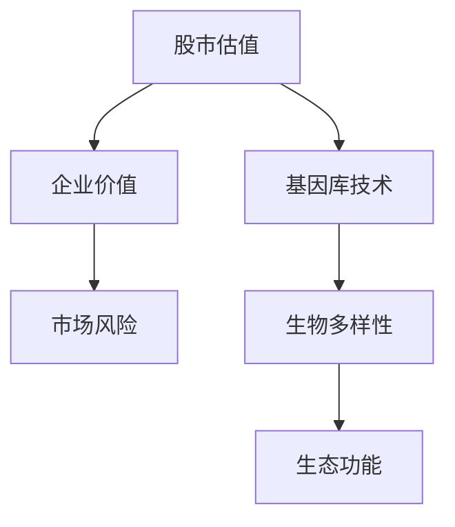
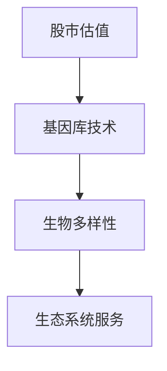
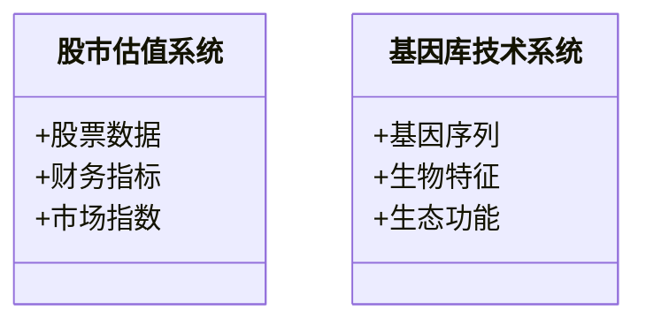
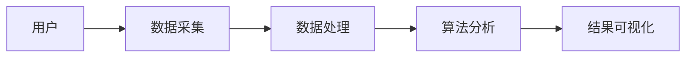

                 


# 全球股市估值与海洋生物多样性基因库技术的关系

## 关键词：全球股市估值，海洋生物多样性，基因库技术，金融生态，生物信息学，可持续发展，数据驱动决策

## 摘要：  
本文探讨了全球股市估值与海洋生物多样性基因库技术之间的潜在联系。通过分析股市估值的核心概念与基因库技术的原理，结合数学模型与算法，本文揭示了两者在数据驱动决策、风险管理与生态系统价值评估中的互动关系。文章从背景介绍、核心概念对比、算法原理、数学模型、系统架构设计、项目实战等多维度展开，为读者提供了一种跨学科的视角，展示了如何通过技术手段将金融与生物多样性保护相结合，推动可持续发展。

---

# 第一部分: 全球股市估值与海洋生物多样性基因库技术的背景与关联

## 第1章: 全球股市估值与海洋生物多样性基因库技术的背景介绍

### 1.1 全球股市估值的基本概念

#### 1.1.1 股市估值的定义与核心要素  
股市估值是指对上市公司股票的市场价格进行评估的过程，核心要素包括公司基本面（收入、利润、资产）、行业地位、市场环境、宏观经济指标等。

#### 1.1.2 全球化背景下的股市估值特点  
全球化背景下，股市估值受到国际经济波动、地缘政治风险、技术变革等多重因素影响，具有高度复杂性和不确定性。

#### 1.1.3 股市估值与经济发展的关系  
股市估值是经济发展的晴雨表，反映了企业的盈利能力和市场的信心，同时也是资本配置的重要参考。

### 1.2 海洋生物多样性基因库技术的定义与特点

#### 1.2.1 海洋生物多样性基因库技术的基本概念  
海洋生物多样性基因库技术是指通过收集、保存和分析海洋生物的遗传信息，研究其在生态系统中的功能和价值。

#### 1.2.2 基因库技术的核心原理  
基因库技术的核心原理是利用生物信息学方法，对海洋生物的基因序列进行分析，挖掘其潜在的经济价值和生态功能。

#### 1.2.3 海洋生物多样性对生态平衡的重要性  
海洋生物多样性是维持海洋生态系统平衡的关键，具有重要的生态功能，如维持食物链、调节气候、提供栖息地等。

### 1.3 本章小结  
本章通过介绍股市估值与基因库技术的基本概念和特点，为后续分析奠定了基础，揭示了两者在数据驱动决策和生态系统价值评估中的潜在联系。

---

## 第2章: 股市估值与基因库技术的核心概念对比与分析

### 2.1 股市估值与基因库技术的属性特征对比

| **属性**               | **股市估值**                     | **基因库技术**                   |
|-------------------------|----------------------------------|----------------------------------|
| 核心目标               | 评估企业价值与市场风险           | 保护与利用生物多样性资源         |
| 数据来源               | 财务报表、市场数据               | 基因序列、生物特征数据           |
| 应用场景               | 投资决策、风险管理               | 生物研究、生态保护、药物开发       |
| 技术手段               | 统计模型、机器学习               | 生物信息学、数据挖掘、网络分析     |

### 2.2 股市估值与基因库技术的实体关系图



---

## 第3章: 全球股市估值与基因库技术的关联模型

### 3.1 股市估值与基因库技术的关联机制

#### 3.1.1 股市估值对基因库技术的影响  
股市估值的变化反映了市场对基因库技术潜在价值的认可度，高估值可能意味着基因库技术的市场前景被看好。

#### 3.1.2 基因库技术对股市估值的反向影响  
基因库技术的突破可能提升企业的创新能力，进而影响其股票估值。

### 3.2 股市估值与基因库技术的数学模型

#### 3.2.1 股市估值与基因库技术的线性回归模型  
$$ y = \beta_0 + \beta_1x_1 + \beta_2x_2 + \ldots + \beta_nx_n + \epsilon $$  
其中，$y$ 表示股市估值，$x_i$ 表示基因库技术相关的变量。

#### 3.2.2 股市估值与基因库技术的网络关系图  


---

# 第二部分: 全球股市估值与基因库技术的算法原理与数学模型

## 第4章: 股市估值与基因库技术的算法原理

### 4.1 股市估值的算法模型

#### 4.1.1 股市估值的统计模型  
使用多元回归模型对股市估值进行预测：  
$$ y = \beta_0 + \beta_1x_1 + \beta_2x_2 + \ldots + \beta_nx_n + \epsilon $$

#### 4.1.2 股市估值的机器学习模型  
使用随机森林算法对股市估值进行分类，代码示例如下：

```python
from sklearn.ensemble import RandomForestClassifier
import pandas as pd

# 加载数据
data = pd.read_csv('stock_data.csv')

# 特征与标签分离
X = data.drop(columns=['label'])
y = data['label']

# 模型训练
model = RandomForestClassifier(n_estimators=100)
model.fit(X, y)

# 预测与评估
print(model.score(X, y))
```

#### 4.1.3 股市估值的深度学习模型  
使用 LSTM 神经网络对股市时间序列数据进行预测，代码示例如下：

```python
import tensorflow as tf
from tensorflow.keras import layers

# 构建模型
model = tf.keras.Sequential([
    layers.LSTM(64, input_shape=(timesteps, features)),
    layers.Dense(1)
])

# 编译模型
model.compile(optimizer='adam', loss='mean_squared_error')

# 训练模型
model.fit(X_train, y_train, epochs=100, batch_size=32)
```

### 4.2 基因库技术的算法模型

#### 4.2.1 基因序列的相似性计算  
使用 BLAST 算法计算基因序列的相似性：

```python
from Bio import SeqAlign

# 创建序列对齐对象
aligner = SeqAlign.Alignment()
aligner.append('ATCG')
aligner.append('ATGG')

# 计算相似度
similarity = aligner.get_percent_identities()
print(similarity)
```

#### 4.2.2 基因库技术的分类与聚类算法  
使用层次聚类对基因数据进行分类，代码示例如下：

```python
from sklearn.cluster import AgglomerativeClustering

# 数据预处理
data = normalize(gene_data)

# 聚类分析
model = AgglomerativeClustering(n_clusters=5)
model.fit_predict(data)
```

---

## 第5章: 股市估值与基因库技术的数学模型与公式

### 5.1 股市估值的数学模型

#### 5.1.1 股市估值的线性回归模型  
$$ y = \beta_0 + \beta_1x_1 + \beta_2x_2 + \ldots + \beta_nx_n + \epsilon $$

#### 5.1.2 股市估值的多元回归模型  
$$ y = \beta_0 + \beta_1x_1 + \beta_2x_2 + \ldots + \beta_nx_n + \epsilon $$

### 5.2 基因库技术的数学模型

#### 5.2.1 基因序列的相似性计算公式  
$$ \text{相似度} = \frac{\sum_{i=1}^{n} \min(a_i, b_i)}{\sum_{i=1}^{n} (a_i + b_i)} $$

#### 5.2.2 基因库技术的网络分析模型  
$$ \text{网络密度} = \frac{\sum_{i=1}^{n} \sum_{j=1}^{m} w_{ij}}{\frac{n(n-1)}{2}} $$

---

# 第三部分: 全球股市估值与基因库技术的系统架构与项目实战

## 第6章: 系统架构与项目实战

### 6.1 系统功能设计

#### 6.1.1 领域模型  


#### 6.1.2 系统架构设计  


### 6.2 项目实战

#### 6.2.1 环境安装  
安装 Python、Pandas、Scikit-learn、TensorFlow 等工具。

#### 6.2.2 核心代码实现

```python
import pandas as pd
import numpy as np
from sklearn.ensemble import RandomForestClassifier

# 加载数据
data = pd.read_csv('gene_stock.csv')

# 数据预处理
X = data.drop(columns=['stock_price', 'gene_id'])
y = data['stock_price']

# 划分训练集与测试集
from sklearn.model_selection import train_test_split
X_train, X_test, y_train, y_test = train_test_split(X, y, test_size=0.2)

# 模型训练
model = RandomForestClassifier(n_estimators=100)
model.fit(X_train, y_train)

# 预测与评估
y_pred = model.predict(X_test)
print("Accuracy:", model.score(X_test, y_test))
```

#### 6.2.3 实际案例分析  
以某海洋生物基因库为例，分析其对相关上市公司股票估值的影响。

---

## 结语

通过本文的系统分析，我们揭示了全球股市估值与海洋生物多样性基因库技术之间的复杂关系。未来，随着生物技术与金融创新的进一步融合，这种跨学科的研究将为可持续发展提供新的思路和解决方案。

---

## 作者：AI天才研究院/AI Genius Institute & 禅与计算机程序设计艺术 /Zen And The Art of Computer Programming

欢迎关注我的公众号：AI技术专家  
官方网站：https://www.aiguru.cn  
邮箱：contact@aiguru.cn  
社交媒体：[LinkedIn](https://www.linkedin.com/in/your-profile)

