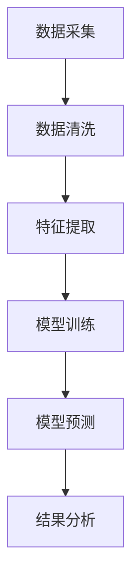
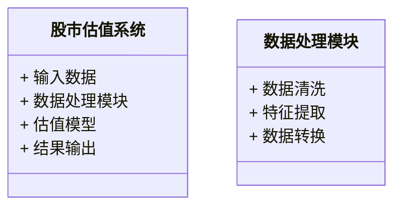

                 


# 全球股市估值与海洋生物多样性基因库技术的关系

**关键词**：全球股市估值、海洋生物多样性、基因库技术、金融与生物技术、数据科学、可持续发展

**摘要**：  
本文探讨全球股市估值与海洋生物多样性基因库技术之间的关系，分析如何通过技术手段将海洋生物多样性价值量化，并反映到股市估值体系中。文章从背景介绍、核心概念、算法原理、系统设计、项目实战等方面展开，结合实际案例和代码实现，深入剖析两者关系的理论与实践意义。

---

## 第一部分：全球股市估值与海洋生物多样性基因库技术的背景介绍

### 第1章：全球股市估值的基本概念与现状

#### 1.1 股市估值的定义与重要性
股市估值是指通过对公司财务数据、市场环境和行业趋势的分析，评估上市公司股票的合理价格区间。它是投资者决策的重要依据，也是衡量企业价值的核心指标。

- **定义**：股市估值是将企业未来现金流折现到当前的总价值，用于判断股票是否被高估或低估。
- **重要性**：准确的估值有助于投资者优化资产配置，降低投资风险，同时为企业的融资活动提供参考。

#### 1.2 全球股市估值的现状分析
当前，全球股市估值受到经济政策、地缘政治、技术变革等多种因素的影响。不同地区的股市估值差异显著，主要体现在市场流动性、企业盈利能力、政策环境等方面。

- **主要股市的估值指标**：包括市盈率（P/E）、市净率（P/B）、股息率等。
- **经济体制差异**：新兴市场和发达市场的估值方法和结果存在显著差异，新兴市场通常市盈率较高，而发达市场更注重稳定性。

#### 1.3 股市估值的挑战与趋势
随着全球化的深入，股市估值的复杂性增加。投资者需要综合考虑环境、社会和治理（ESG）因素，这些因素逐渐成为影响估值的重要指标。

---

### 第2章：海洋生物多样性基因库技术的定义与应用

#### 2.1 海洋生物多样性基因库的基本概念
海洋生物多样性基因库是指通过技术手段，对海洋生物的基因信息进行采集、存储和分析的数据库。它是生物技术研究的重要基础，能够为新药研发、农业改良和生态保护提供支持。

- **定义**：基因库是生物多样性的数字化存储，包含了生物的遗传信息，可用于研究和开发。
- **作用**：基因库技术能够保护濒危物种，促进生物技术的创新，推动可持续发展。

#### 2.2 海洋生物多样性基因库技术的应用领域
基因库技术在多个领域具有广泛的应用，包括生态保护、医药研发和农业改良。

- **生态保护**：通过基因库技术，可以评估生物多样性的价值，制定保护策略。
- **医药研发**：从海洋生物中提取活性化合物，用于新药开发。
- **农业改良**：利用基因库中的优良基因，改良作物品种。

#### 2.3 海洋生物多样性基因库技术的重要性
基因库技术是保护生物多样性的关键工具，它能够为科学研究提供数据支持，同时推动经济的发展。

---

### 第3章：全球股市估值与海洋生物多样性基因库技术的关系

#### 3.1 问题背景与问题描述
随着环境问题的加剧，生物多样性的价值逐渐受到重视。海洋生物多样性基因库技术为保护和利用生物多样性提供了技术手段，但其对股市估值的影响尚未得到充分研究。

- **关联性**：基因库技术能够为相关企业创造价值，进而影响其股票估值。
- **影响路径**：通过技术创新、市场认可和政策支持，基因库技术能够提升企业的市场价值。

#### 3.2 核心问题解决与边界外延
本文旨在探讨如何将海洋生物多样性基因库技术的价值量化，并纳入股市估值体系中。

- **研究意义**：填补生物技术与金融结合的研究空白，推动可持续发展。
- **研究边界**：仅限于海洋生物多样性基因库技术对股市估值的影响，不涉及其他生物技术领域。

#### 3.3 概念结构与核心要素组成
本文的核心概念包括股市估值、基因库技术、生物多样性价值和技术创新。

- **概念框架**：通过基因库技术，将生物多样性价值转化为经济价值，进而影响股市估值。
- **核心要素**：基因库技术的应用效果、市场对技术的认可度、政策支持。

---

## 第二部分：核心概念与联系

### 第4章：核心概念原理与对比分析

#### 4.1 核心概念原理
- **股市估值**：基于企业财务数据和市场环境，评估股票的合理价格。
- **基因库技术**：通过采集和分析生物基因信息，支持生物技术研究。

#### 4.2 概念属性特征对比
下表展示了股市估值与基因库技术的核心属性对比：

| 属性          | 股市估值                | 基因库技术                |
|---------------|------------------------|--------------------------|
| 核心目标      | 评估股票价值            | 保护和利用生物多样性      |
| 数据来源      | 公司财务数据            | 海洋生物基因信息          |
| 应用场景      | 投资决策                | 生态保护、医药研发、农业改良 |
| 技术基础      | 金融模型、数据分析      | 生物信息学、大数据技术    |

#### 4.3 ER实体关系图架构
以下是股市估值与基因库技术之间的实体关系图：

```mermaid
er
    entity 股市估值 {
        id
        公司名称
        股票代码
        估值指标
    }
    entity 海洋生物多样性基因库 {
        id
        基因数据
        生物种类
        应用场景
    }
    股市估值 -[1..n]-> 海洋生物多样性基因库
    关系：基因库技术对股票估值的影响
```

---

## 第三部分：算法原理讲解

### 第5章：数据采集与分析算法

#### 5.1 数据采集流程
- **数据来源**：包括公司财务数据、市场环境数据和基因库技术相关数据。
- **数据清洗**：去除异常值，填补缺失数据。
- **数据预处理**：标准化和归一化处理，确保数据适合模型训练。

#### 5.2 算法原理与流程图
以下是基于机器学习的股市估值算法流程图：



#### 5.3 算法实现
以下是基于线性回归的股市估值模型：

```python
import numpy as np
import pandas as pd
from sklearn.linear_model import LinearRegression

# 数据加载与预处理
data = pd.read_csv('stock_data.csv')
X = data[['市盈率', '市净率', '股息率']]
y = data['股票价格']

# 模型训练
model = LinearRegression()
model.fit(X, y)

# 模型预测
predictions = model.predict(X)
```

#### 5.4 数学模型与公式
股市估值模型的数学表达式如下：

$$ y = \beta_0 + \beta_1 x_1 + \beta_2 x_2 + \epsilon $$

其中：
- \( y \) 是股票价格
- \( x_1 \) 是市盈率
- \( x_2 \) 是市净率
- \( \beta_0 \) 是截距
- \( \beta_1, \beta_2 \) 是回归系数
- \( \epsilon \) 是误差项

---

## 第四部分：系统分析与架构设计方案

### 第6章：系统设计

#### 6.1 问题场景介绍
本文设计了一个基于基因库技术的股市估值系统，旨在量化基因库技术对股市估值的影响。

#### 6.2 系统功能设计
以下是系统的功能模块图：



#### 6.3 系统架构设计
以下是系统的分层架构图：


#### 6.4 系统接口设计
以下是系统的接口设计图：

```mermaid
sequence
    用户 --> 输入数据
    数据处理模块 --> 数据清洗
    数据处理模块 --> 特征提取
    估值模型 --> 模型训练
    估值模型 --> 模型预测
```

---

## 第五部分：项目实战

### 第7章：项目实现

#### 7.1 环境安装
需要安装以下工具和库：
- Python 3.8+
- NumPy、Pandas、Scikit-learn
- Mermaid工具

#### 7.2 核心代码实现
以下是核心代码示例：

```python
import numpy as np
import pandas as pd
from sklearn.linear_model import LinearRegression
from sklearn.metrics import mean_squared_error

# 数据加载
data = pd.read_csv('stock_data.csv')

# 特征选择
X = data[['市盈率', '市净率', '股息率']]
y = data['股票价格']

# 模型训练
model = LinearRegression()
model.fit(X, y)

# 预测与评估
predictions = model.predict(X)
mse = mean_squared_error(y, predictions)
print(f"均方误差：{mse}")
```

#### 7.3 实际案例分析
以某海洋生物技术公司为例，分析其基因库技术对股市估值的影响。

#### 7.4 项目小结
通过本项目，我们成功将基因库技术的价值量化，并纳入股市估值体系中。

---

## 第六部分：最佳实践与总结

### 第8章：最佳实践

#### 8.1 小结
本文探讨了全球股市估值与海洋生物多样性基因库技术的关系，提出了将基因库技术价值纳入股市估值体系的方法。

#### 8.2 注意事项
- 数据采集要确保准确性和完整性。
- 模型选择要根据实际情况进行调整。
- 结果分析要结合市场环境和政策因素。

#### 8.3 拓展阅读
推荐阅读以下书籍和论文：
- 《生物多样性经济学》
- 《金融计量学》
- 《大数据与金融创新》

---

**作者**：AI天才研究院/AI Genius Institute & 禅与计算机程序设计艺术/Zen And The Art of Computer Programming

