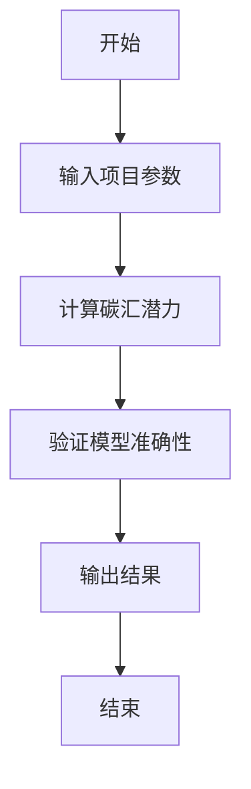

                 


# 全球股市估值与海洋碳汇技术的关系

> 关键词：全球股市估值、海洋碳汇技术、经济影响、投资策略、气候变化、可持续发展

> 摘要：本文探讨了全球股市估值与海洋碳汇技术之间的关系，分析了海洋碳汇技术的原理及其对经济和股市的影响，提出了基于碳汇技术的投资策略，并展望了未来的研究方向。

---

# 第一部分: 全球股市估值与海洋碳汇技术的背景与关系概述

## 第1章: 全球股市估值与海洋碳汇技术的背景介绍

### 1.1 全球股市估值的基本概念

#### 1.1.1 股市估值的定义与重要性
股市估值是衡量企业或股票市场整体价值的重要指标，通常通过市盈率（P/E）、市净率（P/B）等指标来评估。股市估值反映了市场的整体健康状况和投资者对经济前景的预期。

#### 1.1.2 全球股市的现状与发展趋势
全球股市近年来呈现出波动性增强的趋势，特别是在气候变化、地缘政治和经济政策变化的影响下，股市估值受到更多不确定性因素的挑战。

#### 1.1.3 股市估值的核心指标与方法
股市估值的核心指标包括市盈率、市净率、股息率等，常用的方法包括基本面分析、技术分析和量化分析。

### 1.2 海洋碳汇技术的定义与特点

#### 1.2.1 海洋碳汇的基本概念
海洋碳汇是指海洋生态系统（如海草、红树林、珊瑚礁等）通过光合作用吸收并储存二氧化碳的过程。海洋碳汇技术则是通过人工干预和技术创新，增强海洋生态系统的碳捕获能力。

#### 1.2.2 海洋碳汇技术的分类与应用场景
海洋碳汇技术主要包括海洋植被恢复、海洋碱化、深海碳储存等技术。这些技术在应对气候变化、减少碳排放方面具有重要作用。

#### 1.2.3 海洋碳汇技术的生态与经济价值
海洋碳汇技术不仅有助于减缓气候变化，还能促进海洋生态系统的恢复，同时为相关产业（如渔业、旅游业）带来经济价值。

### 1.3 全球股市估值与海洋碳汇技术的关系

#### 1.3.1 问题背景与研究意义
随着全球气候变化的加剧，海洋碳汇技术成为应对气候变化的重要手段。与此同时，股市估值受多种因素影响，包括政策变化、技术创新等。研究两者的关系有助于更好地理解气候变化对经济的影响。

#### 1.3.2 问题描述与研究目标
本文旨在探讨海洋碳汇技术对全球股市估值的影响，分析碳汇项目如何通过改变企业盈利能力和市场预期，进而影响股市估值。

#### 1.3.3 问题解决的路径与方法
通过构建数学模型，分析海洋碳汇技术对企业的财务指标（如收入、成本）的影响，进而评估其对股市估值的潜在影响。

#### 1.3.4 研究的边界与外延
本文主要关注海洋碳汇技术对股市估值的直接影响，不涉及其他因素（如货币政策、地缘政治）的影响。

#### 1.3.5 核心概念与组成要素
核心概念包括股市估值、海洋碳汇技术、气候变化、企业盈利能力和市场预期。

---

## 第2章: 海洋碳汇技术的核心原理与系统架构

### 2.1 海洋碳汇技术的核心原理

#### 2.1.1 碳汇的基本原理
碳汇的核心原理是通过光合作用将二氧化碳转化为有机物，进而将其固定在海洋生态系统中。海洋碳汇技术通过人工干预增强这一过程。

#### 2.1.2 海洋碳汇的生物与物理机制
海洋碳汇的生物机制包括浮游植物的光合作用、海洋植被的生长等；物理机制包括海水的溶解度、海洋环流等。

#### 2.1.3 海洋碳汇技术的关键环节
关键环节包括碳的捕获、储存和监测。通过技术创新，可以提高碳捕获效率和监测精度。

### 2.2 海洋碳汇技术的系统架构

#### 2.2.1 系统功能模块划分
海洋碳汇技术系统包括碳捕获模块、数据采集模块、数据分析模块和决策支持模块。

#### 2.2.2 系统输入与输出分析
输入包括海洋环境数据、碳汇项目参数；输出包括碳汇潜力评估、经济效益分析。

#### 2.2.3 系统架构的ER实体关系图
```mermaid
erd
    MarineCarbonSink
    ----> Project: 承载碳汇项目
    MarineCarbonSink
    ----> Technology: 采用的技术手段
    MarineCarbonSink
    ----> Location: 实施的地理位置
```

### 2.3 海洋碳汇技术的算法原理

#### 2.3.1 碳汇量计算的算法流程


#### 2.3.2 碳汇潜力计算的数学模型
$$碳汇潜力 = \sum_{i=1}^{n} (A_i \times B_i)$$
其中，$A_i$ 是第 $i$ 项技术的潜力系数，$B_i$ 是第 $i$ 项技术的实施面积。

---

## 第3章: 全球股市估值与海洋碳汇技术的经济影响分析

### 3.1 全球股市估值的经济影响因素

#### 3.1.1 宏观经济指标对股市的影响
GDP增长率、通货膨胀率等宏观经济指标直接影响股市估值。

#### 3.1.2 行业政策对股市估值的影响
政府政策（如碳税、补贴）和行业监管政策对股市估值有显著影响。

#### 3.1.3 技术创新对股市估值的推动作用
技术创新（如海洋碳汇技术）通过提高企业竞争力和利润率，间接推动股市估值。

### 3.2 海洋碳汇技术对经济的影响

#### 3.2.1 对企业盈利的影响
海洋碳汇技术可以降低企业的碳排放成本，提高企业的利润率。

#### 3.2.2 对市场预期的影响
通过提高市场对碳汇技术的认知，增强投资者对相关企业的信心，从而提升股市估值。

#### 3.2.3 对行业竞争力的影响
掌握海洋碳汇技术的企业在行业内更具竞争力，从而在股市中获得更高的估值。

---

## 第4章: 基于海洋碳汇技术的股市估值模型构建

### 4.1 股市估值模型的构建思路

#### 4.1.1 数据收集
收集相关企业的财务数据、碳汇技术应用数据和股市历史数据。

#### 4.1.2 模型假设
假设碳汇技术的应用可以显著降低企业的碳排放成本，从而提高企业的净利润率。

#### 4.1.3 模型构建
使用多元回归模型，将碳汇技术的影响因素（如碳汇潜力、技术成熟度）纳入模型，预测股市估值的变化。

### 4.2 股市估值模型的数学表达

$$股市估值 = \beta_0 + \beta_1 \times 碳汇潜力 + \beta_2 \times 技术成熟度 + \epsilon$$

其中，$\beta_0$ 是截距，$\beta_1$ 和 $\beta_2$ 是回归系数，$\epsilon$ 是误差项。

---

## 第5章: 海洋碳汇技术与股市投资策略

### 5.1 投资策略的制定

#### 5.1.1 碳汇技术驱动的投资机会
投资于掌握海洋碳汇技术的企业，预期这些企业在碳中和目标下具有更大的增长潜力。

#### 5.1.2 风险评估与管理
评估碳汇技术的风险，包括技术失败风险、政策变化风险等。

### 5.2 投资策略的实施

#### 5.2.1 个股选择
选择在海洋碳汇技术领域具有领先优势的企业进行投资。

#### 5.2.2 组合优化
通过优化投资组合，分散风险，提高收益。

### 5.3 投资策略的案例分析

#### 5.3.1 案例背景
某企业通过投资海洋碳汇技术，显著降低了碳排放成本，提高了利润率。

#### 5.3.2 投资效果
该企业在股市中的估值显著提升，吸引了更多投资者的关注。

---

## 第6章: 总结与展望

### 6.1 研究总结

#### 6.1.1 核心结论
海洋碳汇技术对全球股市估值具有重要影响，通过降低碳排放成本和提高企业竞争力，显著提升股市估值。

#### 6.1.2 研究不足
本文主要分析了海洋碳汇技术对股市估值的直接影响，未考虑其他因素（如货币政策、地缘政治）的影响。

### 6.2 未来研究方向

#### 6.2.1 多因素模型的构建
研究更多因素（如政策、技术）对股市估值的综合影响。

#### 6.2.2 碳汇技术的区域差异
分析不同地区碳汇技术的应用及其对股市估值的影响差异。

#### 6.2.3 技术创新与股市估值的关系
研究技术创新如何通过改变企业竞争力和利润率，影响股市估值。

---

# 作者：AI天才研究院/AI Genius Institute & 禅与计算机程序设计艺术 /Zen And The Art of Computer Programming

---

这篇博客文章系统地分析了全球股市估值与海洋碳汇技术之间的关系，从理论到实践，从背景到案例，全面探讨了这一主题。通过构建数学模型和案例分析，文章为投资者提供了基于碳汇技术的投资策略，并展望了未来的研究方向。

