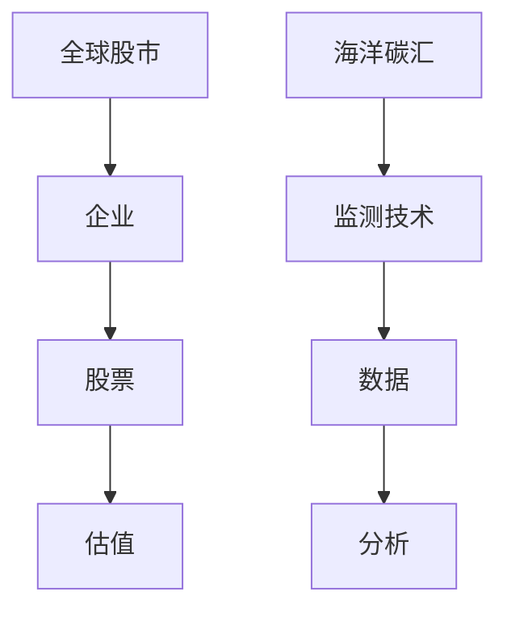
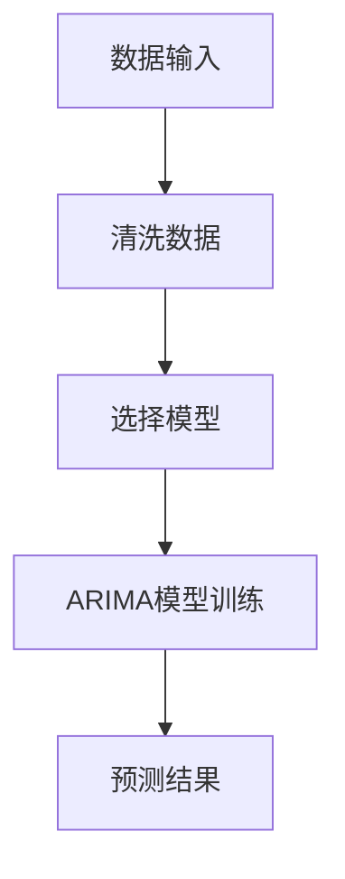
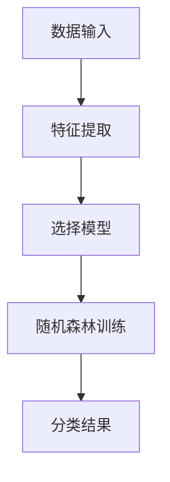

                 


# 全球股市估值与海洋碳汇监测技术的关系

## 关键词：全球股市估值，海洋碳汇，监测技术，时间序列分析，机器学习，气候变化

## 摘要：  
本文探讨了全球股市估值与海洋碳汇监测技术之间的关系，通过分析两者的核心概念、算法原理和系统架构，揭示了气候变化对全球经济和生态系统的影响。文章结合时间序列分析和机器学习技术，提出了一种新的监测与估值方法，为投资者和环保机构提供了科学依据。

---

## 第一部分：背景介绍

### 第1章：全球股市估值与海洋碳汇监测的背景

#### 1.1 全球股市估值的基本概念

- **股市估值的定义与意义**  
  股市估值是指通过对企业的财务数据、市场环境和行业趋势进行分析，估算其股票的合理价格。常用指标包括市盈率（P/E）、市净率（P/B）和股息率等。股市估值是投资者评估投资价值的重要工具。

- **股市估值的主要方法**  
  1. **相对估值法**：通过比较可比公司的估值指标来确定目标公司的价值。  
  2. **绝对估值法**：基于企业未来现金流的折现值来评估公司价值。  
  3. **技术分析法**：通过股价走势、成交量等技术指标预测市场趋势。

- **全球化背景下的股市特点**  
  全球化使得股市更加互联互通，但同时也放大了系统性风险。气候变化、地缘政治和经济政策等宏观因素对股市的影响日益显著。

#### 1.2 海洋碳汇监测技术的定义与作用

- **海洋碳汇的概念**  
  海洋碳汇是指海洋生物通过光合作用吸收二氧化碳的过程。海洋碳汇是全球碳循环的重要组成部分，对调节气候具有重要作用。

- **碳汇监测技术的核心要素**  
  1. **数据采集**：利用卫星遥感、传感器和实地测量获取海洋环境数据，如水温、盐度、溶解氧和叶绿素含量等。  
  2. **数据处理**：通过数据分析和建模技术，估算海洋碳汇的储量和变化趋势。  
  3. **技术实现**：结合GIS（地理信息系统）和大数据技术，构建海洋碳汇监测平台。

- **海洋碳汇在环境保护中的作用**  
  海洋碳汇是减缓气候变化的重要手段。通过监测海洋碳汇，可以评估海洋生态系统的健康状况，制定保护和恢复计划。

#### 1.3 两者的关联性分析

- **气候变化对股市的影响**  
  气候变化导致极端天气事件频发，对农业、能源和保险等行业产生重大影响，进而影响股市表现。例如，干旱可能导致农作物减产，推高粮食价格，引发通货膨胀。

- **碳汇项目与金融投资的关系**  
  碳汇项目（如海洋碳汇）可以通过碳交易市场产生经济价值。投资者可以将碳汇项目作为投资标的，通过碳信用交易获利。碳汇项目的价值与市场对碳排放的定价密切相关。

- **全球经济与海洋生态的互动**  
  海洋经济是全球经济增长的重要组成部分，包括渔业、航运和能源开发等领域。海洋生态系统的健康状况直接影响这些行业的可持续发展，进而影响全球经济。

---

## 第二部分：核心概念与联系

### 第2章：全球股市估值与海洋碳汇监测的核心概念

#### 2.1 核心概念的原理分析

- **股市估值的数学模型**  
  股市估值可以基于财务指标和市场情绪构建模型。例如，使用多元回归模型预测股票价格：  
  $$ P = \beta_0 + \beta_1 E + \beta_2 M + \epsilon $$  
  其中，$P$ 是股票价格，$E$ 是企业盈利，$M$ 是市场情绪指数，$\epsilon$ 是误差项。

- **碳汇监测技术的核心原理**  
  碳汇监测技术通过数据采集和建模，估算海洋碳汇的储量和变化趋势。例如，使用机器学习模型预测海洋碳汇的变化：  
  $$ C(t) = \alpha X(t) + \beta Y(t-1) + \gamma $$  
  其中，$C(t)$ 是碳汇量，$X(t)$ 和 $Y(t-1)$ 是输入变量，$\gamma$ 是常数项。

#### 2.2 核心概念的属性特征对比

| 属性 | 股市估值 | 海洋碳汇监测 |
|------|---------|-------------|
| 数据类型 | 数值型（股票价格、财务指标） | 数值型（水温、溶解氧、叶绿素） |
| 数据频率 | 高频（每日、每周） | 低频（每月、每季度） |
| 数据来源 | 金融市场数据、公司财报 | 卫星遥感、传感器 |
| 数据波动性 | 高 | 中 |

#### 2.3 ER实体关系图架构



---

## 第三部分：算法原理讲解

### 第3章：相关算法原理

#### 3.1 时间序列分析在股市估值中的应用



- **时间序列分析的核心步骤**  
  1. 数据清洗：去除异常值和缺失值。  
  2. 模型选择：根据数据特征选择合适的时间序列模型，如ARIMA或GARCH。  
  3. 模型训练：基于历史数据训练模型。  
  4. 预测与评估：生成预测结果并评估模型性能。

#### 3.2 机器学习模型在碳汇监测中的应用



- **机器学习模型的核心步骤**  
  1. 特征提取：从原始数据中提取有用特征，如水温、溶解氧和叶绿素含量。  
  2. 模型选择：选择适合的机器学习算法，如随机森林或XGBoost。  
  3. 模型训练：基于训练数据训练模型。  
  4. 分类与回归：生成分类或回归结果，评估模型性能。

---

## 第四部分：数学模型

### 第4章：数学模型

#### 4.1 时间序列分析模型

- **ARIMA模型**  
  ARIMA（自回归积分滑动平均模型）用于预测时间序列数据。模型公式：  
  $$ ARIMA(p, d, q) $$  
  其中，$p$ 是自回归阶数，$d$ 是差分阶数，$q$ 是滑动平均阶数。

#### 4.2 机器学习模型

- **随机森林回归**  
  随机森林是一种基于决策树的集成学习算法，适用于回归和分类任务。模型公式：  
  $$ y = \sum_{i=1}^{n} \theta_i h_i(x) $$  
  其中，$\theta_i$ 是权重，$h_i(x)$ 是决策树模型。

---

## 第五部分：系统分析与架构设计

### 第5章：系统分析与架构设计

#### 5.1 系统功能设计

- **领域模型设计**  
  使用Mermaid类图描述系统功能模块：  
  ```mermaid
  classDiagram
      class 股市估值系统 {
          输入：股票数据
          输出：估值结果
      }
      class 碳汇监测系统 {
          输入：环境数据
          输出：监测结果
      }
      股市估值系统 --> 碳汇监测系统
  ```

---

## 第六部分：项目实战

### 第6章：项目实战

#### 6.1 环境安装

- **Python环境安装**  
  使用Anaconda安装Python和相关库：  
  ```bash
  conda create -n stock_and_carbon python=3.8
  conda activate stock_and_carbon
  pip install numpy pandas scikit-learn matplotlib
  ```

#### 6.2 系统核心实现

- **股票数据预处理代码**  
  ```python
  import pandas as pd
  import numpy as np

  # 读取数据
  df = pd.read_csv('stock_data.csv')

  # 数据清洗
  df = df.dropna()
  df = df[~df['volume'].isin([0])]

  # 计算移动平均线
  df['MA5'] = df['close'].rolling(5).mean()
  ```

- **碳汇监测模型实现代码**  
  ```python
  from sklearn.ensemble import RandomForestRegressor

  # 特征提取
  features = ['temp', 'salinity', 'chlorophyll']
  target = 'carbon_sink'

  X = df[features]
  y = df[target]

  # 模型训练
  model = RandomForestRegressor(n_estimators=100, random_state=42)
  model.fit(X, y)

  # 预测结果
  predictions = model.predict(X)
  ```

---

## 第七部分：总结与展望

### 第7章：总结与展望

#### 7.1 总结

- 本文探讨了全球股市估值与海洋碳汇监测技术的关系，分析了两者的核心概念和算法原理。通过时间序列分析和机器学习技术，提出了新的监测与估值方法。

#### 7.2 最佳实践 tips

- 在进行股市估值时，应结合宏观经济指标和行业趋势，避免仅依赖技术分析。  
- 在进行碳汇监测时，应选择合适的传感器和建模方法，确保数据的准确性和模型的鲁棒性。  

#### 7.3 未来研究方向

- 研究气候变化对股市的长期影响。  
- 开发更高效的碳汇监测技术，如人工智能和深度学习。  

---

## 附录

### 附录A：数据来源

- 股票数据：Yahoo Finance  
- 碳汇数据：Copernicus Marine Service

### 附录B：工具安装指南

- Python安装：使用Anaconda安装Python和相关库。  
- 工具配置：配置Jupyter Notebook和数据库连接。

### 附录C：参考文献

- 国际金融协会（IIF）报告  
- 联合国环境规划署（UNEP）报告  

---

## 作者：AI天才研究院 & 禅与计算机程序设计艺术

---

希望这篇文章能为您提供有价值的信息和启发！

