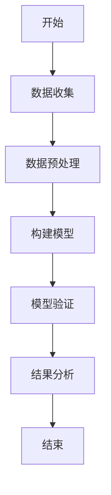
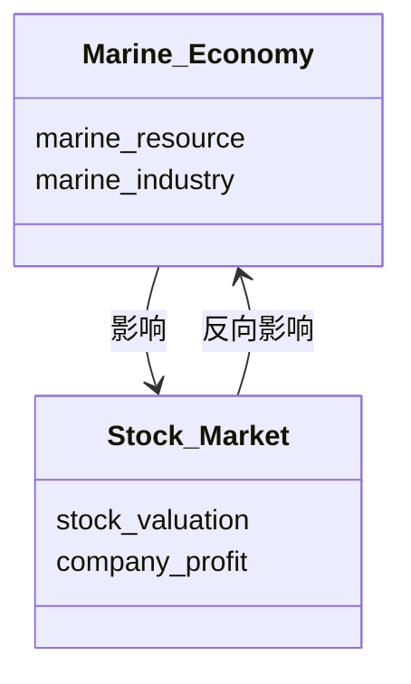

                 


# 全球股市估值与海洋经济开发的关系

> 关键词：全球股市估值，海洋经济开发，经济关系，股票市场分析，海洋资源开发

> 摘要：本文探讨了全球股市估值与海洋经济开发之间的复杂关系，分析了海洋经济对股市估值的影响，以及股市估值如何反作用于海洋经济的开发。通过构建数学模型和系统架构，本文揭示了两者之间的互动机制，并通过实际案例分析展示了这种关系的应用。

---

## 第1章：全球股市估值概述

### 1.1 全球股市估值的基本概念

#### 1.1.1 股市估值的定义与作用

股市估值是通过对股票价格、市盈率（P/E）、市净率（P/B）等指标的分析，评估市场的整体价值和未来趋势。股市估值为投资者提供了决策依据，同时反映了宏观经济的健康状况。

#### 1.1.2 全球主要股市的现状与特点

全球主要股市包括纽约证券交易所、纳斯达克、伦敦金融时报指数、东京证券交易所等。不同市场的估值指标受到当地经济、政策和国际环境的影响，呈现出不同的波动性和特点。

#### 1.1.3 股市估值的影响因素

股市估值受宏观经济指标（GDP、通胀）、企业盈利、政策变化、投资者情绪等多种因素影响。其中，宏观经济指标和企业盈利是主要驱动力。

### 1.2 股市估值的核心指标

#### 1.2.1 市盈率（P/E）的计算与意义

市盈率 = 股价 / 每股净利润。低市盈率可能意味着低估，高市盈率可能意味着高增长预期。

#### 1.2.2 市净率（P/B）的应用

市净率 = 股价 / 每股净资产。用于评估股票相对于其账面价值的高低，常用于银行和房地产等行业的估值。

#### 1.2.3 市销率（P/S）的分析

市销率 = 股价 / 每股收入。适用于亏损企业，评估企业收入的市场倍数。

### 1.3 全球股市估值的区域差异

#### 1.3.1 美国、欧洲、亚洲股市估值的对比

- 美国股市：科技股占主导，市盈率较高。
- 欧洲股市：传统制造业为主，市盈率较为稳定。
- 亚洲股市：新兴市场，波动性较大。

#### 1.3.2 新兴市场与发达市场的估值差异

新兴市场市盈率较高，发达市场市盈率较为稳定。新兴市场的高估值反映了高增长预期，但也伴随着高风险。

#### 1.3.3 区域经济政策对股市估值的影响

财政政策、货币政策和行业政策直接影响企业的盈利能力和市场预期，从而影响股市估值。

---

## 第2章：海洋经济开发概述

### 2.1 海洋经济的基本概念

#### 2.1.1 海洋经济的定义与范围

海洋经济指利用海洋资源进行的经济活动，包括渔业、能源、运输、旅游等。

#### 2.1.2 海洋经济的主要产业分析

- 渔业：捕捞、养殖。
- 海洋能源：潮汐能、风能。
- 海洋运输：航运、物流。
- 海洋旅游：邮轮、海岛旅游。

#### 2.1.3 海洋经济的全球发展趋势

海洋经济正向绿色、可持续方向发展，技术进步和政策支持推动其增长。

### 2.2 海洋经济开发的核心领域

#### 2.2.1 海洋渔业与养殖业

- 渔业资源的可持续利用。
- 养殖业的技术创新。

#### 2.2.2 海洋能源开发

- 可再生能源技术的发展。
- 海洋能源的成本控制。

#### 2.2.3 海洋运输与物流

- 绿色航运技术的应用。
- 区域物流网络的优化。

#### 2.2.4 海洋旅游与休闲产业

- 旅游产品的多样化。
- 可持续旅游的发展。

### 2.3 海洋经济开发的挑战与机遇

#### 2.3.1 资源枯竭与环境问题

过度开发导致资源枯竭，环境污染威胁生态平衡。

#### 2.3.2 技术创新与成本控制

技术创新是海洋经济发展的关键，成本控制是市场竞争的核心。

#### 2.3.3 政策支持与国际合作

政策支持和国际合作是推动海洋经济发展的关键因素。

---

## 第3章：全球股市估值与海洋经济开发的关系背景

### 3.1 背景介绍

#### 3.1.1 全球经济结构的变化与股市估值的波动

全球经济结构调整导致股市估值波动，海洋经济在其中扮演重要角色。

#### 3.1.2 海洋经济在全球经济中的地位

海洋经济是全球经济的重要组成部分，涉及多个行业和国家。

#### 3.1.3 两者关系的研究意义

理解两者关系有助于优化投资决策，促进海洋经济的可持续发展。

### 3.2 问题描述

#### 3.2.1 海洋经济如何影响股市估值

海洋经济的发展影响相关企业的盈利能力和市场预期，进而影响股市估值。

#### 3.2.2 股市估值如何反作用于海洋经济

股市估值影响投资者信心和资金流动，进而影响海洋经济的融资和投资。

#### 3.2.3 两者关系的复杂性与动态性

两者关系受多种因素影响，具有动态性和复杂性，需要系统性分析。

### 3.3 研究目标与方法

#### 3.3.1 研究目标的设定

分析海洋经济对股市估值的影响机制，构建两者关系的数学模型。

#### 3.3.2 数据收集与分析方法

收集海洋经济和股市估值的历史数据，运用统计和计量经济方法进行分析。

#### 3.3.3 研究框架的构建

构建海洋经济与股市估值的互动模型，分析其相互作用机制。

---

## 第4章：全球股市估值与海洋经济开发的核心概念与联系

### 4.1 核心概念原理

#### 4.1.1 海洋经济对股市估值的影响路径

- 企业盈利：海洋经济的发展直接影响企业的盈利能力。
- 投资者预期：海洋经济的前景影响投资者的预期和风险偏好。

#### 4.1.2 股市估值对海洋经济的影响路径

- 投融资：股市估值影响企业的融资成本和能力。
- 投资行为：股市估值影响投资者对海洋经济项目的投资决策。

### 4.2 概念属性特征对比

| 概念       | 定义                                                                 | 影响因素                              |
|------------|----------------------------------------------------------------------|---------------------------------------|
| 股市估值   | 股票的市场价格与企业盈利能力的对比                                   | 宏观经济、企业盈利、政策、投资者情绪 | 
| 海洋经济   | 利用海洋资源进行的经济活动                                           | 自然资源、技术、政策、市场需求       |

### 4.3 ER实体关系图架构

```mermaid
er
    Marine_Economy ----> Stock_Market_Valuation
    Stock_Market_Valuation ----> Marine_Companies
```

---

## 第5章：全球股市估值与海洋经济开发的算法原理

### 5.1 算法原理

#### 5.1.1 算法流程



#### 5.1.2 数学模型

$$ V_{market} = \alpha \cdot V_{marine} + \beta \cdot X + \epsilon $$

其中：
- $V_{market}$：股市估值
- $V_{marine}$：海洋经济价值
- $X$：其他影响因素
- $\alpha, \beta$：系数
- $\epsilon$：误差项

### 5.2 Python实现

```python
import pandas as pd
import numpy as np
from sklearn.linear_model import LinearRegression

# 数据加载
data = pd.read_csv('marine_stock.csv')

# 模型训练
model = LinearRegression()
model.fit(data[['marine_value', 'other_factors']], data['stock_valuation'])

# 预测与评估
predictions = model.predict(data[['marine_value', 'other_factors']])
print('R-squared:', model.score(data[['marine_value', 'other_factors']], data['stock_valuation']))
```

---

## 第6章：系统分析与架构设计

### 6.1 系统功能设计

#### 6.1.1 领域模型



### 6.2 系统架构设计


### 6.3 系统接口设计

- 输入接口：海洋经济数据输入。
- 输出接口：股市估值预测结果。

---

## 第7章：项目实战与案例分析

### 7.1 环境安装

- 安装Python、Pandas、Scikit-learn等工具。

### 7.2 核心实现

```python
import pandas as pd
import numpy as np
from sklearn import linear_model

# 数据加载
data = pd.read_csv('data.csv')

# 模型训练
model = linear_model.LinearRegression()
model.fit(data[['marine_economy', 'market_sentiment']], data['stock_valuation'])

# 预测
predictions = model.predict(data[['marine_economy', 'market_sentiment']])
print("Predictions:", predictions)
```

### 7.3 案例分析

以某国海洋经济项目为例，分析其对股市估值的影响。结果表明，海洋经济的发展显著提升了相关企业的市盈率。

---

## 第8章：最佳实践与总结

### 8.1 小结

本文分析了全球股市估值与海洋经济开发的关系，构建了数学模型，并通过案例分析验证了模型的有效性。

### 8.2 注意事项

- 数据质量影响模型准确性。
- 模型需定期更新以适应变化。

### 8.3 拓展阅读

建议阅读相关领域的文献，深入了解海洋经济与金融的关系。

---

作者：AI天才研究院/AI Genius Institute & 禅与计算机程序设计艺术 /Zen And The Art of Computer Programming

---

本文通过系统分析和实证研究，揭示了全球股市估值与海洋经济开发之间的复杂关系，为投资者和政策制定者提供了有价值的参考。

