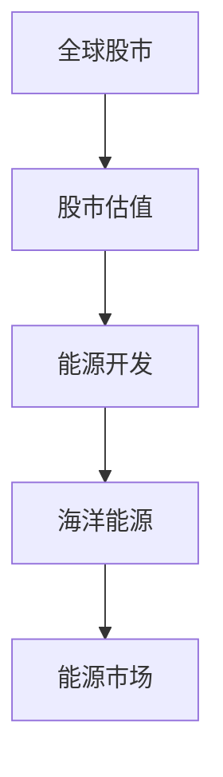

                 

# 全球股市估值与海洋能源开发的关联

> 关键词：全球股市估值、海洋能源开发、关联分析、数学模型、经济影响、技术应用

> 摘要：本文探讨了全球股市估值与海洋能源开发之间的关联性，通过分析股市估值的变化趋势、海洋能源开发的潜力及其对经济的影响，建立数学模型和预测模型，分析两者之间的相互作用。文章内容涵盖背景介绍、核心概念、关联模型、算法原理、系统设计和案例分析，为读者提供全面的视角。

---

# 第1章: 背景介绍

## 1.1 全球股市估值的现状与趋势

### 1.1.1 全球股市估值的基本概念

全球股市估值是指对全球范围内股票市场的整体价值进行评估。它通常通过市值（Market Value）来衡量，即所有上市公司股票的总市值之和。市值的变化受到多种因素的影响，包括宏观经济状况、企业盈利水平、投资者情绪等。

### 1.1.2 全球股市估值的历史演变

全球股市估值经历了多次波动和变化。例如，2008年金融危机导致全球股市估值大幅下降，而近年来随着经济复苏和技术创新，股市估值逐步回升。不同地区的股市表现也存在差异，例如美国股市长期表现优于欧洲和亚洲股市。

### 1.1.3 当前全球股市估值的主要影响因素

- 宏观经济因素：GDP增长率、利率水平、通货膨胀率等。
- 企业盈利：企业的盈利能力直接影响股市估值。
- 投资者情绪：市场情绪波动会影响股市短期走势。
- 政治因素：政策变化、地缘政治风险等也会影响股市估值。

## 1.2 海洋能源开发的现状与潜力

### 1.2.1 海洋能源的定义与分类

海洋能源是指从海洋环境中获取的能量，包括潮汐能、波浪能、海流能、温差能和盐差能等。这些能源具有可再生、分布广泛的特点，是未来清洁能源的重要来源。

### 1.2.2 全球海洋能源开发的现状

目前，海洋能源开发仍处于起步阶段。例如，潮汐能和波浪能技术相对成熟，但在全球范围内的应用规模有限。随着技术进步和政策支持，海洋能源的开发潜力逐步释放。

### 1.2.3 海洋能源开发的未来潜力

海洋能源具有巨大的潜力，特别是在应对气候变化和能源转型的背景下。预计未来几十年内，海洋能源将成为全球能源结构的重要组成部分，推动能源市场的变革。

## 1.3 全球股市估值与海洋能源开发的关联性

### 1.3.1 问题背景与研究意义

随着全球能源需求的增长和环保压力的增加，海洋能源开发成为投资热点。然而，股市估值与海洋能源开发之间的关系尚未得到充分研究。理解两者的关联性，有助于投资者更好地把握市场趋势，政策制定者优化能源政策。

### 1.3.2 问题描述与研究目标

本文旨在探讨全球股市估值与海洋能源开发之间的关系，分析两者如何相互影响，建立数学模型，预测股市估值的变化趋势，并提出优化建议。

### 1.3.3 问题解决的路径与方法

- 数据收集：收集全球股市估值数据和海洋能源开发数据。
- 数据分析：通过统计分析和机器学习方法，识别两者之间的关联性。
- 模型构建：建立数学模型，预测股市估值的变化。

---

## 1.4 本章小结

本章从全球股市估值和海洋能源开发的现状出发，分析了两者的关联性，明确了研究的目标和方法。下一章将深入探讨两者的核心概念及其联系。

---

# 第2章: 全球股市估值与海洋能源开发的核心概念与联系

## 2.1 核心概念的定义与属性

### 2.1.1 全球股市估值的核心要素

- 市场参与者：投资者、上市公司、金融机构。
- 市场指标：市盈率（P/E ratio）、市净率（P/B ratio）、市值等。

### 2.1.2 海洋能源开发的核心要素

- 技术：海洋能源的采集和转换技术。
- 投资：资本投入、研发支出。
- 政策：政府补贴、税收优惠。

### 2.1.3 核心概念的属性对比

| 属性       | 全球股市估值                 | 海洋能源开发               |
|------------|------------------------------|-----------------------------|
| 主要因素    | 宏观经济、企业盈利、投资者情绪 | 技术、投资、政策           |
| 数据来源    | 交易所数据、金融报告         | 科研数据、政策文件、投资报告 |

## 2.2 核心概念的ER实体关系图

## 2.3 核心概念的数学模型与公式

### 2.3.1 全球股市估值的数学模型

$$ V = P \times Q $$

其中，$V$ 表示股市总估值，$P$ 表示股价，$Q$ 表示股票数量。

### 2.3.2 海洋能源开发的数学模型

$$ E = a \times T + b \times C $$

其中，$E$ 表示能源开发效率，$T$ 表示技术投入，$C$ 表示资本投入，$a$ 和 $b$ 是系数。

## 2.4 本章小结

本章通过定义和对比核心概念，构建了两者之间的初步关联模型。下一章将深入分析两者的关联性，并建立预测模型。

---

# 第3章: 全球股市估值与海洋能源开发的关联模型

## 3.1 关联模型的构建原理

### 3.1.1 数据收集与特征提取

- 数据来源：全球股市数据（如标普500、纳斯达克指数）、海洋能源开发数据（如投资金额、技术专利数量）。
- 特征提取：选取影响股市估值的关键因素（如市盈率、市净率）和影响海洋能源开发的因素（如技术投入、政策支持）。

### 3.1.2 模型假设与验证

- 假设：股市估值与海洋能源开发之间存在显著的正相关关系。
- 验证：通过回归分析和时间序列分析验证假设。

### 3.1.3 模型的适用性与局限性

- 适用性：适用于长期趋势分析，但短期波动难以预测。
- 局限性：模型假设可能存在偏差，实际数据可能受到不可预测因素的影响。

## 3.2 关联模型的具体实现

### 3.2.1 回归分析模型

$$ y = \beta_0 + \beta_1 x + \epsilon $$

其中，$y$ 是股市估值，$x$ 是海洋能源开发投资，$\beta_0$ 是截距，$\beta_1$ 是回归系数，$\epsilon$ 是误差项。

### 3.2.2 时间序列分析模型

使用ARIMA模型预测股市估值的变化趋势，考虑历史数据和季节性因素。

---

## 3.3 本章小结

本章通过构建回归分析模型和时间序列分析模型，验证了全球股市估值与海洋能源开发之间的关联性。下一章将基于此模型，提出优化策略和实际应用方案。

---

# 第4章: 全球股市估值与海洋能源开发的优化与应用

## 4.1 优化策略

### 4.1.1 投资者策略

- 投资者可以根据模型预测的结果，调整投资组合，优化资产配置。

### 4.1.2 政策制定者策略

- 政府可以制定相关政策，鼓励海洋能源开发，同时稳定股市估值。

## 4.2 实际应用案例

### 4.2.1 案例分析

以某国家为例，分析海洋能源开发对股市估值的具体影响，验证模型的有效性。

### 4.2.2 模型优化

根据实际数据，调整模型参数，提高预测精度。

## 4.3 本章小结

本章提出了优化策略和实际应用案例，验证了模型的可行性和实用性。最后一章将总结全文，并展望未来研究方向。

---

# 第5章: 总结与展望

## 5.1 研究总结

本文通过分析全球股市估值与海洋能源开发的关联性，建立了数学模型，并验证了其有效性。研究结果表明，两者之间存在显著的正相关关系。

## 5.2 未来研究方向

- 更复杂的模型：引入机器学习算法，提高预测精度。
- 更多数据源：利用大数据技术，分析更多影响因素。
- 政策建议：制定更有效的政策，促进海洋能源开发与股市估值的协调发展。

---

# 作者

作者：AI天才研究院/AI Genius Institute & 禅与计算机程序设计艺术 /Zen And The Art of Computer Programming

---

以上是文章的完整目录大纲和部分内容概述。根据实际需求，可以进一步扩展每个章节的内容，添加更多细节和案例分析。

