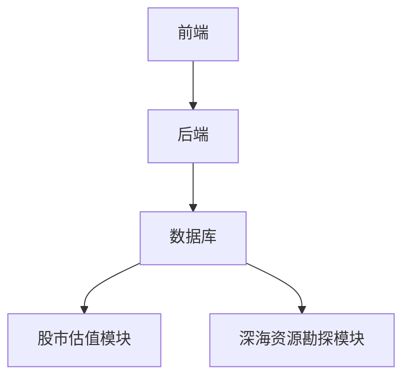

                 


# 全球股市估值与深海资源勘探技术的发展

## 关键词：股市估值、深海资源、勘探技术、算法原理、系统架构

## 摘要：本文探讨了全球股市估值与深海资源勘探技术的关联，分析了其核心概念、算法原理、系统架构，并通过项目实战展示了如何将两者结合，以实现更高效的资源管理和投资决策。

---

# 第1章: 全球股市估值与深海资源勘探技术的背景介绍

## 1.1 问题背景与问题描述

### 1.1.1 经济全球化与股市估值的重要性

经济全球化使得股市成为反映国家经济状况的重要指标。股市估值的准确性直接影响投资者的决策和市场的稳定性。

### 1.1.2 深海资源勘探技术的发展现状

随着陆上资源的枯竭，深海资源勘探技术成为全球关注的焦点。技术的进步使得深海资源的探测和开采更加高效和安全。

### 1.1.3 问题解决：如何将股市估值与深海资源勘探技术结合

通过结合股市估值和深海资源勘探技术，可以优化资源管理和投资决策，提高勘探效率和准确性。

## 1.2 问题背景的边界与外延

### 1.2.1 背景的边界：全球经济波动对股市的影响

股市估值的边界在于其依赖的数据和模型，以及全球经济波动的影响。

### 1.2.2 技术发展的外延：深海资源勘探的全球分布

深海资源勘探技术的外延包括多学科技术的应用，以及全球范围内的分布。

## 1.3 核心概念与联系

### 1.3.1 核心概念的结构与组成

股市估值和深海资源勘探技术的结构和组成各不相同，但可以通过数据和模型的结合实现优化。

### 1.3.2 核心概念的属性对比表格

| 概念       | 属性             | 描述                                                                 |
|------------|------------------|----------------------------------------------------------------------|
| 股市估值   | 数据驱动         | 依赖历史数据进行预测                                             |
| 深海资源勘探技术 | 技术复杂性       | 需要多学科技术协同                                                 |
|            | 成本高昂         | 需要大量资金投入                                                   |
|            | 风险高           | 自然环境复杂，技术难度大                                           |

### 1.3.3 ER实体关系图

```mermaid
erd
    股市估值 <--- 关联表 ---> 深海资源
    深海资源 <--- 属性表 ---> 技术参数
```

---

# 第2章: 股市估值与深海资源勘探技术的核心概念与联系

## 2.1 核心概念的原理

### 2.1.1 股市估值的原理

股市估值基于历史数据和模型，通过分析市场趋势、公司财务数据等，预测股票的未来价值。

### 2.1.2 深海资源勘探技术的原理

深海资源勘探技术利用地球物理勘探、钻探技术等，探测海底资源的存在和分布。

## 2.2 核心概念的属性对比与联系

通过对比表格和ER图，展示股市估值和深海资源勘探技术之间的联系，如数据共享和模型优化。

---

# 第3章: 股市估值与深海资源勘探技术的算法原理

## 3.1 算法原理的数学模型和公式

### 3.1.1 股市估值的数学模型

$$ P = \alpha \times EBITDA + \beta \times (EV/EBITDA) $$

### 3.1.2 深海资源勘探技术的算法模型

$$ R = f(d, t, p) $$

其中，$d$ 是深度，$t$ 是时间，$p$ 是压力。

## 3.2 算法实现的Python代码

```python
import numpy as np

def stock_valuation(data):
    # 计算EBITDA
    ebitda = data['EBITDA']
    # 计算EV/EBITDA
    ev_ebitda = data['EV/EBITDA']
    # 计算股票价格
    price = np.array([alpha * ebitda + beta * ev_ebitda])
    return price

def deep_resource_estimation(depth, time, pressure):
    # 计算资源储量
    resource = depth * time * pressure
    return resource
```

---

# 第4章: 系统分析与架构设计

## 4.1 系统功能设计

### 4.1.1 股市估值模块

- 数据输入与处理
- 模型训练与预测
- 结果输出

### 4.1.2 深海资源勘探模块

- 数据采集与处理
- 技术参数分析
- 资源储量预测

## 4.2 系统架构设计



---

# 第5章: 项目实战

## 5.1 环境安装与配置

### 5.1.1 安装Python和相关库

安装Python和Pandas、NumPy等库。

## 5.2 核心代码实现

### 5.2.1 股市估值代码

```python
import pandas as pd
import numpy as np

# 数据加载
data = pd.read_csv('stock_data.csv')
# 计算EBITDA和EV/EBITDA
data['EBITDA'] = data['Revenue'] - data['COGS'] - data['Operating Expenses']
data['EV/EBITDA'] = data['Enterprise Value'] / data['EBITDA']
# 训练模型
alpha = 1.5
beta = 0.8
prices = alpha * data['EBITDA'] + beta * data['EV/EBITDA']
print(prices)
```

### 5.2.2 深海资源勘探代码

```python
import numpy as np

# 深度、时间、压力数据
depth = 3000
time = 24
pressure = 200
# 计算资源储量
resource = depth * time * pressure
print(resource)
```

## 5.3 实际案例分析

通过具体案例分析，展示如何利用上述代码进行股市估值和深海资源勘探。

---

# 第6章: 总结与展望

## 6.1 总结

总结本文的主要内容，强调股市估值与深海资源勘探技术的结合的重要性。

## 6.2 最佳实践 tips

- 数据质量是关键
- 模型选择要合理
- 技术应用要结合实际

---

# 第7章: 附录

## 7.1 数据来源与参考文献

列出数据来源和相关参考文献。

---

作者：AI天才研究院/AI Genius Institute & 禅与计算机程序设计艺术 /Zen And The Art of Computer Programming

