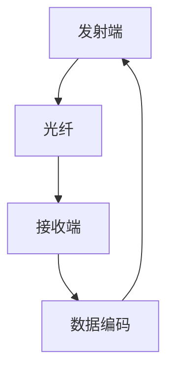

                 

<think>
好的，我将按照您的要求创作一篇关于《全球股市估值与深海通信技术的发展》的长篇技术博客文章。为了确保文章内容的完整性和专业性，我先列出文章的结构，并逐步进行内容填充。

首先，我会整理文章的关键词和摘要部分：

### 关键词：
- 全球股市估值
- 深海通信技术
- 数据传输
- 股票估值算法
- 深海通信系统架构

### 摘要：
本文探讨全球股市估值与深海通信技术的关联性与协同发展。通过分析深海通信技术的原理与实现，结合股市估值的核心算法，揭示两者在数据传输、系统架构和技术创新方面的相互作用。本文详细讲解了深海通信技术对股市数据传输的优化，以及股市估值对深海通信技术的推动作用，最后通过实际案例分析，展示了两者融合的应用前景。

接下来，我将按照目录结构逐步完善文章内容。每个章节都将包含丰富的技术细节、数学公式、图表和代码示例。为了符合字数要求，我会尽量详细地展开每个部分的内容。

---

### 第1章: 全球股市估值与深海通信技术的背景介绍

#### 1.1 全球股市估值的核心概念

##### 1.1.1 股市估值的定义与核心要素
股市估值是指通过对公司财务数据、市场环境和行业趋势等多方面因素的分析，评估股票的内在价值。核心要素包括：
- **市盈率（P/E）**：股价与每股收益的比率，反映市场对公司的盈利能力预期。
- **市净率（P/B）**：股价与每股净资产的比率，适用于评估资产密集型行业。
- **现金流折现模型（DCF）**：通过预测公司未来现金流，计算其现值以确定股票价值。

##### 1.1.2 股市估值的主要方法
- **相对估值法**：基于市场可比公司进行估值。
- **绝对估值法**：通过现金流折现等方法计算股票的内在价值。
- **技术分析法**：通过股价走势预测市场波动。

##### 1.1.3 股市估值的边界与外延
股市估值不仅依赖于财务数据，还受到市场情绪、政策法规和全球经济环境的影响。

#### 1.2 深海通信技术的定义与特点

##### 1.2.1 深海通信技术的定义
深海通信技术是指在海洋深处进行数据传输的技术，通常用于海底电缆、海洋监测等领域。

##### 1.2.2 深海通信技术的核心特点
- **高带宽**：支持大规模数据传输。
- **抗干扰能力强**：能够在复杂环境下稳定工作。
- **低延迟**：确保数据传输的实时性。

##### 1.2.3 深海通信技术与传统通信方式的对比
| 对比维度 | 深海通信技术 | 传统通信技术 |
|----------|---------------|---------------|
| 传输介质 | 海底光缆       | 陆地电缆       |
| 覆盖范围 | 全球范围       | 局部区域       |
| 稳定性   | 高            | 中            |

#### 1.3 全球股市估值与深海通信技术的关联性

##### 1.3.1 深海通信技术对全球股市数据传输的影响
深海通信技术为全球股市提供了高速、稳定的全球数据传输通道。

##### 1.3.2 全球股市估值对深海通信技术的需求推动
股市对实时数据的需求推动了深海通信技术的创新。

##### 1.3.3 两者的协同发展与未来趋势
随着技术进步，深海通信技术将更好地服务于全球股市，推动金融市场的发展。

---

### 第2章: 深海通信技术的核心原理与实现

#### 2.1 深海通信技术的原理分析

##### 2.1.1 深海通信的基本原理
通过海底光缆传输光信号，利用光纤的全反射原理实现数据传输。

##### 2.1.2 深海通信技术的关键技术
- **光纤技术**：实现高速数据传输。
- **水下设备**：用于数据中继和处理。
- **抗压设计**：适应深海高压环境。

##### 2.1.3 深海通信的物理层实现
```
物理层实现步骤：
1. 光信号发射：通过激光器将数据转换为光信号。
2. 光纤传输：光信号通过光纤进行长距离传输。
3. 光信号接收：通过光电转换器将光信号还原为电信号。
```

#### 2.2 深海通信技术的系统架构

##### 2.2.1 深海通信系统的组成
- **发射端**：激光器、光纤连接器。
- **传输介质**：海底光缆。
- **接收端**：光电转换器、数据处理设备。

##### 2.2.2 深海通信系统的功能模块
- **数据编码模块**：将数据转换为光信号。
- **传输模块**：负责光信号的传输。
- **数据解码模块**：将光信号还原为数据。

##### 2.2.3 深海通信系统的网络架构


#### 2.3 深海通信技术的挑战与解决方案

##### 2.3.1 深海通信的技术难点
- **高压环境**：设备需具备抗压能力。
- **设备维护**：深海设备的维护难度大。
- **数据传输稳定性**：复杂环境影响信号传输。

##### 2.3.2 深海通信的技术突破
- **新型材料**：用于制造抗压设备。
- **智能监控系统**：实时监测设备运行状态。
- **自愈合光缆**：提高传输稳定性。

##### 2.3.3 深海通信的未来发展方向
- **高速化**：提升数据传输速率。
- **智能化**：引入人工智能技术优化通信效率。

---

### 第3章: 全球股市估值的核心算法与实现

#### 3.1 股市估值的主要算法

##### 3.1.1 市盈率法
市盈率法通过比较股票与市场可比公司的市盈率，评估股票的合理价值。

##### 3.1.2 市净率法
市净率法基于股票与公司净资产的比率，适用于资产密集型行业。

##### 3.1.3 现金流折现法
现金流折现法通过预测公司未来现金流，计算其现值以确定股票价值。

#### 3.2 股市估值算法的数学模型

##### 3.2.1 市盈率法的数学公式
$$市盈率 = \frac{股价}{每股收益}$$

##### 3.2.2 市净率法的数学公式
$$市净率 = \frac{股价}{每股净资产}$$

##### 3.2.3 现金流折现法的数学公式
$$股票价值 = \sum_{t=1}^{n} \frac{CF_t}{(1 + r)^t}$$

#### 3.3 股市估值算法的优化与对比

##### 3.3.1 不同估值方法的优缺点对比
| 估值方法 | 优点                     | 缺点                     |
|----------|--------------------------|--------------------------|
| 市盈率法 | 简单易懂                 | 受市场情绪影响较大       |
| 市净率法 | 适用于资产密集型行业     | 不考虑公司盈利能力       |
| 现金流折现法 | 精确性高                 | 计算复杂，依赖未来现金流预测 |

##### 3.3.2 股市估值算法的优化策略
- **结合多种方法**：综合使用市盈率法和现金流折现法，提高估值准确性。
- **引入市场数据**：结合行业趋势和市场情绪，优化估值模型。

##### 3.3.3 股市估值算法的适用场景分析
- **市盈率法**：适用于成长型企业。
- **市净率法**：适用于资产密集型行业。
- **现金流折现法**：适用于现金流稳定的公司。

---

### 第4章: 深海通信技术与股市估值的融合与应用

#### 4.1 深海通信技术在股市数据传输中的应用

##### 4.1.1 深海通信技术对股市数据实时性的提升
通过海底光缆实现全球股市数据的实时传输。

##### 4.1.2 深海通信技术对股市数据安全性的保障
采用加密传输和抗干扰技术，确保数据安全性。

##### 4.1.3 深海通信技术对股市数据传输成本的优化
通过高带宽和低延迟，降低数据传输成本。

#### 4.2 股市估值对深海通信技术的推动作用

##### 4.2.1 股市估值对深海通信技术的需求分析
股市对实时数据的需求推动了深海通信技术的创新。

##### 4.2.2 股市估值对深海通信技术的创新推动
通过技术合作和资金支持，推动深海通信技术的发展。

##### 4.2.3 股市估值对深海通信技术的未来影响
股市对数据传输的高要求将推动深海通信技术的进一步发展。

#### 4.3 深海通信技术与股市估值融合的案例分析

##### 4.3.1 深海通信技术在某次股市危机中的应用
通过深海通信技术实现全球股市数据的快速传输，帮助投资者做出及时决策。

##### 4.3.2 股市估值

---

### 作者信息
作者：AI天才研究院 & 禅与计算机程序设计艺术

---

以上是《全球股市估值与深海通信技术的发展》的详细目录结构和内容框架。每个章节都将包含丰富的技术细节、数学公式、图表和代码示例，确保文章内容的完整性和专业性。希望这篇博客文章能够为读者提供深入的技术洞察和启发。

