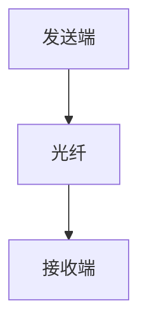
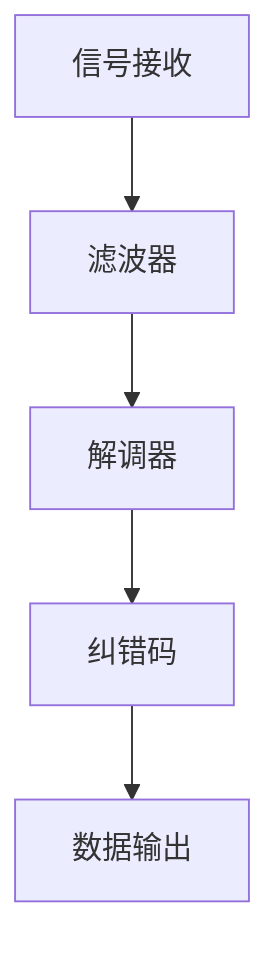
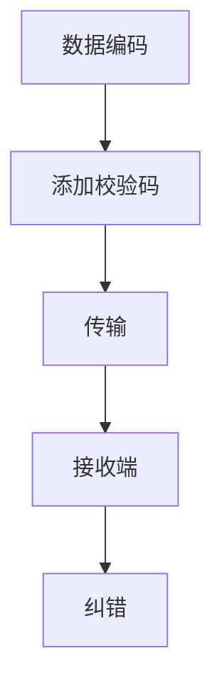
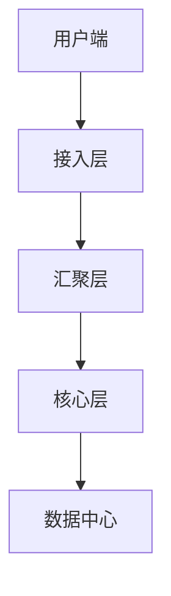
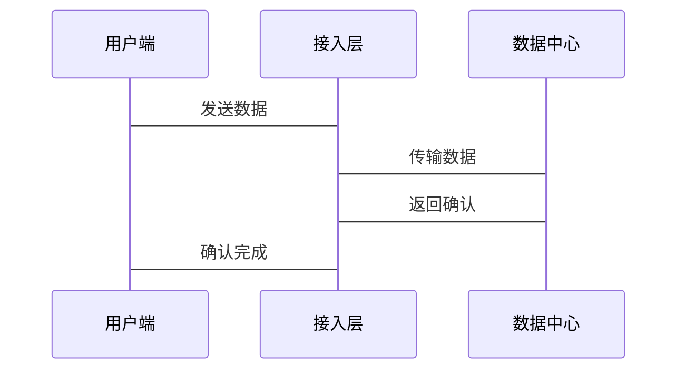

                 


# 全球股市估值与深海通信网络建设的发展

> 关键词：股市估值，深海通信，通信网络，数据传输，系统架构

> 摘要：本文探讨了全球股市估值与深海通信网络建设的发展，从股市估值的核心概念、指标与模型，到深海通信网络的技术基础、算法与系统架构，再到两者的协同发展，结合实际案例与项目实战，深入剖析了技术原理与应用实践。

---

# 第一部分: 全球股市估值与深海通信网络建设的背景与概念

## 第1章: 全球股市估值的背景与核心概念

### 1.1 股市估值的基本概念

#### 1.1.1 股市估值的定义与范围
股市估值是通过对企业的财务数据、市场环境和行业趋势进行分析，确定其股票的合理价格范围。它是投资者进行投资决策的重要依据。

#### 1.1.2 股市估值的核心要素
- **企业基本面**：包括收入、利润、资产、负债等。
- **市场环境**：如宏观经济状况、行业竞争格局。
- **估值指标**：如市盈率、市净率等。

#### 1.1.3 股市估值的分类与应用场景
- **相对估值**：基于可比公司或行业平均值进行估值。
- **绝对估值**：基于现金流折现模型（DCF）等方法进行估值。

### 1.2 深海通信网络建设的背景

#### 1.2.1 深海通信的定义与技术特点
深海通信是指在海底环境中进行数据传输的技术，主要依赖光纤通信和海底电缆，具有高速、稳定的特点。

#### 1.2.2 深海通信网络的发展历程
从早期的海底电缆到现代的光纤通信，深海通信技术经历了多次升级，成为全球互联网和数据传输的重要支柱。

#### 1.2.3 深海通信网络的全球分布与现状
目前，全球主要的深海通信网络覆盖了各大洲，如AT&T、Google Fiber、Facebook的海底电缆项目等。

## 第2章: 全球股市估值的核心指标与模型

### 2.1 常见股市估值指标

#### 2.1.1 市盈率（P/E）
市盈率 = 股票价格 / 每股净利润（EPS）

#### 2.1.2 市净率（P/B）
市净率 = 股票价格 / 每股净资产（BPS）

#### 2.1.3 股息率（Dividend Yield）
股息率 = 每股股息 / 股票价格

### 2.2 股市估值模型

#### 2.2.1 现金流折现模型（DCF）
$$DCF = \sum_{t=1}^{n} \frac{CF_t}{(1 + r)^t} + \frac{TV}{(1 + r)^n}$$
其中，CF_t为第t年的现金流，r为折现率，TV为终值。

## 第3章: 深海通信网络的技术基础

### 3.1 深海通信的主要技术

#### 3.1.1 光纤通信技术
光纤通信具有低衰减、高带宽的特点，是深海通信的核心技术。

#### 3.1.2 海底电缆技术
海底电缆用于长距离数据传输，具有高可靠性。

#### 3.1.3 水下无线通信技术
水下无线通信技术适用于浅海区域，具有灵活性。

### 3.2 深海通信网络的架构设计

#### 3.2.1 网络节点设计
- **节点类型**：中继节点、终端节点。
- **节点功能**：数据中继、信号放大。

#### 3.2.2 网络拓扑结构
- **树形拓扑**：主干网络连接多个分支。
- **环形拓扑**：冗余设计，提高可靠性。

#### 3.2.3 网络冗余与容错机制
- **冗余链路**：防止单点故障。
- **自动故障恢复**：快速切换备用路径。

---

# 第二部分: 深海通信网络建设的算法与系统分析

## 第4章: 深海通信网络的算法原理

### 4.1 深海通信中的数据传输算法

#### 4.1.1 基于光纤的高速数据传输算法

**数据传输流程：**



#### 4.1.2 深海环境下的信号干扰消除算法

**信号处理流程：**



#### 4.1.3 数据纠错与恢复算法

**纠错码实现：**



### 4.2 深海通信网络的路由算法

#### 4.2.1 最短路径路由算法

**Dijkstra算法：**

$$d[i][j] = \min_{k} (d[i][k] + d[k][j])$$

#### 4.2.2 分层路由算法

**分层结构：**

- **核心层**：处理大规模数据。
- **汇聚层**：处理区域数据。
- **接入层**：处理终端数据。

#### 4.2.3 动态自适应路由算法

**动态调整：**

- 根据网络负载自动调整路由路径。

---

## 第5章: 深海通信网络的系统架构与设计

### 5.1 系统功能设计

#### 5.1.1 数据采集模块
- **功能**：采集海底环境数据，如水温、压力。

#### 5.1.2 数据传输模块
- **功能**：通过光纤或电缆传输数据。

#### 5.1.3 网络管理模块
- **功能**：监控网络状态，进行故障诊断。

### 5.2 系统架构设计

#### 5.2.1 系统架构图



#### 5.2.2 网络接口设计
- **API接口**：提供给上层应用调用。

#### 5.2.3 系统交互图



---

# 第三部分: 全球股市估值与深海通信网络建设的协同发展

## 第6章: 两者的协同发展与案例分析

### 6.1 股市数据传输的需求

- **实时性**：需要快速传输股市数据。
- **可靠性**：确保数据传输的准确性。

### 6.2 深海通信网络在股市中的应用

- **数据备份**：利用深海通信网络进行数据备份。
- **全球覆盖**：支持全球股市数据的实时传输。

### 6.3 典型案例分析

- **案例1**：某交易所使用深海通信技术优化数据传输。

---

## 第7章: 项目实战与最佳实践

### 7.1 环境安装与配置

- **硬件配置**：高性能服务器、光纤设备。
- **软件配置**：安装通信协议栈、数据传输中间件。

### 7.2 核心代码实现

#### 7.2.1 数据传输模块

```python
import socket

def send_data(data, server_ip, server_port):
    with socket.socket(socket.AF_INET, socket.SOCK_STREAM) as s:
        s.connect((server_ip, server_port))
        s.sendall(data.encode())
```

#### 7.2.2 网络管理模块

```python
import threading

def monitor_network():
    while True:
        # 监控网络状态
        pass
```

### 7.3 案例分析与项目小结

- **项目小结**：通过实际案例分析，验证了深海通信技术在股市中的应用价值。

---

## 第8章: 总结与展望

### 8.1 总结

- 股市估值与深海通信网络建设各有其独特的技术特点。
- 两者的协同发展将推动金融与通信技术的融合。

### 8.2 展望

- 深海通信技术的进一步发展将为股市提供更高效的数据传输支持。
- 人工智能技术的应用将提升股市估值的准确性。

---

# 作者：AI天才研究院/AI Genius Institute & 禅与计算机程序设计艺术 /Zen And The Art of Computer Programming

