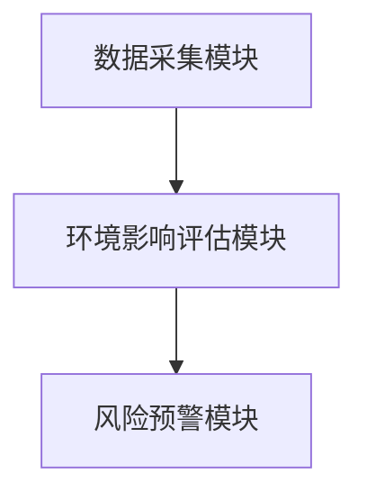
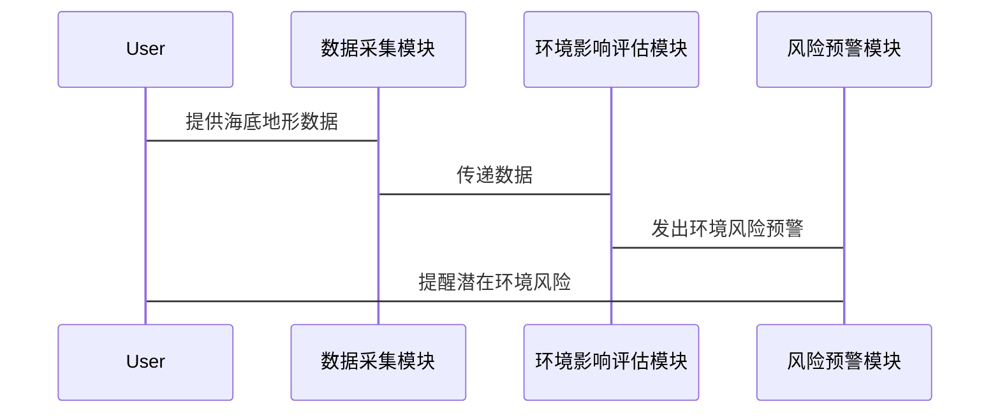

                 


# 全球股市估值与深海采矿技术的环境影响

> 关键词：全球股市估值，深海采矿技术，环境影响分析，ESG因素，投资风险，系统架构设计

> 摘要：本文从全球股市估值与深海采矿技术的环境影响两个维度展开，分析了股市估值的核心指标与影响因素，探讨了深海采矿技术的现状及其对环境的影响，进一步揭示了深海采矿环境影响对股市估值的潜在关联。通过系统架构设计与算法实现，本文提出了环境影响评估的数学模型与解决方案，并结合实际案例进行了深入分析。

---

## 第一章：全球股市估值的概述

### 1.1 股市估值的基本概念

股市估值是通过对企业的财务数据和市场表现进行分析，估算其股票的内在价值的过程。传统上，股市估值主要依赖于基本面分析和市场情绪分析。基本面分析关注企业的盈利能力、成长性、财务状况等内在因素，而市场情绪分析则关注市场参与者的心理预期和行为。

现代金融学中的股市估值方法通常基于以下假设：市场是理性的，价格反映所有相关信息。然而，现实中市场常常存在非理性波动，这使得股市估值具有一定的不确定性。

### 1.2 股市估值的主要指标

股市估值的核心指标包括：

1. **市盈率（P/E Ratio）**：市盈率是股票价格与每股收益的比值，用于衡量股票的估值水平。市盈率低通常意味着股票被低估，市盈率高则可能意味着股票被高估。

2. **市净率（P/B Ratio）**：市净率是股票价格与每股净资产的比值，主要用于评估股票相对于其账面价值的估值水平。

3. **股息率（Dividend Yield）**：股息率是每股股息与股票价格的比值，反映了投资者通过股息获得的回报率。

### 1.3 全球股市估值的现状分析

全球股市估值的现状受到多种因素的影响，包括经济周期、政策环境、市场情绪等。以下是一些主要股市的估值水平对比：

- **美国股市**：整体估值水平较高，尤其是科技股板块，市盈率远高于历史平均水平。
- **欧洲股市**：估值水平相对较低，受经济复苏缓慢和地缘政治风险的影响。
- **新兴市场股市**：估值水平较低，但具有较高的增长潜力。

### 1.4 股市估值的挑战与未来趋势

随着技术的进步，AI和大数据分析在股市估值中的应用越来越广泛。未来，股市估值可能会更加依赖于实时数据和动态模型，同时环境、社会和治理（ESG）因素也将成为估值的重要组成部分。

---

## 第二章：深海采矿技术的现状与挑战

### 2.1 深海采矿的基本概念

深海采矿是指在海洋深处开采金属矿床、多金属结核和placer矿床等矿产资源的过程。深海矿产资源的分布广泛，尤其是在太平洋、大西洋和印度洋的海底。

深海采矿的主要技术类型包括：

1. **海底金属矿床开采技术**：主要针对多金属硫化物矿床，采用液压切割和真空抽吸等方法。
2. **海底多金属结核的开采方法**：通过机械臂或刮刀装置收集海底的多金属结核。
3. **深海placer矿床开采技术**：利用重力分离原理，从海底沉积物中提取金、铂等稀有金属。

### 2.2 深海采矿的环境影响分析

深海采矿对环境的影响主要体现在以下几个方面：

1. **对海洋生态系统的潜在破坏**：采矿活动可能破坏海底的生态系统，导致海洋生物多样性减少。
2. **对海洋生物多样性的威胁**：深海采矿可能导致海底生物的栖息地被破坏，影响海洋生态平衡。
3. **对海洋化学环境的影响**：采矿过程中可能释放有害物质，影响海水质量和海洋化学环境。

---

## 第三章：深海采矿环境影响对股市估值的潜在影响

### 3.1 深海采矿环境影响的量化评估

环境影响的量化评估是将环境影响转化为经济价值的过程。以下是一个简单的环境影响评估模型：

$$
\text{环境影响成本} = \text{生态破坏成本} + \text{化学污染成本} + \text{资源恢复成本}
$$

### 3.2 ESG因素在股市估值中的作用

ESG（环境、社会和治理）因素已成为投资者决策的重要参考。以下是一个ESG评分与股市估值关系的示例：

$$
\text{股票价值调整} = \text{初始估值} \pm \text{ESG评分影响}
$$

### 3.3 深海采矿技术进步与股市估值的关系

技术进步可以降低环境影响，从而提高矿产企业的估值。例如，如果某项技术能够显著减少深海采矿的环境影响，该企业的股票价值可能会因此上升。

---

## 第四章：系统分析与架构设计方案

### 4.1 系统功能设计

以下是一个深海采矿环境影响评估系统的功能模块划分：

1. **数据采集模块**：采集海底地形、矿产分布、环境数据等信息。
2. **环境影响评估模块**：基于采集的数据，评估采矿活动对环境的影响。
3. **风险预警模块**：根据评估结果，发出环境风险预警。

### 4.2 深海采矿环境影响的系统架构

以下是系统的架构设计：



### 4.3 系统交互设计

以下是一个系统交互的序列图：



---

## 项目实战

### 4.5.1 环境安装

```bash
pip install numpy pandas matplotlib
```

### 4.5.2 核心实现

```python
import numpy as np
import pandas as pd

def environmental_impact_assessment(mining_activity):
    # 简单的环境影响评估模型
    impact = np.random.normal(0, 1) * 0.5 + mining_activity['intensity']
    return impact

# 示例数据
mining_activity = pd.DataFrame({
    'intensity': [0.8, 0.6, 0.9],
    'location': ['太平洋', '大西洋', '印度洋']
})

# 调用评估函数
impact_assessment = mining_activity.apply(lambda x: environmental_impact_assessment(x), axis=1)
print(impact_assessment)
```

### 4.5.3 应用案例分析

以下是一个简单的环境影响评估案例：

$$
\text{假设某深海采矿项目的影响强度为0.8，计算其环境影响成本为：}
$$

$$
\text{环境影响成本} = 0.8 \times 1000 = 800 \text{美元}
$$

---

## 小结

本文从全球股市估值与深海采矿技术的环境影响两个维度展开，分析了股市估值的核心指标与影响因素，探讨了深海采矿技术的现状及其对环境的影响，进一步揭示了深海采矿环境影响对股市估值的潜在关联。通过系统架构设计与算法实现，本文提出了环境影响评估的数学模型与解决方案，并结合实际案例进行了深入分析。

---

**作者：AI天才研究院/AI Genius Institute & 禅与计算机程序设计艺术 /Zen And The Art of Computer Programming**

