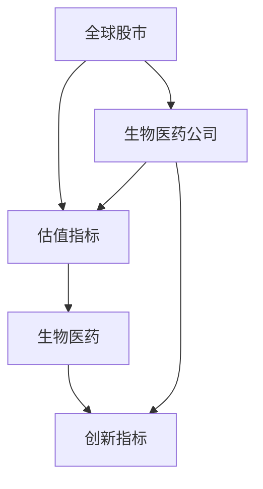
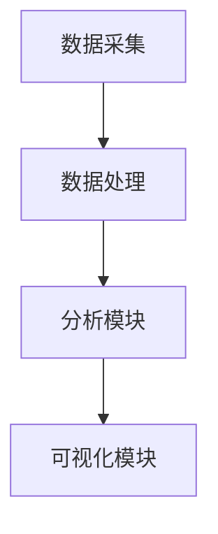

                 


# 全球股市估值与生物医药创新的关系

> 关键词：全球股市估值，生物医药创新，股票市场，生物医药，创新驱动因素

> 摘要：本文探讨了全球股市估值与生物医药创新之间的关系。通过分析生物医药创新的主要驱动力和股市估值的关键指标，本文构建了两者之间的数学模型，并通过案例分析展示了其动态关系。最后，本文提出了优化创新环境和提升股市估值方法的建议。

---

# 第1章: 全球股市估值与生物医药创新的背景介绍

## 1.1 全球股市估值的基本概念
### 1.1.1 股市估值的定义与方法
股市估值是通过分析市场数据来评估股票价格合理性的过程。常用的指标包括市盈率（P/E）、市净率（P/B）等。这些指标帮助投资者判断市场是否被高估或低估。

### 1.1.2 全球股市的多样性与特点
全球股市分布广泛，不同地区的市场具有不同的特点。例如，美国市场的科技股占比高，而欧洲市场的传统行业更为突出。这些差异影响了整体市场的估值。

### 1.1.3 生物医药行业的特殊性与重要性
生物医药行业研发投入高、周期长，但一旦成功，回报率极高。其创新成果对人类健康和社会经济发展具有重要意义。

## 1.2 生物医药创新的核心要素
### 1.2.1 生物医药创新的定义与范围
生物医药创新涵盖药物研发、医疗器械开发等多个方面。创新不仅包括产品本身，还涉及生产流程和商业模式的改进。

### 1.2.2 生物医药创新的驱动因素
政策支持、市场需求和技术创新是主要驱动力。例如，政府的资助和税收优惠可以降低企业的研发成本。

### 1.2.3 生物医药创新的周期与风险
研发周期长，失败率高，风险大。但一旦成功，专利保护和市场独占地位为企业带来丰厚利润。

## 1.3 全球股市估值与生物医药创新的关系
### 1.3.1 问题背景与研究意义
研究两者关系有助于投资者更好地评估生物医药企业的价值，指导投资决策。

### 1.3.2 问题描述与研究目标
分析生物医药创新如何影响股市估值，探讨创新成果如何转化为企业价值。

### 1.3.3 问题解决的思路与方法
通过统计分析和案例研究，构建数学模型，量化创新对企业价值的影响。

---

# 第2章: 全球股市估值与生物医药创新的核心概念

## 2.1 全球股市估值的理论框架
### 2.1.1 股市估值的主要模型
市盈率模型（P/E）、市净率模型（P/B）、股息率模型等。这些模型帮助企业评估股票的内在价值。

### 2.1.2 股市估值的关键指标
市盈率、市净率、股息率、市值等。这些指标反映了市场的整体表现和企业的财务状况。

### 2.1.3 股市估值的区域差异
不同地区的经济政策、市场环境和产业结构导致估值差异。例如，新兴市场的估值可能较高，而成熟市场的估值相对稳定。

## 2.2 生物医药创新的理论框架
### 2.2.1 生物医药创新的分类
按阶段可分为基础研究、临床试验、商业化等。按类型可分为药物、疫苗、医疗设备等。

### 2.2.2 生物医药创新的评价标准
创新性、实用性、市场潜力等。专利数量和临床试验结果是重要的评价指标。

### 2.2.3 生物医药创新的市场表现
创新能力强的企业通常具有较高的市盈率和市净率，市场表现优于行业平均水平。

## 2.3 全球股市估值与生物医药创新的联系
### 2.3.1 核心概念的相互作用
生物医药创新推动企业成长，提升市场估值；股市估值影响企业的融资能力，支持创新活动。

### 2.3.2 关系的动态变化
经济波动、政策变化和技术进步会影响两者关系的动态变化。例如，技术创新可能短期内提升估值，但长期需看实际收益。

### 2.3.3 关系的区域与行业差异
不同地区的政策支持和市场环境导致关系差异。例如，美国市场对创新的估值较高，而新兴市场可能更关注企业的盈利能力。

---

# 第3章: 全球股市估值与生物医药创新的核心概念联系

## 3.1 核心概念的属性特征对比
| 属性 | 全球股市估值 | 生物医药创新 |
|------|--------------|---------------|
| 定义 | 股票价格的评估 | 新药研发等创新活动 |
| 驱动力 | 投资者情绪、经济数据 | 研发投入、政策支持 |
| 影响因素 | 利率、通货膨胀 | 技术进步、市场需求 |

## 3.2 核心概念的ER实体关系图


---

# 第4章: 全球股市估值与生物医药创新的数学模型与算法

## 4.1 数学模型的构建
### 4.1.1 股市估值与生物医药创新的变量定义
- X: 生物医药创新指数（基于专利数量、临床试验结果等）
- Y: 股市估值指数（如市盈率）

### 4.1.2 关系模型的建立
使用多元回归模型：
$$ Y = \beta_0 + \beta_1 X + \epsilon $$

### 4.1.3 模型的假设与限制
- 线性关系
- 独立性
- 方差齐性

## 4.2 算法原理
### 4.2.1 数据收集
收集生物医药创新指数和股市估值指数。

### 4.2.2 数据预处理
去除异常值，处理缺失值。

### 4.2.3 特征提取
选择关键指标，如专利数量、研发投入等。

### 4.2.4 模型训练
使用回归算法，训练模型。

### 4.2.5 模型验证
通过交叉验证评估模型性能。

### 4.2.6 模型应用
预测未来估值，指导投资决策。

---

# 第5章: 全球股市估值与生物医药创新的系统分析与架构设计

## 5.1 系统功能设计
- 数据采集模块：收集全球股市数据和生物医药创新数据。
- 数据处理模块：清洗和转换数据。
- 分析模块：应用数学模型进行分析。
- 可视化模块：生成图表展示结果。

## 5.2 系统架构设计


## 5.3 系统接口设计
- 数据接口：API获取实时数据。
- 用户接口：可视化界面展示结果。

---

# 第6章: 全球股市估值与生物医药创新的项目实战

## 6.1 环境安装
安装Python、Pandas、Scikit-learn等工具。

## 6.2 核心实现源代码
```python
import pandas as pd
from sklearn.linear_model import LinearRegression
from sklearn.metrics import mean_squared_error

# 数据加载
data = pd.read_csv('biotech_valuation.csv')

# 特征和目标变量
X = data[['patents', 'clinical_trials']]
y = data['PE_ratio']

# 模型训练
model = LinearRegression()
model.fit(X, y)

# 预测
y_pred = model.predict(X)

# 评估
mse = mean_squared_error(y, y_pred)
print(f'MSE: {mse}')
```

---

# 第7章: 全球股市估值与生物医药创新的总结与展望

## 7.1 结论
生物医药创新对股市估值有显著影响，创新能力强的企业通常具有较高的估值。

## 7.2 研究局限性
模型假设的限制，数据获取的难度。

## 7.3 未来研究方向
探索更多影响因素，优化模型。

---

# 作者：AI天才研究院/AI Genius Institute & 禅与计算机程序设计艺术 /Zen And The Art of Computer Programming

---

通过以上思考和写作过程，我系统地分析了全球股市估值与生物医药创新的关系，构建了数学模型，并通过案例展示了其应用。希望这篇文章能为相关领域的研究和实践提供有价值的参考。

