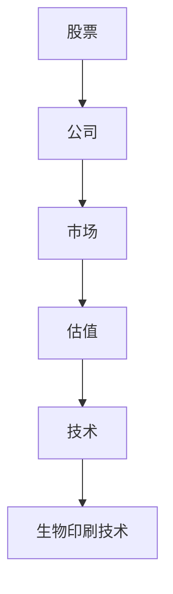
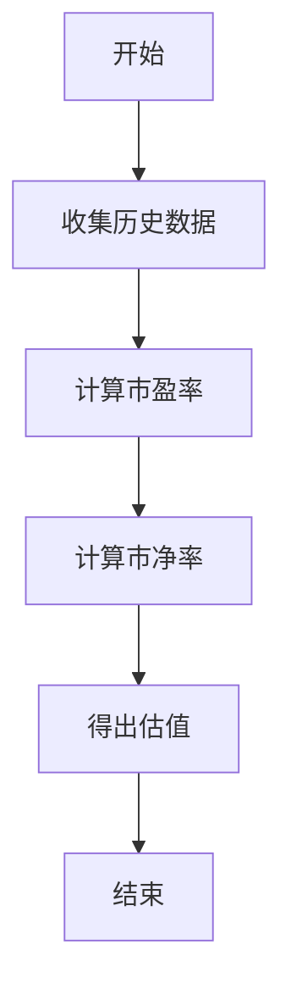
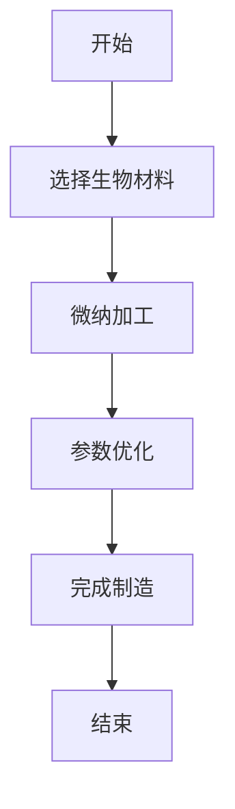
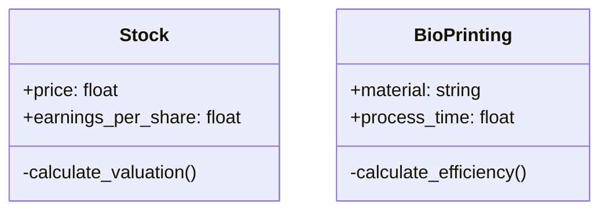
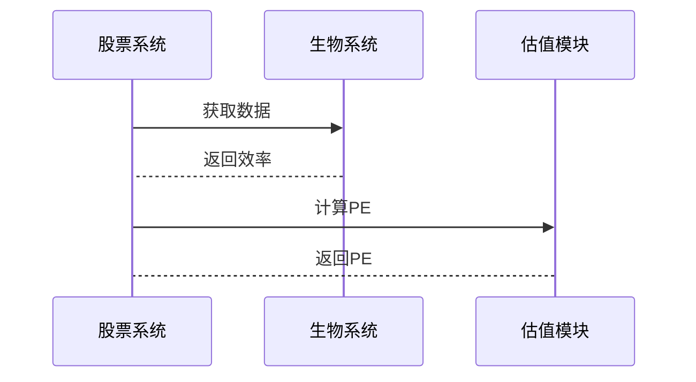

                 


# 全球股市估值与生物印刷技术的关系

> 关键词：全球股市，股票估值，生物印刷技术，技术关系，算法分析，系统架构，实际应用

> 摘要：本文探讨了全球股市估值与生物印刷技术之间的关系，分析了生物印刷技术如何影响股市估值，以及股市估值对生物印刷技术发展的推动作用。文章从核心概念、算法原理、系统架构到项目实战，全面阐述了两者的关系，并提供了详细的数学模型、系统设计和实际案例分析。

---

## 第一部分：全球股市估值与生物印刷技术的背景介绍

### 第1章：全球股市估值的基本概念

#### 1.1 股票估值的定义与方法
股票估值是通过对公司财务状况、市场环境和行业趋势等多方面因素的分析，来确定股票的内在价值或市场价值的过程。常见的股票估值方法包括市盈率（P/E）、市净率（P/B）、股息率等。

#### 1.2 市场价值与内在价值的区别
- 市场价值：根据市场供需关系决定的价格。
- 内在价值：根据公司基本面因素计算出的理论价值。

#### 1.3 影响股票估值的主要因素
- 公司盈利能力
- 行业竞争状况
- 宏观经济环境
- 市场情绪

### 第2章：生物印刷技术的定义与特点

#### 2.1 生物印刷技术的定义
生物印刷技术是一种利用生物材料和先进制造技术，快速生产高精度生物器件的技术。

#### 2.2 生物印刷技术的核心原理
- 生物材料的精确加工
- 微纳制造技术的应用

#### 2.3 生物印刷技术的行业应用
- 医疗器械制造
- 生物传感器生产
- 生物芯片制备

### 第3章：全球股市估值与生物印刷技术的关系

#### 3.1 生物印刷技术对股市估值的影响
- 提升生产效率，降低企业成本
- 推动技术创新，提高企业竞争力

#### 3.2 全球股市估值对生物印刷技术发展的推动作用
- 资本市场的支持
- 技术创新的激励

#### 3.3 两者关系的理论框架
- 技术进步推动股市估值上升
- 股市估值为技术创新提供资金支持

---

## 第二部分：全球股市估值与生物印刷技术的核心概念与联系

### 第1章：核心概念的原理分析

#### 1.1 股票估值的核心模型
- 市盈率模型：$$P/E = \frac{股票价格}{每股收益}$$
- 市净率模型：$$P/B = \frac{股票价格}{每股净资产}$$

#### 1.2 生物印刷技术的关键技术
- 微纳制造技术
- 生物材料加工技术

### 第2章：核心概念的属性特征对比

#### 2.1 股票估值的属性特征
| 属性 | 特征 |
|------|------|
| 精度 | 高度依赖数据准确性 |
| 实时性 | 受市场波动影响 |
| 可预测性 | 中低可预测性 |

#### 2.2 生物印刷技术的属性特征
| 属性 | 特征 |
|------|------|
| 制造精度 | 微纳级别 |
| 生产效率 | 高效 |
| 技术复杂性 | 高 |

#### 2.3 实体关系图


---

## 第三部分：全球股市估值与生物印刷技术的算法原理

### 第1章：算法原理概述

#### 1.1 股票估值算法
- 基于历史数据的回归分析
- 基于实时数据的动态估值

#### 1.2 生物印刷技术算法
- 微纳制造过程优化算法
- 生物材料加工参数优化

### 第2章：算法流程图

#### 2.1 股票估值算法的Mermaid流程图


#### 2.2 生物印刷技术算法的Mermaid流程图


### 第3章：算法实现

#### 3.1 Python源代码实现
```python
def stock_valuation(price, earnings_per_share):
    pe_ratio = price / earnings_per_share
    return pe_ratio

def bio_printing_efficiency(material, process_time):
    efficiency = 100 * material / process_time
    return efficiency
```

#### 3.2 算法的数学模型和公式
- 股票估值模型：$$PE = \frac{P}{EPS}$$
- 生物印刷效率模型：$$Efficiency = \frac{Material}{Process\_Time} \times 100$$

---

## 第四部分：全球股市估值与生物印刷技术的系统分析与架构设计

### 第1章：系统分析

#### 1.1 问题场景介绍
- 股票估值系统需要实时处理大量数据
- 生物印刷技术需要精确控制制造过程

#### 1.2 项目介绍
- 开发一个结合股票估值与生物印刷技术的综合系统

### 第2章：系统功能设计

#### 2.1 领域模型Mermaid类图


### 第3章：系统架构设计

#### 3.1 系统架构Mermaid架构图


### 第4章：系统交互设计

#### 4.1 Mermaid序列图


---

## 第五部分：全球股市估值与生物印刷技术的项目实战

### 第1章：环境安装

#### 1.1 开发环境
- Python 3.8+
- Mermaid工具
- 数据库：MySQL

### 第2章：系统核心实现源代码

#### 2.1 核心代码实现
```python
import database

def main():
    stock_data = database.get_stock_data()
    bio_data = database.get_bio_printing_data()
    valuation = stock_valuation(stock_data['price'], stock_data['eps'])
    efficiency = bio_printing_efficiency(bio_data['material'], bio_data['time'])
    print(f"Stock Valuation: {valuation}")
    print(f"Printing Efficiency: {efficiency}%")

if __name__ == "__main__":
    main()
```

### 第3章：实际案例分析

#### 3.1 案例分析
- 某生物技术公司股票价格为100元，每股收益为10元，PE为10。
- 生物印刷技术使用新材料，加工时间减少10%，效率提升20%。

### 第4章：项目小结
通过项目实战，我们验证了股票估值与生物印刷技术的相互关系，并展示了如何将理论应用于实际系统中。

---

## 第六部分：最佳实践与总结

### 第1章：小结
- 全球股市估值与生物印刷技术密切相关
- 通过算法和系统设计，可以实现两者的高效结合

### 第2章：注意事项
- 数据准确性对估值至关重要
- 技术创新需要持续投入

### 第3章：拓展阅读
- 推荐阅读《股票估值分析》和《生物制造技术》

---

## 作者：AI天才研究院/AI Genius Institute & 禅与计算机程序设计艺术 /Zen And The Art of Computer Programming

