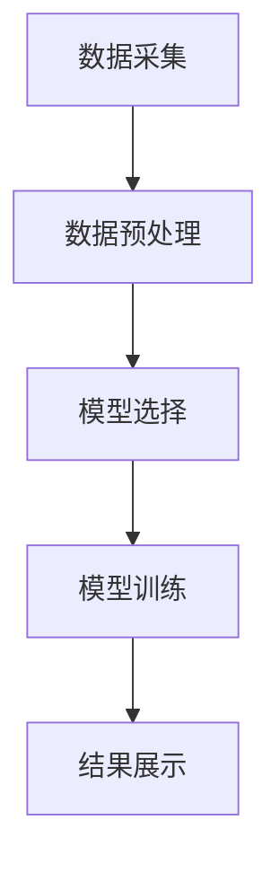

                 

# 全球股市估值与生物塑料在医疗领域的应用

> 关键词：全球股市估值，生物塑料，医疗应用，股市算法，材料科学

> 摘要：本文探讨了全球股市估值的核心概念与算法，以及生物塑料在医疗领域的创新应用。通过分析股市估值的关键算法和生物塑料的性能优化，本文展示了如何将技术与医学结合，推动医疗材料的可持续发展。文章最后总结了两者的结合与未来趋势。

---

# 第一部分: 全球股市估值的核心概念与算法

## 第1章: 股市估值的基本概念与算法

### 1.1 股市估值的核心概念

#### 1.1.1 股市估值的定义与意义

股市估值是通过分析公司财务数据、市场环境和宏观经济指标，对股票的内在价值进行评估的过程。其目的是帮助投资者判断股票是否被高估或低估。

- **定义**：股市估值是通过数学模型对股票价值进行估算。
- **意义**：帮助投资者做出理性投资决策，降低投资风险。

#### 1.1.2 股市估值的核心要素

| 要素 | 描述 |
|------|------|
| 收益 | 公司的净利润 |
| 资产 | 公司的资产规模 |
| 市场环境 | 宏观经济指标和市场情绪 |

#### 1.1.3 股市估值的边界与外延

股市估值不仅关注公司财务数据，还包括市场情绪、政策变化等外部因素。其外延涉及宏观经济分析和行业趋势研究。

### 1.2 股市估值的核心算法

#### 1.2.1 市盈率（P/E）模型

市盈率是股票价格与每股收益的比值，用于衡量股票的估值水平。

$$ P/E = \frac{Stock\ Price}{Earnings\ Per\ Share} $$

#### 1.2.2 现金流折现模型（DCF）

DCF模型通过将未来现金流折现到现值，评估股票的内在价值。

$$ V = \sum_{t=1}^{n} \frac{CF_t}{(1 + r)^t} $$

其中，\( r \) 是折现率，\( CF_t \) 是第 \( t \) 年的现金流。

#### 1.2.3 机器学习模型

使用回归分析和神经网络模型预测股票价格。

---

## 第2章: 股市估值系统的设计与实现

### 2.1 系统需求分析

#### 2.1.1 功能需求

- 数据采集：收集公司财务数据和市场数据。
- 模型选择：根据数据特征选择合适的估值模型。
- 结果展示：输出股票的估值结果和投资建议。

### 2.2 系统架构设计

### 2.3 系统实现

#### 2.3.1 数据预处理

对收集的数据进行清洗和特征提取，确保数据的准确性和完整性。

#### 2.3.2 模型训练

使用历史数据训练模型，评估模型的准确性和稳定性。

#### 2.3.3 结果展示

将模型输出的结果以可视化形式展示，方便用户理解和决策。

---

# 第二部分: 生物塑料在医疗领域的创新应用

## 第3章: 生物塑料的基本概念与优势

### 3.1 生物塑料的定义与分类

#### 3.1.1 定义

生物塑料是由可再生资源（如植物油、淀粉）制成的生物基塑料。

#### 3.1.2 分类

| 类型 | 描述 |
|------|------|
| 生物基塑料 | 以可再生资源为原料 |
| 生物降解塑料 | 可在自然环境中分解 |

### 3.2 生物塑料在医疗领域的优势

#### 3.2.1 环保性

生物塑料可生物降解，减少白色污染。

#### 3.2.2 安全性

生物塑料无毒，适用于医疗领域。

---

## 第4章: 生物塑料在医疗领域的应用

### 4.1 医疗材料的传统问题与挑战

#### 4.1.1 传统塑料的问题

- 不可降解，污染环境。
- 可能引发过敏反应。

### 4.2 生物塑料在医疗中的应用

#### 4.2.1 生物降解材料

用于手术缝合线和可降解药物载体。

#### 4.2.2 智能医疗设备

生物塑料可用于制造可穿戴设备和体内传感器。

---

## 第5章: 生物塑料的应用算法与优化

### 5.1 降解速率预测模型

#### 5.1.1 模型建立

通过实验数据建立降解速率预测模型。

$$ \text{降解速率} = a \cdot t + b $$

其中，\( a \) 和 \( b \) 是模型参数。

### 5.2 性能优化算法

#### 5.2.1 基于实验的优化

通过实验调整材料配方，优化性能。

#### 5.2.2 基于机器学习的优化

使用神经网络预测材料性能，优化配方设计。

---

# 第三部分: 结合与未来展望

## 第6章: 股市估值与生物塑料的结合

### 6.1 结合的可能性

#### 6.1.1 股市估值影响

生物塑料企业的股票估值可能受其技术进步影响。

### 6.2 未来趋势

#### 6.2.1 技术进步推动估值上升

生物塑料技术的突破可能提升相关企业的估值。

---

## 第7章: 总结与展望

### 7.1 总结

本文系统介绍了股市估值的核心算法和生物塑料在医疗中的应用，展示了两者的结合与创新。

### 7.2 展望

未来，随着技术进步，股市估值和生物塑料将在更多领域展现其潜力。

---

# 作者：AI天才研究院 & 禅与计算机程序设计艺术

