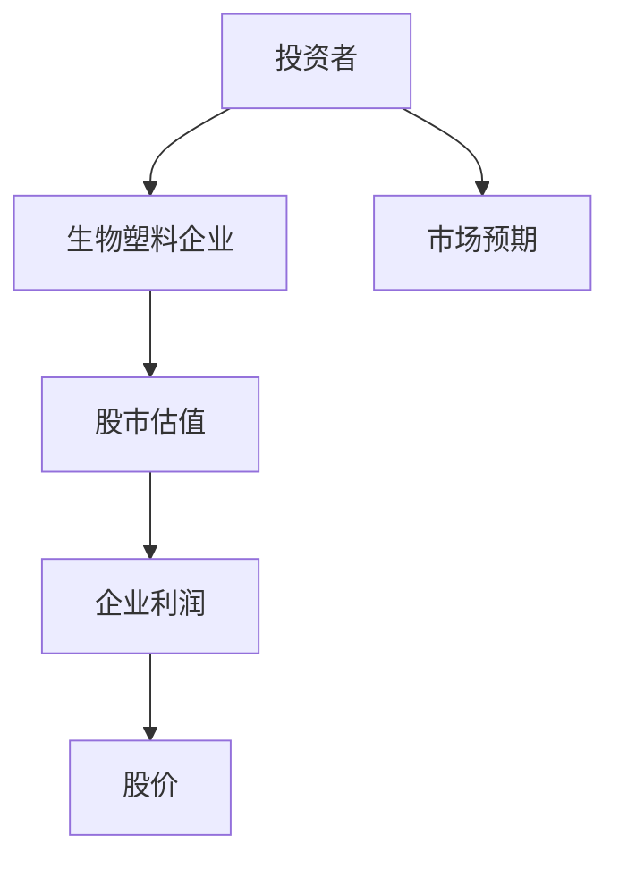
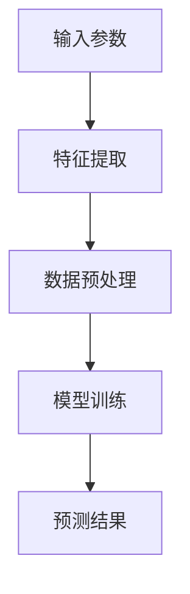
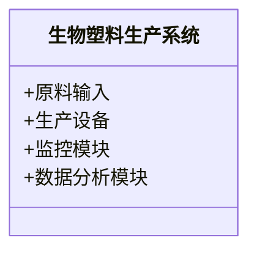
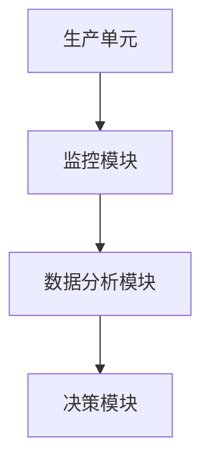

                 


# 全球股市估值与生物塑料规模化生产技术的关联

---

## 关键词
全球股市估值、生物塑料、规模化生产、技术关联、经济影响

---

## 摘要
本文探讨了全球股市估值与生物塑料规模化生产技术之间的关联性。通过分析生物塑料产业对全球经济的影响，预测其对股市估值的潜在影响，并提出基于机器学习的预测模型和优化算法，结合数学模型和系统架构设计，为投资者和企业提供了科学的决策参考。文章还通过实际案例分析和代码实现，深入探讨了生物塑料生产系统的优化与实现。

---

## 第一部分：全球股市估值与生物塑料规模化生产技术的关联概述

### #1章：全球股市估值的背景与现状

#### 1.1 全球股市估值的基本概念
- **1.1.1 股市估值的定义与意义**
  股市估值是衡量企业市场价值的重要指标，反映了投资者对企业的信心和市场预期。通过市盈率、市净率等指标，可以评估企业的投资价值。
  
- **1.1.2 全球主要股市的现状与特点**
  全球主要股市包括纽约证券交易所、纳斯达克、伦敦证券交易所等，每个市场的特点和行业分布不同，影响着整体股市估值的变化。

- **1.1.3 股市估值的核心指标与方法**
  - **核心指标**：市盈率（P/E）、市净率（P/B）、股息率（Dividend Yield）。
  - **方法**：DCF模型、相对估值法、指数估值法。

---

### #2章：生物塑料规模化生产技术的背景与现状

#### 2.1 生物塑料的基本概念
- **2.1.1 生物塑料的定义与分类**
  生物塑料是以可再生资源（如淀粉、纤维素）为原料，通过生物或化学方法制备的塑料。主要分为生物基塑料、可生物降解塑料和海洋降解塑料。

- **2.1.2 生物塑料的生产技术与工艺**
  - **发酵法**：利用微生物发酵生产聚乳酸（PLA）等生物基材料。
  - **化学法**：通过聚合反应制备生物基塑料。
  - **改性技术**：提高材料的机械性能和耐热性。

- **2.1.3 生物塑料的应用领域与市场前景**
  生物塑料广泛应用于包装、农业、汽车等领域，市场增长迅速，预计到2030年市场规模将超过1000亿美元。

---

### #3章：全球股市估值与生物塑料规模化生产的关联性分析

#### 3.1 问题背景与问题描述
- **3.1.1 生物塑料产业对全球经济的影响**
  生物塑料的推广将减少对传统石油基塑料的依赖，降低能源消耗和碳排放，推动绿色经济的发展。

- **3.1.2 生物塑料规模化生产对股市估值的潜在影响**
  - 投资者可能因生物塑料企业的环保表现而提高对其股票的估值。
  - 生物塑料技术的突破可能推动相关企业股价上涨。

- **3.1.3 研究问题的边界与外延**
  本文仅关注生物塑料规模化生产对股市估值的影响，不涉及其他因素如政策变化和全球经济波动。

#### 3.2 核心概念与联系
- **3.2.1 核心概念原理**
  生物塑料的生产成本和市场占有率直接影响企业的盈利能力，从而影响股市估值。

- **3.2.2 核心概念属性特征对比表格**
  | 属性        | 生物塑料生产技术 | 全球股市估值 |
  |-------------|------------------|--------------|
  | 影响因素     | 原料成本、技术成熟度 | 利润率、市场预期 |
  | 发展趋势     | 绿色化、高效化 | 低碳化、智能化 |

- **3.2.3 ER实体关系图架构的Mermaid流程图**


---

## 第二部分：生物塑料规模化生产技术的算法原理

### #4章：生物塑料规模化生产技术的算法原理

#### 4.1 算法原理讲解
- **4.1.1 生物塑料生产过程的优化算法**
  使用遗传算法优化生产参数，如温度、压力和时间，以提高生产效率。

- **4.1.2 基于机器学习的生产效率预测模型**
  使用随机森林算法预测生产效率，模型输入包括原料种类、设备状态等。

- **4.1.3 算法流程图的Mermaid展示**


#### 4.2 数学模型与公式分析
- **4.2.1 生物塑料生产成本的数学模型**
  $$\text{总成本} = \text{原料成本} + \text{设备成本} + \text{人工成本}$$

- **4.2.2 股市估值与生物塑料产量的关系公式**
  $$\text{股价} = \alpha \times \text{产量} + \beta \times \text{利润率} + \gamma \times \text{行业指数}$$

---

### #5章：系统分析与架构设计方案

#### 5.1 问题场景介绍
- **5.1.1 生物塑料生产系统的整体架构**
  包括生产单元、监控系统和数据分析模块。

- **5.1.2 系统功能设计的领域模型Mermaid类图**


- **5.1.3 系统架构设计的Mermaid架构图**


---

### #6章：项目实战与案例分析

#### 6.1 环境安装与系统核心实现
- **6.1.1 开发环境的安装与配置**
  安装Python、TensorFlow和Scikit-learn库。

- **6.1.2 系统核心代码的实现与解读**
  ```python
  import numpy as np
  from sklearn.ensemble import RandomForestRegressor

  # 示例数据
  X = np.array([[1, 2], [3, 4], [5, 6]])
  y = np.array([10, 20, 30])

  # 训练模型
  model = RandomForestRegressor(n_estimators=100)
  model.fit(X, y)

  # 预测
  print(model.predict([[7, 8]]))  # 输出预测结果
  ```

- **6.1.3 代码应用的实际案例分析**
  通过实际生产数据，训练模型预测未来产量，从而优化生产计划。

---

## 第三部分：最佳实践与小结

### #7章：最佳实践与小结

#### 7.1 最佳实践Tips
- **生物塑料生产中的注意事项**
  - 确保原料的可持续供应。
  - 定期维护生产设备，减少故障率。

- **股市估值分析中的关键点**
  - 关注企业的研发投入和技术创新能力。
  - 考虑行业政策和市场趋势的影响。

- **技术与市场的结合策略**
  - 加强技术研发，提高生产效率。
  - 积极拓展市场，扩大销售网络。

#### 7.2 小结与未来展望
- **全书内容总结**
  本文系统分析了全球股市估值与生物塑料规模化生产技术的关联性，提出了基于机器学习的预测模型和优化算法，并通过实际案例分析验证了模型的有效性。

- **未来研究方向与发展趋势**
  - 开发更高效的生物塑料生产技术。
  - 推动生物塑料在更多领域的应用，减少对传统塑料的依赖。

---

## 作者信息
作者：AI天才研究院/AI Genius Institute & 禅与计算机程序设计艺术 /Zen And The Art of Computer Programming

---

**页脚**
禁止商业用途，转载请注明出处

