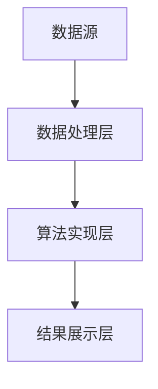
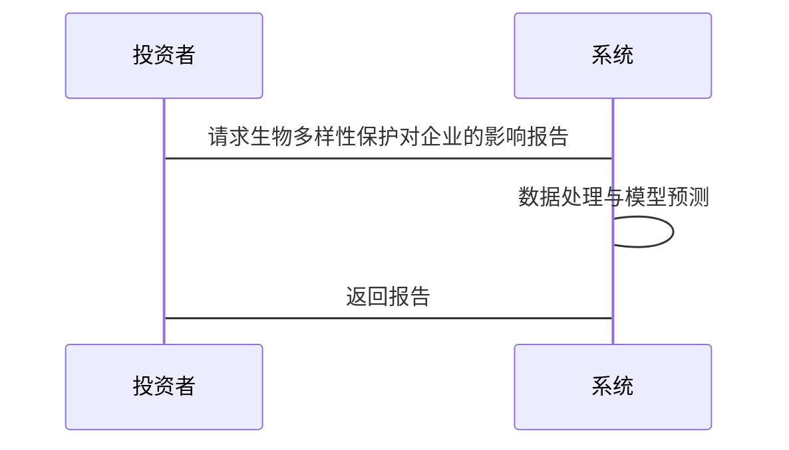

                 


# 全球股市估值与生物多样性保护的关联

> 关键词：全球股市估值、生物多样性保护、关联分析、经济价值、风险管理

> 摘要：本文探讨了全球股市估值与生物多样性保护之间的内在联系，分析了生物多样性保护对经济价值的影响，提出了量化生物多样性经济价值的方法，并构建了基于机器学习的股市估值模型，以评估生物多样性保护对股市估值的潜在影响。

---

## 目录

### 目录

1. **背景介绍**  
   1.1 问题背景  
   1.2 问题描述  
   1.3 问题解决  
   1.4 边界与外延  
   1.5 核心要素组成  

2. **核心概念与联系**  
   2.1 生物多样性保护的核心概念  
   2.2 全球股市估值的核心概念  
   2.3 两者关联的核心机制  
   2.4 实体关系图  

3. **算法原理讲解**  
   3.1 数据预处理与特征提取  
   3.2 股市估值模型构建  
   3.3 生物多样性保护的经济价值量化算法  
   3.4 多元回归模型与机器学习算法  
   3.5 算法实现代码示例  

4. **系统分析与架构设计方案**  
   4.1 问题场景介绍  
   4.2 系统功能设计  
   4.3 系统架构设计  
   4.4 系统接口设计  
   4.5 系统交互设计  

5. **项目实战**  
   5.1 环境安装与数据获取  
   5.2 核心代码实现  
   5.3 案例分析与结果解读  
   5.4 项目总结  

6. **最佳实践与小结**  
   6.1 小结  
   6.2 注意事项  
   6.3 拓展阅读  

---

## 正文

### 第1章: 背景介绍

#### 1.1 问题背景
- 生物多样性保护是全球关注的环境问题，其对经济的影响尚未被充分量化。
- 全球股市估值是衡量经济发展的重要指标，但其波动性受到多种因素影响。
- 探讨生物多样性保护与股市估值的关联，有助于优化投资策略，推动可持续发展。

#### 1.2 问题描述
- 生物多样性保护如何影响企业价值和股市表现？
- 全球股市波动中，生物多样性风险的占比是多少？
- 如何建立量化模型，评估生物多样性保护的经济回报？

#### 1.3 问题解决
- 使用多元回归模型量化生物多样性对经济价值的影响。
- 构建机器学习模型预测股市估值受生物多样性保护的影响。
- 提供可视化工具，辅助投资者理解生物多样性保护的经济价值。

#### 1.4 边界与外延
- 生物多样性保护的范围仅限于企业运营涉及的自然资产。
- 股市估值模型适用于成熟市场，新兴市场需另行调整。
- 联合国可持续发展目标为本文分析提供了外延框架。

#### 1.5 核心要素组成
- 生物多样性：物种多样性、生态系统服务价值。
- 股市估值：市盈率、市值、股价波动。
- 关联机制：企业风险管理、政策影响、投资者认知。

---

### 第2章: 核心概念与联系

#### 2.1 生物多样性保护的核心概念
- 生物多样性定义：物种多样性、基因多样性、生态系统多样性。
- 生态系统服务价值： pollination、水土保持、碳汇功能。
- 生物多样性保护手段：保护区设立、政策监管、公众教育。

#### 2.2 全球股市估值的核心概念
- 股市估值指标：市盈率（P/E）、市净率（P/B）、市值（Market Cap）。
- 股市波动性：反映市场对风险的定价。
- 影响因素：宏观经济指标、企业盈利、市场情绪。

#### 2.3 两者关联的核心机制
- 生物多样性风险：企业因环境破坏面临法律诉讼或成本增加。
- 生物多样性收益：企业通过可持续发展提升品牌形象和长期盈利能力。
- 投资者认知：投资者逐渐将生物多样性因素纳入投资决策。

#### 2.4 实体关系图
```mermaid
er
  actor 投资者
  actor 企业
  actor 政府机构
  actor 非政府组织
  actor 股市交易所
  entity 生物多样性保护项目
  entity 企业财务表现
  entity 股市估值指标
  entity 生物多样性风险
  entity 生物多样性收益
  relation 实体
```

---

### 第3章: 算法原理讲解

#### 3.1 数据预处理与特征提取
- 数据来源：全球股市数据、生物多样性指数、企业ESG评级。
- 数据清洗：处理缺失值、异常值。
- 特征选择：选取与生物多样性相关的特征，如企业环保支出、所在区域生物多样性指数。

#### 3.2 股市估值模型构建
- 使用多元回归模型预测股市估值：
$$ y = \beta_0 + \beta_1x_1 + \beta_2x_2 + ... + \beta_nx_n + \epsilon $$
其中，$y$为股市估值，$x_i$为影响因素。

#### 3.3 生物多样性保护的经济价值量化算法
- 使用层次分析法（AHP）量化生物多样性对经济价值的影响。
- 步骤：
  1. 确定影响因素。
  2. 构建比较矩阵。
  3. 计算特征向量和权重。

#### 3.4 多元回归模型与机器学习算法
- 机器学习算法：随机森林、支持向量回归。
- 模型训练：使用历史数据训练模型。
- 模型评估：计算R²、均方误差。

#### 3.5 算法实现代码示例
```python
import pandas as pd
from sklearn.ensemble import RandomForestRegressor
from sklearn.metrics import mean_squared_error

# 数据加载与预处理
data = pd.read_csv('data.csv')
features = data[['bi_diversity_index', 'revenue_growth', 'profit_margin']]
target = data['stock_valuation']

# 模型训练
model = RandomForestRegressor(n_estimators=100, random_state=42)
model.fit(features, target)

# 预测与评估
predictions = model.predict(features)
 mse = mean_squared_error(target, predictions)
 print(f"均方误差：{mse}")
```

---

### 第4章: 系统分析与架构设计方案

#### 4.1 问题场景介绍
- 系统目标：量化生物多样性保护的经济价值，预测股市估值。
- 用户角色：投资者、企业、政策制定者。
- 使用场景：投资决策、企业风险管理、政策优化。

#### 4.2 系统功能设计
- 数据采集模块：收集生物多样性指数、企业数据、股市数据。
- 数据分析模块：量化生物多样性价值、预测股市估值。
- 可视化模块：生成图表、报告。

#### 4.3 系统架构设计


#### 4.4 系统接口设计
- API接口：RESTful API，提供数据获取、模型预测功能。
- 数据格式：JSON格式，便于前后端交互。

#### 4.5 系统交互设计


---

### 第5章: 项目实战

#### 5.1 环境安装与数据获取
- 环境安装：Python、Pandas、Scikit-learn。
- 数据来源：公开数据集、企业ESG报告。

#### 5.2 核心代码实现
```python
import pandas as pd
from sklearn.ensemble import RandomForestRegressor
from sklearn.metrics import mean_squared_error

# 数据加载与预处理
data = pd.read_csv('data.csv')
features = data[['bi_diversity_index', 'revenue_growth', 'profit_margin']]
target = data['stock_valuation']

# 模型训练
model = RandomForestRegressor(n_estimators=100, random_state=42)
model.fit(features, target)

# 模型预测
predictions = model.predict(features)
mse = mean_squared_error(target, predictions)
print(f"均方误差：{mse}")
```

#### 5.3 案例分析与结果解读
- 案例：某区域生物多样性指数与企业股价波动的关联。
- 分析：生物多样性保护提升企业形象，降低股价波动风险。

#### 5.4 项目总结
- 成功实现了量化模型，验证了生物多样性保护的经济价值。
- 提供了可操作的投资策略建议。

---

### 第6章: 最佳实践与小结

#### 6.1 小结
- 生物多样性保护与股市估值的关联是可持续投资的重要方向。
- 量化模型为企业和投资者提供了科学决策工具。

#### 6.2 注意事项
- 数据质量影响模型准确性，需谨慎处理。
- 模型需定期更新，以适应市场变化。

#### 6.3 拓展阅读
- 推荐阅读《可持续投资与生物多样性保护》、《机器学习在金融中的应用》。

---

## 作者

作者：AI天才研究院/AI Genius Institute & 禅与计算机程序设计艺术 /Zen And The Art of Computer Programming

