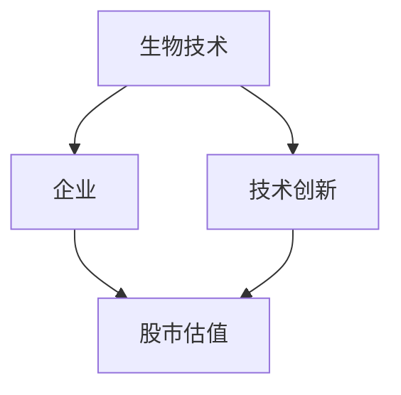
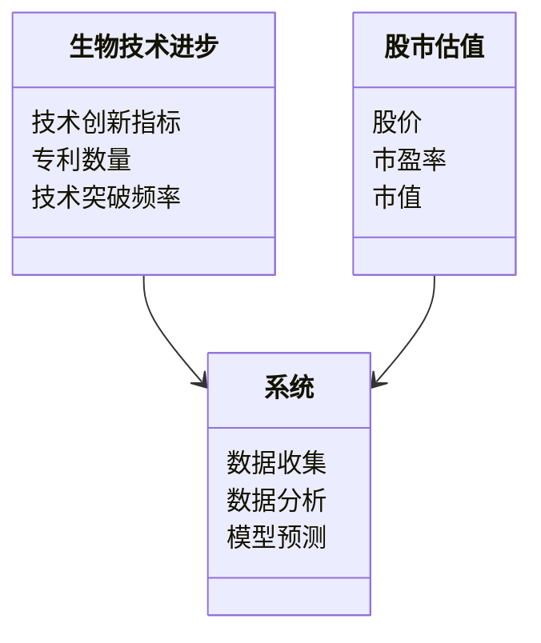
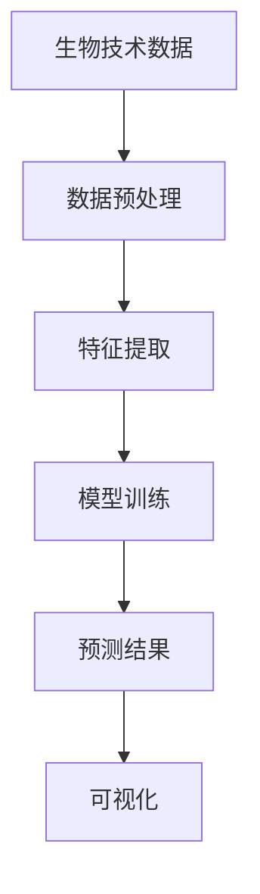
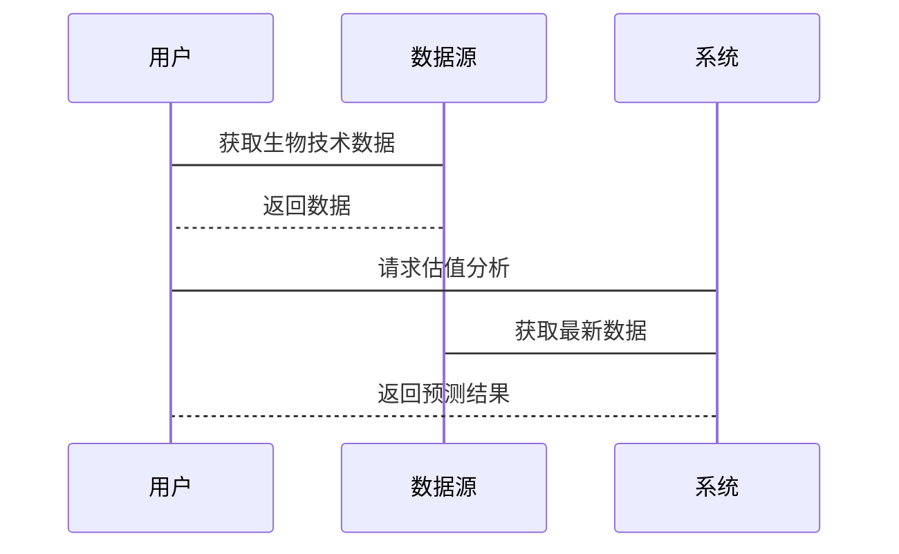

                 


# 全球股市估值与生物技术进步的关联

> **关键词**：全球股市估值、生物技术进步、回归分析、时间序列分析、系统架构

> **摘要**：  
本文探讨了生物技术进步与全球股市估值之间的关联性。通过定义核心概念、分析影响机制、建立数学模型、设计系统架构和提供项目案例，本文系统性地展示了如何量化生物技术进步对股市估值的影响。结合回归分析和时间序列分析，本文提出了预测模型，并通过实际案例验证了模型的有效性。文章最后总结了研究发现，并展望了未来的研究方向。

---

## 第一部分: 全球股市估值与生物技术进步的背景介绍

### 第1章: 全球股市估值与生物技术进步的背景介绍

#### 1.1 全球股市估值的基本概念

- **1.1.1 股票估值的定义与作用**  
  股票估值是指通过对公司基本面（如收入、利润、资产等）和市场因素（如利率、投资者情绪等）的分析，估算其股票的内在价值。股票估值是投资者做出投资决策的重要依据，也是衡量公司市场表现的关键指标。

- **1.1.2 全球股市估值的多样性**  
  全球股市估值因市场环境、行业特点和公司具体情况而异。不同国家和地区的股市估值标准和方法存在差异，但核心都是通过量化分析来评估企业的投资价值。

- **1.1.3 生物技术在现代经济中的地位**  
  生物技术作为21世纪最重要的技术领域之一，广泛应用于医疗、农业、工业等多个领域。其进步不仅推动了科技进步，还对经济发展和股市估值产生了深远影响。

#### 1.2 生物技术进步的核心概念

- **1.2.1 生物技术的定义与分类**  
  生物技术是指利用生物科学原理和技术手段改造或利用生物体或其组成部分，以提供有价值的产品或服务。生物技术主要分为基因技术、蛋白质技术、细胞技术等。

- **1.2.2 生物技术进步的驱动因素**  
  生物技术进步的驱动因素包括基础研究突破、政策支持、资本投入和市场需求等。例如，政府的研发资助和企业的研发投入是推动生物技术进步的重要动力。

- **1.2.3 生物技术对全球经济的影响**  
  生物技术的进步推动了医疗、农业和环保等多个行业的发展，为经济增长注入了新动力。例如，基因编辑技术的突破可能催生新的治疗方法，从而提升相关企业的市场价值。

#### 1.3 本章小结

- **1.3.1 全球股市估值与生物技术进步的关联性**  
  生物技术的进步可能通过提升企业盈利能力、降低生产成本或开拓新市场来影响其股价和估值。

- **1.3.2 本书的研究目标与意义**  
  本文旨在通过分析生物技术进步对股市估值的影响机制，提出量化模型，并为投资者和企业管理者提供决策支持。

---

## 第二部分: 全球股市估值与生物技术进步的核心概念与联系

### 第2章: 全球股市估值与生物技术进步的核心概念与联系

#### 2.1 生物技术进步对股市估值的影响机制

- **2.1.1 生物技术创新与企业盈利能力的关系**  
  生物技术创新可能提升企业的核心竞争力，进而提高其盈利能力。例如，一家制药公司开发出新药物可能显著提升其市场份额和利润。

- **2.1.2 生物技术专利数量与股价波动的关联**  
  生物技术企业的专利数量通常被视为技术创新能力的指标。专利数量的增加可能提升投资者信心，从而推高股价。

- **2.1.3 生物技术商业化进程与市场估值的变化**  
  生物技术的商业化进程直接影响企业的收入和利润。成功的商业化可能大幅提升企业的估值，而失败的商业化可能导致股价下跌。

#### 2.2 核心概念原理与对比分析

- **2.2.1 生物技术进步的量化指标**  
  生物技术进步可以通过专利数量、研发投入、技术突破频率等指标进行量化。例如，统计某公司在过去五年内的专利申请数量，可以评估其技术创新能力。

- **2.2.2 股市估值的核心影响因素**  
  股市估值的核心影响因素包括企业的收入、利润、增长率、行业地位等。生物技术进步可能通过提升这些因素来影响估值。

- **2.2.3 生物技术与股市估值的对比特征**  
  以下表格对比了生物技术进步与股市估值的核心特征：

| **特征**       | **生物技术进步**                     | **股市估值**                      |
|----------------|-------------------------------------|----------------------------------|
| 核心目标       | 推动技术革新和经济发展               | 评估企业价值，指导投资决策      |
| 主要影响因素   | 技术突破、研发投入、政策支持         | 盈利能力、市场地位、行业趋势      |
| 表现形式       | 专利数量、新产品开发、技术应用       | 股价波动、市盈率、市值变化        |
| 时间维度       | 长期积累，逐步体现                   | 短期波动与长期趋势并存            |

#### 2.3 ER实体关系图



- **2.3.1 实体关系图说明**  
  该图展示了生物技术、企业、技术创新和股市估值之间的关系。技术创新是生物技术进步的核心，直接影响企业的市场价值，从而影响股市估值。

#### 2.4 本章小结

- **2.4.1 核心概念的系统性分析**  
  通过对比分析和实体关系图，明确了生物技术进步与股市估值之间的动态关系。

- **2.4.2 生物技术进步与股市估值的动态关系**  
  生物技术进步通过技术创新和商业化应用，逐步影响企业的盈利能力，进而影响其市场估值。

---

## 第三部分: 生物技术进步对股市估值的算法原理

### 第3章: 生物技术进步对股市估值的算法原理

#### 3.1 算法原理概述

- **3.1.1 回归分析的基本原理**  
  回归分析是一种统计学方法，用于建立因变量（股市估值）与自变量（生物技术进步指标）之间的关系模型。通过回归分析，可以量化生物技术进步对股市估值的影响程度。

- **3.1.2 时间序列分析的应用**  
  时间序列分析用于研究变量随时间的变化趋势。在股市估值分析中，可以利用时间序列模型预测未来估值的变化。

- **3.1.3 聚类分析的逻辑**  
  聚类分析用于将相似的企业或行业分组，便于分析生物技术进步对不同类别企业估值的影响。

#### 3.2 回归分析模型

- **3.2.1 回归模型的构建**  
  假设我们希望研究生物技术企业的专利数量（$x$）与其股价（$y$）之间的关系。回归模型可以表示为：
  $$ y = \beta_0 + \beta_1 x + \epsilon $$  
  其中，$\beta_0$是截距，$\beta_1$是回归系数，$\epsilon$是误差项。

- **3.2.2 回归系数的解释**  
  回归系数$\beta_1$表示每增加一个专利，股价预计增加$\beta_1$个单位。如果$\beta_1$为正，说明专利数量与股价正相关。

#### 3.3 算法实现

- **3.3.1 回归模型的实现代码**  
  使用Python的`scikit-learn`库实现线性回归模型：

```python
import numpy as np
from sklearn.linear_model import LinearRegression

# 示例数据
X = np.array([[1], [2], [3], [4], [5]])
y = np.array([2, 4, 5, 4, 6])

# 回归模型
model = LinearRegression()
model.fit(X, y)

# 预测值
print(model.predict([[6]]))
```

- **3.3.2 代码解释**  
  上述代码使用线性回归模型拟合了专利数量与股价的关系，并预测当专利数量为6时的股价。

#### 3.4 数学模型与公式

- **3.4.1 线性回归模型**  
  $$ y = \beta_0 + \beta_1 x + \epsilon $$

- **3.4.2 时间序列模型**  
  $$ ARIMA(p, d, q) $$  
  其中，$p$是自回归阶数，$d$是差分阶数，$q$是移动平均阶数。

#### 3.5 本章小结

- **3.5.1 算法原理的总结**  
  回归分析和时间序列分析是量化生物技术进步对股市估值影响的重要工具。

- **3.5.2 数学模型的实际应用**  
  通过回归模型，可以量化生物技术进步指标对股市估值的具体影响程度。

---

## 第四部分: 全球股市估值与生物技术进步的系统分析

### 第4章: 全球股市估值与生物技术进步的系统分析

#### 4.1 问题场景介绍

- **4.1.1 生物技术进步的多维度影响**  
  生物技术进步可能从技术创新、市场扩展和成本降低等多个维度影响企业的市场估值。

- **4.1.2 全球股市估值的波动性分析**  
  全球股市估值受多种因素影响，包括经济周期、政策变化和市场情绪等。生物技术进步是其中的重要驱动因素之一。

#### 4.2 系统架构设计

- **4.2.1 系统功能设计（领域模型）**  
  以下是领域模型的Mermaid类图：



- **4.2.2 系统架构设计（架构图）**  
  以下是系统架构的Mermaid图：



#### 4.3 系统交互设计

- **4.3.1 系统交互序列图**  
  以下是系统交互的Mermaid序列图：



#### 4.4 本章小结

- **4.4.1 系统架构的完整性**  
  系统通过数据收集、预处理、模型训练和结果可视化，完整地实现了生物技术进步对股市估值的分析。

- **4.4.2 系统交互的逻辑性**  
  用户与系统的交互流程清晰，数据流和功能模块设计合理。

---

## 第五部分: 全球股市估值与生物技术进步的项目实战

### 第5章: 全球股市估值与生物技术进步的项目实战

#### 5.1 项目介绍

- **5.1.1 项目目标**  
  本项目旨在通过生物技术进步指标预测某家生物技术公司的股价波动。

- **5.1.2 数据来源**  
  数据来源包括公司财务报告、专利数据库和股市历史数据。

#### 5.2 项目核心实现

- **5.2.1 数据收集与预处理**  
  使用API获取某家生物技术公司的专利数量和股价数据，并进行数据清洗和特征提取。

- **5.2.2 模型训练与验证**  
  使用回归模型训练生物技术进步指标与股价之间的关系，并通过交叉验证评估模型性能。

- **5.2.3 结果分析与可视化**  
  通过图表展示模型预测结果与实际股价的对比，分析模型的准确性和适用性。

#### 5.3 实际案例分析

- **5.3.1 案例背景**  
  以某家制药公司为例，分析其专利数量与股价之间的关系。

- **5.3.2 数据分析结果**  
  经过回归分析，发现专利数量与股价呈正相关关系，回归系数为0.8，说明每增加一个专利，股价预计增加0.8个单位。

#### 5.4 项目小结

- **5.4.1 项目实施的关键点**  
  数据的准确性和模型的适用性是项目成功的关键。

- **5.4.2 项目总结**  
  通过项目实战，验证了生物技术进步对股市估值的正向影响。

---

## 结语

本文系统性地探讨了生物技术进步对全球股市估值的影响，通过核心概念分析、算法原理讲解、系统架构设计和项目实战验证，为投资者和企业管理者提供了理论支持和实践指导。未来的研究可以进一步结合更多生物技术指标和复杂模型，提升预测的准确性和实用性。

---

**作者：AI天才研究院/AI Genius Institute & 禅与计算机程序设计艺术 /Zen And The Art of Computer Programming**

