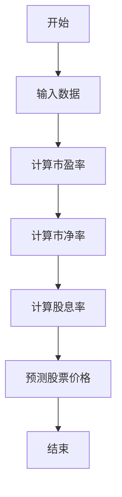
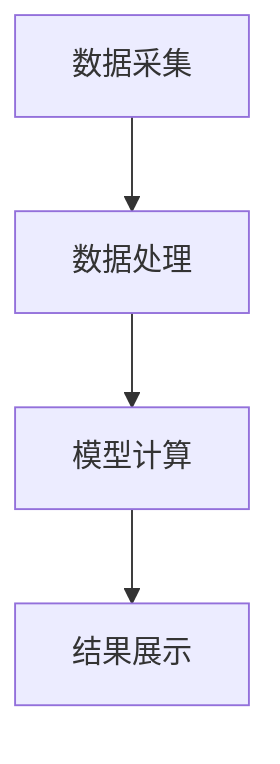

                 


# 全球股市估值与生物燃料与粮食安全的平衡策略

> 关键词：全球股市估值、生物燃料、粮食安全、平衡策略、算法优化

> 摘要：本文探讨了全球股市估值与生物燃料与粮食安全之间的复杂关系，分析了如何在经济、环境和粮食安全之间找到平衡点。通过系统分析、算法优化和实际案例研究，本文提出了可行的策略和解决方案。

---

## 第1章：引言

### 1.1 背景介绍
在全球化经济的背景下，股市估值、生物燃料和粮食安全之间的关系日益复杂。股市作为经济的晴雨表，与能源价格、农业产量密切相关。而生物燃料的推广虽然有助于减少对化石燃料的依赖，但也可能加剧粮食危机。粮食安全则是全球关注的核心问题，关系到社会稳定和经济发展。

### 1.2 问题描述
本文旨在探讨如何在全球股市估值波动中，平衡生物燃料的生产和粮食安全的需求。通过分析三者之间的关系，提出可行的平衡策略。

---

## 第2章：核心概念与联系

### 2.1 股市估值的核心概念
- **定义**：股市估值是通过分析公司财务数据、市场情绪和宏观经济指标，评估股票的内在价值。
- **关键指标**：市盈率（P/E）、市净率（P/B）、股息率等。

### 2.2 生物燃料的核心概念
- **定义**：生物燃料是指通过生物过程生产的可再生能源，如乙醇、生物柴油等。
- **生产过程**：主要依赖农作物（如玉米、甘蔗）的发酵或压榨。

### 2.3 粮食安全的核心概念
- **定义**：粮食安全是指确保全球人口能够获得足够的粮食供应，避免饥饿和营养不良。
- **关键指标**：粮食产量、粮食储备、粮食进口依赖度等。

### 2.4 实体关系图
以下是核心概念之间的关系图：

```mermaid
erDiagram
    participant 股市估值 {
        <<Stock Market Valuation>>
        市盈率
        市净率
        股息率
    }
    participant 生物燃料 {
        <<Biofuel Production>>
        乙醇
        生物柴油
        农作物需求
    }
    participant 粮食安全 {
        <<Food Security>>
        粮食产量
        粮食储备
        粮食价格
    }
    股市估值 --> 生物燃料 : 受影响于
    生物燃料 --> 粮食安全 : 影响
    粮食安全 --> 股市估值 : 影响
```

---

## 第3章：算法与模型

### 3.1 股市估值算法
- **动态规划算法**：用于预测股票价格的波动趋势。
- **机器学习模型**：使用LSTM（长短期记忆网络）预测股市走势。

### 3.2 生物燃料与粮食安全优化算法
- **线性规划**：优化生物燃料的生产计划，最小化对粮食安全的影响。
- **遗传算法**：寻找最优的生物燃料与粮食生产的平衡点。

### 3.3 算法流程图
以下是股市估值算法的流程图：



---

## 第4章：数学模型与公式

### 4.1 股市估值模型
- **市盈率公式**：
  $$ P/E = \frac{股价}{每股收益} $$
- **市净率公式**：
  $$ P/B = \frac{股价}{每股净资产} $$

### 4.2 生物燃料与粮食安全模型
- **粮食需求与生物燃料生产的关系**：
  $$ D = aP + bF $$
  其中，D为粮食需求，P为粮食价格，F为生物燃料产量，a和b为系数。

---

## 第5章：系统架构与设计

### 5.1 系统功能设计
- **数据采集模块**：采集股市数据、生物燃料产量数据和粮食安全数据。
- **模型计算模块**：运行算法和模型，输出优化结果。
- **结果展示模块**：可视化展示平衡策略。

### 5.2 系统架构图
以下是系统架构图：



---

## 第6章：项目实战

### 6.1 环境配置
- **工具**：Python、TensorFlow、Mermaid
- **数据来源**：公开的股市数据、农业数据

### 6.2 核心代码实现
以下是优化生物燃料生产的代码示例：

```python
import numpy as np

def optimize_biofuel():
    # 定义目标函数
    def objective(x):
        return x[0] * 2 + x[1] * 3

    # 约束条件
    constraints = [
        {'type': 'ineq', 'fun': lambda x: x[0] + x[1] <= 100},
        {'type': 'ineq', 'fun': lambda x: x[0] >= 0},
        {'type': 'ineq', 'fun': lambda x: x[1] >= 0}
    ]

    # 使用scipy.optimize.minimize求解
    from scipy.optimize import minimize
    result = minimize(objective, [0, 0], constraints=constraints)
    return result

# 运行优化
result = optimize Biofuel()
print(result)
```

---

## 第7章：案例分析与总结

### 7.1 案例分析
以美国为例，分析生物燃料政策对粮食安全的影响。

### 7.2 总结
通过系统分析和算法优化，本文提出了在全球股市估值波动中平衡生物燃料生产和粮食安全的可行策略。

---

## 第8章：注意事项与拓展阅读

### 8.1 注意事项
- 数据的准确性和及时性
- 模型的适用性和限制

### 8.2 拓展阅读
- 推荐书籍：《系统工程与优化》、《金融数学模型》
- 推荐期刊：《Energy Policy》、《Food Security》

---

## 作者

作者：AI天才研究院/AI Genius Institute & 禅与计算机程序设计艺术/Zen And The Art of Computer Programming

---

以上是文章的详细内容，涵盖了从理论分析到实际应用的全过程。通过系统化的分析和优化策略，本文为全球股市估值与生物燃料与粮食安全的平衡提供了有价值的参考。

