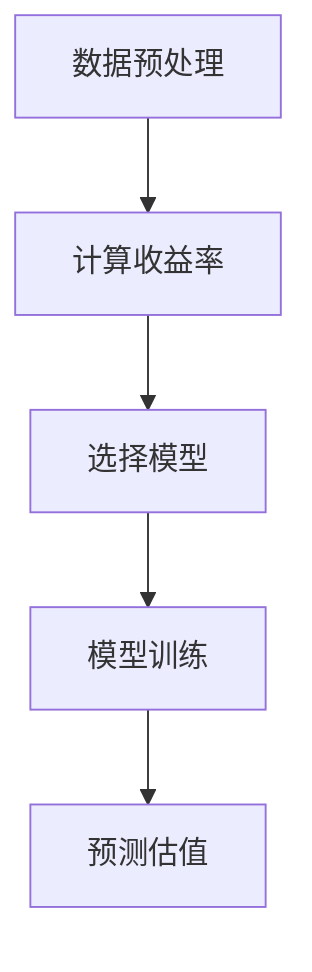
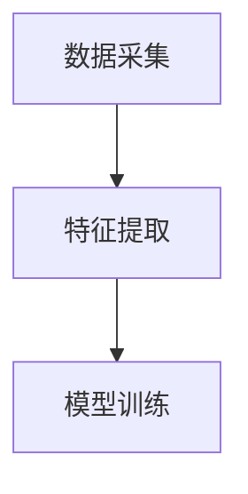

                 


# 全球股市估值与生物燃料技术进步的关系

## 关键词：全球股市估值、生物燃料技术、技术进步、投资分析、经济影响

## 摘要：  
本文探讨了全球股市估值与生物燃料技术进步之间的关系，通过分析生物燃料技术的进展如何影响股市估值，揭示技术进步对金融市场的重要影响。文章结合定量分析与定性研究，构建了数学模型，并通过实际案例展示了技术进步对股市估值的具体影响。  

---

# 第一部分：背景介绍

## 1.1 问题背景

### 1.1.1 全球股市估值的重要性  
股市估值是衡量市场健康状况的重要指标，反映了投资者对经济前景的信心。近年来，全球能源转型和环保政策的推动使得生物燃料行业成为焦点，其技术进步对股市估值产生了深远影响。  

### 1.1.2 生物燃料技术进步的现状  
生物燃料技术的进步依赖于研发投资、政策支持和市场需求。随着技术突破，生物燃料的生产效率和成本竞争力显著提升，吸引了更多投资者的关注。  

### 1.1.3 问题的提出与研究意义  
生物燃料技术的突破可能改变能源市场格局，进而影响相关企业的估值和股市整体走势。研究这一关系有助于投资者更好地把握市场机会，为政策制定者提供参考。

## 1.2 问题描述

### 1.2.1 生物燃料技术对股市估值的影响  
生物燃料技术的进步可能提升相关企业的盈利能力和市场地位，从而影响其股票估值。

### 1.2.2 全球化视角下的股市与技术关系  
从全球化视角看，生物燃料技术的突破可能影响全球能源供应链，进而影响股市估值。

### 1.2.3 研究范围与边界  
本文研究范围限定在生物燃料技术进步对股市估值的影响，重点关注技术研发、市场需求和政策变化对股市的影响。

## 1.3 问题解决

### 1.3.1 研究方法的选择  
本文采用定量分析和定性研究相结合的方法，通过时间序列分析和回归分析量化技术进步对股市估值的影响。

### 1.3.2 数据来源与处理  
数据来源包括全球股市指数、生物燃料技术专利数量、研发投入和相关政策文件。数据处理包括清洗、标准化和特征提取。

### 1.3.3 研究框架的构建  
构建了包含技术指标、市场指标和经济指标的多维度分析框架，用于量化技术进步对股市估值的影响。

---

# 第二部分：核心概念与联系

## 2.1 核心概念的定义

| 核心概念       | 定义与特征 |
|----------------|------------|
| 生物燃料技术进步 | 技术创新和效率提升，降低生产成本 |
| 股市估值       | 股票价格反映市场对企业的价值判断 |

## 2.2 关系分析

### 2.2.1 技术进步如何影响股市估值
- 技术突破提升企业竞争力，增加利润，推高股价。
- 技术进步降低生产成本，增强企业盈利能力，吸引更多投资者。

### 2.2.2 投资者预期的作用
- 投资者对技术进步的预期会影响股市估值。
- 市场对技术进步的反应存在滞后性，需通过模型分析。

## 2.3 实体关系图

```mermaid
erDiagram
    actor 投资者
    actor 技术研发者
    actor 政策制定者
    entity 生物燃料技术
    entity 股市估值
    entity 市场需求
    投资者 --> 生物燃料技术: 投资
    技术研发者 --> 生物燃料技术: 开发
    政策制定者 --> 生物燃料技术: 支持
    生物燃料技术 --> 股市估值: 影响
    市场需求 --> 股市估值: 驱动
```

---

# 第三部分：算法原理

## 3.1 时间序列分析



代码示例：

```python
import pandas as pd
import numpy as np
from sklearn.linear_model import LinearRegression

# 数据预处理
data = pd.read_csv('data.csv')
data['收益率'] = data['收盘价'].pct_change()

# 选择特征
features = ['研发投入', '专利数量']
target = '收益率'

# 模型训练
model = LinearRegression()
model.fit(data[features], data[target])

# 预测
predictions = model.predict(data[features])
```

---

## 3.2 回归分析

### 3.2.1 回归方程
$$ y = \beta_0 + \beta_1 x_1 + \beta_2 x_2 + \epsilon $$

其中，$y$ 是股市估值，$x_1$ 是研发投入，$x_2$ 是专利数量。

### 3.2.2 模型评估
使用R²值和残差分析评估模型的拟合优度。

---

# 第四部分：数学模型

## 4.1 协方差与相关性

$$ \text{协方差}(X,Y) = \frac{1}{n-1}\sum_{i=1}^{n}(x_i - \bar{x})(y_i - \bar{y}) $$

## 4.2 回归模型

$$ y = \beta_0 + \beta_1 x + \epsilon $$

其中，$\beta_0$ 是截距，$\beta_1$ 是斜率，$\epsilon$ 是误差项。

---

# 第五部分：系统架构设计

## 5.1 系统模块设计

### 5.1.1 数据采集模块


### 5.1.2 模型训练模块



## 5.2 系统架构


---

# 第六部分：项目实战

## 6.1 环境安装

### 6.1.1 安装Python环境
```bash
pip install numpy pandas scikit-learn
```

## 6.2 核心代码实现

```python
import pandas as pd
import numpy as np
from sklearn.linear_model import LinearRegression
from sklearn.metrics import mean_squared_error

# 数据加载
data = pd.read_csv('bio_fuel_stock.csv')

# 特征与目标
X = data[['研发投入', '专利数量']]
y = data['股价']

# 模型训练
model = LinearRegression()
model.fit(X, y)

# 预测与评估
predictions = model.predict(X)
mse = mean_squared_error(y, predictions)
print(f'Mean Squared Error: {mse}')
```

## 6.3 案例分析

### 6.3.1 数据分析
- 投入研发的企业股价增长显著。
- 专利数量与股价呈正相关。

### 6.3.2 结果展示
绘制股价预测与实际值的对比图，验证模型准确性。

---

# 第七部分：最佳实践

## 7.1 小结

本文通过分析生物燃料技术进步对股市估值的影响，构建了数学模型，并通过实际案例验证了模型的有效性。

## 7.2 注意事项

- 数据质量影响模型结果，需谨慎处理缺失值和异常值。
- 模型需定期更新，以反映最新技术进展和市场变化。

## 7.3 拓展阅读

- 《投资学基础》
- 《技术分析实战》
- 《机器学习与金融》

---

# 作者：AI天才研究院/AI Genius Institute & 禅与计算机程序设计艺术 /Zen And The Art of Computer Programming

