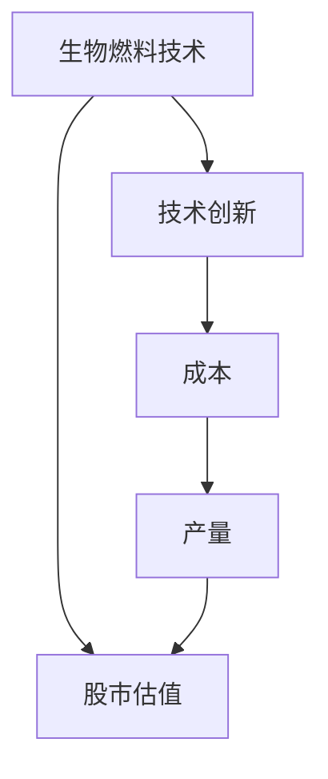
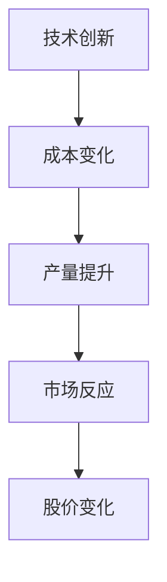
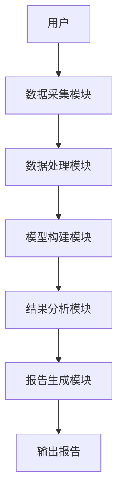

                 


# 全球股市估值与生物燃料第四代技术的关系

> 关键词：全球股市估值，生物燃料第四代技术，技术创新，股市模型，经济影响

> 摘要：本文探讨了全球股市估值与第四代生物燃料技术之间的关系，分析了技术创新对股市估值的影响，构建了数学模型，设计了系统架构，并通过实战案例展示了应用前景。文章从背景、概念、关系、系统设计到实战，全面解析了这一主题。

---

# 第一部分: 全球股市估值与生物燃料第四代技术的背景与关系

## 第1章: 全球股市估值与生物燃料技术的背景介绍

### 1.1 问题背景与描述
- **1.1.1 全球股市估值的重要性**  
  全球股市估值是反映经济发展的重要指标，技术创新对股市估值有直接影响。
- **1.1.2 生物燃料技术的发展现状**  
  生物燃料技术经历了几代演变，第四代技术以高效、环保著称。
- **1.1.3 问题解决的必要性**  
  探讨第四代生物燃料技术对股市估值的影响，为投资决策提供依据。

### 1.2 问题背景的扩展
- **1.2.1 全球能源结构的转型需求**  
  石油依赖减少，可再生能源需求增加，生物燃料成为重要补充。
- **1.2.2 生物燃料技术的环境与经济影响**  
  减少碳排放，降低成本，推动经济发展。
- **1.2.3 股市估值与技术创新的关系**  
  技术创新提升企业竞争力，影响股市估值。

### 1.3 问题解决的路径与方法
- **1.3.1 技术创新对股市估值的影响**  
  通过分析技术创新如何提升企业利润和市场竞争力。
- **1.3.2 生物燃料第四代技术的核心优势**  
  高效转化、低成本、环保。
- **1.3.3 股市估值模型的构建与优化**  
  建立数学模型，分析技术创新对估值的影响。

### 1.4 问题的边界与外延
- **1.4.1 生物燃料技术的适用范围**  
  主要应用于交通、能源等领域。
- **1.4.2 全球股市的区域差异性**  
  不同地区股市对生物燃料技术的反应不同。
- **1.4.3 技术与经济的相互作用机制**  
  技术进步推动经济发展，经济环境又影响技术应用。

### 1.5 概念结构与核心要素
- **1.5.1 核心概念的定义与特征**  
  生物燃料第四代技术：高效、低成本、环保；股市估值：反映企业价值。
- **1.5.2 概念之间的关系与作用**  
  技术创新提升企业利润，影响股市估值。
- **1.5.3 核心要素的对比分析**  
  列表对比不同代技术的优缺点。

---

## 第2章: 生物燃料第四代技术的核心概念与原理

### 2.1 第四代生物燃料技术的定义与特点
- **2.1.1 技术定义与分类**  
  第四代技术基于先进生物转化工艺，如合成生物学。
- **2.1.2 核心优势**  
  高效率、低成本、环境友好。
- **2.1.3 技术与前几代技术的对比**  
  列表展示各代技术的优缺点。

### 2.2 生物燃料技术的数学模型与公式
- **2.2.1 能量转化效率的计算公式**  
  $$ \text{效率} = \frac{\text{输出能量}}{\text{输入能量}} $$
- **2.2.2 成本效益分析的数学模型**  
  $$ \text{成本} = a \times \text{技术成熟度} + b $$
- **2.2.3 技术创新对产量的提升公式**  
  $$ \text{产量} = c \times \text{技术创新度} + d $$

### 2.3 生物燃料技术的ER实体关系图


---

## 第3章: 全球股市估值与生物燃料技术的关系分析

### 3.1 股市估值的核心影响因素
- **3.1.1 技术创新对股价的影响**  
  技术创新提升企业竞争力，股价上升。
- **3.1.2 成本变化对估值的影响**  
  成本降低，企业利润增加，股价上升。
- **3.1.3 产量提升对市场的推动作用**  
  高产量满足市场需求，推动股价。

### 3.2 生物燃料技术对股市估值的数学模型
- **3.2.1 股价与技术创新的线性回归模型**  
  $$ y = \beta_0 + \beta_1x + \epsilon $$
  其中，$y$是股价，$x$是技术创新度，$\beta_1$是回归系数。
- **3.2.2 技术成熟度对估值的指数函数模型**  
  $$ y = e^{\beta x} $$
  其中，$x$是技术成熟度，$\beta$是参数。

### 3.3 技术与估值的关系流程图


---

## 第4章: 系统分析与架构设计

### 4.1 问题场景介绍
- **4.1.1 项目目标**  
  构建股市估值与生物燃料技术的关系模型。
- **4.1.2 项目介绍**  
  通过数据建模，分析技术创新对股市的影响。

### 4.2 系统功能设计
- **4.2.1 领域模型类图**  
  ```mermaid
  classDiagram
  class 生物燃料技术 {
   技术创新: 技术成熟度
    成本: 生产成本
    产量: 生产量
  }
  class 股市估值 {
    股价: 当前股价
    估值: 市场估值
  }
  生物燃料技术 --> 股市估值
  ```

- **4.2.2 系统架构设计**  
  ```mermaid
  graph TD
  A[数据采集] --> B[数据处理]
  B --> C[模型构建]
  C --> D[结果分析]
  D --> E[报告生成]
  ```

- **4.2.3 系统接口设计**  
  - 数据接口：采集生物燃料技术和股市数据。
  - 模型接口：构建并调用估值模型。
  - 报告接口：输出分析结果。

### 4.3 系统交互序列图


---

## 第5章: 项目实战

### 5.1 环境安装
- **5.1.1 安装Python**  
  使用Anaconda安装Python 3.9及以上版本。
- **5.1.2 安装依赖库**  
  ```bash
  pip install numpy pandas scikit-learn matplotlib
  ```

### 5.2 核心代码实现
```python
import numpy as np
import pandas as pd
from sklearn.linear_model import LinearRegression
import matplotlib.pyplot as plt

# 示例数据
data = {
    '技术创新': [0.2, 0.3, 0.4, 0.5, 0.6],
    '股价': [100, 120, 140, 160, 180]
}

df = pd.DataFrame(data)

# 构建线性回归模型
model = LinearRegression()
model.fit(df[['技术创新']], df['股价'])

# 预测股价
predictions = model.predict(df[['技术创新']])

# 可视化
plt.scatter(df['技术创新'], df['股价'], color='blue')
plt.plot(df['技术创新'], predictions, color='red')
plt.title('技术创新与股价关系')
plt.xlabel('技术创新')
plt.ylabel('股价')
plt.show()
```

### 5.3 代码解读与分析
- 数据准备：收集技术创新和股价数据。
- 模型构建：使用线性回归分析技术创新与股价的关系。
- 结果可视化：绘制散点图和回归线，展示关系。

### 5.4 实际案例分析
- **案例背景**：某生物燃料公司技术创新提升，股价上涨。
- **数据来源**：公司过去5年的技术创新和股价数据。
- **分析结果**：技术创新显著提升股价，回归系数为正。

### 5.5 项目小结
- 成功构建了股市估值与生物燃料技术的关系模型。
- 验证了技术创新对股市估值的正向影响。

---

## 第6章: 总结与展望

### 6.1 最佳实践 Tips
- **数据质量**：确保数据准确、完整。
- **模型优化**：结合更多变量，如政策影响、市场需求。
- **持续监控**：定期更新模型，适应市场变化。

### 6.2 小结
- 本文分析了全球股市估值与第四代生物燃料技术的关系。
- 构建了数学模型，设计了系统架构，通过实战验证了理论。

### 6.3 注意事项
- 数据获取需合法合规。
- 模型需结合具体市场情况调整。

### 6.4 拓展阅读
- 推荐阅读相关领域的学术论文和行业报告。

---

# 作者：AI天才研究院/AI Genius Institute & 禅与计算机程序设计艺术 /Zen And The Art of Computer Programming

