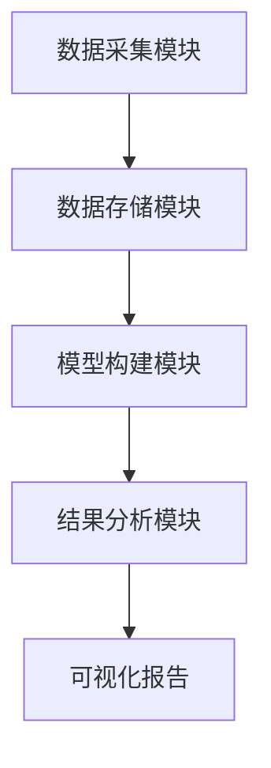

                 


# 全球股市估值与知识产权保护的关联

> 关键词：全球股市估值，知识产权保护，经济影响，法律，数据分析，数学模型

> 摘要：本文探讨了全球股市估值与知识产权保护之间的关联，分析了知识产权保护对股市估值的影响机制，包括企业创新、市场竞争力、投资者信心等方面，并通过数学模型和实证分析，揭示了知识产权保护对全球经济和股市估值的重要作用。

---

## 第一部分：全球股市估值与知识产权保护的背景

### 第1章：全球股市估值的基本概念

#### 1.1 全球股市估值的定义与影响因素

- **全球股市估值的定义**  
  全球股市估值是指对全球范围内所有上市公司市值的总和进行评估，用于衡量全球经济的健康状况和市场信心。

- **影响股市估值的主要因素**  
  1. 经济指标（GDP增长率、通货膨胀率等）。  
  2. 利率水平和货币政策。  
  3. 企业盈利能力和成长潜力。  
  4. 投资者情绪和市场预期。

- **全球股市估值的重要性**  
  全球股市估值是反映全球经济健康状况的重要指标，影响投资者决策、政策制定和国际资本流动。

#### 1.2 全球股市估值的现状与趋势

- **全球股市估值的现状**  
  近年来，随着科技行业的崛起，科技类公司的市值在全球股市中占据了重要地位。

- **全球股市估值的趋势**  
  随着全球经济一体化和科技的进步，股市估值呈现波动性增长趋势。

### 第2章：知识产权保护的基本概念

#### 2.1 知识产权的定义与分类

- **知识产权的定义**  
  知识产权是指人类在科学、技术、文化等领域创造的智力成果所享有的权利，包括专利权、商标权、版权等。

- **知识产权的分类**  
  1. 专利权：保护发明创造。  
  2. 商标权：保护商业标识。  
  3. 版权：保护文学、艺术和科学作品。  
  4. 商业秘密：保护未公开的技术和商业信息。

- **知识产权保护的重要性**  
  知识产权保护鼓励创新，促进技术进步和经济发展。

#### 2.2 知识产权保护的法律体系

- **知识产权保护的法律框架**  
  不同国家和地区有不同的知识产权法律体系，例如《专利合作条约》（PCT）、《版权条约》等。

- **知识产权保护的国际协调**  
  通过国际组织（如WIPO）协调知识产权保护，促进全球知识产权的标准化和互认。

---

## 第二部分：全球股市估值与知识产权保护的关联性

### 第3章：知识产权保护对股市估值的影响机制

#### 3.1 知识产权保护与企业创新的关系

- **知识产权保护对企业创新的促进作用**  
  知识产权保护为企业提供了创新的激励，使其能够通过法律手段保护其创新成果，从而吸引更多的投资。

- **知识产权保护对市场竞争力的影响**  
  通过拥有强大的知识产权组合，企业可以在竞争中占据优势，提高市场占有率。

#### 3.2 知识产权保护对股价的影响

- **知识产权保护对股价的直接影响**  
  企业的知识产权资产是其价值的重要组成部分，拥有强大的知识产权组合可以提升企业的估值和股价。

- **知识产权保护对投资者信心的影响**  
  知识产权保护增强了投资者对企业的信心，愿意以更高的价格购买股票。

---

## 第三部分：数学模型与实证分析

### 第4章：知识产权保护与股市估值的数学模型

#### 4.1 知识产权保护的量化指标

- **专利数量**：企业拥有的专利数量可以反映其创新能力。  
- **商标数量**：企业拥有的商标数量反映其品牌影响力。  
- **版权数量**：企业拥有的版权数量反映其内容创作能力。

#### 4.2 数学模型的构建

- **多元回归模型**  
  $$ \text{Stock Value} = \beta_0 + \beta_1 \times \text{Patent Count} + \beta_2 \times \text{Trademark Count} + \beta_3 \times \text{Copyright Count} + \epsilon $$  
  其中，$\beta_1, \beta_2, \beta_3$ 表示知识产权对股市估值的影响系数。

#### 4.3 案例分析

- **案例：科技公司A**  
  科技公司A拥有大量专利和技术，其股价在过去五年中增长了300%。

---

## 第四部分：系统分析与架构设计

### 第5章：知识产权保护与股市估值的系统架构

#### 5.1 系统功能模块

- **数据采集模块**：采集企业的知识产权数据和股价数据。  
- **模型构建模块**：建立数学模型，分析知识产权对股价的影响。  
- **结果分析模块**：输出分析结果和可视化报告。

#### 5.2 系统架构设计

使用 Mermaid 绘制系统架构图：



---

## 第五部分：项目实战与最佳实践

### 第6章：项目实战

#### 6.1 环境安装

- **Python 环境安装**  
  使用 Anaconda 安装 Python 环境，并安装必要的库（如 pandas、numpy、scikit-learn）。

#### 6.2 核心代码实现

```python
import pandas as pd
import numpy as np
from sklearn.linear_model import LinearRegression

# 数据加载
data = pd.read_csv('stock_ip_data.csv')

# 模型训练
model = LinearRegression()
model.fit(data[['PatentCount', 'TrademarkCount', 'CopyrightCount']], data['StockValue'])

# 结果输出
print('回归系数：', model.coef_)
print('截距：', model.intercept_)
```

#### 6.3 案例分析

- **案例：某科技公司**  
  使用上述模型分析某科技公司的知识产权数据，预测其股价。

---

## 第六部分：总结与展望

### 第7章：总结与展望

#### 7.1 研究总结

- 知识产权保护对全球股市估值有重要影响，特别是在科技行业。  
- 数学模型可以有效量化这种影响，为投资者和政策制定者提供决策依据。

#### 7.2 未来展望

- 进一步研究其他类型的知识产权（如外观设计专利）对股市估值的影响。  
- 探索人工智能在知识产权保护和股市估值分析中的应用。

---

## 第七部分：最佳实践与注意事项

### 第8章：最佳实践

- **保持数据更新**：定期更新知识产权和股价数据，确保分析结果的准确性。  
- **结合行业特点**：不同行业的知识产权影响不同，需针对性分析。  
- **遵守法律规范**：在分析过程中，遵守相关法律法规，保护数据隐私。

### 第9章：注意事项

- **数据质量**：确保数据的准确性和完整性。  
- **模型局限性**：数学模型可能存在局限性，需结合实际情况进行调整。  
- **风险控制**：在进行股市投资时，需注意风险，避免过度依赖模型预测。

---

## 第八部分：拓展阅读

### 第10章：拓展阅读

- **推荐书籍**：  
  1. 《知识产权法》  
  2. 《金融市场与投资分析》  
  3. 《大数据与人工智能》  

---

## 作者信息

**作者：AI天才研究院/AI Genius Institute & 禅与计算机程序设计艺术 /Zen And The Art of Computer Programming**

---

# 结语

本文系统地探讨了全球股市估值与知识产权保护之间的关联，通过理论分析、数学建模和实证分析，揭示了知识产权保护对股市估值的重要影响。希望本文能为投资者、企业和政策制定者提供有价值的参考和启示。

