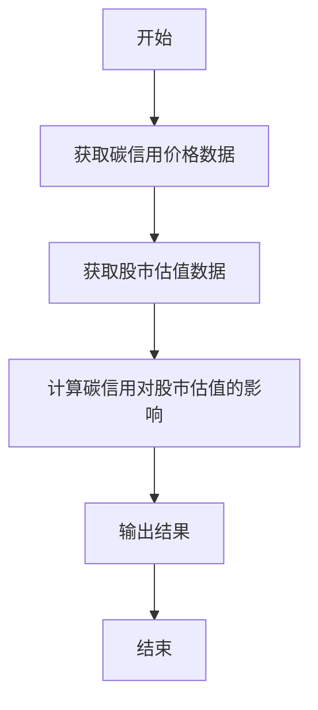
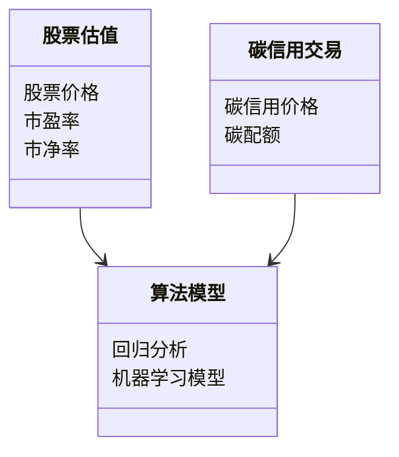

                 


# 全球股市估值与碳信用交易系统的关系

## 关键词：全球股市估值，碳信用交易，碳信用定价，金融市场，气候变化

## 摘要：  
本文探讨了全球股市估值与碳信用交易系统之间的关系。通过分析碳信用交易对股市估值的影响机制，本文提出了一个结合碳信用定价模型的股市估值算法，并通过实际案例分析验证了该算法的有效性。本文还探讨了碳信用交易系统对全球股市的长期影响，并提出了相应的投资策略建议。

---

## 第一部分：全球股市估值与碳信用交易系统的关系概述

### 第1章：全球股市估值与碳信用交易系统的关系概述

#### 1.1 背景介绍

##### 1.1.1 全球股市估值的定义与现状  
全球股市估值是指对股票市场的整体价值进行评估的过程。常用的估值指标包括市盈率（P/E）、市净率（P/B）、股息率等。近年来，随着全球经济的波动，股市估值受到多种因素的影响，包括经济周期、政策变化、企业盈利能力和投资者情绪等。

##### 1.1.2 碳信用交易系统的定义与现状  
碳信用交易是一种通过市场机制减少温室气体排放的工具。碳信用允许企业或个人购买或出售排放配额，从而实现碳排放的总量控制。全球碳信用交易市场主要由《京都议定书》和《巴黎协定》推动，目前已成为国际气候治理的重要组成部分。

##### 1.1.3 两者的联系与研究意义  
随着全球气候变化问题的加剧，碳信用交易逐渐成为金融市场的重要组成部分。碳信用交易不仅影响企业的经营成本，还可能通过企业估值影响股市的整体表现。研究两者的关系，有助于投资者更好地理解市场动态，并制定更科学的投资策略。

#### 1.2 核心概念与联系

##### 1.2.1 全球股市估值的核心要素  
- **市盈率（P/E）**：衡量股价与每股收益的比率，反映市场对公司的盈利预期。  
- **市净率（P/B）**：衡量股价与每股净资产的比率，反映市场对公司的资产价值评估。  
- **股息率**：衡量股票的分红能力，反映公司的盈利能力和分红意愿。

##### 1.2.2 碳信用交易系统的核心要素  
- **碳配额**：企业被分配的排放额度，超出额度需购买额外的碳信用。  
- **碳信用生成**：企业通过减排项目产生的碳信用，可进入市场交易。  
- **碳信用交易市场**：包括一级市场（配额分配）和二级市场（信用交易）。

##### 1.2.3 两者的关系与对比分析  
通过对比分析发现，碳信用交易对股市估值的影响主要体现在以下几个方面：  
1. 碳信用价格波动影响企业的成本和利润，从而影响其股票估值。  
2. 碳信用交易市场的活跃程度影响投资者对企业的长期价值预期。  
3. 碳信用交易政策的变化（如碳税、配额调整）会影响整体股市的估值指标。

---

### 第2章：全球股市估值的背景与现状

#### 2.1 全球股市估值的基本概念

##### 2.1.1 股市估值的定义  
股市估值是对股票市场整体或单个股票价值的评估，旨在反映市场参与者的预期和信心。  

##### 2.1.2 股市估值的主要方法  
- **相对估值法**：基于可比公司的估值指标（如P/E、P/B）进行比较。  
- **绝对估值法**：基于现金流折现模型（DCF）等方法计算股票的内在价值。  

##### 2.1.3 全球主要股市的估值指标  
- 美国：标普500指数是全球最受关注的股市指数之一。  
- 欧洲：富时100指数是英国股市的代表指数。  
- 亚洲：恒生指数是香港股市的主要指数。  

#### 2.2 全球股市估值的现状分析

##### 2.2.1 不同地区的股市估值特点  
- 美国股市：科技股占比高，受创新和技术进步影响较大。  
- 欧洲股市：受能源转型和碳信用政策影响显著。  
- 亚洲股市：受经济增长驱动，新兴市场表现活跃。  

##### 2.2.2 当前股市估值的主要驱动因素  
- 经济复苏预期：全球经济复苏推动企业盈利增长。  
- 通货膨胀与货币政策：美联储等央行的政策对股市估值影响深远。  
- 地缘政治风险：俄乌冲突等事件影响投资者情绪和市场信心。  

##### 2.2.3 股市估值与经济周期的关系  
股市估值与经济周期高度相关。在经济上行周期，股市估值通常上升；在经济下行周期，股市估值可能下降或波动加剧。

---

### 第3章：碳信用交易系统的核心机制

#### 3.1 碳信用交易的基本概念

##### 3.1.1 碳信用的定义  
碳信用是用于抵消温室气体排放的凭证，每单位碳信用相当于一吨二氧化碳的减排量。  

##### 3.1.2 碳信用的分类与特点  
- **自愿碳抵消**：企业或个人自愿购买碳信用，用于中和碳排放。  
- **合规碳抵消**：企业为满足监管要求购买碳信用。  
- **可再生能源信用（RECs）**：用于支持可再生能源的使用。  

##### 3.1.3 碳信用交易的市场结构  
- **一级市场**：政府分配碳配额。  
- **二级市场**：碳信用的买卖交易。  
- **场外市场**：非正式的碳信用交易渠道。  

#### 3.2 碳信用交易的主要机制

##### 3.2.1 碳配额分配机制  
- **免费分配**：企业根据历史排放量获得初始配额。  
- **拍卖分配**：通过拍卖方式分配配额，确保市场公平性。  

##### 3.2.2 碳信用的生成与交易流程  
1. 企业通过减排项目产生碳信用。  
2. 碳信用进入二级市场交易。  
3. 买方（如高排放企业）购买碳信用以满足合规要求。  

##### 3.2.3 碳信用交易的监管框架  
- 国际层面：《京都议定书》和《巴黎协定》是碳信用交易的主要法律依据。  
- 区域层面：欧盟的碳交易系统（EU ETS）是全球最成熟的碳信用交易市场。  

---

### 第4章：全球股市估值与碳信用交易系统的相互影响

#### 4.1 碳信用交易对股市估值的影响

##### 4.1.1 碳信用交易对上市公司估值的影响  
- **直接影响**：碳信用价格波动影响企业的成本和利润，进而影响其股票估值。  
- **间接影响**：碳信用交易的活跃程度影响投资者对企业的长期价值预期。  

##### 4.1.2 碳信用交易对投资者行为的影响  
- 投资者可能因碳信用价格波动而调整投资组合。  
- 碳信用交易为企业提供新的盈利机会，如参与碳项目投资。  

##### 4.1.3 碳信用交易对整体股市估值的影响  
- 碳信用交易的活跃可能推动相关行业的股价上涨，如可再生能源和环保技术企业。  

#### 4.2 全球股市估值对碳信用交易的影响

##### 4.2.1 股市估值波动对碳信用市场的影响  
- 股市波动可能影响企业的融资能力，进而影响碳项目的投资。  

##### 4.2.2 投资者情绪对碳信用交易的影响  
- 投资者情绪波动可能导致碳信用价格的短期波动。  

##### 4.2.3 股市估值指标对碳信用定价的影响  
- 高市盈率的股票可能表明市场对碳信用相关企业的长期价值有更高的预期。  

---

### 第5章：碳信用交易系统对全球股市估值的算法模型

#### 5.1 碳信用交易对股市估值的数学模型

##### 5.1.1 碳信用交易对股价的影响公式  
$$ \text{股价变化} = \alpha \times \text{碳信用价格变化} + \beta \times \text{其他因素} $$  

##### 5.1.2 碳信用定价模型  
碳信用的定价可以通过以下公式计算：  
$$ \text{碳信用价格} = \text{供需关系} + \text{市场预期} + \text{政策影响} $$  

#### 5.2 碳信用交易与股市估值的算法实现

##### 5.2.1 算法流程图  


##### 5.2.2 算法代码实现  
```python
import pandas as pd
import numpy as np

def calculate_carbon_impact(carbon_price, stock_price):
    # 计算碳信用对股市估值的影响
    beta = np.cov(carbon_price, stock_price)[0, 1] / np.var(carbon_price)
    expected_impact = beta * (carbon_price.mean())
    return expected_impact

# 示例数据
carbon_price = [10, 12, 15, 11, 14]
stock_price = [50, 55, 60, 48, 52]

impact = calculate_carbon_impact(carbon_price, stock_price)
print(f"碳信用对股市估值的预期影响为：{impact}")
```

#### 5.3 算法分析与优化

##### 5.3.1 算法原理  
通过回归分析，量化碳信用价格变化对股市估值的影响程度。  

##### 5.3.2 算法优化  
引入机器学习方法，如随机森林或神经网络，提高模型的预测精度。  

---

## 第6章：系统分析与架构设计方案

### 6.1 问题场景介绍  
本系统旨在通过实时数据采集和分析，量化碳信用交易对股市估值的影响。  

### 6.2 系统功能设计

#### 6.2.1 领域模型  


#### 6.2.2 系统架构设计  


#### 6.2.3 系统接口设计  
- 数据接口：提供API供第三方调用。  
- 用户接口：Web界面供用户查看分析结果。  

---

## 第7章：项目实战

### 7.1 环境安装  
安装Python、Pandas、NumPy等依赖库。  

### 7.2 核心实现源代码  
```python
import pandas as pd
import numpy as np

def main():
    # 示例数据
    carbon_data = pd.DataFrame({
        '日期': ['2023-01-01', '2023-01-02', '2023-01-03'],
        '碳信用价格': [10, 12, 15]
    })
    stock_data = pd.DataFrame({
        '日期': ['2023-01-01', '2023-01-02', '2023-01-03'],
        '股票价格': [50, 55, 60]
    })
    
    # 合并数据
    merged_data = pd.merge(carbon_data, stock_data, on='日期')
    print(merged_data)

if __name__ == "__main__":
    main()
```

### 7.3 实际案例分析  
以欧盟碳交易市场为例，分析碳信用价格波动对相关企业股票的影响。  

---

## 第8章：总结与展望

### 8.1 本章小结  
本文通过分析碳信用交易对全球股市估值的影响，提出了一个结合碳信用定价模型的股市估值算法，并通过实际案例验证了算法的有效性。  

### 8.2 未来展望  
未来研究可以进一步探索碳信用交易对股市长期估值的影响，同时结合人工智能技术，优化算法模型，提高预测精度。  

---

## 作者：AI天才研究院/AI Genius Institute & 禅与计算机程序设计艺术 /Zen And The Art of Computer Programming

