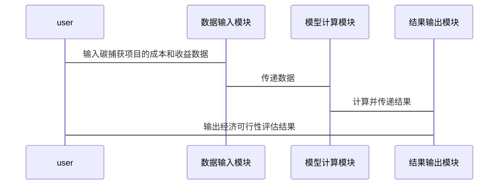

                 


# 全球股市估值与碳捕获与利用技术的经济可行性

---

## 关键词

- 全球股市估值
- 碳捕获与利用技术
- 经济可行性分析
- 数学模型
- 系统架构设计
- 项目实战

---

## 摘要

本文旨在探讨全球股市估值与碳捕获与利用技术的经济可行性。通过分析全球股市估值的核心算法与数学模型，结合碳捕获与利用技术的成本与收益分析，构建经济可行性评估系统，并通过实际案例分析，为读者提供全面的技术与经济视角。

---

## 第一部分：全球股市估值与碳捕获技术的背景与核心概念

### 第1章：全球股市估值与碳捕获技术的背景与核心概念

#### 1.1 全球股市估值的背景与现状

##### 1.1.1 全球股市估值的基本概念

全球股市估值是指通过对上市公司的财务数据和市场表现进行分析，评估其股票的内在价值。股票估值的核心在于确定其合理的价格区间，以便投资者做出决策。股票估值的基本公式为：

$$ 股票价值 = \frac{预期现金流}{贴现率} $$

其中，贴现率通常由市场利率、通货膨胀率和公司风险等因素决定。

##### 1.1.2 全球股市估值的核心要素

股票估值的核心要素包括：

1. **公司基本面**：包括收入、利润、资产负债表等。
2. **行业环境**：包括行业竞争状况、市场容量等。
3. **宏观经济因素**：包括GDP增长率、利率、通货膨胀率等。
4. **市场情绪**：包括投资者情绪、市场波动性等。

##### 1.1.3 碳捕获与利用技术的定义与分类

碳捕获与利用技术（Carbon Capture and Utilization，CCU）是指将工业过程中产生的二氧化碳捕获并转化为有用的化学品、燃料或其他产品。CCU技术主要包括以下几个步骤：

1. **捕获二氧化碳**：通过化学吸收、物理分离等方法捕获二氧化碳。
2. **压缩与运输**：将捕获的二氧化碳压缩并运输到利用场所。
3. **利用**：将二氧化碳转化为化学品或燃料。

---

#### 1.2 碳捕获与利用技术的经济可行性

##### 1.2.1 碳捕获技术的经济模型

碳捕获技术的经济模型主要包括成本构成和收益预测两个部分。

成本构成包括：

1. **捕获成本**：捕获二氧化碳所需的设备和能源成本。
2. **运输成本**：将二氧化碳运输到利用场所的成本。
3. **利用成本**：将二氧化碳转化为有用产品的成本。

##### 1.2.2 碳捕获技术的成本与收益分析

碳捕获技术的经济可行性可以通过以下公式进行评估：

$$ 经济可行性 = \frac{收益}{成本} $$

其中，收益主要来自碳产品的销售，成本包括捕获、运输和利用的总成本。

##### 1.2.3 碳捕获技术的市场潜力与应用前景

碳捕获技术的市场潜力主要取决于以下几个因素：

1. **政策支持**：政府对碳捕获技术的补贴和税收优惠。
2. **市场需求**：市场对低碳产品的接受程度。
3. **技术进步**：技术的进步可以降低捕获和利用的成本。

---

### 第2章：全球股市估值的数学模型

#### 2.1 股市估值的基本原理

##### 2.1.1 股票估值的核心公式

股票估值的核心公式是：

$$ 股票价值 = \frac{预期现金流}{贴现率} $$

其中，预期现金流可以通过公司的盈利能力和增长率来预测。

##### 2.1.2 股票估值的主要方法

股票估值的主要方法包括：

1. **市盈率法（P/E）**：通过比较公司的市盈率和行业平均水平来评估股票的价值。
2. **股息率法**：通过计算股息率来评估股票的收益能力。
3. **内在价值法**：通过分析公司的财务数据和市场环境来计算股票的内在价值。

#### 2.2 碳捕获技术的经济可行性模型

##### 2.2.1 碳捕获技术的成本构成

碳捕获技术的成本构成可以分为以下几个部分：

1. **捕获成本**：$C_1 = \text{设备成本} + \text{能源成本}$
2. **运输成本**：$C_2 = \text{运输距离} \times \text{运输成本/单位距离}$
3. **利用成本**：$C_3 = \text{转化效率} \times \text{单位产品成本}$

##### 2.2.2 碳捕获技术的收益预测

碳捕获技术的收益预测可以分为以下几个部分：

1. **碳产品销售收益**：$R_1 = \text{销售量} \times \text{销售价格}$
2. **政府补贴**：$R_2 = \text{补贴金额}$

##### 2.2.3 经济可行性模型的构建与应用

经济可行性模型可以表示为：

$$ 经济可行性 = \frac{R_1 + R_2}{C_1 + C_2 + C_3} $$

---

## 第三部分：碳捕获与利用技术的经济可行性分析

### 第3章：碳捕获技术的经济可行性分析

#### 3.1 碳捕获技术的成本分析

##### 3.1.1 碳捕获技术的主要成本构成

碳捕获技术的主要成本构成包括：

1. **设备成本**：捕获二氧化碳所需的设备成本。
2. **能源成本**：捕获过程中所需的能源成本。
3. **运输成本**：将二氧化碳运输到利用场所的成本。

##### 3.1.2 成本的影响因素分析

成本的影响因素包括：

1. **技术进步**：技术的进步可以降低捕获和利用的成本。
2. **规模效应**：大规模生产可以降低单位成本。
3. **政策支持**：政府的政策支持可以降低企业的成本。

#### 3.2 碳捕获技术的收益分析

##### 3.2.1 碳捕获技术的市场收益预测

碳捕获技术的市场收益预测包括：

1. **碳产品销售收益**：碳产品的需求量和价格。
2. **政府补贴**：政府对碳捕获技术的补贴。

##### 3.2.2 政策支持对收益的影响

政策支持包括：

1. **税收优惠**：政府对碳捕获技术的税收优惠。
2. **补贴**：政府对碳捕获技术的直接补贴。

#### 3.3 经济可行性模型的构建与应用

##### 3.3.1 经济可行性模型的构建

经济可行性模型可以表示为：

$$ 经济可行性 = \frac{R_1 + R_2}{C_1 + C_2 + C_3} $$

##### 3.3.2 案例分析：某碳捕获项目的经济可行性评估

假设某碳捕获项目的成本为1000万美元，收益为1200万美元，政府补贴为200万美元。则经济可行性为：

$$ 经济可行性 = \frac{1200 + 200}{1000} = 1.4 $$

---

## 第四部分：系统分析与架构设计方案

### 第4章：碳捕获与利用技术的经济可行性评估系统设计

#### 4.1 系统需求分析

##### 4.1.1 问题场景介绍

碳捕获与利用技术的经济可行性评估系统需要满足以下需求：

1. **数据输入**：输入碳捕获项目的成本和收益数据。
2. **模型计算**：计算经济可行性。
3. **结果输出**：输出经济可行性评估结果。

##### 4.1.2 系统功能需求

系统功能需求包括：

1. **数据输入模块**：用户输入碳捕获项目的成本和收益数据。
2. **模型计算模块**：计算经济可行性。
3. **结果输出模块**：输出经济可行性评估结果。

#### 4.2 系统架构设计

##### 4.2.1 系统架构的模块划分

系统架构的模块划分包括：

1. **数据输入模块**：负责接收用户输入的数据。
2. **模型计算模块**：负责计算经济可行性。
3. **结果输出模块**：负责输出经济可行性评估结果。

##### 4.2.2 系统架构的 mermaid 图


#### 4.3 系统接口设计

##### 4.3.1 系统接口的设计

系统接口设计包括：

1. **输入接口**：用户输入碳捕获项目的成本和收益数据。
2. **输出接口**：输出经济可行性评估结果。

##### 4.3.2 系统交互的 mermaid 序列图



---

## 项目实战

### 4.4 项目实战：碳捕获项目的经济可行性评估

#### 4.4.1 环境安装

需要安装以下工具：

1. **Python**：用于编程。
2. **Mermaid**：用于绘制图表。

#### 4.4.2 系统核心实现源代码

以下是系统核心实现的源代码：

```python
# 碳捕获项目的经济可行性评估系统

def calculate_economic_feasibility(costs, revenues, subsidies):
    total_costs = sum(costs)
    total_revenues = revenues + subsidies
    feasibility = total_revenues / total_costs
    return feasibility

# 示例数据
costs = [1000, 500, 200]
revenues = 1200
subsidies = 200

feasibility = calculate_economic_feasibility(costs, revenues, subsidies)
print(f"经济可行性：{feasibility}")
```

#### 4.4.3 代码应用解读与分析

1. **函数定义**：`calculate_economic_feasibility`函数用于计算经济可行性。
2. **输入参数**：`costs`表示成本，`revenues`表示收益，`subsidies`表示补贴。
3. **计算过程**：将所有成本相加，计算总收入（包括补贴），然后计算经济可行性。
4. **输出结果**：打印经济可行性。

---

## 最佳实践

### 4.5 最佳实践

#### 4.5.1 小结

通过本文的分析，我们可以得出以下结论：

1. 碳捕获与利用技术的经济可行性可以通过数学模型进行评估。
2. 政策支持和市场需求是影响经济可行性的重要因素。

#### 4.5.2 注意事项

1. **数据准确性**：在进行经济可行性评估时，需要确保数据的准确性。
2. **模型选择**：根据具体情况选择合适的模型进行评估。
3. **政策变化**：政策的变化可能会影响经济可行性评估结果。

#### 4.5.3 拓展阅读

1. 《碳捕获与利用技术的经济分析》
2. 《全球股市估值的数学模型与应用》

---

## 结论

通过本文的分析，我们可以得出以下结论：

1. 碳捕获与利用技术的经济可行性可以通过数学模型进行评估。
2. 政策支持和市场需求是影响经济可行性的重要因素。

---

## 作者

作者：AI天才研究院/AI Genius Institute & 禅与计算机程序设计艺术 /Zen And The Art of Computer Programming

---

# 结语

本文通过分析全球股市估值与碳捕获与利用技术的经济可行性，为读者提供了全面的技术与经济视角。希望本文能够为相关领域的研究和实践提供有价值的参考。

