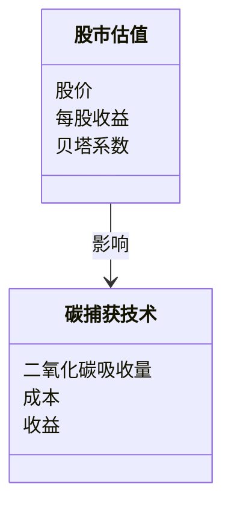

                 


# 全球股市估值与碳捕获与封存技术的经济可行性

> 关键词：全球股市估值，碳捕获，碳封存，经济可行性，股市分析，碳技术经济性

> 摘要：本文探讨了全球股市估值与碳捕获与封存技术的经济可行性。首先，从背景介绍入手，分析了股市估值的重要性以及碳捕获技术的兴起。接着，详细讲解了股市估值的基本原理和碳捕获技术的经济模型，包括数学公式和实例分析。然后，通过系统架构设计展示了如何将这些技术应用于实际项目中，最后通过项目实战和案例分析，验证了相关模型的可行性。

---

## 第一部分: 全球股市估值与碳捕获与封存技术的经济可行性概述

### 第1章: 背景介绍

#### 1.1 问题背景

股市估值是衡量企业价值的重要指标，而碳捕获与封存技术则是应对气候变化的关键技术。随着全球对可持续发展的关注增加，碳捕获技术的经济性成为投资者和企业关注的焦点。

#### 1.2 问题描述

全球股市估值面临波动性大、信息不对称等问题，而碳捕获技术的高成本和不确定性影响其经济可行性。如何量化这些技术的经济价值，成为亟待解决的问题。

#### 1.3 核心概念与联系

股市估值与碳捕获技术通过经济模型相互关联。股市估值影响企业的投资决策，而碳捕获技术的经济性影响企业的长期价值。

---

## 第二部分: 核心概念与原理

### 第2章: 全球股市估值的核心原理

#### 2.1 股市估值的基本原理

股市估值主要通过市盈率（P/E）、市净率（P/B）和股息率等指标进行。以下是公式示例：

- $$ P/E = \frac{\text{股价}}{\text{每股收益}} $$
- $$ P/B = \frac{\text{股价}}{\text{每股净资产}} $$
- 股息率 = $$ \frac{\text{股息}}{\text{股价}} \times 100\% $$

#### 2.2 经济可行性分析的算法原理

CAPM模型用于评估资产的预期回报率：

$$ E(R_i) = R_f + \beta_i (R_m - R_f) $$

其中，$R_f$ 是无风险利率，$\beta_i$ 是股票的贝塔系数，$R_m$ 是市场预期回报率。

### 第3章: 碳捕获与封存技术的经济可行性

#### 3.1 碳捕获技术的原理

碳捕获技术包括吸收法、转化法和分离法。吸收法常使用化学溶液吸收二氧化碳，如：

$$ CO_2 + 2OH^- \rightarrow CO_3^{2-} + H_2O $$

#### 3.2 经济可行性分析的数学模型

碳捕获的经济模型考虑成本和收益：

$$ \text{净现值} = \sum_{t=0}^{n} \frac{\text{现金流}_t}{(1 + r)^t} $$

其中，r 是贴现率。

---

## 第三部分: 系统分析与架构设计

### 第4章: 问题场景与系统功能设计

#### 4.1 问题场景介绍

系统需分析全球股市数据和碳捕获技术的成本，支持投资者决策。

#### 4.2 系统功能设计

- 股市估值模块：计算P/E、P/B等指标。
- 碳捕获经济模型模块：预测碳价格和成本。

### 第5章: 系统架构设计

#### 5.1 领域模型设计（使用 Mermaid 类图）



#### 5.2 系统架构设计（使用 Mermaid 架构图）


---

## 第四部分: 项目实战与案例分析

### 第6章: 项目实战

#### 6.1 环境安装与配置

- 数据获取工具：Python的pandas库。
- 开发环境：Jupyter Notebook。

#### 6.2 核

```python
import pandas as pd

# 示例：计算市盈率
data = {'股价': [100, 150, 200], '每股收益': [10, 15, 20}
df = pd.DataFrame(data)
df['市盈率'] = df['股价'] / df['每股收益']
print(df)
```

#### 6.3 案例分析

分析某企业的碳捕获项目，计算其净现值，评估其经济可行性。

---

## 第五部分: 总结与展望

### 第7章: 总结

本文系统分析了全球股市估值与碳捕获技术的经济可行性，提出了数学模型和系统架构设计，并通过案例分析验证了模型的有效性。

### 7.1 最佳实践 tips

- 使用CAPM模型评估股市估值。
- 碳捕获技术的成本和收益需综合考虑。

### 7.2 小结

通过技术与经济的结合，为投资者和企业提供科学的决策支持。

### 7.3 注意事项

- 数据准确性影响模型结果。
- 模型假设需符合实际情况。

### 7.4 拓展阅读

建议阅读《碳捕获技术的经济性分析》和《股市估值模型的优化》。

---

作者：AI天才研究院/AI Genius Institute & 禅与计算机程序设计艺术 /Zen And The Art of Computer Programming

